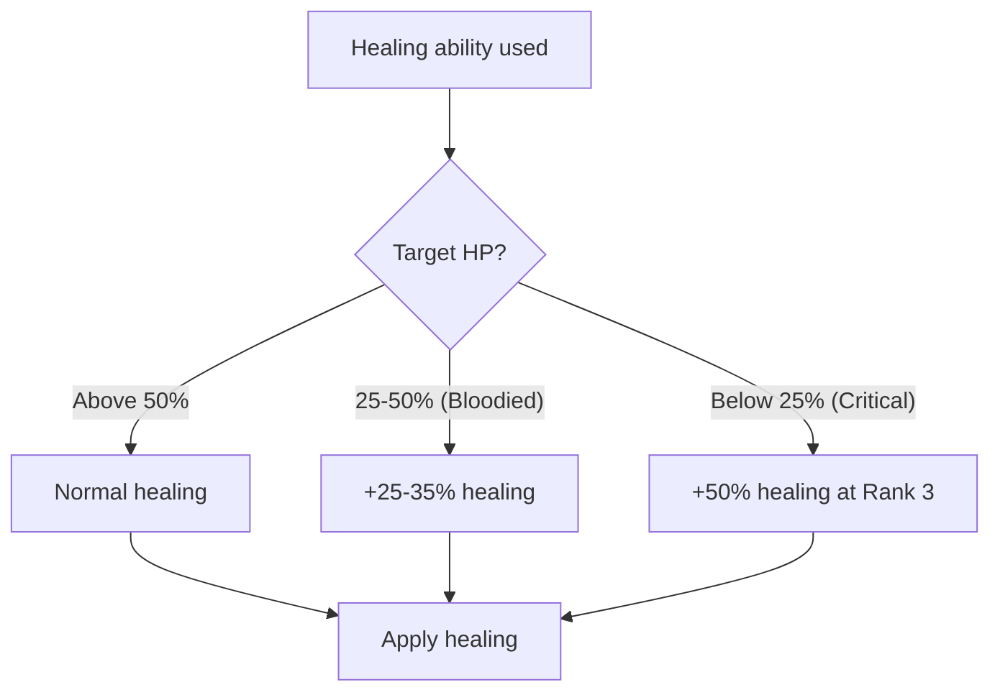

# Triage

**Ability ID:** 2006 | **Tier:** 2 | **Type:** Passive | **PP Cost:** 4

---

## 1. Overview

| Property | Value |
|----------|-------|
| **Action** | Free (always active) |
| **Target** | Self (modifies healing) |
| **Resource Cost** | None |
| **Prerequisite** | 8 PP in Bone-Setter tree |
| **Starting Rank** | 2 |

---

## 2. Description

> The Bone-Setter has a grim but necessary understanding of battlefield medicine: treat the most grievous wounds first.

---

## 3. Mechanical Effects

### 3.1 Primary Effect

```
Condition: Target is [Bloodied] (below 50% HP)
Effect: All healing abilities restore +25% HP
```

> [!IMPORTANT]
> This passive rewards **reactive play** — prioritizing the most injured allies yields the most efficient healing.

---

## 4. Rank Progression

### Rank 2 (Starting Rank)

**Mechanical Effects:**
- +25% healing when target is [Bloodied]
- Applies to all healing abilities

**Formula:**
```
IF target.HP < (target.MaxHP × 0.5) THEN
    Healing = BaseHealing × 1.25
```

---

### Rank 3 (Upgrade Cost: +3 PP, requires Rank 2)

**Mechanical Effects:**
- +35% healing when target is [Bloodied]
- **NEW:** +50% healing when target below 25% HP

**Formula:**
```
IF target.HP < (target.MaxHP × 0.25) THEN
    Healing = BaseHealing × 1.50  // Critical condition
ELSE IF target.HP < (target.MaxHP × 0.5) THEN
    Healing = BaseHealing × 1.35  // Bloodied
```

---

## 5. Triage Decision Tree



---

## 6. Example Calculation

> **Situation:** Mend Wound on bloodied ally (Rank 2)
>
> **Base Healing:** 2d6 + 6 = 13 HP
> **Triage Bonus:** 13 × 1.25 = 16 HP
>
> **Result:** +3 HP from Triage passive

---

## 7. Balance Data

### 7.1 Efficiency
- **Bloodied:** +25% means a 10 HP heal becomes 12.5 HP. Over many heals, this adds up.
- **Critical:** +50% at <25% HP is huge. 10 HP -> 15 HP. Encourages "clutch" saves.

---

## 8. Phased Implementation Guide

### Phase 1: Mechanics
- [ ] **Hook**: `CalculateHealing`.
- [ ] **Check**: `Target.HP < Target.MaxHP * 0.5`.
- [ ] **Modify**: `Healing *= 1.25`.

### Phase 2: Logic Integration
- [ ] **Rank 3**: Add secondary check (HP < 25% -> Multiplier = 1.5).

### Phase 3: Visuals
- [ ] **UI**: Show "CRITICAL TRIAGE" text when <25% HP patient is healed.

---

## 9. Testing Requirements

### 9.1 Unit Tests
- [ ] **Threshold**: Target at 51% HP -> No bonus. Target at 49% HP -> +25%.
- [ ] **Rank 3**: Target at 24% HP -> +50%.

### 9.2 Integration Tests
- [ ] **Stacking**: Does this stack with Masterwork Poultice bonus? (Likely multiplicative).

### 9.3 Manual QA
- [ ] **Log**: "Triage bonus applied to critical patient."

---

## 10. Logging Requirements

**Reference:** [logging.md](../../../../../00-project/logging.md)

### 10.1 Log Events
| Event | Level | Message Template | Properties |
|-------|-------|------------------|------------|
| Bonus | Debug | "Triage: +{Percent}% healing for {Target}." | `Percent`, `Target` |

---

## 11. Related Specifications
| Document | Purpose |
|----------|---------|
| [Mend Wound](mend-wound.md) | Primary heal synergy |
| [HP](../../../../01-core/resources/hp.md) | Health definition |

---

## 12. Changelog
| Version | Date | Changes |
|---------|------|---------|
| 1.0 | 2025-12-07 | Initial specification |
| 1.1 | 2025-12-14 | Standardized with Balance, Phased Guide, Testing, Logging |
