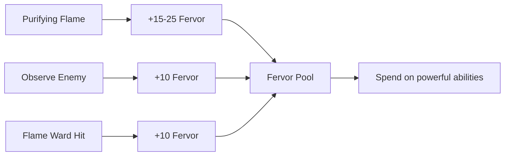

# Iron-Bane (Knowledge is the Deadliest Weapon)

---

## 1. Identity

| Property | Value |
|----------|-------|
| **Display Name** | Iron-Bane |
| **Translation** | "Knowledge is the Deadliest Weapon" |
| **Archetype** | Warrior |
| **Path Type** | Coherent |
| **Mechanical Role** | Anti-Mechanical Specialist / Controller |
| **Primary Attribute** | WILL |
| **Secondary Attribute** | MIGHT |
| **Resource System** | Stamina + Righteous Fervor (0-100) |
| **Trauma Risk** | Low |
| **Icon** | :fire: |

---

## 2. Unlock Requirements

| Requirement | Value | Notes |
|-------------|-------|-------|
| **PP Cost to Unlock** | 3 PP | Standard cost |
| **Minimum Legend** | 3 | Early-game |
| **Maximum Corruption** | 100 | No restriction |
| **Required Quest** | None | No prerequisite |

---

## 3. Design Philosophy

**Tagline:** "You are the debugger, the antivirus, the purifier."

**Core Fantasy:** You are a warrior-scholar who has studied the Undying and their mechanical corruption. Where others see invincible foes, you see exploitable weaknesses in their code. You wield flame and faith to purge the abominations, using your knowledge of pre-Glitch technology to identify and destroy critical systems.

**Mechanical Identity:**
1. **Enemy-Type Specialist** — Massive bonuses against Mechanical and Undying enemies
2. **Knowledge-Based Combat** — Observe enemies to reveal weaknesses and unlock bonus effects
3. **Fire Damage Focus** — Primary damage type is Fire, with persistent Burning effects
4. **Righteous Fervor** — Build conviction through purging the corrupted
5. **Execute Threshold** — Devastating finishers against weakened machines

**Gameplay Feel:** A methodical hunter of machines. Identify, analyze, and systematically dismantle corrupted technology with holy fire.

---

## 4. The Righteous Fervor System

### 4.1 Fervor Mechanics

| Property | Value |
|----------|-------|
| **Range** | 0-100 |
| **Decay** | Slow decay out of combat |
| **Reset** | Partial loss on rest |

### 4.2 Fervor Generation



| Source | Fervor Gained |
|--------|---------------|
| Purifying Flame vs Mech/Undying | +15 → +20 → +25 (by rank) |
| Observing enemy (Rank 2+) | +10 |
| Flame Ward retaliation (Rank 3) | +10 |
| Kill Mech/Undying | Varies by ability |

### 4.3 Fervor Spending

| Cost | Abilities |
|------|-----------|
| 25 Fervor | Critical Strike |
| 30 Fervor | System Shutdown |
| 40 Fervor | Purging Flame |
| 75 Fervor | Divine Purge |

---

## 5. Rank Progression

### 5.1 Rank Unlock Rules

| Tier | Starting Rank | Progresses To | Rank 3 Trigger |
|------|---------------|---------------|----------------|
| **Tier 1** | Rank 1 | Rank 2 (2× Tier 2) | Capstone trained |
| **Tier 2** | Rank 2 | Rank 3 (Capstone) | Capstone trained |
| **Tier 3** | Rank 2 | Rank 3 (Capstone) | Capstone trained |
| **Capstone** | Rank 1 | Rank 2→3 (tree) | Full tree |

### 5.2 Total PP Investment

| Milestone | PP Spent | Tier 1 Rank | Notes |
|-----------|----------|-------------|-------|
| Unlock Specialization | 3 PP | Rank 1 | Tier 1 abilities free |
| 2× Tier 2 | 11 PP | **Rank 2** | |
| All Tier 2 | 15 PP | Rank 2 | |
| All Tier 3 | 25 PP | Rank 2 | |
| Capstone | 31 PP | **Rank 3** | Full tree |

---

## 6. Ability Tree

### 6.1 Visual Structure

```
                    TIER 1: FOUNDATION (Free with Spec)
    ┌─────────────────────┼─────────────────────┐
    │                     │                     │
[Scholar of         [Purifying        [Weakness
 Corruption]          Flame]          Exploiter]
  (Passive)          (Active)          (Passive)
    │                     │                     │
    └─────────────────────┴─────────────────────┘
                          │
                          ▼
                TIER 2: ADVANCED (4 PP each)
    ┌─────────────────────┼─────────────────────┐
    │                     │                     │
[System            [Critical          [Flame
 Shutdown]          Strike]            Ward]
  (Active)          (Active)         (Passive)
    │                     │                     │
    └─────────────────────┴─────────────────────┘
                          │
                          ▼
                TIER 3: MASTERY (5 PP each)
          ┌───────────────┴───────────────┐
          │                               │
   [Purging             [Righteous
     Flame]             Conviction]
    (Active)              (Passive)
          │                               │
          └───────────────┬───────────────┘
                          │
                          ▼
              TIER 4: CAPSTONE (6 PP)
                          │
                   [Divine Purge]
                     (Active)
```

### 6.2 Ability Index

| ID | Ability | Tier | Type | PP | Spec Document |
|----|---------|------|------|-----|---------------|
| 1101 | Scholar of Corruption | 1 | Passive | 0 | [scholar-of-corruption.md](abilities/scholar-of-corruption.md) |
| 1102 | Purifying Flame | 1 | Active | 0 | [purifying-flame.md](abilities/purifying-flame.md) |
| 1103 | Weakness Exploiter | 1 | Passive | 0 | [weakness-exploiter.md](abilities/weakness-exploiter.md) |
| 1104 | System Shutdown | 2 | Active | 4 | [system-shutdown.md](abilities/system-shutdown.md) |
| 1105 | Critical Strike | 2 | Active | 4 | [critical-strike.md](abilities/critical-strike.md) |
| 1106 | Flame Ward | 2 | Passive | 4 | [flame-ward.md](abilities/flame-ward.md) |
| 1107 | Purging Flame | 3 | Active | 5 | [purging-flame.md](abilities/purging-flame.md) |
| 1108 | Righteous Conviction | 3 | Passive | 5 | [righteous-conviction.md](abilities/righteous-conviction.md) |
| 1109 | Divine Purge | 4 | Active | 6 | [divine-purge.md](abilities/divine-purge.md) |

---

## 7. Situational Power Profile

### 7.1 Optimal Conditions

| Situation | Why Strong |
|-----------|------------|
| Mechanical enemies | All abilities gain massive bonuses |
| Undying enemies | All abilities gain massive bonuses |
| Sustained combat | Fervor builds to devastating abilities |
| Mixed enemy groups | Can prioritize machines while handling others |

### 7.2 Weakness Conditions

| Situation | Why Weak |
|-----------|----------|
| Organic-only enemies | Lose ~50% of kit effectiveness |
| Fire-resistant enemies | Primary damage type negated |
| Short encounters | No time to build Fervor |
| Stealth missions | Fire-based combat is loud |

---

## 8. Party Synergies

### 8.1 Positive Synergies

| Partner | Synergy |
|---------|---------|
| **Jötun-Reader** | Combined machine-hunting expertise |
| **Skjaldmær** | Tank holds line while Bane deals damage |
| **Bone-Setter** | Sustain through long encounters |
| **Rúnasmiðr** | Fire enchantments enhance damage |

### 8.2 Negative Synergies

| Partner | Issue |
|---------|-------|
| Other anti-machine specialists | Overkill on machines, weak elsewhere |
| Stealth-focused parties | Fire abilities break concealment |

---

## 9. Integration Points

| System | Integration |
|--------|-------------|
| **Fervor Resource** | Unique mechanic |
| **Enemy Types** | Mechanical, Undying tags |
| **Status Effects** | [Burning], [Stunned], [System Malfunction], [Critical Failure], [Vulnerable] |
| **Combat** | Fire damage specialist |

---

## 10. Balance Data

### 10.1 Power Curve

| Legend | Damage Output | Survivability | Utility |
|--------|---------------|---------------|---------|
| 1-3 | High vs Machines | Medium | Low |
| 4-6 | Very High vs Machines | High | Medium |
| 7-10 | Extreme vs Machines | High | Medium |

### 10.2 Role Effectiveness

| Role | Rating (1-5) | Notes |
|------|--------------|-------|
| Single Target DPS | ★★★★★ | Against Mech/Undying |
| AoE DPS | ★★★★☆ | Purging Flame |
| Tanking | ★★★☆☆ | Fire immunity, Soak bonus |
| Healing | ☆☆☆☆☆ | None |
| Utility | ★★★☆☆ | Enemy identification |

### 10.3 Fervor Economy Analysis

| Metric | Value | Notes |
|--------|-------|-------|
| Avg Fervor per turn | +15-25 | When fighting machines |
| Divine Purge threshold | 75 Fervor | 3-5 turns to build |
| Optimal rotation | Observe → Flame → Shutdown | Build and control |

---

## 11. Voice Guidance

**Reference:** [/docs/.templates/flavor-text/specialization-abilities.md]

### 11.1 Tone Profile

| Property | Value |
|----------|-------|
| **Tone** | Zealous, methodical, righteous |
| **Key Words** | Purge, cleanse, corrupt, abomination, weakness |
| **Sentence Style** | Declarative, confident, technical |

### 11.2 Example Voice

> **Activation:** "I see your weakness. I know your code."
> **Effect:** "Holy fire cleanses corrupted iron!"
> **Failure:** "The corruption... runs deeper than I thought."

---

## 12. Phased Implementation Guide

### Phase 1: Resource & Foundation
- [ ] **Define Resource**: Implement `RighteousFervor` property (0-100) on Character Entity.
- [ ] **Generation Logic**: Hook into damage events for Fervor generation.
- [ ] **Enemy Type Tags**: Add Mechanical and Undying type tags to enemy data.

### Phase 2: Core Abilities
- [ ] **Observe System**: Implement enemy identification via Scholar of Corruption.
- [ ] **Purifying Flame**: Implement Fire attack with type-based bonuses.
- [ ] **Weakness Exploiter**: Implement damage modifier against identified enemies.

### Phase 3: Advanced Abilities
- [ ] **System Shutdown**: Implement Stun + permanent debuff.
- [ ] **Critical Strike**: Implement guaranteed crit + execute threshold.
- [ ] **Flame Ward**: Implement Fire immunity and retaliation.

### Phase 4: Capstone
- [ ] **Divine Purge**: Implement instant death mechanic with save.
- [ ] **Mass [Feared]**: Implement AoE fear on machine kill.
- [ ] **Explosion on Kill**: Implement AoE damage from destroyed targets.

---

## 13. Testing Requirements

### 13.1 Unit Tests
- [ ] **Type Detection**: Verify Mechanical/Undying tags correctly identified.
- [ ] **Fervor Generation**: Verify correct amounts from each source.
- [ ] **Damage Bonuses**: Verify +damage vs identified enemies.

### 13.2 Integration Tests
- [ ] **Execute Threshold**: Verify Critical Strike instant kill at 40% HP.
- [ ] **Divine Purge**: Verify instant death on failed save.
- [ ] **Fire Immunity**: Verify Flame Ward provides complete immunity at Rank 3.

### 13.3 Manual QA
- [ ] **Fervor Bar**: Display updates correctly in combat.
- [ ] **Enemy Analysis**: Information panel shows revealed data.
- [ ] **Divine Purge VFX**: Dramatic visual feedback on activation.

---

## 14. Logging Requirements

**Reference:** [logging.md](../../../00-project/logging.md)

### 14.1 Log Events

| Event | Level | Message Template | Properties |
|-------|-------|------------------|------------|
| Spec Unlock | Info | "Unlocked Specialization: Iron-Bane for {Character}." | `Character` |
| Enemy Identified | Info | "{Character} identified {Target} as {Type}." | `Character`, `Target`, `Type` |
| Divine Purge | Info | "{Character} used Divine Purge on {Target}. Result: {Result}." | `Character`, `Target`, `Result` |
| Fervor Max | Info | "{Character} reached maximum Righteous Fervor!" | `Character` |

---

## 15. Related Documentation

| Document | Purpose |
|----------|---------|
| [Burning](../../../04-systems/status-effects/bleeding.md) | Primary DoT effect |
| [Stunned](../../../04-systems/status-effects/stunned.md) | System Shutdown effect |
| [Enemy Design](../../../03-combat/enemy-design.md) | Mechanical/Undying types |

---

## 16. Changelog

| Version | Date | Changes |
|---------|------|---------|
| 1.0 | 2025-12-14 | Initial gold standard migration from legacy spec |
