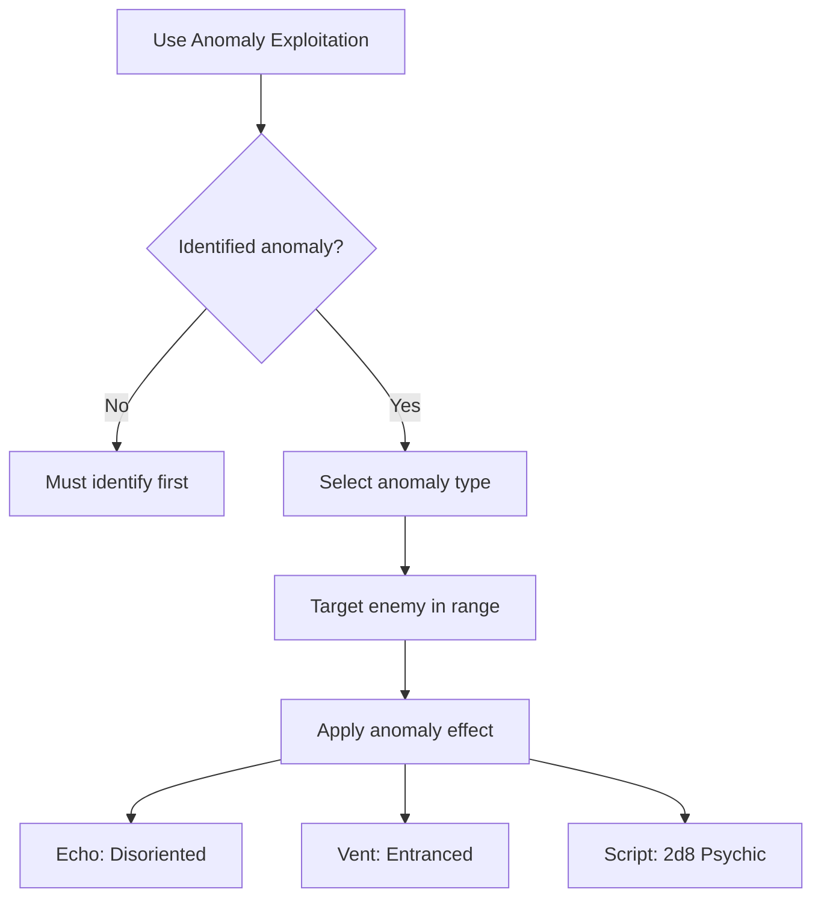

# Anomaly Exploitation

**Ability ID:** 4005 | **Tier:** 2 | **Type:** Active | **PP Cost:** 4

---

## 1. Overview

| Property | Value |
|----------|-------|
| **Action** | Standard Action |
| **Target** | Single enemy (via anomaly) |
| **Resource Cost** | 30 Stamina |
| **Range** | Anomaly range |
| **Cooldown** | 3 turns |
| **Prerequisite** | 8 PP in Ruin-Stalker tree |
| **Starting Rank** | 2 |

---

## 2. Description

> "What kills the unprepared can be turned against enemies. You've learned to weaponize the Old World's broken systems."

---

## 3. Mechanical Effects

### 3.1 Anomaly Effects

| Anomaly Type | Effect on Enemy |
|--------------|-----------------|
| **Echo Surface** | [Disoriented] (2 turns) |
| **Singing Vent** | [Entranced] (1 turn, no actions) |
| **Animated Script** | 2d8 Psychic damage |

---

## 4. Rank Progression

### Rank 2 (Starting Rank)

**Mechanical Effects:**
- Requires identified anomaly in range
- Manipulate anomaly to affect 1 enemy
- Effects as listed above
- Cost: 30 Stamina
- Cooldown: 3 turns

---

### Rank 3 (Upgrade Cost: +3 PP, requires Rank 2)

**Mechanical Effects:**
- All effects last +1 turn
- Can affect 2 enemies simultaneously
- **NEW:** Trigger anomalies remotely
- **NEW:** All effects deal +1d8 damage
- [Entranced] lasts 2 turns

---

## 5. Exploitation Workflow

---

## 6. Tactical Applications

| Situation | Application |
|-----------|-------------|
| **Environmental combat** | Turn ruins against enemies |
| **Crowd control** | Disorient/entrance threats |
| **Damage** | Psychic damage via Script |

---

## 7. Balance Data

### 7.1 Power Budget
| Effect | Equivalent | Value |
|--------|------------|-------|
| Disoriented (2 turns) | Tier 1 Spell | Moderate |
| Entranced (1 turn) | Hard CC (Stun) | High (Loss of turn) |
| Psychic Dmg (2d8) | Standard Attack | Moderate |

### 7.2 Situational Value
- **High Ceiling:** In anomaly-dense rooms, this allows a Ruin Stalker to act as a Controller/Mage without spending Mana/Spirit.
- **Low Floor:** Useless in clean rooms.

---

## 8. Phased Implementation Guide

### Phase 1: Mechanics
- [ ] **Interaction**: Link `Anomaly` entities to `Exploit` table.
- [ ] **Action**: Create ability targeting `Anomaly` + `Enemy`.

### Phase 2: Logic Integration
- [ ] **Range Check**: `Distance(Player, Anomaly) <= Range` AND `Distance(Anomaly, Enemy) <= EffectRange`.
- [ ] **Rank 3**: Implement "Remote Trigger" (Line of Sight only?). Implement Multi-Target loop.

### Phase 3: Visuals
- [ ] **Projectiles**: Beam from Anomaly to Enemy.
- [ ] **Feedback**: Enemy flinch/status icon.

---

## 9. Testing Requirements

### 9.1 Unit Tests
- [ ] **Requirement**: No anomaly -> Ability fails.
- [ ] **Effect**: Singing Vent -> Target gets [Entranced].
- [ ] **Damage**: Script -> Target takes 2d8 damage.
- [ ] **Multi**: Rank 3 -> 2 targets selected -> Both affected.

### 9.2 Integration Tests
- [ ] **Combat**: Player exploits anomaly -> Enemy loses turn (Entranced). Player remains hidden? (If Stealth/Ambush implies).
- [ ] **Friendly Fire**: Ensure effect doesn't hit allies (unless AoE).

### 9.3 Manual QA
- [ ] **Log**: "Turned the Singing Vent against the Draugr!"

---

## 10. Logging Requirements

**Reference:** [logging.md](../../../../../00-project/logging.md)

### 10.1 Log Events
| Event | Level | Message Template | Properties |
|-------|-------|------------------|------------|
| Exploit | Info | "{Character} overloads the {Anomaly}!" | `Character`, `Anomaly` |
| Effect | Info | "{Target} is struck by the anomaly ({Effect})." | `Target`, `Effect` |

---

## 11. Related Specifications
| Document | Purpose |
|----------|---------|
| [Anomaly Sense](anomaly-sense-i.md) | Detection requirement |
| [Status Effects](../../../../04-systems/status-effects/disoriented.md) | Effect spec |

---

## 12. Changelog
| Version | Date | Changes |
|---------|------|---------|
| 1.0 | 2025-12-07 | Initial specification |
| 1.1 | 2025-12-14 | Standardized with Balance, Phased Guide, Testing, Logging |
