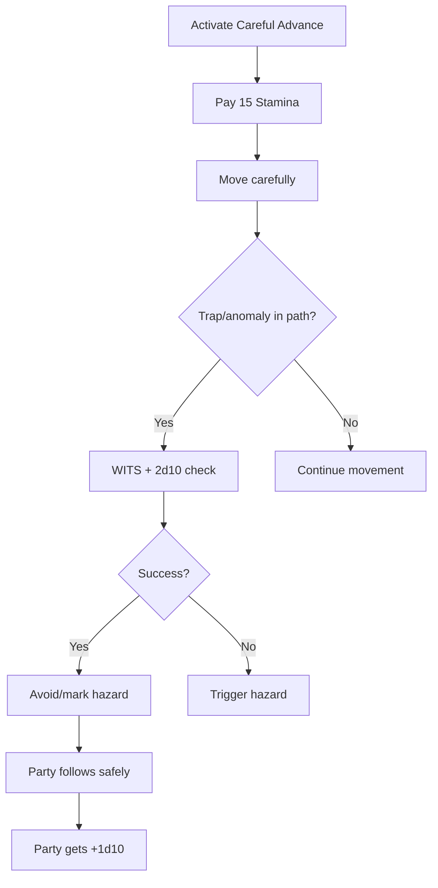

# Careful Advance

**Ability ID:** 4002 | **Tier:** 1 | **Type:** Active | **PP Cost:** 3

---

## 1. Overview

| Property | Value |
|----------|-------|
| **Action** | Standard Action (sustained) |
| **Target** | Self + following party |
| **Resource Cost** | 15 Stamina |
| **Range** | Self |
| **Cooldown** | None (can be sustained) |
| **Prerequisite** | Ruin-Stalker specialization |

---

## 2. Description

> "You move with deliberate, measured steps, testing each surface before committing weight. In ruins, haste is death."

---

## 3. Mechanical Effects

### 3.1 Primary Effect

```
Movement = Half speed
Bonus = +2d10 to avoid traps/anomalies
Party following = +1d10 to their checks
```

---

## 4. Rank Progression

### Rank 1 (Base — included with ability unlock)

**Mechanical Effects:**
- Move at half speed
- +2d10 to avoid triggering traps/anomalies
- Party members following your exact path: +1d10
- Cost: 15 Stamina

---

### Rank 2 (Upgrade Cost: +2 PP)

**Mechanical Effects:**
- Move at **full speed**
- +3d10 personal bonus
- Party gains +2d10

---

### Rank 3 (Upgrade Cost: +3 PP, requires Rank 2)

**Mechanical Effects:**
- Full speed, entire party guided
- Automatically detect and mark all hazards along route
- Party moves at your pace safely

---

## 5. Careful Advance Workflow



---

## 6. Tactical Applications

| Situation | Application |
|-----------|-------------|
| **Unknown ruin** | Lead party safely |
| **Trapped corridor** | Maximum avoidance |
| **Extraction** | Guide party out |

---

## 7. Balance Data

### 7.1 Action Economy
- **Speed Penalty (Rank 1):** 50% movement is a massive cost, balancing the +2d10 safety.
- **Full Speed (Rank 2):** Removes the tradeoff, making it strictly better than normal movement in dangerous zones.

### 7.2 Resource Efficiency
- **Cost:** 15 Stamina is negligible for short bursts, but drains quickly over long corridors. Encourages toggle use.

---

## 8. Phased Implementation Guide

### Phase 1: Mechanics
- [ ] **Mode**: Implement `ExplorationMode` enum (Normal, Careful, Sprint).
- [ ] **Modifier**: Apply Speed * 0.5 when Mode == Careful (Rank 1).
- [ ] **Bonus**: Add +2d10 to Traversal checks.

### Phase 2: Logic Integration
- [ ] **Party**: Iterate followers -> Apply +1d10 if `Leader.Mode == Careful`.
- [ ] **Rank 2**: Remove speed penalty logic.
- [ ] **Pathing**: Rank 3 auto-pathing logic around hazards.

### Phase 3: Visuals
- [ ] **Animation**: "Sneak/Crouch" walk cycle.
- [ ] **UI**: "Careful Advance" status icon.

---

## 9. Testing Requirements

### 9.1 Unit Tests
- [ ] **Speed**: Move distance halved (Rank 1). Unchanged (Rank 2).
- [ ] **Bonus**: Check adds +2d10.
- [ ] **Stamina**: Drains 15 Stamina per turn/move? (Spec says "Cost: 15 Stamina", implies per activation or per turn if sustained. Assuming activation per room/segment).

### 9.2 Integration Tests
- [ ] **Party**: Companion fails check -> Leader activates Careful -> Companion retries with +1d10 -> Succeeds.
- [ ] **Combat**: Entering combat cancels Careful Advance? (Usually yes).

### 9.3 Manual QA
- [ ] **Feel**: Does the half-speed feel too slow?

---

## 10. Logging Requirements

**Reference:** [logging.md](../../../../../00-project/logging.md)

### 10.1 Log Events
| Event | Level | Message Template | Properties |
|-------|-------|------------------|------------|
| Activate | Info | "{Character} begins a careful advance." | `Character` |
| Bonus | Debug | "Careful Advance prevented a mishap (+2d10)." | - |
| Party | Info | "The party follows in {Character}'s footsteps." | `Character` |

---

## 11. Related Specifications
| Document | Purpose |
|----------|---------|
| [Anomaly Sense](anomaly-sense-i.md) | Detection synergy |
| [Stamina](../../../../01-core/resources/stamina.md) | Resource management |

---

## 12. Changelog
| Version | Date | Changes |
|---------|------|---------|
| 1.0 | 2025-12-07 | Initial specification |
| 1.1 | 2025-12-14 | Standardized with Balance, Phased Guide, Testing, Logging |
