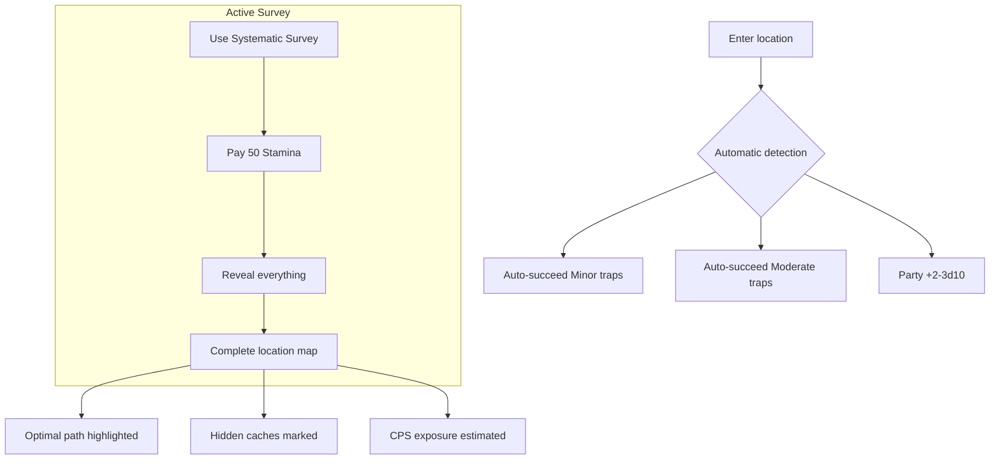

# Corridor Maker

**Ability ID:** 4009 | **Tier:** 4 (Capstone) | **Type:** Passive + Active | **PP Cost:** 6

---

## 1. Overview

| Property | Value |
|----------|-------|
| **Passive** | Always active |
| **Active Action** | Full Turn |
| **Resource Cost** | 50 Stamina |
| **Cooldown** | Once per location |
| **Prerequisite** | Full Ruin-Stalker tree (24 PP) |
| **Starting Rank** | 1 |

---

## 2. Description

> "You have become the master of dead places. Where others see tombs, you see harvest routes. Where others flee anomalies, you document, catalog, and convert danger into knowledge."

---

## 3. Passive Component: Ruin Mastery

### Rank 1 (Starting Rank)

**Mechanical Effects:**
- **Automatic success** on Minor and Moderate trap/anomaly interactions
- +4d10 to all WITS checks in Old World environments
- Party gains +2d10 while following your lead

---

### Rank 2 (Unlocked: Tree progression)

**Mechanical Effects:**
- Automatic success extends to **Severe** hazards
- Party bonus increases to +3d10

---

### Rank 3 (Unlocked: Full tree completion)

**Mechanical Effects:**
- Sense **all** anomalies and traps within 30 meters
- Party gains your CPS Resistance bonuses while in your presence

---

## 4. Active Component: Systematic Survey

### 4.1 Survey Effect

```
Target = Current room/corridor/chamber
Reveals:
  - All traps, anomalies, hazards (including hidden)
  - All hidden caches, passages, valuables
  - Optimal route with danger ratings
  - CPS exposure estimate
```

### 4.2 Rank Progression

| Rank | Additional Reveals |
|------|-------------------|
| 1 | Base revelations |
| 2 | Enemy positions & patrol patterns; half survey time |
| 3 | Permanent record; system weaknesses (+50% damage) |

---

## 5. Corridor Maker Workflow



---

## 6. What Survey Reveals

| Information | Always | Rank 2+ | Rank 3 |
|-------------|--------|---------|--------|
| All traps | ✓ | ✓ | ✓ |
| All anomalies | ✓ | ✓ | ✓ |
| Hidden passages | ✓ | ✓ | ✓ |
| Hidden caches | ✓ | ✓ | ✓ |
| Optimal route | ✓ | ✓ | ✓ |
| CPS estimate | ✓ | ✓ | ✓ |
| Enemy positions | ✗ | ✓ | ✓ |
| Patrol patterns | ✗ | ✓ | ✓ |
| System weaknesses | ✗ | ✗ | ✓ |
| Permanent record | ✗ | ✗ | ✓ |

---

## 7. Capstone Power Level

> [!TIP]
> At Rank 3, the Ruin-Stalker becomes the **ultimate exploration specialist:**
> - Auto-succeed on all hazards up to Severe
> - 30m detection radius
> - Party shares your CPS resistance
> - Complete location intelligence
> - Exploitable system weaknesses

---

## 8. Synergies

| Combination | Effect |
|-------------|--------|
| + Jötun-Reader | Complete site comprehension |
| + Hazard Mapping | Stacking party bonuses |
| + Safe Extraction | Survey then extract safely |

---

## 9. Balance Data

### 9.1 Power Budget: Capstone

| Metric | Value |
|--------|-------|
| **Power Level** | Ultimate |
| **Action Economy** | Passive + Full Turn Active |
| **Resource Cost** | 50 Stamina |
| **Opportunity Cost** | Full Ruin-Stalker tree (47 PP) |

### 9.2 Effectiveness Ratings

| Context | Rating | Notes |
|---------|--------|-------|
| Old World Ruins | ★★★★★ | Maximum value |
| Trap-heavy areas | ★★★★★ | Auto-success |
| Combat (direct) | ★★☆☆☆ | Utility focus |
| Open wilderness | ★☆☆☆☆ | Limited application |

### 9.3 Party Value

| Metric | Solo | Party of 4 |
|--------|------|------------|
| Survey value | 1× | 4× (everyone benefits) |
| Safety bonus | +4d10 self | +3d10 party |

---

## 10. Technical Implementation

**File:** `RuneAndRust.Engine/Abilities/CorridorMaker.cs`
**Class:** `CorridorMakerAbility`

### 10.1 Interface

```csharp
public interface ICorridorMakerAbility : ICapstoneAbility
{
    // Passive component
    bool AutoSucceedHazard(HazardSeverity severity, int rank);
    int GetWitsBonus(EnvironmentType environment, int rank);
    int GetPartyBonus(int rank);
    
    // Active component
    SurveyResult ExecuteSystematicSurvey(Room room, int rank);
    bool CanSurvey(Character caster);
}
```

### 10.2 Database Reference

```sql
SELECT * FROM Abilities 
WHERE ability_id = 4009 
  AND specialization = 'ruin-stalker';
```

---

## 11. Phased Implementation Guide

### Phase 1: Data & Strategy Setup
- [ ] **Data Definition**: Add entry to `Abilities` table (ID 4009) with Passive+Active flags.
- [ ] **Strategy Class**: Create `CorridorMakerAbility.cs` implementing `IAbility`.
- [ ] **Factory Registration**: Register component in `AbilityFactory`.

### Phase 2: Core Logic (Passive)
- [ ] **Trap Auto-Success**: Implement logic to bypass `Hazard.Severity <= Moderate` checks.
- [ ] **Wits Bonus**: Inject +4d10 modifier into `CheckService` for Old World contexts.
- [ ] **Party Aura**: Implement `LeaderBonus` for party members following the user.

### Phase 3: Active Component (Survey)
- [ ] **Survey Method**: Implement `ExecuteSystematicSurvey` method.
- [ ] **Reveal Logic**: Query `GameState` to find all hidden objects in room.
- [ ] **Optimization**: Calculate optimal path algorithm (e.g., A* or simplified node graph).
- [ ] **Stamina Cost**: Ensure 50 Stamina is deducted on use.

### Phase 4: UI & Feedback
- [ ] **Logging**: Implement distinct log events for "Survey Complete" (see Logging section).
- [ ] **TUI Display**: Create "Survey Report" window showing map and hazards.
- [ ] **Voice**: Add "Initiating systematic survey" bark on activation.

---

## 12. Testing Requirements

### 12.1 Unit Tests
- [ ] **Passive Logic**: Verify auto-success returns true for Minor/Moderate hazards.
- [ ] **Bonus Stacking**: Verify party bonus applies only when close.
- [ ] **Survey Output**: Mock a room with hidden items; verify Survey returns them all.
- [ ] **Cost**: Verify 50 Stamina deducted; fail if < 50.

### 12.2 Manual QA
- [ ] **Survey UI**: Run survey in a test room; verify TUI overlay appears correctly.
- [ ] **Logging**: Verify logs appear in debug console.
- [ ] **Integration**: Walk through a trap field; confirm no checks triggered.

---

## 13. Voice Guidance

**Theme:** Methodical, clinical, observant. The voice of a professional in a world of madness.

### 13.1 Tone Profile

| Property | Value |
|----------|-------|
| **Tone** | Clinical, detached, focused |
| **Key Words** | Pattern, route, secure, anomaly, confirmed |
| **Sentence Style** | Short, observations, status updates |

### 13.2 Example Voice

> **Activation:** "Initiating systematic survey. Hold position."
> **Effect:** "Route confirmed. Hazards marked. We move now."
> **Passive:** "Anomaly detected. 12 degrees left. Don't touch it."

---

## 14. Logging Requirements

**Reference:** [../../01-core/logging.md](../../01-core/logging.md)

### 14.1 Log Events

| Event | Level | Message Template | Properties |
|-------|-------|------------------|------------|
| Survey Start | Debug | "Systematic Survey started by {CharacterId} in {RoomId}" | `CharacterId`, `RoomId` |
| Hazard Detected | Verbose | "Passive detection: {HazardType} found at {Distance}m" | `CharacterId`, `HazardType`, `Distance` |
| Survey Result | Debug | "Survey complete: {Traps} traps, {Anomalies} anomalies found" | `CharacterId`, `Traps`, `Anomalies` |
| Auto-Success | Verbose | "Auto-success interaction with {HazardId} (Rank {Rank})" | `CharacterId`, `HazardId`, `Rank` |

### 14.2 Example Implementation

```csharp
public SurveyResult ExecuteSystematicSurvey(Room room, int rank)
{
    _logger.Debug("Systematic Survey started by {CharacterId} in {RoomId}", _owner.Id, room.Id);
    
    var hazards = room.GetHazards();
    // ... logic ...
    
    _logger.Debug("Survey complete: {Count} hazards found", hazards.Count);
    return result;
}
```

---

## 15. Changelog

| Version | Date | Changes |
|---------|------|---------|
| 1.0 | 2025-12-08 | Initial specification |
| 1.1 | 2025-12-08 | Added Balance Data, Technical Implementation, Changelog (golden standard) |

