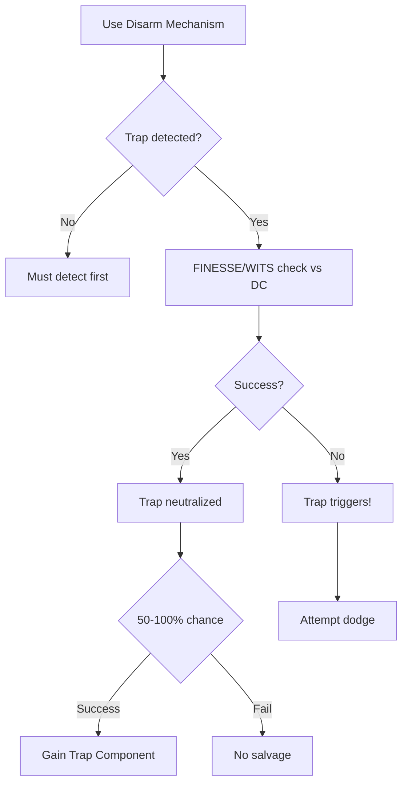

# Disarm Mechanism

**Ability ID:** 4003 | **Tier:** 1 | **Type:** Active | **PP Cost:** 3

---

## 1. Overview

| Property | Value |
|----------|-------|
| **Action** | Standard Action |
| **Target** | Single trap/mechanism |
| **Resource Cost** | 20 Stamina |
| **Range** | Adjacent (touch) |
| **Cooldown** | None |
| **Prerequisite** | Ruin-Stalker specialization |

---

## 2. Description

> "Your hands know the logic of Old World design. Springs, triggers, pressure plates—all follow patterns if you've studied them."

---

## 3. Mechanical Effects

### 3.1 Primary Effect

```
Check = FINESSE or WITS vs trap DC
Success = Trap neutralized, 50% salvage chance
Failure = Trap triggers (attempt dodge)
```

### 3.2 Salvage

| Result | Salvage Chance |
|--------|----------------|
| Success | 50% (1 Trap Component) |
| Rank 2 | 75% |
| Rank 3 | 100% |

---

## 4. Rank Progression

### Rank 1 (Base — included with ability unlock)

**Mechanical Effects:**
- FINESSE or WITS check to disarm
- Success: Trap neutralized
- 50% salvage chance
- Cost: 20 Stamina

---

### Rank 2 (Upgrade Cost: +2 PP)

**Mechanical Effects:**
- +2d10 to disarm checks
- 75% salvage chance
- **NEW:** Can redirect trap to target enemies

---

### Rank 3 (Upgrade Cost: +3 PP, requires Rank 2)

**Mechanical Effects:**
- +3d10 to disarm
- **Automatic success** on Minor/Moderate traps
- Can safely disarm Severe traps
- 100% salvage chance

---

## 5. Disarm Workflow



---

## 6. Trap Difficulty Tiers

| Tier | DC | Auto-Success (Rank 3) |
|------|-----|----------------------|
| Minor | 8 | ✓ |
| Moderate | 12 | ✓ |
| Severe | 16 | Manual only |
| Lethal | 20+ | Manual only |

---

## 7. Balance Data

### 7.1 Risk vs Reward
- **Failure:** Triggering a Severe trap can be lethal (4d10 damage).
- **Success:** Salvage (Components are valuable for *Master Trapsmith*) + Safe passage.
- **Efficiency:** Much cheaper than *Careful Advance* stamina-wise, but higher risk.

### 7.2 Salvage Economy
- **Trap Component:** Estimated value 50-100 hacksilver. Rank 3 printing money safely.

---

## 8. Phased Implementation Guide

### Phase 1: Mechanics
- [ ] **Interact**: Add `Disarm` option to Trap entities.
- [ ] **Check**: Implement `AttributeCheck` logic (FINESSE/WITS).
- [ ] **Result**: Hook up `Trigger()` on fail, `Destroy()` on success.

### Phase 2: Logic Integration
- [ ] **Salvage**: Implement `LootTable` drop logic for Trap Components.
- [ ] **Rank 2**: Add `Redirect` capability (Turn trap into a hazard for enemies?).
- [ ] **Rank 3**: Implement `AutoSuccess` logic for Tier check.

### Phase 3: Visuals
- [ ] **Animation**: Tinkering animation.
- [ ] **Minigame**: (Optional) UI for picking locks/cutting wires.

---

## 9. Testing Requirements

### 9.1 Unit Tests
- [ ] **Check**: Roll vs DC 12 -> Fail -> Trap Triggers. Success -> Trap Neutralized.
- [ ] **Salvage**: Success -> Inventory +1 Trap Component (50% test).
- [ ] **Auto**: Rank 3 vs DC 12 -> Returns Success immediately.

### 9.2 Integration Tests
- [ ] **Combat**: Attempting disarm during combat? (Standard action).
- [ ] **Redirect**: Trap targets enemy instead of player.

### 9.3 Manual QA
- [ ] **Log**: "Neutralized High Explosive Trap. Retrieved Blasting Cap."

---

## 10. Logging Requirements

**Reference:** [logging.md](../../../../../00-project/logging.md)

### 10.1 Log Events
| Event | Level | Message Template | Properties |
|-------|-------|------------------|------------|
| Attempt | Info | "{Character} attempts to disarm the {Trap}." | `Character`, `Trap` |
| Success | Info | "Success! The mechanism clicks open." | - |
| Fail | Warn | "Click... distinct metallic snap. RUN!" | - |
| Loot | Info | "Salvaged: {Item}." | `Item` |

---

## 11. Related Specifications
| Document | Purpose |
|----------|---------|
| [Master Trapsmith](master-trapsmith.md) | Uses salvaged components |
| [Skill System](../../../../01-core/dice-system.md) | Check mechanics |

---

## 12. Changelog
| Version | Date | Changes |
|---------|------|---------|
| 1.0 | 2025-12-07 | Initial specification |
| 1.1 | 2025-12-14 | Standardized with Balance, Phased Guide, Testing, Logging |
