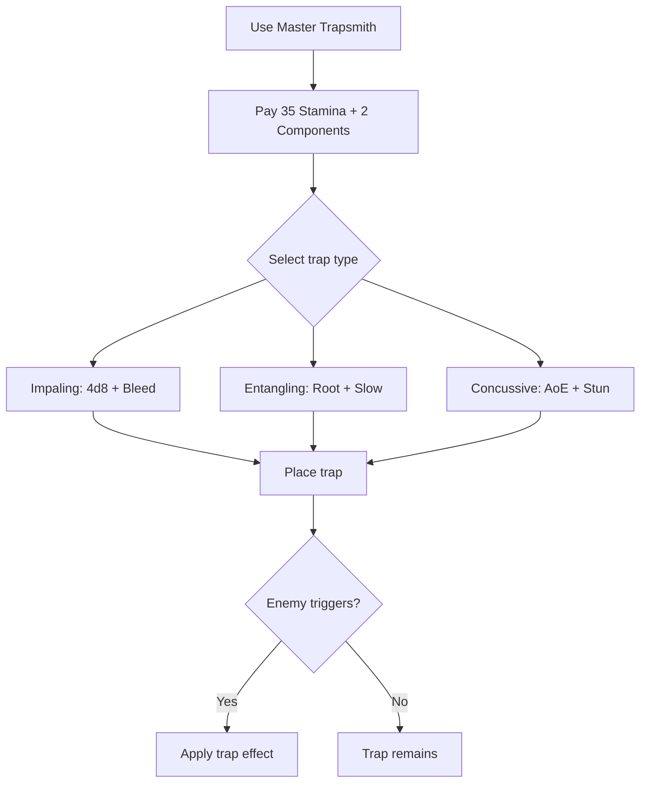

# Master Trapsmith

**Ability ID:** 4008 | **Tier:** 3 | **Type:** Passive + Active | **PP Cost:** 5

---

## 1. Overview

| Property | Value |
|----------|-------|
| **Passive** | Always active |
| **Active Action** | Standard Action |
| **Resource Cost** | 35 Stamina + 2 Trap Components |
| **Cooldown** | 2 turns (per trap) |
| **Prerequisite** | 16 PP in Ruin-Stalker tree |
| **Starting Rank** | 2 |

---

## 2. Description

> "You don't just disarm traps—you improve them, repurpose them, and deploy them with lethal precision."

---

## 3. Passive Effects

```
All placed traps: +1 turn duration
All placed traps: +1d6 damage
Can deploy salvaged ruin traps
```

---

## 4. Active: Deploy Advanced Trap

### 4.1 Trap Types

| Trap Type | Effect |
|-----------|--------|
| **Impaling** | 4d8 Physical + [Bleeding] (3 turns) |
| **Entangling** | [Rooted] 3 turns + [Slowed] 2 turns after |
| **Concussive** | 3d6 AoE (3×3) + [Stunned] (1 turn) |

### 4.2 Cost

```
Cost = 35 Stamina + 2 Trap Components
```

---

## 5. Rank Progression

### Rank 2 (Starting Rank)

**Passive:**
- +1 turn duration on placed traps
- +1d6 damage on placed traps
- Can deploy salvaged traps

**Active:**
- Deploy 1 Advanced Trap per combat
- Choose Impaling, Entangling, or Concussive
- Cooldown: 2 turns

---

### Rank 3 (Upgrade Cost: +3 PP, requires Rank 2)

**Passive:**
- +2 turn duration
- +2d6 damage

**Active:**
- Advanced traps: +2d8 damage
- Can place 2 traps per combat
- **NEW:** Place traps as **Bonus Action**
- **NEW:** Traps invisible (even to trap detection)
- Effects last +1 turn

---

## 6. Trap Deployment Workflow



---

## 7. Balance Data

### 7.1 Power Budget
| Rank | Passive | Active |
|------|---------|--------|
| II | +1 turn, +1d6 dmg | 35 Stamina, 1 Trap/Combat |
| III | +2 turn, +2d6 dmg | 2 Traps/Combat, Bonus Action, Invisible |

### 7.2 Tactical Value
- **Control:** Entangling Traps + Range = Free killy zone.
- **Pre-Combat:** Rank 3 Bonus Action means you can set traps *mid-fight* without losing attacks. Massive buff.

---

## 8. Phased Implementation Guide

### Phase 1: Mechanics
- [ ] **Data**: Update `Trap` entities with `IsPlayerOwned`, `DamageBonus`, `DurationBonus`.
- [ ] **Action**: Implement `DeployTrap` ability.

### Phase 2: Logic Integration
- [ ] **Trigger**: OnEnemyEnter -> Trigger Effect -> Roll Damage (Base + Bonus).
- [ ] **Rank 3**: Set `ActionCost` to `Bonus` instead of `Standard`. Set `IsVisible` to `False`.

### Phase 3: Visuals
- [ ] **Model**: Generic "Trap" model (Bear trap/Tripwire).
- [ ] **VFX**: Explosion/Snap effect on trigger.

---

## 9. Testing Requirements

### 9.1 Unit Tests
- [ ] **Deploy**: Inventory -2 Components, Stamina -35. Trap created at Target Loc.
- [ ] **Trigger**: Enemy moves -> Damage 4d8+1d6.
- [ ] **Passives**: Verify bonus damage applies to *all* player traps.
- [ ] **Action Economy**: Rank 3 -> Uses Bonus Action resource.

### 9.2 Integration Tests
- [ ] **Friendly Fire**: Player/Allies do not trigger own traps? (Usually yes, safer).
- [ ] **Persistence**: Trap remains for X turns then self-destructs?

### 9.3 Manual QA
- [ ] **Placement**: Verify cannot place inside walls or occupied tiles.

---

## 10. Logging Requirements

**Reference:** [logging.md](../../../../../00-project/logging.md)

### 10.1 Log Events
| Event | Level | Message Template | Properties |
|-------|-------|------------------|------------|
| Deploy | Info | "{Character} sets a {Type} trap." | `Character`, `Type` |
| Trigger | Info | "{Enemy} triggers the trap! ({Damage} dmg)" | `Enemy`, `Damage` |

---

## 11. Related Specifications
| Document | Purpose |
|----------|---------|
| [Disarm Mechanism](disarm-mechanism.md) | Component source |
| [Status Effects](../../../../04-systems/status-effects/rooted.md) | Rooted effect |

---

## 12. Changelog
| Version | Date | Changes |
|---------|------|---------|
| 1.0 | 2025-12-07 | Initial specification |
| 1.1 | 2025-12-14 | Standardized with Balance, Phased Guide, Testing, Logging |
