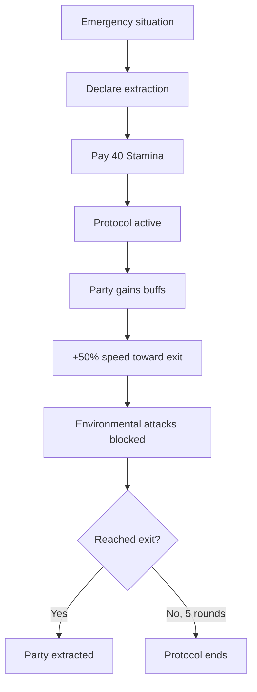

# Safe Extraction Protocol

**Ability ID:** 4007 | **Tier:** 3 | **Type:** Active | **PP Cost:** 5

---

## 1. Overview

| Property | Value |
|----------|-------|
| **Action** | Full Turn |
| **Target** | Entire party |
| **Resource Cost** | 40 Stamina |
| **Duration** | Until exit or 5 rounds |
| **Cooldown** | Once per exploration session |
| **Prerequisite** | 16 PP in Ruin-Stalker tree |
| **Starting Rank** | 2 |

---

## 2. Description

> "When everything goes wrong, you get everyone out. Your routes are planned, your signals clear, your discipline absolute."

---

## 3. Mechanical Effects

### 3.1 Party Buffs

```
Movement checks: +3d10
Hazard avoidance: +3d10
Speed: +50% toward exit
Immunity: Opportunity attacks from environmental hazards
```

---

## 4. Rank Progression

### Rank 2 (Starting Rank)

**Mechanical Effects:**
- All party members gain:
  - +3d10 to movement/hazard checks
  - Immunity to environmental opportunity attacks
  - +50% movement speed toward exit
- Duration: 5 rounds or until exit
- Cost: 40 Stamina

---

### Rank 3 (Upgrade Cost: +3 PP, requires Rank 2)

**Mechanical Effects:**
- All Rank 2 effects
- Party gains +2 Soak
- **NEW:** Rally points (party regains 10 Stamina each)
- **NEW:** Temporary CPS progression immunity
- **NEW:** Can carry incapacitated ally at full speed
- Extraction cannot be interrupted by non-boss enemies

---

## 5. Extraction Workflow



---

## 6. Tactical Applications

| Situation | Application |
|-----------|-------------|
| **Party wipe imminent** | Emergency extraction |
| **CPS overload** | Get everyone out safely |
| **Objective complete** | Fast, safe exit |

---

## 7. Balance Data

### 7.1 Emergency Utility
- **Cost:** 40 Stamina is high (nearly half pool), but cheap for preventing a TPK (Total Party Kill).
- **Restrictions:** "Once per session" prevents abuse for fast travel. It is strictly an "Oh Shit" button.

### 7.2 Comparison
- **Vs Retreat:** Standard retreat has checks and opportunity attacks. This guarantees safety from environment, which is often the killer in Ruin Stalker runs.

---

## 8. Phased Implementation Guide

### Phase 1: Mechanics
- [ ] **State**: Create `ExtractionMode` global state for the party.
- [ ] **Modifier**: Apply `MoveSpeed` * 1.5 multiplier.
- [ ] **Immunity**: Hook `CombatSystem` to block Opportunity Attacks tagged `Environment`.

### Phase 2: Logic Integration
- [ ] **Rally Check**: On activate, restore 10 Stamina to all (Rank 3).
- [ ] **Carry**: Allow "Drag Ally" action without movement penalty (Rank 3).
- [ ] **CPS**: Pause `PsychicStress` accumulation timer.

### Phase 3: Visuals
- [ ] **UI**: Flashing "EXTRACTION PROTOCOL ACTIVE" warning/timer (5 rounds).
- [ ] **Post-Process**: High-contrast or "Adrenaline" visual filter.

---

## 9. Testing Requirements

### 9.1 Unit Tests
- [ ] **Buffs**: Party Members gain +3d10 to Hazard checks.
- [ ] **Speed**: Move Speed 10 -> 15.
- [ ] **Recovery**: Rank 3 -> Stamina +10 applied.
- [ ] **Carry**: Dragging Body Speed 5 -> 15 (Rank 3).

### 9.2 Integration Tests
- [ ] **Timer**: 5 rounds pass -> Protocol expires.
- [ ] **Exit**: Reach Exit Zone -> "Mission Success".
- [ ] **Combat**: Enemy attempts AoO (Environment) -> Blocked. Enemy attempts AoO (Boss) -> Allowed? (Spec says "non-boss enemies" cannot interrupt).

### 9.3 Manual QA
- [ ] **Vibe**: Does the music change? (It should).

---

## 10. Logging Requirements

**Reference:** [logging.md](../../../../../00-project/logging.md)

### 10.1 Log Events
| Event | Level | Message Template | Properties |
|-------|-------|------------------|------------|
| Activate | Warn | "⚠ SAFE EXTRACTION PROTOCOL INITIATED ⚠" | - |
| Rally | Info | "{Character} rallies the squad! (+10 Stamina)" | `Character` |
| Expire | Warn | "Extraction window closed. Protocol offline." | - |

---

## 11. Related Specifications
| Document | Purpose |
|----------|---------|
| [Hazard Mapping](hazard-mapping.md) | Finding the exit |
| [Game Loop](../../../../01-core/game-loop.md) | Turn structure/Exit conditions |

---

## 12. Changelog
| Version | Date | Changes |
|---------|------|---------|
| 1.0 | 2025-12-07 | Initial specification |
| 1.1 | 2025-12-14 | Standardized with Balance, Phased Guide, Testing, Logging |
