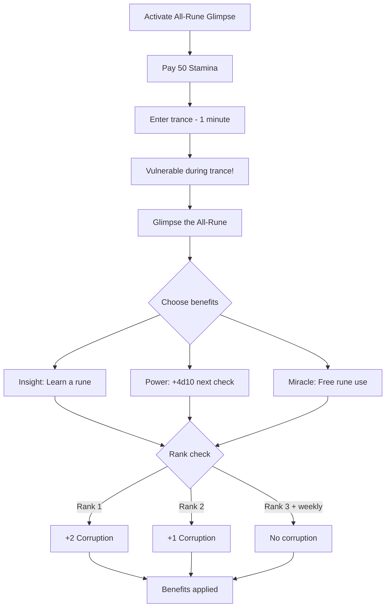

# All-Rune Glimpse

**Ability ID:** 1509 | **Tier:** 4 (Capstone) | **Type:** Active | **PP Cost:** 6

---

## Overview

| Property | Value |
|----------|-------|
| **Action** | Full Round |
| **Target** | Self |
| **Resource Cost** | 50 Stamina |
| **Prerequisite** | Full Rúnasmiðr tree |
| **Cooldown** | 1/day |
| **Starting Rank** | 1 |

---

## Description

> You trace the forbidden glyph. Reality shudders. For one moment, you see it — the All-Rune, the pattern beneath all patterns, the corruption made symbol. You cannot comprehend it. But fragments remain.

> [!CAUTION]
> This ability channels the All-Rune — the source of the Blight. Using it grants power but carries corruption risk.

---

## The All-Rune

The **All-Rune** is the theoretical "master rune" from which all other runes derive. It is the source of both runic power and the Blight. Glimpsing it is:
- **Dangerous** — Corruption guaranteed at lower ranks
- **Powerful** — Grants knowledge and ability impossible otherwise
- **Mysterious** — Nobody fully understands what they see

---

## Rank Progression

### Rank 1 (Starting Rank)

**Mechanical Effects:**
- Enter trance for 1 minute
- Choose ONE benefit:
  - **Insight:** Learn any rune you've seen but not mastered
  - **Power:** +4d10 to next runeforging check
  - **Miracle:** Gain 1 use of any rune you know (no materials)
- **Cost:** 50 Stamina **+ 2 Corruption**

**Formula:**
```
Duration = 1 minute (trance, vulnerable)
BenefitChoice = 1
StaminaCost = 50
CorruptionCost = 2
Cooldown = 1/day
```

---

### Rank 2 (Unlocked: Tree progression)

**Mechanical Effects:**
- All Rank 1 benefits
- **NEW:** Can choose TWO benefits
- **NEW:** Corruption cost reduced to 1

**Formula:**
```
BenefitChoice = 2
CorruptionCost = 1
```

---

### Rank 3 (Unlocked: Full tree completion)

**Mechanical Effects:**
- All Rank 2 benefits
- **NEW:** Can choose THREE benefits
- **NEW:** Once per week, NO corruption cost
- **NEW:** Fragments remain (permanent +1d10 to runeforging)

**Formula:**
```
BenefitChoice = 3
WeeklyNoCost = true
PermanentBonus = 1d10 (first use only)
```

---

## All-Rune Glimpse Workflow



---

## Benefit Details

### Insight: Learn Any Rune
- Must have **seen** the rune before (on item, in text, etc.)
- Rune is now fully mastered (craft at normal DC)
- Includes forbidden/elder runes

### Power: +4d10 Next Check
- Applies to NEXT runeforging check only
- Stacks with other bonuses
- Must use within 24 hours

### Miracle: Free Rune Use
- Choose any rune you know
- Apply it to any valid target
- No materials, no runeink, no check
- Effect is **temporary** (1 hour)

---

## Example Scenario

> **Situation:** Bjorn (Rank 2) uses All-Rune Glimpse before inscribing a legendary weapon.
>
> **Activation:**
> - Pays 50 Stamina
> - Enters 1-minute trance
>
> **Choices (2 at Rank 2):**
> 1. **Power** — +4d10 to next runeforging check
> 2. **Miracle** — Free temporary Tiwaz inscription
>
> **Corruption:** +1 (Rank 2 reduction)
>
> **Result:** Bjorn's next inscription roll has +4d10 bonus. His temporary Tiwaz lasts 1 hour.
>
> **The Experience:**
> *For one heartbeat, Bjorn sees it — the All-Rune. It is every symbol and no symbol. It is the Blight and the cure. His mind recoils, but fragments cling to his thoughts. He knows things he did not know before.*

---

## Corruption Consequences

| Corruption Level | Effect |
|------------------|--------|
| 1-5 | Minor cosmetic changes |
| 6-10 | Nightmares, -1d10 to rest |
| 11-15 | Visible corruption, social penalties |
| 16-20 | Mutation, attribute loss |
| 21+ | Risk of losing character |

See: [Corruption System](../../../01-core/corruption.md)

---

## Implementation Status

### Balance Data

#### Capstone Power Budget
- **Choice:** 3 powerful effects at Rank 3, each worth ~5 PP individually.
- **Cost:** Corruption is a hard limit. 2 Corruption/use at Rank 1 means ~10 uses before major consequences.
- **Weekly Free:** Rank 3's 1/week free use is powerful for high-stakes moments.

---

### Phased Implementation Guide

#### Phase 1: Mechanics
- [ ] **State**: `TranceActive` boolean. During trance, Character is `Vulnerable`.
- [ ] **Choice**: UI for selecting 1-3 benefits.
- [ ] **Effect**: Implement each benefit (Learn Rune, Bonus Dice, Free Use).

#### Phase 2: Logic Integration
- [ ] **Corruption**: Hook `ApplyCorruption(Amount)` after use.
- [ ] **Weekly**: Track `LastFreeUseDate`. If > 7 days, allow free.
- [ ] **Permanent**: Rank 3 first use -> `PermanentRuneforgingBonus += 1d10`.

#### Phase 3: Visuals
- [ ] **VFX**: Screen distortion, rune patterns overlay.
- [ ] **Audio**: Low droning, discordant chimes.

---

### Testing Requirements

#### Unit Tests
- [ ] **Rank**: Rank 1 -> 1 choice. Rank 2 -> 2 choices. Rank 3 -> 3 choices.
- [ ] **Corruption**: Verify +2 (Rank 1), +1 (Rank 2), +0 (Rank 3 weekly).
- [ ] **Permanent**: First use at Rank 3 -> Permanent bonus applied.

#### Integration Tests
- [ ] **Learn Rune**: Select "Insight" on unseen rune -> Fails. On seen rune -> Success.
- [ ] **Cooldown**: Use twice in one day -> Second fails.

#### Manual QA
- [ ] **VFX**: Does the "glimpse" feel appropriately disturbing?

---

### Logging Requirements

**Reference:** [logging.md](../../../../../00-project/logging.md)

#### Log Events
| Event | Level | Message Template | Properties |
|-------|-------|------------------|------------|
| Glimpse | Warn | "{Character} glimpses the All-Rune. (+{Corruption} Corruption)" | `Character`, `Corruption` |
| Benefit | Info | "Benefit chosen: {Benefit}." | `Benefit` |

---

### Related Specifications
| Document | Purpose |
|----------|---------|
| [Corruption](../../../../01-core/resources/corruption.md) | Corruption mechanic |
| [Runeforging](../../../../04-systems/crafting/runeforging.md) | Rune system |

---

### Changelog
| Version | Date | Changes |
|---------|------|---------|
| 1.0 | 2025-12-07 | Initial specification |
| 1.1 | 2025-12-14 | Standardized with Balance, Phased Guide, Testing, Logging |
