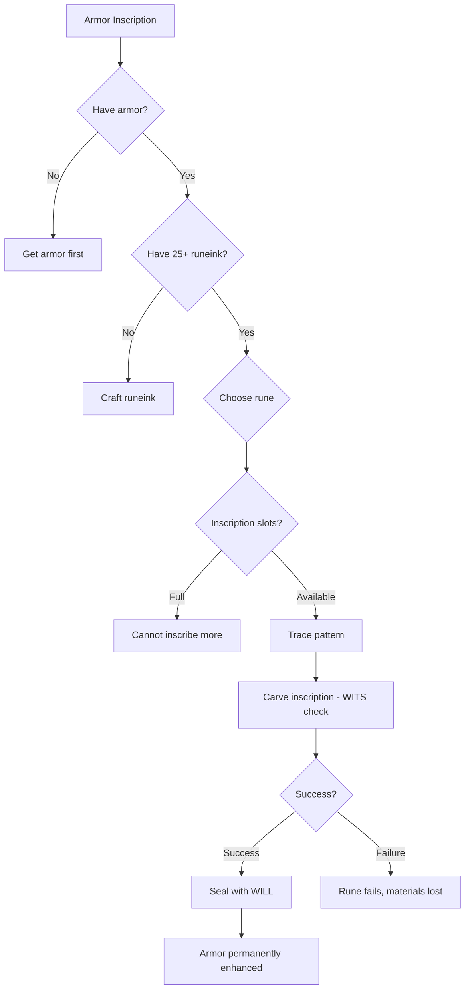

# Armor Inscription

**Ability ID:** 1506 | **Tier:** 2 | **Type:** Active | **PP Cost:** 4

---

## Overview

| Property | Value |
|----------|-------|
| **Action** | Extended (2 hours base) |
| **Target** | Armor |
| **Resource Cost** | 25 Runeink + 40 Stamina |
| **Prerequisite** | 8 PP in Rúnasmiðr tree |
| **Duration** | Permanent |
| **Starting Rank** | 2 |

---

## Description

> Protective symbols wrap the metal. The armor remembers.

---

## Available Runes

### Rank 2 Runes

| Symbol | Name | Effect | DC |
|--------|------|--------|-----|
| ᛇ | Eihwaz | +1 armor | 14 |
| ᛉ | Algiz | +2 to all saves | 16 |
| ᛁ | Isa | Cold resistance +2 | 12 |

### Rank 3 Runes (Additional)

| Symbol | Name | Effect | DC |
|--------|------|--------|-----|
| ᛒ | Berkano | +1 HP regeneration/hour | 14 |
| ᚨ | Ansuz | +1d10 to WILL saves | 14 |

---

## Rank Progression

### Rank 2 (Starting Rank)

**Mechanical Effects:**
- Inscribe ONE protection rune on armor
- Available: Eihwaz, Algiz, Isa
- Effect is permanent
- Cost: 25 Runeink + 40 Stamina
- Time: 2 hours

**Formula:**
```
MaxRunesPerArmor = 1
AvailableRunes = [Eihwaz, Algiz, Isa]
RuneinkCost = 25
StaminaCost = 40
Time = 2 hours
Duration = PERMANENT
```

---

### Rank 3 (Upgrade Cost: +3 PP, requires Rank 2)

**Mechanical Effects:**
- Additional runes: Berkano, Ansuz
- **NEW:** Can inscribe 2 runes on same armor
- Runeink cost reduced to 20

**Formula:**
```
MaxRunesPerArmor = 2
AvailableRunes += [Berkano, Ansuz]
RuneinkCost = 20
```

---

## Inscription Workflow



---

## Example Scenario

> **Situation:** Sigrid (Rank 3) inscribes Algiz and Berkano onto her chainmail.
>
> **First Inscription - Algiz:**
> - DC: 16
> - WITS: 5 + 3d10 (Rank 3 Expertise) = 8d10
> - Roll: [8, 7, 9, 6, 7, 8, 4, 9] = 6 successes ✓
> - Result: +2 to all saves inscribed
>
> **Second Inscription - Berkano:**
> - DC: 14
> - Roll: [7, 8, 9, 7, 6, 8, 7, 9] = 7 successes ✓
> - Result: +1 HP regeneration/hour inscribed
>
> **Final Armor:**
> - Sigrid's Chainmail
> - +2 to all saves
> - +1 HP regeneration per hour
> - Permanent enhancement

---

## Synergy with Other Abilities

| Combination | Effect |
|-------------|--------|
| + Inscription Expertise | Bonus dice apply |
| + Runelore Mastery | Reduced cost and time |
| + Elder Patterns | Can use combination runes |

---

## Implementation Status

### Balance Data

#### Economy
- **Input:** 25 Runeink (~50 Hacksilver) + 40 Stamina + 2 hours.
- **Output:** Permanent +1 Armor or +2 Saves (Legendary-tier enchantment).
- **Value:** Extremely efficient. A commercial enchanter would charge 500+ Hacksilver.

---

### Phased Implementation Guide

#### Phase 1: Mechanics
- [ ] **Object**: Add `InscriptionSlots` (1-2) to Armor entity.
- [ ] **Effect**: Implement each rune's permanent stat modification.

#### Phase 2: Logic Integration
- [ ] **Rank 3**: Unlock 2nd slot. Unlock Berkano/Ansuz.

#### Phase 3: Visuals
- [ ] **Item**: Glowing rune overlay on armor sprite/model.

---

### Testing Requirements

#### Unit Tests
- [ ] **Slot**: Armor has 0 inscriptions -> +1 after success.
- [ ] **Limit**: Rank 2: Inscribe 2nd rune -> Fail. Rank 3 -> Success.
- [ ] **Effect**: Armor has +1 Armor after Eihwaz inscription.

#### Integration Tests
- [ ] **Save**: Save/Load game -> Inscription persists.

#### Manual QA
- [ ] **Tooltip**: Armor tooltip shows "ᛇ Eihwaz: +1 Armor".

---

### Logging Requirements

**Reference:** [logging.md](../../../../../00-project/logging.md)

#### Log Events
| Event | Level | Message Template | Properties |
|-------|-------|------------------|------------|
| Inscribe | Info | "{Character} inscribes {Rune} onto {Armor}." | `Character`, `Rune`, `Armor` |

---

### Related Specifications
| Document | Purpose |
|----------|---------|
| [Runeforging](../../../../04-systems/crafting/runeforging.md) | Rune system |

---

### Changelog
| Version | Date | Changes |
|---------|------|---------|
| 1.0 | 2025-12-07 | Initial specification |
| 1.1 | 2025-12-14 | Standardized with Balance, Phased Guide, Testing, Logging |
