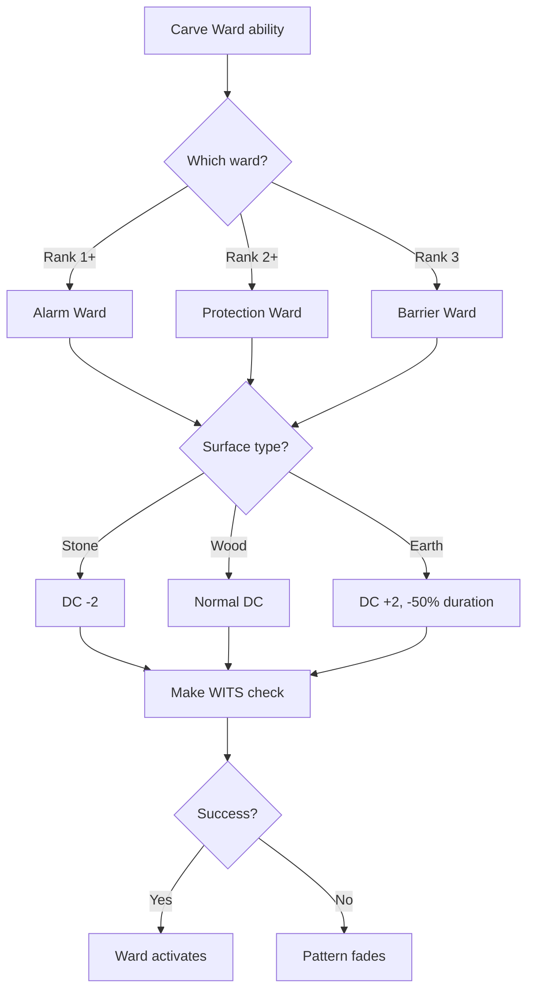

# Carve Ward

**Ability ID:** 1502 | **Tier:** 1 | **Type:** Active | **PP Cost:** 3

---

## Overview

| Property | Value |
|----------|-------|
| **Action** | Standard Action |
| **Target** | Surface (floor, wall, doorway) |
| **Resource Cost** | 20-40 Stamina |
| **Cooldown** | None (limited by duration) |
| **Prerequisite** | Rúnasmiðr specialization |

---

## Description

> You scratch the protective symbol into stone. The air shimmers. Something watches.

---

## Ward Types Available

| Ward | Rank Required | DC | Duration |
|------|---------------|-----|----------|
| Alarm Ward | 1 | 12 | 24 hours |
| Protection Ward | 2 | 16 | 12 hours |
| Barrier Ward | 3 | 18 | 8 hours |

---

## Rank Progression

### Rank 1 (Base — included with ability unlock)

**Mechanical Effects:**
- Place **Alarm Ward** only
- Duration: 24 hours
- Effect: Psychic alert when enemies cross (range: 500 ft)
- Cost: 20 Stamina

**Formula:**
```
WardType = "Alarm"
Duration = 24 hours
TriggerRange = 500 ft
StaminaCost = 20
DC = 12
```

**Carving Procedure:**
1. Find suitable surface (stone preferred)
2. Carve ᚨ (Ansuz) pattern
3. Make WITS check vs DC 12
4. Success: Ward activates
5. Failure: Pattern fades, retry tomorrow

---

### Rank 2 (Upgrade Cost: +2 PP)

**Mechanical Effects:**
- Can also place **Protection Ward**
- Protection effect: +2 to all saves for allies within 10 ft
- Duration: 12 hours
- Cost: 30 Stamina
- **NEW:** Wards can be hidden (enemies need WITS DC 14 to spot)

**Formula:**
```
WardTypes = ["Alarm", "Protection"]
Protection.SaveBonus = +2
Protection.Radius = 10 ft
Protection.Duration = 12 hours
HiddenDC = 14
```

---

### Rank 3 (Upgrade Cost: +3 PP, requires Rank 2)

**Mechanical Effects:**
- Can also place **Barrier Ward**
- Barrier effect: Blocks passage, 30 HP, breakable
- Duration: 8 hours
- Cost: 40 Stamina
- **NEW:** All ward durations +50%

**Formula:**
```
WardTypes = ["Alarm", "Protection", "Barrier"]
Barrier.HP = 30
Barrier.BlocksPassage = true
DurationMultiplier = 1.5
```

---

## Ward Placement Workflow



---

## Example Scenario

> **Situation:** Bjorn places a Protection Ward at camp entrance (Rank 2).
>
> **Setup:**
> - WITS: 5
> - Stone surface: -2 DC
> - Cost: 30 Stamina
>
> **Check:**
> - DC: 16 (Protection) - 2 (stone) = 14
> - Roll: 5d10 → [8, 7, 4, 9, 7] = 4 successes ✓
>
> **Result:** Ward activates. All allies within 10 ft gain +2 to saves for 12 hours.

---

## Implementation Status

### Balance Data

#### Utility
- **Alarm:** Essential for safe resting. Prevents ambushes.
- **Protection:** +2 Saves is a significant buff for party.
- **Barrier:** 30 HP barrier blocks pursuit during retreats.

---

### Phased Implementation Guide

#### Phase 1: Mechanics
- [ ] **Ward Entity**: Create placeable Ward object at tile.
- [ ] **Alarm**: Hook `OnEnemyCrossed` -> Send alert to caster.
- [ ] **Protection**: Aura buff for allies in radius.
- [ ] **Barrier**: Collision blocker with HP.

#### Phase 2: Logic Integration
- [ ] **Hidden**: Stealth DC check for enemies.
- [ ] **Duration**: Apply multiplier for Rank 3 (+50%).

#### Phase 3: Visuals
- [ ] **VFX**: Shimmering rune on surface.

---

### Testing Requirements

#### Unit Tests
- [ ] **Alarm**: Enemy crosses -> Caster receives notification.
- [ ] **Protection**: Ally in radius -> +2 Saves.
- [ ] **Barrier**: 30 damage -> Barrier destroyed.

#### Integration Tests
- [ ] **Duration**: Ward placed -> Wait 24h (Alarm) -> Verify expiry.
- [ ] **Hidden**: Enemy WITS < 14 -> Ward not detected.

#### Manual QA
- [ ] **Map**: Verify ward icon appears on minimap.

---

### Logging Requirements

**Reference:** [logging.md](../../../../../00-project/logging.md)

#### Log Events
| Event | Level | Message Template | Properties |
|-------|-------|------------------|------------|
| Place | Info | "{Character} carves a {WardType} ward." | `Character`, `WardType` |
| Trigger | Warn | "Alarm ward triggered!" | - |

---

### Related Specifications
| Document | Purpose |
|----------|---------|
| [Runeforging](../../../../04-systems/crafting/runeforging.md) | Rune system |

---

### Changelog
| Version | Date | Changes |
|---------|------|---------|
| 1.0 | 2025-12-07 | Initial specification |
| 1.1 | 2025-12-14 | Standardized with Balance, Phased Guide, Testing, Logging |
