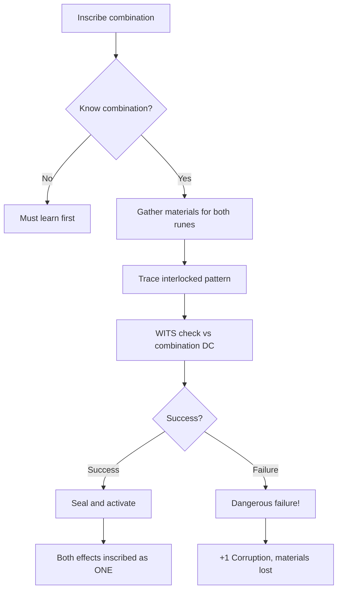

# Elder Patterns

**Ability ID:** 1508 | **Tier:** 3 | **Type:** Passive | **PP Cost:** 5

---

## Overview

| Property | Value |
|----------|-------|
| **Action** | Free (always active) |
| **Target** | Self |
| **Resource Cost** | None |
| **Prerequisite** | 16 PP in Rúnasmiðr tree |
| **Starting Rank** | 2 |

---

## Description

> You have learned the forbidden combinations. Two runes. Three. Patterns of terrible power.

---

## Combination Runes

### Rank 2 Combinations

| Combination | Runes | Effect | DC |
|-------------|-------|--------|-----|
| **Warrior's Blessing** | ᚢ + ᛏ | +2 damage, +2 hit | 20 |
| **Worldwalker** | ᚱ + ᛖ | +3 movement | 18 |

### Rank 3 Combinations

| Combination | Runes | Effect | DC |
|-------------|-------|--------|-----|
| **Storm-Caller** | ᚦ + ᚺ | +2d6 lightning + cold | 22 |
| **Ironhide** | ᛇ + ᛉ | +2 armor, +2 saves | 22 |
| **Mind-Ward** | ᚨ + ᛉ | Fear immunity, +3 WILL | 24 |

---

## Rank Progression

### Rank 2 (Starting Rank)

**Mechanical Effects:**
- Learn 2 combination runes:
  - Warrior's Blessing (ᚢ + ᛏ)
  - Worldwalker (ᚱ + ᛖ)
- Can attempt combination inscriptions (DC 18-20)
- Combinations count as ONE inscription slot

**Formula:**
```
KnownCombinations = ["Warrior's Blessing", "Worldwalker"]
CombinationSlotCost = 1
```

---

### Rank 3 (Upgrade Cost: +3 PP, requires Rank 2)

**Mechanical Effects:**
- Learn ALL combination runes
- **NEW:** Can create new combinations (GM approval, DC 24+)
- **NEW:** +2d10 when inscribing combinations

**Formula:**
```
KnownCombinations = ALL
CanCreateNew = true (DC 24+)
CombinationBonus = 2d10
```

---

## Combination Inscription Workflow



---

## Creating New Combinations (Rank 3)

When attempting to create a **new** combination not in the library:

| Step | Requirement |
|------|-------------|
| 1. Theory | Explain why runes combine |
| 2. GM Approval | Must make thematic sense |
| 3. Check | DC 24 WITS check |
| 4. Success | New combination learned |
| 5. Failure | +2 Corruption, cannot retry for 1 week |

---

## Example Scenario

> **Situation:** Kira (Rank 2) inscribes Warrior's Blessing onto sword.
>
> **Setup:**
> - WITS: 6
> - Elder Patterns: grants access
> - Inscription Expertise: +2d10
>
> **Check:**
> - DC: 20 (Warrior's Blessing)
> - Pool: 8d10
> - Roll: [8, 7, 9, 4, 7, 8, 6, 9] = 6 successes ✓
>
> **Result:** Sword gains BOTH +2 damage AND +2 hit, using ONE inscription slot.

---

## Implementation Status

### Balance Data

#### Power
- **Efficiency:** 2 effects in 1 slot = 100% more powerful weapons.
- **Risk:** Higher DCs (20+) and Corruption on failure balances power.

---

### Phased Implementation Guide

#### Phase 1: Mechanics
- [ ] **Data**: Define combination rune table.
- [ ] **Logic**: `GetCombinationEffects(Rune1, Rune2)`.

#### Phase 2: Logic Integration
- [ ] **Rank 3**: Enable custom combination creation (GM approval flag).
- [ ] **Failure**: Apply +1 Corruption on failed combination attempts.

#### Phase 3: Visuals
- [ ] **UI**: Show interlocked rune patterns in crafting UI.

---

### Testing Requirements

#### Unit Tests
- [ ] **Combo**: Inscribe Warrior's Blessing -> Weapon has +2 damage AND +2 hit.
- [ ] **Slot**: Combination uses only 1 slot.

#### Integration Tests
- [ ] **Failure**: Fail DC by 5 -> +1 Corruption applied.

#### Manual QA
- [ ] **Tooltip**: Weapon shows combined effect description.

---

### Logging Requirements

**Reference:** [logging.md](../../../../../00-project/logging.md)

#### Log Events
| Event | Level | Message Template | Properties |
|-------|-------|------------------|------------|
| Combine | Info | "{Character} inscribes {Combination} ({Rune1}+{Rune2})." | `Character`, `Combination`, `Rune1`, `Rune2` |

---

### Related Specifications
| Document | Purpose |
|----------|---------|
| [Runeforging](../../../../04-systems/crafting/runeforging.md) | Rune system |

---

### Changelog
| Version | Date | Changes |
|---------|------|---------|
| 1.0 | 2025-12-07 | Initial specification |
| 1.1 | 2025-12-14 | Standardized with Balance, Phased Guide, Testing, Logging |
