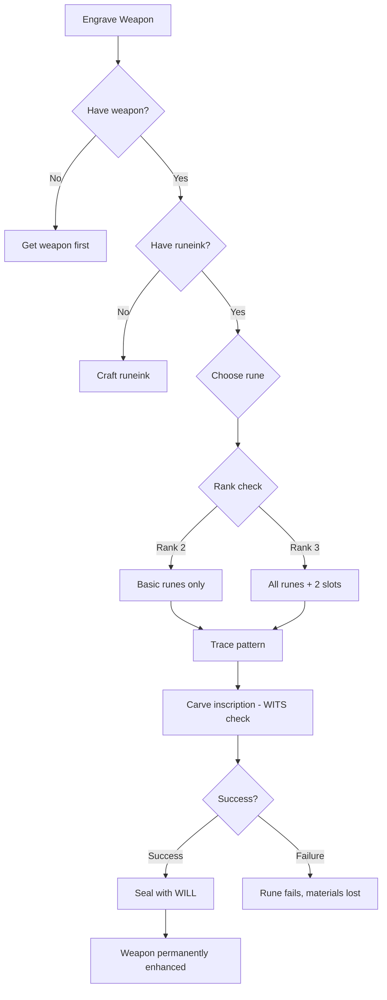

# Engrave Weapon

**Ability ID:** 1504 | **Tier:** 2 | **Type:** Active | **PP Cost:** 4

---

## Overview

| Property | Value |
|----------|-------|
| **Action** | Extended (2 hours base) |
| **Target** | Weapon |
| **Resource Cost** | 25 Runeink + 40 Stamina |
| **Prerequisite** | 8 PP in Rúnasmiðr tree |
| **Duration** | Permanent |
| **Starting Rank** | 2 |

---

## Description

> The rune burns as you carve. The weapon drinks the power hungrily.

---

## Available Runes

### Rank 2 Runes

| Symbol | Name | Effect | DC |
|--------|------|--------|-----|
| ᚢ | Uruz | +1 damage | 12 |
| ᚦ | Thurisaz | +1d6 lightning damage | 14 |
| ᚲ | Kenaz | +1d6 fire damage | 14 |
| ᚺ | Hagalaz | +1d6 cold damage | 14 |

### Rank 3 Runes (Additional)

| Symbol | Name | Effect | DC |
|--------|------|--------|-----|
| ᛏ | Tiwaz | +2 to hit | 16 |
| ᛊ | Sowilo | +1d6 radiant damage | 16 |

---

## Rank Progression

### Rank 2 (Starting Rank)

**Mechanical Effects:**
- Inscribe ONE damage rune on weapon
- Available: Uruz, Thurisaz, Kenaz, Hagalaz
- Effect is permanent
- Cost: 25 Runeink + 40 Stamina
- Time: 2 hours

**Formula:**
```
MaxRunesPerWeapon = 1
AvailableRunes = [Uruz, Thurisaz, Kenaz, Hagalaz]
RuneinkCost = 25
StaminaCost = 40
Time = 2 hours
Duration = PERMANENT
```

---

### Rank 3 (Upgrade Cost: +3 PP, requires Rank 2)

**Mechanical Effects:**
- Additional runes: Tiwaz, Sowilo
- **NEW:** Can inscribe 2 runes on same weapon
- Runeink cost reduced to 20

**Formula:**
```
MaxRunesPerWeapon = 2
AvailableRunes += [Tiwaz, Sowilo]
RuneinkCost = 20
```

---

## Engraving Workflow



---

## Example Scenario

> **Situation:** Kira (Rank 3) engraves Thurisaz and Tiwaz onto her axe.
>
> **First Inscription - Thurisaz:**
> - DC: 14
> - WITS: 6 + 2d10 (Inscription Expertise) = 8d10
> - Roll: [8, 7, 9, 4, 7, 8, 3, 9] = 6 successes ✓
> - Result: +1d6 lightning damage inscribed
>
> **Second Inscription - Tiwaz:**
> - DC: 16
> - Roll: [7, 8, 4, 9, 7, 6, 8, 9] = 6 successes ✓
> - Result: +2 to hit inscribed
>
> **Final Weapon:**
> - Kira's Axe
> - +1d6 lightning damage
> - +2 to hit
> - Permanent enhancement

---

## Failure Consequences

| Failure Margin | Consequence |
|----------------|-------------|
| Miss by 1-2 | Weak inscription (-50% effect) |
| Miss by 3-4 | Inscription inert, materials wasted |
| Miss by 5+ | Catastrophic failure (see runeforging) |

---

## Implementation Status

### Balance Data

#### Economy
- **Input:** 25 Runeink + 40 Stamina + 2 hours.
- **Output:** Permanent +1 damage or +1d6 elemental.
- **Value:** Significant DPS increase for entire campaign.

---

### Phased Implementation Guide

#### Phase 1: Mechanics
- [ ] **Object**: Add `InscriptionSlots` to Weapon entity.
- [ ] **Effect**: Implement each rune's damage modification.

#### Phase 2: Logic Integration
- [ ] **Rank 3**: Unlock 2nd slot. Unlock Tiwaz/Sowilo.

#### Phase 3: Visuals
- [ ] **Item**: Glowing rune overlay on weapon sprite/model.

---

### Testing Requirements

#### Unit Tests
- [ ] **Slot**: Weapon has 0 inscriptions -> +1 after success.
- [ ] **Effect**: Weapon deals +1d6 lightning after Thurisaz.

#### Integration Tests
- [ ] **Persistence**: Save/Load -> Inscription persists.

#### Manual QA
- [ ] **Combat Log**: "Deals 8 + 4 (ᚦ lightning) damage."

---

### Logging Requirements

**Reference:** [logging.md](../../../../../00-project/logging.md)

#### Log Events
| Event | Level | Message Template | Properties |
|-------|-------|------------------|------------|
| Engrave | Info | "{Character} engraves {Rune} onto {Weapon}." | `Character`, `Rune`, `Weapon` |

---

### Related Specifications
| Document | Purpose |
|----------|---------|
| [Runeforging](../../../../04-systems/crafting/runeforging.md) | Rune system |

---

### Changelog
| Version | Date | Changes |
|---------|------|---------|
| 1.0 | 2025-12-07 | Initial specification |
| 1.1 | 2025-12-14 | Standardized with Balance, Phased Guide, Testing, Logging |
