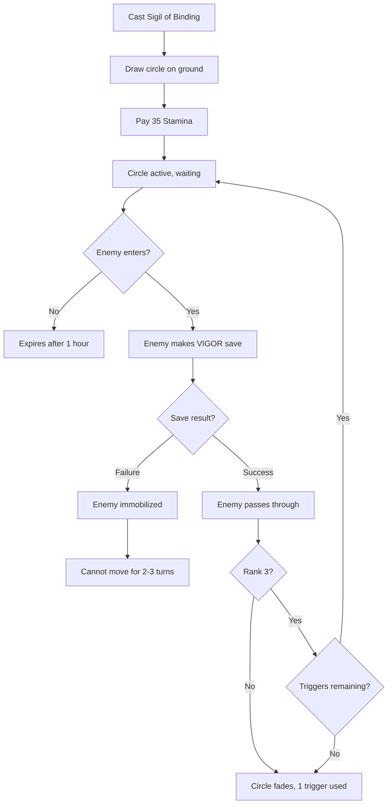

# Sigil of Binding

**Ability ID:** 1505 | **Tier:** 2 | **Type:** Active | **PP Cost:** 4

---

## Overview

| Property | Value |
|----------|-------|
| **Action** | Standard Action |
| **Target** | Ground location |
| **Resource Cost** | 35 Stamina |
| **Prerequisite** | 8 PP in Rúnasmiðr tree |
| **Duration** | 1 hour or triggered |
| **Starting Rank** | 2 |

---

## Description

> The binding glyph flares. Whatever steps within the circle cannot leave.

---

## Rank Progression

### Rank 2 (Starting Rank)

**Mechanical Effects:**
- Place binding circle (5 ft radius)
- Enemy entering makes VIGOR save DC 14
- Failed save: Immobilized 2 turns
- Duration: 1 hour or 1 trigger (whichever first)
- Cost: 35 Stamina

**Formula:**
```
CircleRadius = 5 ft
SaveDC = 14
SaveAttribute = VIGOR
ImmobilizeDuration = 2 turns
CircleDuration = 1 hour
MaxTriggers = 1
```

**Visual Effect:**
- Faint runic circle visible on ground
- Flares bright when triggered

---

### Rank 3 (Upgrade Cost: +3 PP, requires Rank 2)

**Mechanical Effects:**
- Save DC: 16
- Immobilized: 3 turns
- **NEW:** Can draw larger circle (10 ft radius)
- **NEW:** Circle can trigger multiple times (up to 3)

**Formula:**
```
CircleRadius = 10 ft (option)
SaveDC = 16
ImmobilizeDuration = 3 turns
MaxTriggers = 3
```

---

## Binding Workflow



---

## Tactical Uses

| Situation | Application |
|-----------|-------------|
| Chokepoint defense | Place at doorway |
| Ambush | Hidden sigil + attack |
| Escape | Drop behind while fleeing |
| Boss fight | Control enemy movement |

---

## Example Scenario

> **Situation:** Bjorn (Rank 2) places Sigil of Binding at tunnel entrance.
>
> **Setup:**
> - Pays 35 Stamina
> - Draws 5 ft circle
> - Circle activates
>
> **Later - Enemy enters:**
> - Raider steps into circle
> - VIGOR save: DC 14
> - Raider VIGOR: 4
> - Roll: 4d10 → [3, 6, 4, 2] = 0 successes ✗
>
> **Result:** Raider immobilized for 2 turns. Bjorn attacks freely.

---

## Implementation Status

### Balance Data

#### Control
- **Duration:** 2-3 turns of Immobilize = 2-3 free attacks on target.
- **AOE:** 10ft at Rank 3 can catch multiple enemies.
- **Cost:** 35 Stamina is moderate; good for setup.

---

### Phased Implementation Guide

#### Phase 1: Mechanics
- [ ] **Entity**: Create `BindingCircle` placeable entity.
- [ ] **Trigger**: Hook `OnEnemyEnter(Circle)` -> Force save.
- [ ] **Effect**: Apply `Immobilized` status on fail.

#### Phase 2: Logic Integration
- [ ] **Multi**: Track `TriggersRemaining` counter.
- [ ] **Expiry**: Timer for 1 hour duration.

#### Phase 3: Visuals
- [ ] **VFX**: Glowing runic circle on ground.

---

### Testing Requirements

#### Unit Tests
- [ ] **Trigger**: Enemy enters -> Save forced.
- [ ] **Fail**: Save fails -> Enemy Immobilized.
- [ ] **Duration**: After 1 hour, circle gone.

#### Integration Tests
- [ ] **Multiple**: Rank 3, 3 enemies enter -> All 3 save, 3 triggers used.

#### Manual QA
- [ ] **VFX**: Circle flares on trigger.

---

### Logging Requirements

**Reference:** [logging.md](../../../../../00-project/logging.md)

#### Log Events
| Event | Level | Message Template | Properties |
|-------|-------|------------------|------------|
| Place | Info | "{Character} draws a binding sigil." | `Character` |
| Trigger | Warn | "{Target} is bound!" | `Target` |

---

### Related Specifications
| Document | Purpose |
|----------|---------|
| [Status Effects](../../../../04-systems/status-effects/immobilized.md) | Immobilized status |

---

### Changelog
| Version | Date | Changes |
|---------|------|---------|
| 1.0 | 2025-12-07 | Initial specification |
| 1.1 | 2025-12-14 | Standardized with Balance, Phased Guide, Testing, Logging |
