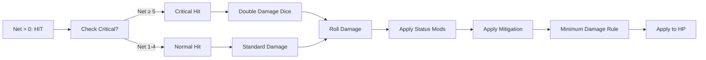

# Attack Outcomes — From Roll to Result

> *"The dice fall. Steel meets flesh—or finds only air. In that moment, fate is decided."*

---

## Document Control

| Version | Date | Changes |
|---------|------|---------|
| 1.0 | 2025-12-07 | Initial specification |

---

## 1. Overview

### 1.1 Identity Table

| Property | Value |
|----------|-------|
| Spec ID | `SPEC-COMBAT-OUTCOMES` |
| Category | Combat System |
| Type | Mechanics |
| Dependencies | Combat Resolution, Dice System |

### 1.2 Core Philosophy

Attack outcomes define **what happens when dice are rolled**. Every roll has consequences—hits deal damage, misses waste resources, fumbles create danger, and critical hits create triumph.

---

## 2. Outcome Types

### 2.1 Outcome Table

| Net Successes | Outcome | Effect |
|---------------|---------|--------|
| ≤ -5 | **Critical Fumble** | Miss + weapon jam or self-injury |
| -4 to -1 | **Miss** | Attack deflected, no damage |
| 0 | **Miss (Tie)** | Defender wins ties |
| 1-4 | **Hit** | Standard damage |
| 5+ | **Critical Hit** | Double damage dice |

### 2.2 Outcome Probability

At equal dice pools (e.g., 5d10 attack vs 5d10 defense):

| Outcome | Probability |
|---------|-------------|
| Critical Fumble | ~3% |
| Miss | ~45% |
| Hit | ~45% |
| Critical Hit | ~7% |

---

## 3. Hit Resolution

### 3.1 When Hit Lands (Net > 0)



### 3.2 Damage Calculation Pipeline

```
1. Base Damage = Weapon Dice + Flat Bonus
2. [Inspired] → Add +3 dice before rolling
3. Critical → Double dice before rolling
4. Stance Bonus → Add flat damage
5. [Vulnerable] → Multiply by 1.25
6. Defense Bonus → Reduce by %
7. Soak → Subtract flat armor
8. Minimum Rule → Max(1, result) if hit
9. Apply to HP
```

---

## 4. Damage Calculation

### 4.1 Base Damage

```
Base Damage = Roll(Weapon.DamageDice) + Weapon.DamageBonus
```

**Weapon Examples:**

| Weapon | Die | Bonus | Average |
|--------|-----|-------|---------|
| Unarmed | 1d4 | +0 | 2.5 |
| Dagger | 2d6 | +2 | 9 |
| Longsword | 2d8 | +3 | 12 |
| Greatsword | 2d10 | +5 | 16 |
| Atgeir | 2d8 | +5 | 14 |

### 4.2 Status Effect Modifiers

| Status | Effect | Application |
|--------|--------|-------------|
| **[Inspired]** | +3 damage dice | Before rolling |
| **[Vulnerable]** | +25% damage | After rolling |
| **Aggressive Stance** | +4 flat damage | After rolling |
| **Battle Rage (self)** | +25% damage taken | On defense |

### 4.3 Damage Mitigation

```
Defense Bonus (from Defend): 0-75% reduction
Soak (from armor): Flat subtraction

Final = (Damage × (1 - DefenseBonus%)) - Soak
```

### 4.4 Minimum Damage Rule

**If attack hit (Net > 0):**
```
Final Damage = Max(1, calculated)
```

A successful hit **always deals at least 1 damage**.

### 4.5 Ignore Armor Flag

Some abilities (Heretical powers) set `IgnoresArmor = true`:
- Bypasses Defense Bonus
- Bypasses Soak
- Still subject to minimum damage rule

---

## 5. Miss Resolution

### 5.1 Standard Miss (Net ≤ 0)

When attack misses:
- No damage dealt
- Combat log displays deflection message
- Resources (Stamina/AP) still consumed
- Turn ends

### 5.2 Miss Messages

| Context | Message |
|---------|---------|
| Melee attack | "The attack is deflected!" |
| Ranged attack | "The shot goes wide!" |
| Aetheric attack | "The spell fizzles!" |
| Tie (Net = 0) | "Barely parried!" |

---

## 6. Critical Hit

### 6.1 Trigger Conditions

```
Critical Hit triggers when:
  Net Successes ≥ 5
  OR
  Flanking bonus triggers crit (5% base + flanking %)
```

### 6.2 Critical Hit Effect

**Double damage dice, NOT flat bonuses:**

```
Normal: Longsword 2d8+3
Critical: Longsword 4d8+3 (doubles 2d8 → 4d8)
```

### 6.3 Critical with [Inspired]

```
Weapon: 2d8+3
+ [Inspired]: 5d8+3
+ Critical: 10d8+3

Average: ~48 damage (devastating)
```

### 6.4 Critical + Flanking

| Condition | Crit Chance |
|-----------|-------------|
| Base | 5% |
| Flanking (+10%) | 15% |
| Rear (+15%) | 20% |
| Surrounded (+20%) | 25% |

---

## 7. Fumble (Critical Failure)

### 7.1 Trigger Condition

```
Fumble triggers when:
  Net Successes ≤ -5
```

### 7.2 Fumble Effects

| Roll d10 | Fumble Type | Effect |
|---------|-------------|--------|
| 1-3 | **Overextended** | -2 to defense until next turn |
| 4-6 | **Weapon Jam** | Next attack costs +5 Stamina |
| 7-8 | **Self-Injury** | Take 1d10 damage |
| 9-10 | **Catastrophic** | Drop weapon, opponent gets free attack |

### 7.3 Fumble Stress

| Event | Stress Gain |
|-------|-------------|
| Standard fumble | +5 |
| Self-injury fumble | +8 |
| Catastrophic fumble | +12 |

---

## 8. Special Hit Types

### 8.1 Triumph (Roll all 6s)

If every die in the attack pool shows a 10:
- **Automatic critical hit**
- **Ignore all defense**
- Combat log: "PERFECT STRIKE!"

Probability: Very rare (~0.00001% for 5 dice)

### 8.2 Botch (Roll all 1-4)

If every die shows 1-7 (no successes):
- **Automatic fumble** (even if defender also fails)
- Combat log: "Complete failure!"

### 8.3 Overkill

If damage exceeds target's remaining HP by 50%+:
- **Overkill bonus**: +10% Legend from this kill
- **Morale effect**: Adjacent enemies gain +5 Stress

---

## 9. Damage Types

### 9.1 Physical vs Aetheric

| Type | Defense | Source |
|------|---------|--------|
| **Physical** | Soak (armor) reduces | Weapons, melee |
| **Aetheric** | No Soak reduction | Spells, Mystic |
| **True** | Ignores all defense | Corruption, special |

### 9.2 Damage Type Resolution

```
Physical: Apply Soak normally
Aetheric: Skip Soak, apply Defense Bonus only
True: No mitigation at all
```

---

## 10. Worked Examples

### 10.1 Standard Hit

```
Attack: Warrior with MIGHT 5, Longsword (2d8+3)
Defense: Enemy STURDINESS 4

Attack Roll: 5d10 = [10, 8, 4, 3, 2] = 2 successes
Defense Roll: 4d10 = [3, 8, 1, 4] = 1 success
Net: 2 - 1 = 1 → HIT

Damage: 2d8+3 = [4, 7] + 3 = 14
Enemy Soak: 3
Final: 14 - 3 = 11 damage
```

### 10.2 Critical Hit with [Vulnerable]

```
Attack: Net successes = 6 → CRITICAL
Weapon: 2d8+3 → Crit: 4d8+3 = [7, 6, 4, 8] + 3 = 28
[Vulnerable]: 28 × 1.25 = 35
Soak 5: 35 - 5 = 30 damage
```

### 10.3 Miss with Mitigation

```
Attack: 4 successes
Defense: 4 successes (with 50% Defense Bonus active)
Net: 4 - 4 = 0 → MISS (tie, defender wins)

No damage dealt.
Defense Bonus consumed.
```

### 10.4 Fumble

```
Attack: 1 success
Defense: 6 successes
Net: 1 - 6 = -5 → FUMBLE

Roll d10 for fumble type: 7 = Self-Injury
Take 1d10 damage (roll: 6)
Gain +8 Stress
```

---

## 11. Technical Implementation

### 11.1 Data Model

```csharp
public class DamageResult
{
    public int BaseDamage { get; set; }
    public int BonusDice { get; set; }
    public bool IsCritical { get; set; }
    public bool IsFumble { get; set; }
    public int NetSuccesses { get; set; }
    
    public int StatusModifier { get; set; }
    public int StanceBonus { get; set; }
    public int MitigationReduction { get; set; }
    public int SoakReduction { get; set; }
    
    public int FinalDamage { get; set; }
    public bool MinimumDamageApplied { get; set; }
    public DamageType Type { get; set; }
}

public enum DamageType { Physical, Aetheric, True }
```

### 11.2 Service Interface

```csharp
public interface IAttackResolutionService
{
    AttackResult ResolveAttack(
        CombatParticipant attacker,
        CombatParticipant defender,
        Weapon weapon,
        List<StatusEffect> attackerStatuses,
        List<StatusEffect> defenderStatuses);
    
    DamageResult CalculateDamage(
        AttackResult attackResult,
        Weapon weapon,
        Stance attackerStance);
    
    FumbleResult RollFumble();
}
```

---

## 12. Phased Implementation Guide

### Phase 1: Core Math
- [ ] **Data Model**: Implement `DamageResult`, `DamageType`.
- [ ] **Service**: Implement `CalculateDamage` with basic math (Base + Bonus).
- [ ] **Crit/Fumble**: Implement Net >= 5 / Net <= -5 checks.

### Phase 2: Modifiers
- [ ] **Status**: Implement [Inspired] (+3 dice) and [Vulnerable] (x1.25).
- [ ] **Mitigation**: Implement Defense Bonus % and Soak flat reduction.
- [ ] **Type**: Implement Physical vs Aetheric soak bypass logic.

### Phase 3: Edge Cases
- [ ] **Min Damage**: Ensure hits always deal >= 1 damage.
- [ ] **Fumble Table**: Implement random effect selection for Fumbles.
- [ ] **Overkill**: Implement bonus Legend calculation (if integrating).

### Phase 4: UI & Feedback
- [ ] **Floaters**: "CRIT!", "FUMBLE!", "Blocked" floating text.
- [ ] **Log**: Detailed breakdown of damage calculation in tooltips/log.
- [ ] **Screen Shake**: Visual impact for Critical Hits.

---

## 13. Testing Requirements

### 13.1 Unit Tests
- [ ] **Net Success**: Net > 0 -> Hit. Net <= 0 -> Miss.
- [ ] **Crit**: Net = 5 -> Double Base Dice.
- [ ] **Vulnerable**: (10 dmg) * 1.25 = 12 dmg (floor/ceil rules?).
- [ ] **Soak**: 10 dmg - 3 soak = 7 final. 2 dmg - 3 soak = 1 min.
- [ ] **Ignore Armor**: 10 dmg vs 50 soak -> 10 dmg.

### 13.2 Integration Tests
- [ ] **Flow**: Attack Hit -> Damage Calc -> HP Reduction.
- [ ] **Fumble**: Attack Fumble -> Self Injury -> HP Reduction + Log.
- [ ] **Stance**: Aggressive Stance -> +4 Dmg verified.

### 13.3 Manual QA
- [ ] **Visual**: Crit shows larger font/color.
- [ ] **Log**: Tooltip explains "Base 5 + Might 2 - Soak 3".

---

## 14. Logging Requirements

**Reference:** [logging.md](../logging.md)

### 14.1 Log Events

| Event | Level | Message Template | Properties |
|-------|-------|------------------|------------|
| Attack Result | Info | "Attack: {Result} (Net: {Net}). Damage: {Final} ({Type})." | `Result`, `Net`, `Final`, `Type` |
| Critical | Info | "CRITICAL HIT! Multiplier applied." | None |
| Fumble | Warning | "FUMBLE! {Effect} applied." | `Effect` |
| Mitigation | Debug | "Mitigated {Amount} via {Source}." | `Amount`, `Source` |

---

## 15. Related Specifications

| Spec ID | Relationship |
|---------|--------------|
| `SPEC-COMBAT-RESOLUTION` | Parent combat loop |
| `SPEC-COMBAT-DEFENSE` | Defensive reactions |
| `SPEC-COMBAT-STATUS` | Status effect definitions |
| `SPEC-CORE-DICE` | Dice rolling mechanics |
