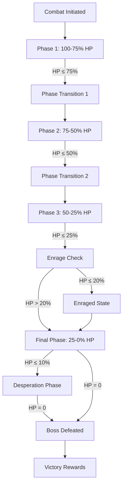

# Boss Encounter Mechanics

> "The corruption has a name here. It has *weight*. This is not a glitch—this is a testament. A monument to something that refused to die."

---

## 1. Overview

### 1.1 Identity Table

| Property | Value |
|----------|-------|
| Spec ID | `SPEC-COMBAT-018` |
| Category | Combat System |
| Priority | Must-Have |
| Status | Draft |
| Parent | [SPEC-COMBAT-016](encounter-generation.md) |
| Migrated From | `99-legacy/specifications/boss-encounters.md` |

### 1.2 Core Philosophy

The **Boss Encounter Mechanics** system defines multi-phase combat against named, scripted enemies that serve as climactic encounters. Boss fights are designed to test mastery of game systems through escalating difficulty, readable telegraphs, and punishing enrage mechanics.

Unlike Champions (procedurally generated), Bosses are **hand-crafted** encounters with unique abilities, phase transitions, and narrative significance.

**Design Pillars:**
- **Escalating Crescendo**: Each phase is harder than the last, forcing resource commitment
- **Readable Telegraphs**: Players can learn and counter powerful attacks through observation
- **Time Pressure**: Enrage mechanics punish passive play and stalling tactics
- **Proportional Rewards**: Boss loot quality matches the challenge (guaranteed high-tier drops)
- **No Retreat**: Bosses block flee attempts—commit or die

---

## 2. Boss Encounter Lifecycle

### 2.1 Phase Flow



### 2.2 Lifecycle Sequence

```
1. COMBAT INITIALIZATION
   ├─ Boss room sealed (no retreat)
   ├─ Phase 1 abilities activated
   ├─ Turn-based enrage timer started (if applicable)
   └─ Cinematic entrance message displayed

2. PHASE 1 COMBAT (100-75% HP)
   ├─ Standard attacks, learn patterns
   ├─ 1-2 telegraphed abilities available
   └─ No stat modifiers

3. PHASE TRANSITION (75% HP)
   ├─ Invulnerability window (1-2 turns)
   ├─ Stat modifiers applied (+damage, +defense)
   ├─ Add wave spawned (optional)
   ├─ New abilities unlocked
   └─ Cinematic transition message

4. PHASE 2+ COMBAT (75-50%, 50-25%)
   ├─ Enhanced abilities, new patterns
   ├─ Regeneration may activate
   └─ Enrage check at each phase

5. ENRAGE STATE (HP ≤ 20% OR Turn ≥ EnrageTimer)
   ├─ +30-50% damage
   ├─ +1 bonus action per turn
   ├─ Immune to control effects
   └─ No further phase transitions

6. DESPERATION PHASE (HP ≤ 10%)
   ├─ Unique "last stand" ability unlocked
   ├─ All cooldowns reset
   └─ Final damage burst

7. BOSS DEFEATED
   ├─ End combat loop
   ├─ Generate boss loot (guaranteed quality)
   ├─ Award Legend (×2.5 base)
   ├─ Mark room cleared
   └─ Display victory narrative
```

---

## 3. Phase Mechanics

### 3.1 Phase Thresholds

All bosses follow the standard 3-phase structure with optional Desperation phase:

| Phase | HP Threshold | Typical Duration | Stat Modifiers |
|-------|--------------|------------------|----------------|
| **Phase 1** | 100-75% | 3-5 turns | 1.0× damage, +0 Defense |
| **Phase 2** | 75-50% | 4-6 turns | 1.2× damage, +2 Defense, 3-4 HP/turn regen |
| **Phase 3** | 50-25% | 4-6 turns | 1.4× damage, +4 Defense, 5-6 HP/turn regen |
| **Final** | 25-0% | 3-5 turns | 1.5× damage, +5 Defense, 7-8 HP/turn regen, +1 action |
| **Desperation** | ≤10% | 1-3 turns | All cooldowns reset, unique ability |

### 3.2 Phase Transition Sequence

```csharp
public void ProcessPhaseTransition(Boss boss, int newPhase)
{
    // 1. Apply invulnerability
    boss.ApplyStatus(StatusEffect.Invulnerable, duration: TransitionTurns);

    // 2. Update phase state
    boss.CurrentPhase = newPhase;
    boss.PhaseStartHP = boss.CurrentHP;

    // 3. Apply stat modifiers
    var modifiers = GetPhaseModifiers(newPhase);
    boss.DamageMultiplier = modifiers.DamageMultiplier;
    boss.DefenseBonus = modifiers.DefenseBonus;
    boss.Regeneration = modifiers.Regeneration;

    // 4. Spawn adds (if configured)
    if (boss.PhaseConfig[newPhase].AddWave != null)
    {
        SpawnAddWave(boss.PhaseConfig[newPhase].AddWave);
    }

    // 5. Unlock new abilities
    foreach (var ability in boss.PhaseConfig[newPhase].UnlockedAbilities)
    {
        boss.EnableAbility(ability);
    }

    // 6. Display transition message
    DisplayCinematicMessage(boss.PhaseConfig[newPhase].TransitionText);
}
```

### 3.3 Add Wave Spawning

Certain bosses spawn reinforcements at phase transitions:

| Boss | Phase | Add Wave | Purpose |
|------|-------|----------|---------|
| Ruin-Warden | 2 | 2× Corrupted Servitor | Distraction, target splitting |
| Aetheric Aberration | 2 | 1× Blight Drone | Ranged pressure |
| Forlorn Archivist | 2 | 2× Memory Fragment | Stress stacking |
| Forlorn Archivist | 3 | 1× Nightmare Echo | High damage threat |
| Omega Sentinel | None | — | Pure solo mechanical difficulty |

**Add Wave Rules:**
- Adds share boss's TDR scaling
- Killing adds does NOT advance boss phase
- Adds despawn if boss dies
- Add limit: 4 active at once (new wave replaces oldest)

---

## 4. Telegraphed Abilities

### 4.1 Ability Types

| Type | Charge Time | Cooldown | Interruptible | Vulnerability |
|------|-------------|----------|---------------|---------------|
| **Standard** | 0 turns | 0-2 turns | No | No |
| **Telegraphed** | 1-2 turns | 3-4 turns | Yes (threshold) | No |
| **Ultimate** | 2 turns | 5-6 turns | No | Yes (post-use) |
| **Passive** | N/A | N/A | N/A | No |
| **Desperation** | 0 turns | Once | No | N/A |

### 4.2 Telegraph Mechanics

Telegraphed abilities display charge indicators and can be interrupted:

```
TELEGRAPH DISPLAY:
┌────────────────────────────────────┐
│  ⚠ RUIN-WARDEN is charging        │
│    [SYSTEM PURGE]                  │
│    ████████░░░░░░░░ (2 turns)      │
│                                    │
│  Interrupt threshold: 15 damage    │
│  Effect: 4d10 AoE + [Corroded]     │
└────────────────────────────────────┘
```

**Interrupt Mechanics:**
```
InterruptThreshold = BaseThreshold + (BossTier × 5)

If DamageDealtDuringCharge >= InterruptThreshold:
    Boss.ApplyStatus([Staggered], duration: 2)
    Boss.AbortAbility()
    Boss.SkipNextAction = true
```

| Boss Tier | Base Interrupt Threshold | Phase Scaling |
|-----------|-------------------------|---------------|
| Low | 10 | +2 per phase |
| Mid | 15 | +3 per phase |
| High | 20 | +4 per phase |
| World | 25 | +5 per phase |

### 4.3 Vulnerability Windows

After using an **Ultimate** ability, bosses enter a vulnerable state:

| Vulnerability Level | Duration | Damage Taken |
|---------------------|----------|--------------|
| Minor | 1 turn | +25% |
| Standard | 2 turns | +50% |
| Major | 3 turns | +50%, -2 Defense |

**Vulnerability Window Table:**

| Boss | Ultimate Ability | Window Duration | Damage Bonus |
|------|-----------------|-----------------|--------------|
| Ruin-Warden | Total System Failure | 2 turns | +50% |
| Aetheric Aberration | Aetheric Storm | 3 turns | +25% |
| Forlorn Archivist | Psychic Storm | 2 turns | +50% |
| Omega Sentinel | Omega Protocol | 3 turns | +25% |

---

## 5. Enrage System

### 5.1 Enrage Triggers

Bosses enrage when either condition is met:

| Trigger Type | Condition | Typical Value |
|--------------|-----------|---------------|
| **HP-Based** | HP falls below threshold | 20-25% HP |
| **Turn-Based** | Combat exceeds turn limit | 15-25 turns |
| **Phase-Based** | Reaches specific phase | Phase 4 (if exists) |

**Enrage Priority:** HP-based triggers take precedence over turn-based.

### 5.2 Enrage Effects

```
ENRAGE STATE MODIFIERS:
├─ Damage: +30% to +50%
├─ Actions: +1 action per turn
├─ Control Immunity: Immune to Stun, Root, Slow, Fear
├─ Regeneration: Disabled (desperation, not healing)
└─ Special: Boss-specific enrage ability (optional)
```

| Boss | Enrage Trigger | Damage Bonus | Special Effect |
|------|----------------|--------------|----------------|
| Ruin-Warden | 20% HP | +40% | — |
| Aetheric Aberration | 25% HP | +50% | — |
| Forlorn Archivist | 20% HP | +30% | Stress aura doubled |
| Omega Sentinel | 20% HP OR 20 turns | +50% | +2 Soak |

### 5.3 Soft Enrage (Turn-Based)

For bosses with turn-based enrage, stacking debuffs apply before hard enrage:

| Turns Exceeded | Effect |
|----------------|--------|
| EnrageTimer | +10% damage |
| EnrageTimer + 3 | +20% damage |
| EnrageTimer + 6 | +30% damage, +1 action |
| EnrageTimer + 10 | Hard Enrage (full effects) |

---

## 6. Desperation Phase

### 6.1 Desperation Trigger

At **≤10% HP**, bosses enter Desperation phase with unique mechanics:

```
DESPERATION PHASE ACTIVATION:
├─ All ability cooldowns reset
├─ Desperation ability unlocked (one-time use)
├─ Boss AI becomes hyper-aggressive
└─ No further phase transitions
```

### 6.2 Desperation Abilities

Each boss has a unique Desperation ability:

| Boss | Desperation Ability | Effect |
|------|---------------------|--------|
| Ruin-Warden | **Final Directive** | Summons 4 Corrupted Servitors, self-destructs in 3 turns for 6d10 AoE |
| Aetheric Aberration | **Reality Collapse** | Teleports all party members randomly, creates 4 hazard zones |
| Forlorn Archivist | **Memory Flood** | All characters take 3d10 Psychic + 15 Stress, boss heals 20% HP |
| Omega Sentinel | **Extinction Protocol** | Charges for 2 turns, then deals 10d10 damage to all (interruptible, threshold 40) |

---

## 7. No Retreat Mechanics

### 7.1 Sealed Arena

Boss encounters **prevent fleeing**:

```csharp
public bool AttemptFlee(CombatState state)
{
    if (state.HasActiveBoss)
    {
        DisplayMessage("The arena is sealed. There is no escape.");
        return false;
    }
    // Normal flee logic...
}
```

### 7.2 Threat Assessment Override

Boss rooms display **BOSS** threat level regardless of TDR/PPS ratio:

| Encounter Type | Threat Display |
|----------------|----------------|
| Standard | Calculated (Trivial → Impossible) |
| Boss | Always "BOSS" (red, animated) |

**Note:** Impossible Encounters (SPEC-COMBAT-020) allow retreat. Boss encounters do not. This is intentional—bosses are designed to be defeated, not avoided.

---

## 8. Boss Loot System

### 8.1 Guaranteed Quality Drops

| Boss Tier | Min Quality | Optimized % | Artifact % | Base Legend |
|-----------|-------------|-------------|------------|-------------|
| Low | Clan-Forged | 25% | 8% | 100 |
| Mid | Clan-Forged | 35% | 12% | 150 |
| High | Optimized | 40% | 15% | 200 |
| World | Optimized | 50% | 20% | 300 |

### 8.2 Boss-Specific Drops

Each boss has a unique loot table with signature items:

| Boss | Signature Drop | Drop Rate | Effect |
|------|----------------|-----------|--------|
| Ruin-Warden | Warden's Corroded Core | 100% | Crafting material for unique armor |
| Aetheric Aberration | Aberrant Essence | 100% | Consumable: +10 max HP permanently |
| Forlorn Archivist | Fractured Memory | 100% | Unlocks lore entry + skill point |
| Omega Sentinel | Sentinel Override Chip | 100% | Opens hidden zone access |

### 8.3 Legend Multiplier

Boss Legend awards scale with difficulty:

```
BossLegend = BaseLegend × TDRMultiplier × DeathPenalty

TDRMultiplier: Standard difficulty multipliers apply
DeathPenalty: -10% per party death during fight (min 50%)
```

---

## 9. Implemented Bosses

### 9.1 Boss Roster

| Boss | Tier | Location | HP | Damage | Defense | Soak | Phases | Enrage |
|------|------|----------|-----|--------|---------|------|--------|--------|
| **Ruin-Warden** | Low | Rust Wastes | 80 | 2d10+4 | 4 | 3 | 3 | 20% HP |
| **Aetheric Aberration** | Mid | Blight Core | 100 | 3d10+6 | 5 | 3 | 3 | 25% HP |
| **Forlorn Archivist** | Mid | Memory Vault | 90 | 3d10+4 | 4 | 2 | 3 | 20% HP |
| **Omega Sentinel** | High | Mechanical Hive | 130 | 4d10+8 | 6 | 5 | 3 | 20%/20T |

### 9.2 Boss Ability Summary

#### Ruin-Warden (Mechanical, Corruption)

| Ability | Type | Damage | Effect | Phase |
|---------|------|--------|--------|-------|
| Rust Slam | Standard | 2d10+4 | Single target | 1+ |
| Corrosive Sweep | Telegraphed (1T) | 3d10 | AoE cone, [Corroded] | 1+ |
| System Purge | Telegraphed (2T) | 4d10 | AoE all, [Corroded] ×2 | 2+ |
| Total System Failure | Ultimate (2T) | 5d10 | AoE all, vulnerability window | 3+ |
| Final Directive | Desperation | — | Spawns adds, self-destruct timer | ≤10% |

#### Forlorn Archivist (Psychic, Forlorn)

| Ability | Type | Damage | Effect | Phase |
|---------|------|--------|--------|-------|
| Mind Spike | Standard | 3d10 Psychic | Ignores Soak | 1+ |
| Memory Drain | Standard | 2d10 | -2 Accuracy next turn | 1+ |
| Psychic Scream | Telegraphed (1T) | 2d10 Psychic + 8 Stress | AoE 3 tiles | 1+ |
| Whispers of the Lost | Passive | — | +3 Stress/round to lowest WILL | 2+ |
| Psychic Storm | Ultimate (2T) | 4d10 Psychic + 12 Stress | All targets | 3+ |
| Memory Flood | Desperation | 3d10 Psychic + 15 Stress | Heals boss 20% | ≤10% |

---

## 10. Balance Data

### 10.1 Time-to-Kill Targets

| Boss Tier | HP Range | Expected TTK | With Regen | Acceptable Range |
|-----------|----------|--------------|------------|------------------|
| Low | 70-90 | 8-10 turns | +2-3 turns | 6-13 turns |
| Mid | 90-110 | 12-14 turns | +3-4 turns | 9-18 turns |
| High | 110-140 | 14-16 turns | +4-5 turns | 11-21 turns |
| World | 150-200 | 18-22 turns | +5-7 turns | 15-29 turns |

### 10.2 Design Constraints

| Constraint | Value | Rationale |
|------------|-------|-----------|
| Max single-hit damage | ≤50% player HP | No one-shots |
| Enrage pressure window | 2-3 turns | Must defeat before overwhelmed |
| Healing effectiveness | Mitigates 1-2 attacks | Sustainable but not trivializing |
| Phase 1 difficulty | ~70% of Phase 3 | Ramp-up learning curve |

### 10.3 Party Wipe Recovery

Unlike standard encounters, boss wipes have narrative weight:

| Wipe Count | Effect |
|------------|--------|
| 1st wipe | Boss HP resets to 100%, normal retry |
| 2nd wipe | Boss HP starts at 95% (slight mercy) |
| 3rd+ wipe | Boss HP starts at 90% (min floor) |

**Note:** This is NOT comeback scaling—the boss doesn't get weaker. The party simply starts with a slight advantage to prevent frustration spirals.

---

## 11. UI Requirements

### 11.1 Boss Health Bar

```
┌──────────────────────────────────────────────┐
│  ★ RUIN-WARDEN ★                            │
│  ████████████████░░░░░░░░░░░░░░░░░░░░░░░░░░ │
│  [Phase 2] 56/100 HP                         │
│  ────────────────────────────────────────── │
│  ENRAGE IN: 8 TURNS                         │
│                                              │
│  ⚠ CHARGING: System Purge (1 turn)          │
│  Interrupt: 12/15 damage                    │
└──────────────────────────────────────────────┘
```

### 11.2 Phase Transition Display

```
┌──────────────────────────────────────────────┐
│                                              │
│         ▼ PHASE TRANSITION ▼                │
│                                              │
│  The Ruin-Warden's systems surge with       │
│  corrupted energy. Redundant protocols      │
│  activate as it enters COMBAT MODE BETA.    │
│                                              │
│  [+20% Damage] [+2 Defense] [+3 HP/turn]    │
│                                              │
│  New Ability Unlocked: SYSTEM PURGE         │
│                                              │
└──────────────────────────────────────────────┘
```

### 11.3 Color Coding

| Element | Color | Meaning |
|---------|-------|---------|
| Boss name | Gold + animated border | Boss encounter |
| Phase indicator | Cyan | Current phase |
| Enrage timer | Orange → Red (critical) | Time pressure |
| Telegraph charge | Yellow pulsing | Incoming attack |
| Vulnerability | Green glow | Bonus damage window |

---

## 12. Integration Points

### 12.1 Dependencies

| System | Dependency Type |
|--------|-----------------|
| [SPEC-COMBAT-016](encounter-generation.md) | Parent - encounter triggering |
| [SPEC-COMBAT-017](spawn-scaling.md) | Reads - TDR for stat scaling |
| Combat Resolution | Uses - damage, status, turn system |
| Loot System | Writes - boss drop tables |
| AI System | Uses - boss-specific AI patterns |

### 12.2 Triggered By

| Trigger | Source |
|---------|--------|
| Boss room entry | Encounter Generation |
| Phase threshold | Combat loop HP check |
| Enrage condition | HP/turn check |
| Desperation | HP ≤ 10% check |

### 12.3 Modifies

| Target | Modification |
|--------|--------------|
| Combat state | Sealed arena, no flee |
| Enemy stats | Phase modifiers |
| Loot tables | Guaranteed quality |
| Player Legend | Boss multiplier |

---

## 13. Service Architecture

### 13.1 Service Interface

```csharp
public interface IBossEncounterService
{
    // Lifecycle
    void InitializeBossEncounter(Boss boss, CombatState state);
    void ProcessBossTurn(Boss boss, CombatState state);
    void CheckPhaseTransition(Boss boss);
    void ProcessPhaseTransition(Boss boss, int newPhase);

    // Abilities
    void StartTelegraph(Boss boss, BossAbility ability);
    bool CheckInterrupt(Boss boss, int damageDealt);
    void ExecuteAbility(Boss boss, BossAbility ability);
    void ApplyVulnerabilityWindow(Boss boss, int duration, float damageMultiplier);

    // Enrage
    void CheckEnrageCondition(Boss boss, int turnNumber);
    void ApplyEnrage(Boss boss);
    void ApplyDesperationPhase(Boss boss);

    // Resolution
    void ProcessBossDefeat(Boss boss, CombatState state);
    BossLoot GenerateBossLoot(Boss boss);
}
```

### 13.2 Data Model

```csharp
public class Boss : Enemy
{
    public string BossId { get; set; }
    public BossTier Tier { get; set; }
    public int CurrentPhase { get; set; } = 1;
    public List<BossPhase> Phases { get; set; } = new();
    public List<BossAbility> Abilities { get; set; } = new();

    // State
    public bool IsEnraged { get; set; }
    public bool IsInDesperation { get; set; }
    public bool IsCharging { get; set; }
    public BossAbility ChargingAbility { get; set; }
    public int ChargeProgress { get; set; }
    public int InterruptDamageAccumulated { get; set; }

    // Vulnerability
    public bool IsVulnerable { get; set; }
    public int VulnerabilityTurnsRemaining { get; set; }
    public float VulnerabilityDamageMultiplier { get; set; }

    // Enrage
    public float EnrageHPThreshold { get; set; } = 0.2f;
    public int? EnrageTurnThreshold { get; set; }
}

public class BossPhase
{
    public int PhaseNumber { get; set; }
    public float HPThreshold { get; set; }  // 0.75, 0.5, 0.25
    public float DamageMultiplier { get; set; }
    public int DefenseBonus { get; set; }
    public int Regeneration { get; set; }
    public int InvulnerabilityTurns { get; set; }
    public AddWaveConfig AddWave { get; set; }
    public List<string> UnlockedAbilities { get; set; } = new();
    public string TransitionText { get; set; }
}

public class BossAbility
{
    public string AbilityId { get; set; }
    public string Name { get; set; }
    public AbilityType Type { get; set; }
    public int ChargeTime { get; set; }
    public int Cooldown { get; set; }
    public int InterruptThreshold { get; set; }
    public int VulnerabilityDuration { get; set; }
    public float VulnerabilityMultiplier { get; set; }
    public int MinPhase { get; set; } = 1;
}

public enum BossTier { Low, Mid, High, World }
public enum AbilityType { Standard, Telegraphed, Ultimate, Passive, Desperation }
```

---

## 14. Voice Guidance

**Reference:** [npc-flavor.md](../../.templates/flavor-text/npc-flavor.md)

### 14.1 System Tone

| Context | Tone |
|---------|------|
| Boss entrance | Dread, weight, named threat |
| Phase transition | Escalation, danger rising |
| Enrage | Urgency, desperation |
| Victory | Relief, triumph, cost acknowledged |

### 14.2 Feedback Text Examples

| Event | Text |
|-------|------|
| Boss encounter start | "ALERT: Apex-class threat detected. {BossName}. Combat parameters: Unsurvivable without commitment. Retreat protocols: DISABLED." |
| Phase transition | "WARNING: {BossName} has entered combat phase {Phase}. Threat assessment recalculating. New abilities detected." |
| Telegraph charge | "CRITICAL: {BossName} is charging {AbilityName}. Interrupt threshold: {Threshold} damage. Time remaining: {Turns} turns." |
| Interrupt success | "{BossName} staggered! System integrity compromised. Exploit this window." |
| Enrage trigger | "DANGER: {BossName} has entered enrage state. Damage output: CRITICAL. Control resistance: TOTAL. End this. Now." |
| Desperation phase | "FINAL WARNING: {BossName} at critical integrity. Desperation protocols detected. Brace for {DesperationAbility}." |
| Boss defeated | "{BossName} has been terminated. Threat neutralized. Impressive. The system acknowledges your tenacity." |

---

## 15. Logging Requirements

**Reference:** [logging.md](../01-core/logging.md)

### 15.1 Log Events

| Event | Level | Message Template | Properties |
|-------|-------|------------------|------------|
| Boss combat started | Information | "Boss encounter initiated: {BossName}" | `BossId`, `BossName`, `Tier` |
| Phase transition | Information | "Boss {BossName} transitioned to phase {Phase}" | `BossName`, `Phase`, `Modifiers` |
| Ability telegraphed | Debug | "Boss {BossName} charging {Ability}" | `BossName`, `Ability`, `ChargeTime` |
| Interrupt success | Information | "Boss {BossName} interrupted ({Damage}/{Threshold})" | `BossName`, `Damage`, `Threshold` |
| Enrage triggered | Warning | "Boss {BossName} entered enrage state" | `BossName`, `Trigger`, `TurnNumber` |
| Boss defeated | Information | "Boss {BossName} defeated in {Turns} turns" | `BossName`, `Turns`, `Deaths` |

### 15.2 Example Implementation

```csharp
public void CheckPhaseTransition(Boss boss)
{
    var nextPhase = boss.Phases
        .Where(p => p.PhaseNumber > boss.CurrentPhase)
        .Where(p => boss.HPPercent <= p.HPThreshold)
        .OrderBy(p => p.PhaseNumber)
        .FirstOrDefault();

    if (nextPhase != null)
    {
        _logger.Information("Boss {BossName} transitioned to phase {Phase}",
            boss.Name, nextPhase.PhaseNumber);

        ProcessPhaseTransition(boss, nextPhase.PhaseNumber);
    }
}
```

---

## 16. Testing Requirements

### 16.1 Unit Test Coverage

| Area | Priority | Test Cases |
|------|----------|------------|
| Phase transitions | High | Correct threshold detection |
| Interrupt mechanics | High | Damage accumulation, stagger |
| Enrage triggers | High | HP-based, turn-based |
| Vulnerability windows | Medium | Duration, multiplier |
| Desperation phase | Medium | Ability unlock, HP threshold |

### 16.2 Key Test Cases

```csharp
[TestMethod]
public void PhaseTransition_TriggersAt75Percent()
{
    var boss = CreateTestBoss(maxHP: 100);
    boss.CurrentHP = 74;  // Below 75%

    _bossService.CheckPhaseTransition(boss);

    Assert.AreEqual(2, boss.CurrentPhase);
    Assert.IsTrue(boss.HasStatus(StatusEffect.Invulnerable));
}

[TestMethod]
public void Interrupt_StaggersBossWhenThresholdMet()
{
    var boss = CreateTestBoss();
    boss.StartTelegraph(_testAbility);  // Threshold: 15

    _bossService.CheckInterrupt(boss, damageDealt: 8);
    Assert.IsFalse(boss.HasStatus(StatusEffect.Staggered));

    _bossService.CheckInterrupt(boss, damageDealt: 8);  // Total: 16
    Assert.IsTrue(boss.HasStatus(StatusEffect.Staggered));
    Assert.IsFalse(boss.IsCharging);
}

[TestMethod]
public void EnrageTriggers_WhenHPBelowThreshold()
{
    var boss = CreateTestBoss(enrageHP: 0.2f);
    boss.CurrentHP = 19;  // 19% HP

    _bossService.CheckEnrageCondition(boss, turnNumber: 5);

    Assert.IsTrue(boss.IsEnraged);
    Assert.IsTrue(boss.HasStatus(StatusEffect.ControlImmunity));
}
```

### 16.3 QA Checklist

- [ ] Phase transitions show cinematic messages
- [ ] Telegraph charge bar displays correctly
- [ ] Interrupt feedback is immediate and clear
- [ ] Enrage visual effects are noticeable
- [ ] Vulnerability window has distinct appearance
- [ ] Boss loot quality matches specification
- [ ] Arena sealing prevents all flee attempts

---

## 17. Related Specifications

| Spec | Relationship |
|------|--------------|
| [SPEC-COMBAT-016](encounter-generation.md) | Parent - encounter spawning |
| [SPEC-COMBAT-017](spawn-scaling.md) | Sibling - TDR scaling for boss stats |
| [SPEC-COMBAT-019](elite-mechanics.md) | Sibling - sub-boss threats |
| [SPEC-COMBAT-020](impossible-encounters.md) | Sibling - contrast (bosses != impossible) |
| Combat Resolution | Dependency - turn/damage systems |
| Loot System | Dependency - boss drop generation |

---

## 18. Changelog

| Version | Date | Changes |
|---------|------|---------|
| 1.0 | 2025-12-14 | Initial specification (migrated from legacy boss-encounters.md) |
