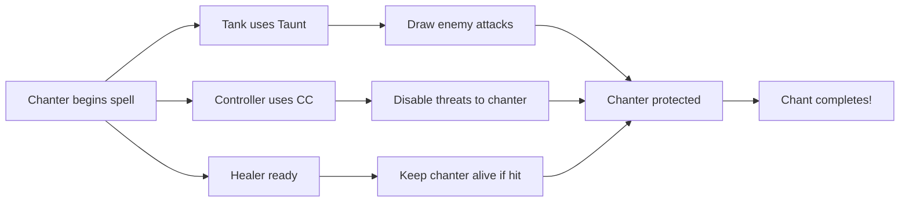

# Chant Mechanic

> *"The words spill from your lips in patterns older than memory. Reality listens. Reality resists. But if you can hold the pattern long enough—reality obeys."*

**Governing Attribute:** WILL

---

## 1. Core Philosophy: The Coherent System Call

The **Chant** mechanic is the mechanical and thematic representation of a character making a **complex, high-power "system call"** to the world's broken operating system. It is the act of a Galdr-caster meticulously compiling a devastating spell, a Skald-Screamer attuning their voice to a fatal frequency, or an Örlög-bound carefully editing a line of reality's source code.

### 1.1 The High-Risk, High-Reward Principle

> [!IMPORTANT]
> **Chanting is power at a price.** Characters unleash their most spectacular abilities, but they dedicate full focus and leave themselves completely vulnerable. A chanted spell is a tense, strategic, and often desperate gamble.

**What Chanting Represents:**
- Galdr-casters compiling devastating runic code
- Skald-Screamers attuning to fatal vocal frequencies
- Örlög-bound editing reality's source code
- Rune-Witches channeling raw Aetheric power
- Any character invoking abilities too complex for instant casting

**The Core Trade-Off:**
| Benefit | Cost |
|---------|------|
| Devastating, reality-bending effects | Multi-turn vulnerability |
| "I win" capability for encounters | Can be interrupted, wasting resources |
| Highest damage/utility ceiling | Requires party protection |

---

## 2. Chanted Ability Properties

Chanted abilities are a special category of Active Ability with unique properties:

| Property | Description | Example |
|----------|-------------|---------|
| **Chant Duration** | Turns required to complete (1-3) | `Hagalaz's Storm`: 2 turns |
| **Interruptible** | Can be broken by damage | Most are `true` |
| **Interrupt DC** | WILL check DC when damaged | DC 12-18 |
| **Vulnerability State** | Penalties while chanting | -3 Defense, no reactions |
| **Resource Cost** | Paid immediately on initiation | 40-80 Stamina or AP |

### 2.1 Chant Duration Tiers

| Duration | Power Level | Examples |
|----------|-------------|----------|
| **1 Turn** | Strong | `Galdra-Strike`, `Echoing Wail` |
| **2 Turns** | Devastating | `Hagalaz's Storm`, `Saga of Doom` |
| **3 Turns** | Encounter-Ending | `Ragnarök's Herald`, `World-Tree's Wrath` |

---

## 3. The Chant Process Flow

### 3.1 Complete Lifecycle

```mermaid
flowchart TD
    START[Player uses Chant ability] --> COST[Deduct full resource cost]
    COST --> STATE[Enter [Chanting] status]
    STATE --> END_TURN[Turn ends immediately]
    END_TURN --> WAIT[Wait for next turn]
    
    WAIT --> DAMAGE{Damaged before turn?}
    DAMAGE --> |Yes| INTERRUPT[Interruption Check]
    DAMAGE --> |No| PROGRESS[Progress chant]
    
    INTERRUPT --> |Pass WILL check| PROGRESS
    INTERRUPT --> |Fail WILL check| BROKEN[Chant broken!]
    
    BROKEN --> LOST[Resources lost, no effect]
    
    PROGRESS --> COMPLETE{Duration complete?}
    COMPLETE --> |No| WAIT
    COMPLETE --> |Yes| RESOLVE[Spell resolves!]
    
    RESOLVE --> EFFECT[Apply devastating effect]
    EFFECT --> CLEAR[Remove [Chanting] status]
    CLEAR --> CONTINUE[Continue turn normally]
```

### 3.2 Turn-by-Turn Breakdown

#### Turn 1: Initiation

| Step | Action | Effect |
|------|--------|--------|
| 1 | Player selects chant ability | Command: `hagalazs_storm` |
| 2 | Resource deduction | Full Stamina/AP cost paid immediately |
| 3 | Enter [Chanting] state | Apply vulnerability penalties |
| 4 | End turn | No further actions this turn |
| 5 | UI update | `[Chanting: Hagalaz's Storm (1/2)]` |

**Flavor Text:**
> *"Grizelda closes her eyes and begins a low, humming chant. The air around her grows cold, frost spreading across nearby surfaces..."*

#### Intermediate Turns (2+ turn chants)

| Step | Action | Effect |
|------|--------|--------|
| 1 | Turn begins | Chant counter advances: `(2/2)` |
| 2 | Check for interruption | (see Interruption Check) |
| 3 | Turn ends | Still [Chanting], no actions |

**Flavor Text:**
> *"The chant grows in power. Ice crystals form in the air. The temperature plummets..."*

#### Final Turn: Resolution

| Step | Action | Effect |
|------|--------|--------|
| 1 | Turn begins | Duration complete! |
| 2 | Spell resolves | Effect applies automatically |
| 3 | [Chanting] removed | Vulnerability ends |
| 4 | Normal turn | Can take Standard Action |

**Flavor Text:**
> *"Grizelda's eyes snap open, blazing with frozen light! 'HAGALAZ!' A storm of ice and destruction erupts across the battlefield!"*

---

## 4. The [Chanting] Status Effect

### 4.1 Properties

| Property | Value |
|----------|-------|
| **Type** | Buff (self-imposed vulnerability for power) |
| **Duration** | Until chant completes or is interrupted |
| **Stackable** | No (cannot chant multiple spells) |
| **Removable** | By interruption or completion |

### 4.2 Applied Modifiers

| Modifier | Effect | Justification |
|----------|--------|---------------|
| **Defense Penalty** | -3 to Defense Score | Full focus on chant |
| **Reaction Lock** | Cannot `parry` or `block` | No spare attention |
| **Stance Lock** | Cannot change combat stance | Locked in position |
| **Movement Lock** | Cannot move | Rooted in place |
| **Action Lock** | No actions except chanting | Full concentration |

### 4.3 UI Representation

```
Party Status:
┌────────────────────────────────────────┐
│ GRIZELDA [HP: 45/60] [ST: 12/40]       │
│ [Chanting: Hagalaz's Storm (1/2)] ⏳   │
│ Defense: 12 (-3) = 9 | VULNERABLE      │
└────────────────────────────────────────┘
```

---

## 5. The Interruption Check

### 5.1 Trigger

The Interruption Check is triggered when a character in the [Chanting] state **takes any damage** from any source.

### 5.2 Resolution

| Component | Value |
|-----------|-------|
| **Check Type** | WILL-based Resolve Check |
| **Dice Pool** | WILL + Resolve Rank (if applicable) |
| **DC** | Determined by ability being chanted |

**Interrupt DC by Chant Duration:**
| Duration | Base Interrupt DC |
|----------|-------------------|
| 1 Turn | 12 |
| 2 Turns | 14 |
| 3 Turns | 16 |

**Modifiers:**
| Factor | DC Modifier |
|--------|-------------|
| Damage > 10 HP | +2 |
| Damage > 20 HP | +4 |
| Critical hit | +2 |
| [Staggered] status | +2 |
| [Focused] status | -2 |

### 5.3 Outcomes

| Result | Effect |
|--------|--------|
| **Success** (Successes ≥ DC) | Focus maintained. Chant continues. |
| **Failure** (Successes < DC) | **Chant Interrupted!** [Chanting] removed, spell lost, resources NOT refunded. |

### 5.4 Interruption Flavor Text

**Success:**
> *"A crossbow bolt grazes Grizelda's shoulder, drawing blood—but her voice never wavers. The chant continues!"*

**Failure:**
> *"The blow staggers Grizelda mid-syllable! The runic pattern collapses into harmless static. The spell is lost!"*

---

## 6. Chant Abilities: Example Catalog

### 6.1 Tier 1 Chants (1 Turn)

#### Galdra-Strike

| Property | Value |
|----------|-------|
| **Specialization** | Galdr-caster |
| **Cost** | 25 Stamina |
| **Chant Duration** | 1 Turn |
| **Interrupt DC** | 12 |
| **Effect** | Single target, 4d10 + WILL frost damage |
| **Additional** | Target [Chilled] for 2 turns |

#### Echoing Wail

| Property | Value |
|----------|-------|
| **Specialization** | Skald-Screamer |
| **Cost** | 20 Stamina |
| **Chant Duration** | 1 Turn |
| **Interrupt DC** | 12 |
| **Effect** | AoE cone, 2d10 + WILL psychic damage |
| **Additional** | Enemies must WILL save or [Deafened] |

### 6.2 Tier 2 Chants (2 Turns)

#### Hagalaz's Storm

| Property | Value |
|----------|-------|
| **Specialization** | Galdr-caster |
| **Cost** | 50 Stamina |
| **Chant Duration** | 2 Turns |
| **Interrupt DC** | 14 |
| **Effect** | Large AoE, 6d10 + WILL frost damage |
| **Additional** | All targets [Frozen] for 1 turn, terrain becomes [Icy] |

#### Saga of Doom

| Property | Value |
|----------|-------|
| **Specialization** | Skald-Screamer |
| **Cost** | 45 Stamina |
| **Chant Duration** | 2 Turns |
| **Interrupt DC** | 14 |
| **Effect** | Single target, inflict [Doomed] status |
| **Additional** | Target dies in 3 turns unless curse lifted |

#### Battle-Hymn of the Forebears

| Property | Value |
|----------|-------|
| **Specialization** | Skald |
| **Cost** | 40 Stamina |
| **Chant Duration** | 2 Turns |
| **Interrupt DC** | 14 |
| **Effect** | All allies gain +2d10 to all checks for 3 turns |
| **Additional** | Remove [Fear] and [Despair] from party |

### 6.3 Tier 3 Chants (3 Turns)

#### Ragnarök's Herald

| Property | Value |
|----------|-------|
| **Specialization** | Galdr-caster (Capstone) |
| **Cost** | 80 Stamina |
| **Chant Duration** | 3 Turns |
| **Interrupt DC** | 16 |
| **Effect** | Massive AoE, 10d10 + WILL fire/frost damage |
| **Additional** | All enemies [Stunned], terrain devastated, caster [Exhausted] after |

> [!CAUTION]
> **Ragnarök's Herald** is an "I win" button. Successfully completing it should effectively end most encounters. The 3-turn duration and high Interrupt DC mean the entire party must dedicate itself to protecting the caster.

#### World-Tree's Wrath

| Property | Value |
|----------|-------|
| **Specialization** | Örlög-bound (Capstone) |
| **Cost** | 75 Stamina |
| **Chant Duration** | 3 Turns |
| **Interrupt DC** | 16 |
| **Effect** | Rewrite target's fate—instant death or complete healing |
| **Additional** | Cannot target self, costs 5 Corruption on use |

---

## 7. Tactical Integration

### 7.1 The Core Tactical Puzzle

Chanted abilities create a rich tactical puzzle for both players and AI:

#### Player Strategy: Protect the Caster



**Party Roles in Chant Protection:**
| Role | Job | Abilities |
|------|-----|-----------|
| **Tank** | Draw fire | `Taunt`, `Guardian Stance` |
| **Controller** | Disable threats | `Stun`, `Root`, `Blind` |
| **Healer** | Emergency recovery | `Quick Heal`, `Pain Suppression` |
| **Off-DPS** | Kill priority targets | Focus enemies targeting chanter |

#### AI Strategy: Interrupt the Threat

| AI Priority | Action |
|-------------|--------|
| **Highest** | Target [Chanting] character |
| **High** | Break through tank to reach chanter |
| **Medium** | Use ranged attacks to bypass frontline |
| **Adaptive** | Call reinforcements if chant is high-tier |

A "Tactician" AI archetype will:
1. Immediately recognize [Chanting] as highest priority
2. Ignore taunts if possible (higher INT enemies)
3. Coordinate focus fire on chanter
4. Use gap-closers to bypass defenders

### 7.2 Countermeasures

**Abilities That Protect Chanters:**
| Ability | Effect |
|---------|--------|
| `[Unbreakable Focus]` | +4 to Interrupt DC checks |
| `[Ward of Silence]` | Immune to psychic interruption |
| `[Battle-Trance]` | First interruption auto-succeeds |
| `[Guardian's Oath]` | Adjacent ally takes 50% of chanter's damage |

---

## 8. Specialization Integration

### 8.1 Primary Chanting Specializations

| Specialization | Chant Focus | Signature Chant |
|----------------|-------------|-----------------|
| **Galdr-caster** | Elemental devastation | `Ragnarök's Herald` |
| **Skald-Screamer** | Psychic/sonic warfare | `Saga of Doom` |
| **Skald** | Party buffs/inspiration | `Battle-Hymn of the Forebears` |
| **Örlög-bound** | Fate manipulation | `World-Tree's Wrath` |
| **Rune-Witch** | Curse/debuff | `Blight-Song` |

### 8.2 Specialization-Specific Chant Abilities

**Galdr-caster Chant Tree:**
- Tier 1: `Galdra-Strike` (1 turn, single target)
- Tier 2: `Hagalaz's Storm` (2 turns, AoE)
- Tier 3: `Ragnarök's Herald` (3 turns, devastation)

**Skald Chant Tree:**
- Tier 1: `Verse of Courage` (1 turn, party fear immunity)
- Tier 2: `Battle-Hymn of the Forebears` (2 turns, party buff)
- Tier 3: `Saga of the Endless` (3 turns, party resurrection/full heal)

### 8.3 Passive Enhancements

| Passive | Effect | Specialization |
|---------|--------|----------------|
| `[Unshakable Voice]` | -2 to all Interrupt DCs | Skald |
| `[Frost-Warded]` | Ignore first interruption per encounter | Galdr-caster |
| `[Fate-Touched]` | Chants cost 25% less Stamina | Örlög-bound |
| `[Harmonic Resonance]` | Chants complete 1 turn faster | Skald-Screamer (Capstone) |

---

## 9. Trauma Economy Integration

### 9.1 Stress Costs

| Event | Stress Cost |
|-------|-------------|
| Initiating 3-turn chant | +3 Psychic Stress (anticipatory dread) |
| Taking damage while chanting | +2 Psychic Stress |
| Chant interrupted | +5 Psychic Stress |
| Successfully completing capstone | +0 (satisfying payoff) |

### 9.2 Corruption Costs

Some powerful chants draw on forbidden power:

| Chant | Corruption Cost |
|-------|-----------------|
| `Ragnarök's Herald` | +2 Corruption |
| `World-Tree's Wrath` | +5 Corruption |
| `Blight-Song` | +3 Corruption |

---

## 10. Technical Implementation

### 10.1 Data Model

```csharp
public enum AbilityType { Instant, Chant, Reaction, Passive }

public class ChantAbility : ActiveAbility
{
    public int ChantDuration { get; set; }
    public int InterruptDc { get; set; }
    public bool IsInterruptible { get; set; } = true;
    public int CorruptionCost { get; set; } = 0;
}

public class ChantingStatus : StatusEffect
{
    public ChantAbility ActiveChant { get; set; }
    public int TurnsRemaining { get; set; }
    public int TurnsCompleted { get; set; }
    public int DefensePenalty { get; set; } = -3;
    public bool CanReact { get; set; } = false;
    public bool CanMove { get; set; } = false;
}
```

### 10.2 Service Interface

```csharp
public interface IChantService
{
    ChantResult InitiateChant(Character caster, ChantAbility ability);
    bool ProcessInterruptionCheck(Character caster, int damageTaken);
    void AdvanceChant(Character caster);
    AbilityResult ResolveChant(Character caster);
    void CancelChant(Character caster, bool refund = false);
}
```

### 10.3 Combat Engine Integration

```csharp
// In CombatEngine.cs
public void OnDamageTaken(Character target, int damage, DamageSource source)
{
    if (target.HasStatus<ChantingStatus>())
    {
        var chant = target.GetStatus<ChantingStatus>();
        bool maintained = _chantService.ProcessInterruptionCheck(target, damage);
        
        if (!maintained)
        {
            _eventBus.Publish(new ChantInterruptedEvent(target, chant.ActiveChant));
            _chantService.CancelChant(target, refund: false);
        }
    }
}

public void OnTurnStart(Character character)
{
    if (character.HasStatus<ChantingStatus>())
    {
        var chant = character.GetStatus<ChantingStatus>();
        chant.TurnsCompleted++;
        
        if (chant.TurnsCompleted >= chant.ActiveChant.ChantDuration)
        {
            _chantService.ResolveChant(character);
        }
    }
}
```

---

## 11. Phased Implementation Guide

### Phase 1: Core Mechanic
- [ ] Implement `ChantingStatus` effect with all modifiers
- [ ] Implement `IChantService` interface
- [ ] Add `ChantDuration` and `InterruptDc` to Abilities table
- [ ] Hook into `OnDamageTaken` for interruption checks

### Phase 2: Abilities
- [ ] Create Tier 1 chant abilities (Galdra-Strike, Echoing Wail)
- [ ] Create Tier 2 chant abilities (Hagalaz's Storm, Saga of Doom)
- [ ] Create Tier 3 capstone abilities (Ragnarök's Herald)

### Phase 3: AI Integration
- [ ] Add [Chanting] priority to enemy targeting
- [ ] Implement "break through" behavior for intelligent enemies
- [ ] Add interruption-focused tactics to Tactician AI

### Phase 4: UI & Feedback
- [ ] Add `[Chanting (X/Y)]` status display
- [ ] Add progress bar for multi-turn chants
- [ ] Add dramatic sound/visual cues for initiation and resolution

---

## 12. Testing Requirements

### 12.1 Unit Tests
- [ ] **Initiation:** Chant start → Resource deducted, [Chanting] applied
- [ ] **Vulnerability:** [Chanting] → Defense -3, no reactions
- [ ] **Interruption Success:** Damage + high WILL → Chant continues
- [ ] **Interruption Failure:** Damage + low WILL → Chant lost, no refund
- [ ] **Resolution:** Duration complete → Effect applies

### 12.2 Integration Tests
- [ ] **Full Cycle:** Initiate 2-turn chant → Survive 2 turns → Spell resolves
- [ ] **Interrupted Cycle:** Initiate chant → Take damage → Fail check → Verify lost
- [ ] **AI Priority:** Place [Chanting] character → Verify AI targets them

### 12.3 Manual QA
- [ ] **UI:** Verify [Chanting (X/Y)] updates correctly
- [ ] **Sound:** Verify chant initiation/interruption audio
- [ ] **Balance:** Test 3-turn chants are appropriately devastating

---

## 13. Voice Guidance

### 13.1 Tone Profile

| Property | Value |
|----------|-------|
| **Theme** | Focused power, vulnerability, epic payoff |
| **Tone** | Building tension, anticipation, desperation |
| **Key Words** | Focus, chant, compile, pattern, interrupt, unleash |

### 13.2 Narrative Examples

| Event | Example Text |
|-------|--------------|
| **Initiation** | "Grizelda closes her eyes and begins a low, humming chant. The air around her grows cold and frost spreads across nearby surfaces..." |
| **Progress** | "The chant grows in power. Ice crystals form in the air. The temperature plummets as reality strains against the pattern she's building..." |
| **Interruption Attempt (Success)** | "A crossbow bolt grazes Grizelda's shoulder, drawing blood—but her voice never wavers. The chant continues!" |
| **Interruption Attempt (Failure)** | "The blow staggers Grizelda mid-syllable! The runic pattern collapses into harmless static. The spell is lost!" |
| **Resolution (Tier 1)** | "Grizelda's eyes snap open! 'GALDRA!' A lance of frozen light pierces her target!" |
| **Resolution (Tier 3)** | "Grizelda's voice rises to an inhuman shriek! 'RAGNARÖK!' Reality shatters! A storm of ice and fire erupts across the battlefield, consuming everything in its path!" |

---

## 14. Balance Data

### 14.1 Power Budget

| Chant Duration | Expected Damage | Party Protection Required |
|----------------|-----------------|---------------------------|
| 1 Turn | 4-6d10 (strong ability) | Minimal |
| 2 Turns | 6-8d10 (devastating) | Active tank engagement |
| 3 Turns | 10-12d10 (encounter-ending) | Full party coordination |

### 14.2 Risk/Reward Curve

| Duration | Risk | Reward | Success Rate (Estimated) |
|----------|------|--------|--------------------------|
| 1 Turn | Low | Good | 85% |
| 2 Turns | Medium | Great | 65% |
| 3 Turns | High | Excellent | 40% |

---

## 15. Related Specifications

| Document | Purpose |
|----------|---------|
| [Active Abilities](active-abilities.md) | Ability framework |
| [Status Effects](status-effects.md) | Status effect system |
| [Combat Resolution](combat-resolution.md) | Damage and check mechanics |
| [Defensive Reactions](defensive-reactions.md) | Block/parry (disabled by chanting) |
| [Enemy AI](enemy-ai.md) | AI targeting priorities |

---

## 16. Changelog

| Version | Date | Changes |
|---------|------|---------|
| 1.0 | 2025-12-14 | Initial specification |
