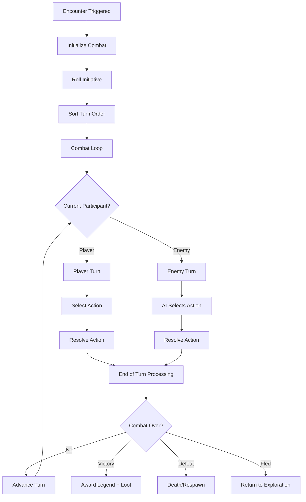
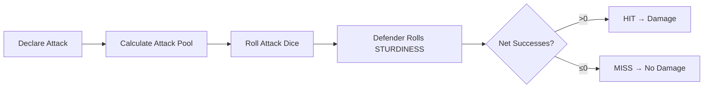

# Combat Resolution — The Flow of Battle

> *"Every turn is a choice. Every choice has consequences. In battle, hesitation is death."*

---

## Document Control

| Version | Date | Changes |
|---------|------|---------|
| 1.0 | 2025-12-07 | Initial consolidated specification |

---

## 1. Overview

### 1.1 Identity Table

| Property | Value |
|----------|-------|
| Spec ID | `SPEC-COMBAT-RESOLUTION` |
| Category | Combat System |
| Type | Core Loop |
| Dependencies | Dice System, Attributes |

### 1.2 Core Philosophy

Combat in Rune & Rust is **turn-based, initiative-ordered, and tactical**. Every action consumes resources, every miss matters, and every decision shapes the outcome.

**Design Pillars:**
1. **Turn Order Clarity**: Players always know when they act
2. **Tactical Pacing**: Deliberate decisions, no time pressure
3. **FINESSE Rewards Speed**: Higher FINESSE = more likely to act first
4. **Meaningful Actions**: Every turn is a meaningful decision point

---

## 2. Combat Flow

### 2.1 Complete Combat Sequence



---

## 3. Initiative System

### 3.1 Initiative Rolling

At combat start, all participants roll initiative:

```
Initiative Roll = Roll FINESSE d10, count successes (8, 9, 10)
```

### 3.2 Turn Order

Participants sorted by:
1. Initiative successes (descending)
2. FINESSE attribute (tie-breaker, descending)
3. Player wins final ties

### 3.3 Initiative Example

```
Player (FINESSE 5): Rolls [10, 4, 8, 2, 9] = 3 successes
Enemy A (FINESSE 3): Rolls [8, 1, 9] = 2 successes
Enemy B (FINESSE 6): Rolls [8, 4, 9, 3, 10, 2] = 3 successes

Turn Order:
  1. Enemy B (3 successes, FINESSE 6) ← Wins tie via FINESSE
  2. Player (3 successes, FINESSE 5)
  3. Enemy A (2 successes)
```

### 3.4 Initiative Parameters

| Parameter | Value | Notes |
|-----------|-------|-------|
| Dice Pool | FINESSE attribute | 1d10 per point |
| Success | 8-10 on d10 | 30% per die |
| Order | Fixed for combat | Unless death |

---

## 4. Turn Structure

### 4.1 Available Actions (Player Turn)

| Action | Cost | Description |
|--------|------|-------------|
| **Attack** | Stamina (varies) | Standard weapon attack |
| **Defend** | 5 Stamina | Raise defense until next hit |
| **Use Ability** | Varies (Stamina/AP) | Archetype or Specialization ability |
| **Use Consumable** | Free | Use item from inventory |
| **Flee** | Full Action | Attempt to escape combat |
| **Move** | 1 Stamina per tile | Reposition on grid |

### 4.2 Action Economy

Each turn, a participant can:
- **One Standard Action**: Attack, Use Ability, Defend, Flee
- **One Movement**: Move up to movement speed
- **Free Actions**: Use consumable, speak

### 4.3 Stances (Optional)

| Stance | Bonus | Penalty |
|--------|-------|---------|
| **Neutral** | None | None |
| **Aggressive** | +4 flat damage | +25% damage taken |
| **Defensive** | +25% damage reduction | -25% damage dealt |

---

## 5. Attack Resolution

### 5.1 Attack Sequence



### 5.2 Attack Pool Calculation

```
Attack Dice = Base Attribute + Equipment Bonus + Ability Bonus + Status Bonuses
Attack Dice = MIN(calculated, 20) // Cap at 20
```

**Attribute Source by Weapon:**
- **Melee (Heavy)**: MIGHT
- **Melee (Light)**: FINESSE
- **Ranged**: FINESSE
- **Aetheric**: WILL

### 5.3 Hit/Miss Determination

```
Net Successes = Attack Successes - Defense Successes

If Net > 0: HIT → Proceed to damage
If Net ≤ 0: MISS → Attack deflected (defender wins ties)
```

### 5.4 Accuracy Bonuses

| Source | Bonus | Duration |
|--------|-------|----------|
| Equipment | +0 to +3 | Persistent |
| [Analyzed] on target | +2 | 4 turns |
| Battle Rage | +2 | 3 turns |
| Saga of Courage | +2 | Performance |
| Ability (temp) | Varies | Next attack |

---

## 6. Combat Outcomes

### 6.1 Possible Outcomes

| Condition | Result |
|-----------|--------|
| All enemies HP ≤ 0 | **Victory** |
| Player HP ≤ 0 | **Defeat** |
| Successful flee | **Fled** |
| 100+ turns | **Force Resolution** (edge case) |

### 6.2 Victory Rewards

- **Legend**: Based on enemy difficulty
- **Loot**: Equipment, consumables, currency
- **Stress Relief**: -5 per enemy killed (typical)

### 6.3 Defeat Consequences

- Death handling (see Death System)
- No Legend or loot awarded
- Stress gain from defeat

### 6.4 Flee Mechanics

```
Flee Check: Opposed Roll
  Player: FINESSE dice pool
  Enemy: Average enemy FINESSE

Success: Combat ends, no rewards
Failure: Turn wasted, combat continues
```

| Condition | Can Flee? |
|-----------|-----------|
| Normal combat | Yes |
| Boss encounter | No |
| Scripted event | Depends |

---

## 7. End of Turn Processing

### 7.1 Processing Order

After each participant's action:

1. **Environmental Hazards**: Apply room hazard damage
2. **Aura Effects**: Apply Forlorn stress auras
3. **Status Duration**: Decrement all status effect counters
4. **Status Removal**: Remove expired effects
5. **DoT Ticks**: Apply Bleeding, Poison damage
6. **Death Check**: Check if anyone reached HP ≤ 0
7. **Advance Initiative**: Move to next participant

### 7.2 Environmental Hazards

If combat occurs in hazard room:

| Hazard | Damage | Notes |
|--------|--------|-------|
| Fire | 5 HP/turn | Ignores armor |
| Steam | 2d10/turn | STURDINESS save |
| Psychic Resonance | +5 Stress/turn | Not HP damage |

---

## 8. State Management

### 8.1 Combat State

```csharp
public class CombatState
{
    public bool IsActive { get; set; }
    public int CurrentTurnIndex { get; set; }
    public List<CombatParticipant> InitiativeOrder { get; set; }
    public bool CanFlee { get; set; }
    public Room CurrentRoom { get; set; }
    public List<string> CombatLog { get; set; }
}
```

### 8.2 State Transitions

```
[Not In Combat] → InitializeCombat() → [Active Combat]

[Active Combat] → All Enemies Dead → [Victory] → [Not In Combat]
[Active Combat] → Player Dead → [Defeat] → [Not In Combat]
[Active Combat] → Successful Flee → [Fled] → [Not In Combat]
```

---

## 9. Technical Implementation

### 9.1 Data Model

```csharp
public class CombatState
{
    public bool IsActive { get; set; }
    public int CurrentTurnIndex { get; set; }
    public List<CombatParticipant> InitiativeOrder { get; set; }
    public bool CanFlee { get; set; }
    public Room CurrentRoom { get; set; }
    public List<string> CombatLog { get; set; }
}
```

### 9.2 Service Interface

```csharp
public interface ICombatEngine
{
    CombatState InitializeCombat(PlayerCharacter player, 
                                  List<Enemy> enemies, 
                                  Room room, 
                                  bool canFlee = true);
    
    CombatParticipant GetCurrentParticipant(CombatState state);
    
    void ProcessPlayerAction(CombatState state, CombatAction action);
    void ProcessEnemyTurn(CombatState state, Enemy enemy);
    
    void NextTurn(CombatState state);
    
    bool IsCombatOver(CombatState state);
    CombatOutcome GetCombatOutcome(CombatState state);
    
    AttackResult ResolveAttack(CombatParticipant attacker, 
                               CombatParticipant defender);
    
    FleeResult AttemptFlee(CombatState state);
}
```

---

## 10. Phased Implementation Guide

### Phase 1: Core Loop
- [ ] **State**: Implement `CombatState` and initialization logic.
- [ ] **Initiative**: Implement rolling and sorting logic.
- [ ] **Turn**: Implement `NextTurn` cycling logic.

### Phase 2: Actions
- [ ] **Attack**: Implement `ResolveAttack` with Hit/Miss logic.
- [ ] **Defend**: Implement Defense Stance modification.
- [ ] **Flee**: Implement Opposed Roll logic for fleeing.

### Phase 3: Integration
- [ ] **AI**: Hook `ProcessEnemyTurn` to `IEnemyAI`.
- [ ] **Room**: Apply Environmental Hazards at end of turn.
- [ ] **Status**: Decrement/Remove status effects on turn start/end.

### Phase 4: UI & Feedback
- [ ] **Log**: Implement "Combat Log" string builder.
- [ ] **Grid**: Show turn order queue on UI.
- [ ] **Feedback**: "Miss", "Hit", "Crit" floating text.

---

## 11. Testing Requirements

### 11.1 Unit Tests
- [ ] **Initiative**: Sorts desc by Successes, then FINESSE.
- [ ] **Hit Logic**: Net > 0 = Hit. Net <= 0 = Miss.
- [ ] **Cycle**: Turn Index wraps around correctly.
- [ ] **Death**: Dead participants removed/skipped.

### 11.2 Integration Tests
- [ ] **Combat**: Init -> Player Atk -> Enemy Atk -> Player Kill -> Victory.
- [ ] **Flee**: Attempt Flee -> Success -> Combat State Cleared.
- [ ] **Hazard**: End Turn in Fire Room -> Take 5 Damage.

### 11.3 Manual QA
- [ ] **UI**: Verify Initiative Queue matches stats.
- [ ] **Log**: Verify "Reflected" message appears on misses.

---

## 12. Logging Requirements

**Reference:** [logging.md](../logging.md)

### 12.1 Log Events

| Event | Level | Message Template | Properties |
|-------|-------|------------------|------------|
| Combat Start | Info | "Combat started vs {Enemies} in {Room}." | `Enemies`, `Room` |
| Turn Start | Info | "Turn {Turn}: {Participant}'s turn." | `Turn`, `Participant` |
| Attack | Info | "{Attacker} attacked {Defender}: {Result} ({Net} success)." | `Attacker`, `Defender`, `Result`, `Net` |
| Damage | Info | "{Target} took {Damage} damage. HP: {Current}/{Max}." | `Target`, `Damage`, `Current`, `Max` |
| Combat End | Info | "Combat ended: {Outcome}." | `Outcome` |

---

## 13. Related Specifications

| Spec ID | Relationship |
|---------|--------------|
| [Active Abilities](active-abilities.md) | Ability system, actions, reactions, chants |
| [Passive Abilities](passive-abilities.md) | Always-on stat modifiers and event triggers |
| [Attack Outcomes](attack-outcomes.md) | Hit/miss, damage, crits |
| [Defensive Reactions](defensive-reactions.md) | Evasion, block, parry |
| [Combat Stances](combat-stances.md) | Stance mechanics |
| [Status Effects](status-effects.md) | Status effect registry |
| [Ambient Conditions](../07-environment/ambient-conditions.md) | Room-wide environmental modifiers |
| [Dynamic Hazards](../07-environment/dynamic-hazards.md) | Interactive battlefield elements |
| [Dice System](../01-core/dice-system.md) | Dice rolling mechanics |
