# Encounter Generation System

> "The Blight does not spawn horrors at random. It calculates, it remembers, it learns. Every room you enter has been waiting for you."

---

## 1. Overview

### 1.1 Identity Table

| Property | Value |
|----------|-------|
| Spec ID | `SPEC-COMBAT-016` |
| Category | Combat / Encounter Design |
| Priority | Must-Have |
| Status | Draft |
| Domain | Combat, Spawning, Procedural Generation |

### 1.2 Core Philosophy

The **Encounter Generation System** is the master orchestrator for all hostile confrontations in Rune & Rust. It determines *what* spawns, *where* it spawns, and *how difficult* the encounter should be relative to the party's power level.

This system prioritizes **meaningful challenge over predictable grinding**. Encounters should feel dangerous, occasionally overwhelming, and always tactically interesting. Players who ignore warning signs or push into areas beyond their capability will face consequences.

**Design Pillars:**

1. **Calculated Danger:** Spawn composition follows budget rules—no random difficulty spikes or trivial encounters
2. **Biome Identity:** Each region has distinct enemy factions that reinforce thematic identity
3. **Unforgiving Progression:** The world does not scale down to coddle players—some fights are meant to be avoided
4. **Readable Threat:** Players can assess danger before commitment through environmental cues and UI indicators

---

## 2. Player Experience

### 2.1 How Players Interact

Players experience encounter generation through:

- **Room Entry:** Hostile rooms trigger combat initialization with pre-determined or procedurally generated enemy compositions
- **Threat Assessment:** Before combat, players see visual indicators of encounter difficulty (skull icons, color coding)
- **Tactical Decisions:** Encounter composition forces varied responses—swarms require AoE, elites require focus fire, bosses require phase awareness
- **Risk Evaluation:** Some encounters display "Impossible" warnings, encouraging exploration of alternate routes

### 2.2 Key Features

- **Spawn Budget System:** Room size, biome danger, and depth determine how many "points" of enemies spawn
- **Faction Pools:** Each biome has weighted enemy faction tables (Undying dominant in Jötunheim, Forlorn dominant in Alfheim)
- **Encounter Types:** Patrol, Ambush, Lair, Boss, and Impossible encounters have distinct generation rules
- **Composition Rules:** Budgets are spent on enemy tiers (Minion=1, Standard=3, Elite=6, Boss=15)
- **Scaling Integration:** Enemy stats scale based on Target Difficulty Rating (TDR) vs Party Power Score (PPS)

### 2.3 Edge Cases

| Case | Behavior |
|------|----------|
| Empty spawn budget | Minimum 1 Standard enemy always spawns in hostile rooms |
| Budget exceeds available enemies | Cap at faction pool maximum; excess budget lost |
| Boss room with low budget | Boss encounters ignore budget—always spawn full boss + adds |
| Party severely underpowered | "Impossible Encounter" flag set; flee mechanics modified |

---

## 3. Mechanics

### 3.1 Spawn Budget Calculation

The spawn budget determines how many and what tier of enemies appear in an encounter.

```mermaid
flowchart TD
    START[Room Entered] --> HOSTILE{Is Hostile?}
    HOSTILE -->|No| SKIP[No Encounter]
    HOSTILE -->|Yes| CALC[Calculate Spawn Budget]

    CALC --> BASE[Base = RoomSize Value]
    BASE --> BIOME[× BiomeDanger Multiplier]
    BIOME --> DEPTH[× DepthMultiplier]
    DEPTH --> VARIANCE[+ RandomVariance]
    VARIANCE --> FLOOR[Apply Minimum Floor]

    FLOOR --> TYPE{Encounter Type?}
    TYPE -->|Patrol| PATROL[Budget × 0.6]
    TYPE -->|Ambush| AMBUSH[Budget × 0.8]
    TYPE -->|Lair| LAIR[Budget × 1.2]
    TYPE -->|Boss| BOSS[Fixed Boss Budget]
    TYPE -->|Impossible| IMPOSSIBLE[Budget × 2.5+]

    PATROL --> COMPOSE[Compose Enemy Group]
    AMBUSH --> COMPOSE
    LAIR --> COMPOSE
    BOSS --> COMPOSE
    IMPOSSIBLE --> COMPOSE
```



**Formula:**

```
SpawnBudget = (RoomSizeValue × BiomeDangerMult × DepthMult) + RandomVariance

Variables:
  - RoomSizeValue: Small (4), Medium (6), Large (8), XLarge (12)
  - BiomeDangerMult: TheRoots (1.0), Muspelheim (1.3), Niflheim (1.2), Jötunheim (1.4), Alfheim (1.5), Asgard (1.8)
  - DepthMult: 1.0 + (CurrentDepth × 0.1), capped at 2.0
  - RandomVariance: -2 to +2 (uniform distribution)

Minimum Floor: 3 (ensures at least 1 Standard enemy or 3 Minions)
```

### 3.2 Enemy Cost Table

Spawn budget is spent purchasing enemies from the faction pool.

| Enemy Tier | Budget Cost | Typical Per Encounter | Notes |
|------------|-------------|----------------------|-------|
| **Minion** | 1 | 3-6 | Swarm fodder, always spawn in groups |
| **Standard** | 3 | 1-3 | Core threats, balanced encounters |
| **Elite** | 6 | 0-1 | Dangerous specialists, max 1 per normal encounter |
| **Boss** | 15 | 1 | Climactic threats, scripted encounters only |

**Composition Constraints:**

- Minions must spawn in groups of 2+ (cannot spend 1 point on single minion)
- Elites can only spawn if budget ≥ 8 (ensures supporting enemies exist)
- Bosses bypass budget system entirely—use fixed encounter definitions

### 3.3 Encounter Types

| Type | Budget Modifier | Trigger | Characteristics |
|------|-----------------|---------|-----------------|
| **Patrol** | ×0.6 | Random room population | Light resistance, enemies may not be alert |
| **Ambush** | ×0.8 | Rest interruption, trap trigger | Enemies start with surprise round |
| **Lair** | ×1.2 | Enemy den, nest location | Enemies fight harder, environmental advantages |
| **Boss** | Fixed | End of dungeon, scripted rooms | Multi-phase, unique mechanics, no flee |
| **Impossible** | ×2.5+ | Deep zones, roaming threats | Warning displayed, flee encouraged |

### 3.4 Faction Spawn Pools

Each biome draws enemies from weighted faction pools.

| Biome | Primary (60%) | Secondary (30%) | Rare (10%) |
|-------|---------------|-----------------|------------|
| **The Roots** | Undying | Humanoid | Blight-Creature |
| **Muspelheim** | Undying (Forge variants) | Blight-Creature | Blighted Beast |
| **Niflheim** | Blighted Beast | Undying (Cryo variants) | The Forlorn |
| **Jötunheim** | Undying | Blight-Creature | Humanoid |
| **Alfheim** | The Forlorn | Blighted Beast | Blight-Creature |
| **Asgard** | Undying (Sentinel class) | The Forlorn | Humanoid |

**Pool Selection Process:**

1. Roll d100 for faction category (Primary/Secondary/Rare)
2. Filter faction pool by available threat tiers (based on remaining budget)
3. Select enemy randomly from filtered pool
4. Subtract enemy cost from budget
5. Repeat until budget exhausted

---

## 4. Calculations

### 4.1 Complete Spawn Budget Example

**Scenario:** Large Lair room in Jötunheim at Depth 5

```
Input:
  RoomSize = Large (8)
  BiomeDanger = Jötunheim (1.4)
  Depth = 5 → DepthMult = 1.0 + (5 × 0.1) = 1.5
  EncounterType = Lair (×1.2)
  RandomVariance = +1

Calculation:
  BaseBudget = 8 × 1.4 × 1.5 = 16.8
  WithVariance = 16.8 + 1 = 17.8 → 17 (rounded down)
  TypeModified = 17 × 1.2 = 20.4 → 20

Final Budget: 20 points
```

**Possible Compositions (20 budget):**

| Option | Composition | Budget Spent |
|--------|-------------|--------------|
| A | 1 Elite (6) + 2 Standard (6) + 8 Minions (8) | 20 |
| B | 1 Elite (6) + 4 Standard (12) + 2 Minions (2) | 20 |
| C | 3 Standard (9) + 11 Minions (11) | 20 |
| D | 1 Elite (6) + 14 Minions (14) | 20 |

### 4.2 Difficulty Assessment Formula

The system calculates relative difficulty to display threat indicators.

```
DifficultyRatio = TDR / PPS

Thresholds:
  Ratio < 0.5    → Trivial (Grey skull)     — No Legend reward
  Ratio 0.5-0.8  → Easy (Green skull)       — 0.5× Legend
  Ratio 0.8-1.2  → Standard (Yellow skull)  — 1.0× Legend
  Ratio 1.2-1.75 → Hard (Orange skull)      — 1.5× Legend
  Ratio 1.75-2.5 → Deadly (Red skull)       — 2.0× Legend
  Ratio > 2.5    → Impossible (Black skull) — Flee recommended
```

### 4.3 Depth Scaling Table

| Depth | DepthMult | Min TDR Floor | Typical Encounter |
|-------|-----------|---------------|-------------------|
| 1 | 1.0 | 10 | Tutorial, Patrols |
| 2-3 | 1.1-1.2 | 20 | Standard exploration |
| 4-5 | 1.3-1.4 | 35 | Mid-game challenge |
| 6-7 | 1.5-1.6 | 50 | Late-game |
| 8-9 | 1.7-1.8 | 70 | Endgame |
| 10+ | 1.9-2.0 | 90 | Post-game / NG+ |

---

## 5. Integration Points

### 5.1 Dependencies

| System | Dependency Type |
|--------|-----------------|
| **Spawn Scaling (SPEC-COMBAT-017)** | Reads PPS/TDR for difficulty calculation |
| **Room Engine (room-engine/core.md)** | Reads room size, type, biome |
| **Biome System (biomes/biomes-overview.md)** | Reads biome danger multipliers |
| **Enemy Design (enemy-design.md)** | Reads enemy tier classifications |
| **Creature Traits (creature-traits.md)** | Assigns traits during elite generation |

### 5.2 Triggered By

| Trigger | Source |
|---------|--------|
| Room Entry (hostile) | Exploration System |
| Rest Interruption | Sanctuary System |
| Trap Activation | Environmental Hazards |
| Dialogue Failure | NPC Interaction System |
| Scripted Event | Quest System |

### 5.3 Modifies

| Target | Modification |
|--------|--------------|
| Combat State | Initializes enemy list, positions, turn order |
| Room State | Marks encounter type, cleared status |
| UI State | Displays threat indicators, enemy composition |

---

## 6. UI Requirements

### 6.1 Threat Indicator Display

```
┌─────────────────────────────────────┐
│  ☠ HOSTILE ROOM DETECTED            │
│                                     │
│  Threat Level: ████████░░ DEADLY    │
│  Enemies: 1 Elite, 3 Standard       │
│  Faction: Undying                   │
│                                     │
│  [ENGAGE]  [SCOUT]  [RETREAT]       │
└─────────────────────────────────────┘
```

### 6.2 Color Coding

| Threat Level | Color | Skull Icon | Meaning |
|--------------|-------|------------|---------|
| Trivial | Grey | ☠ (faded) | No challenge, no reward |
| Easy | Green | ☠ | Minor threat |
| Standard | Yellow | ☠☠ | Fair fight |
| Hard | Orange | ☠☠☠ | Dangerous |
| Deadly | Red | ☠☠☠☠ | Very dangerous |
| Impossible | Black/Purple | 💀 | Retreat strongly advised |

### 6.3 Feedback Messages

| Event | Message Template |
|-------|------------------|
| Patrol detected | `"Movement ahead. Corrupted processes patrol this sector."` |
| Ambush triggered | `"ALERT: Hostile emergence! You've been flanked!"` |
| Lair entered | `"This place reeks of the Blight. Something has made its nest here."` |
| Boss encountered | `"The air grows heavy. A dominant process awakens."` |
| Impossible detected | `"WARNING: Threat assessment critical. This battle cannot be won."` |

---

## 7. Balance Data

### 7.1 Design Intent

The encounter generation system aims to:

- Provide **consistent challenge** that scales with player progression
- Create **varied tactical situations** through composition diversity
- Maintain **tension** by including encounters beyond current capability
- Reward **exploration and preparation** over brute-force grinding

### 7.2 Expected Encounter Frequency

| Encounter Type | Frequency | Purpose |
|----------------|-----------|---------|
| Patrol | 40% | Standard exploration fodder |
| Ambush | 15% | Punishment for carelessness |
| Lair | 25% | Resource-intensive challenges |
| Boss | 10% | Climactic progression gates |
| Impossible | 10% | Route planning, world danger |

### 7.3 Budget Distribution Targets

| Budget Range | Expected Difficulty | Composition |
|--------------|---------------------|-------------|
| 3-6 | Easy | 1-2 Standard OR 3-6 Minions |
| 7-12 | Standard | 2-3 Standard + Minions |
| 13-18 | Hard | 1 Elite + Standards + Minions |
| 19-25 | Deadly | 1 Elite + 3+ Standards + Minions |
| 26+ | Impossible | Multiple Elites or overpowered composition |

### 7.4 Tuning Rationale

**Why these numbers?**

- **Minion cost (1):** Minions are fodder—they should flood the field cheaply
- **Standard cost (3):** Core enemies require ~3 turns to kill at-level, worth 3 minions
- **Elite cost (6):** Elites are dangerous enough to be encounter-defining
- **Boss cost (15):** Bosses are hand-crafted, budget is irrelevant—fixed encounters

**Anti-Grinding Philosophy:**

Trivial encounters (Ratio < 0.5) award **zero Legend**. Players cannot farm low-level content for progression. The world's minimum TDR floors ensure even "easy" zones remain somewhat threatening.

---

## 8. Voice Guidance

**Reference:** [../.templates/flavor-text/combat-flavor.md](../.templates/flavor-text/combat-flavor.md)

### 8.1 System Tone

| Context | Tone |
|---------|------|
| Threat detection | Clinical, diagnostic (Layer 2 voice) |
| Combat initiation | Urgent, visceral (Narrator voice) |
| Impossible warning | Ominous, foreboding |
| Victory | Relieved exhaustion |

### 8.2 Encounter Introduction Examples

**Patrol (Low Threat):**
> "Corrupted servitors shuffle through the debris ahead—mindless, but still dangerous. Their optical sensors have not yet detected you."

**Lair (High Threat):**
> "The stench hits you first. Oil, rust, and something organic. The walls are slick with Blight-residue. Whatever lives here has been feeding."

**Impossible:**
> "Your diagnostic runes flare crimson. Every calculation returns the same result: *UNWINNABLE*. The process ahead exceeds all survivable parameters. Find another way."

---

## 9. Implementation

### 9.1 Service Interface

```csharp
public interface IEncounterGenerationService
{
    /// <summary>
    /// Generates a complete encounter definition for a room.
    /// </summary>
    EncounterDefinition GenerateEncounter(Room room, Party party);

    /// <summary>
    /// Calculates spawn budget for given parameters.
    /// </summary>
    int CalculateSpawnBudget(RoomSize size, Biome biome, int depth, EncounterType type);

    /// <summary>
    /// Composes enemy group from budget and faction pool.
    /// </summary>
    List<EnemySpawn> ComposeEnemyGroup(int budget, Biome biome, EncounterType type);

    /// <summary>
    /// Assesses difficulty ratio for UI display.
    /// </summary>
    DifficultyAssessment AssessThreat(EncounterDefinition encounter, Party party);

    /// <summary>
    /// Retrieves faction spawn pool for a biome.
    /// </summary>
    FactionPool GetFactionPool(Biome biome);
}
```

### 9.2 Data Model

```csharp
public class EncounterDefinition
{
    public Guid EncounterId { get; set; }
    public Guid RoomId { get; set; }
    public EncounterType Type { get; set; }
    public int SpawnBudget { get; set; }
    public int TargetDifficultyRating { get; set; }
    public List<EnemySpawn> Enemies { get; set; }
    public DifficultyAssessment Assessment { get; set; }
    public bool IsCleared { get; set; }
}

public class EnemySpawn
{
    public string EnemyTypeId { get; set; }
    public EnemyTier Tier { get; set; }
    public GridPosition SpawnPosition { get; set; }
    public List<CreatureTrait> AssignedTraits { get; set; }
    public bool IsChampion { get; set; }
}

public enum EncounterType
{
    Patrol,
    Ambush,
    Lair,
    Boss,
    Impossible
}

public enum DifficultyLevel
{
    Trivial,
    Easy,
    Standard,
    Hard,
    Deadly,
    Impossible
}
```

### 9.3 Database Schema

```sql
CREATE TABLE encounter_definitions (
    encounter_id UUID PRIMARY KEY,
    room_id UUID NOT NULL REFERENCES rooms(room_id),
    encounter_type TEXT NOT NULL,
    spawn_budget INTEGER NOT NULL,
    target_difficulty_rating INTEGER NOT NULL,
    is_cleared BOOLEAN DEFAULT FALSE,
    created_at TIMESTAMP DEFAULT CURRENT_TIMESTAMP,

    CONSTRAINT chk_encounter_type CHECK (
        encounter_type IN ('patrol', 'ambush', 'lair', 'boss', 'impossible')
    ),
    CONSTRAINT chk_budget_positive CHECK (spawn_budget >= 0)
);

CREATE TABLE encounter_enemies (
    id UUID PRIMARY KEY,
    encounter_id UUID NOT NULL REFERENCES encounter_definitions(encounter_id),
    enemy_type_id TEXT NOT NULL,
    tier TEXT NOT NULL,
    spawn_position_x INTEGER,
    spawn_position_y INTEGER,
    is_champion BOOLEAN DEFAULT FALSE,
    assigned_traits JSONB,

    CONSTRAINT chk_tier CHECK (tier IN ('minion', 'standard', 'elite', 'boss'))
);

CREATE TABLE faction_pools (
    biome TEXT NOT NULL,
    faction TEXT NOT NULL,
    weight INTEGER NOT NULL,
    enemy_types JSONB NOT NULL,

    PRIMARY KEY (biome, faction),
    CONSTRAINT chk_weight CHECK (weight BETWEEN 1 AND 100)
);

CREATE INDEX idx_encounter_room ON encounter_definitions(room_id);
CREATE INDEX idx_encounter_cleared ON encounter_definitions(is_cleared);
```

---

## 10. Logging Requirements

**Reference:** [../01-core/logging.md](../01-core/logging.md)

### 10.1 Log Events

| Event | Level | Message Template | Properties |
|-------|-------|------------------|------------|
| Budget Calculated | Debug | "Spawn budget calculated: {Budget} for room {RoomId}" | `Budget`, `RoomId`, `RoomSize`, `Biome`, `Depth` |
| Encounter Generated | Information | "Encounter generated: {Type} with {EnemyCount} enemies (TDR: {TDR})" | `EncounterId`, `Type`, `EnemyCount`, `TDR` |
| Faction Selected | Debug | "Faction {Faction} selected for spawn (roll: {Roll})" | `Faction`, `Roll`, `Biome` |
| Threat Assessed | Information | "Threat assessment: {Level} (Ratio: {Ratio})" | `Level`, `Ratio`, `PPS`, `TDR` |
| Impossible Flagged | Warning | "IMPOSSIBLE encounter flagged for room {RoomId}" | `RoomId`, `TDR`, `PPS`, `Ratio` |

### 10.2 Example Implementation

```csharp
public EncounterDefinition GenerateEncounter(Room room, Party party)
{
    var encounterId = Guid.NewGuid();

    using (LogContext.PushProperty("EncounterId", encounterId))
    {
        var budget = CalculateSpawnBudget(room.Size, room.Biome, room.Depth, room.EncounterType);
        _logger.Debug("Spawn budget calculated: {Budget} for room {RoomId}",
            budget, room.Id);

        var enemies = ComposeEnemyGroup(budget, room.Biome, room.EncounterType);
        var tdr = _scalingService.CalculateTDR(enemies, room.Biome, room.Depth);
        var assessment = AssessThreat(tdr, party.PowerScore);

        if (assessment.Level == DifficultyLevel.Impossible)
        {
            _logger.Warning("IMPOSSIBLE encounter flagged for room {RoomId}", room.Id);
        }

        _logger.Information("Encounter generated: {Type} with {EnemyCount} enemies (TDR: {TDR})",
            room.EncounterType, enemies.Count, tdr);

        return new EncounterDefinition
        {
            EncounterId = encounterId,
            RoomId = room.Id,
            Type = room.EncounterType,
            SpawnBudget = budget,
            TargetDifficultyRating = tdr,
            Enemies = enemies,
            Assessment = assessment
        };
    }
}
```

---

## 11. Testing

### 11.1 Unit Test Coverage

| Area | Coverage | Missing |
|------|----------|---------|
| Budget Calculation | 0% | All formula validation |
| Faction Pool Selection | 0% | Weight distribution tests |
| Enemy Composition | 0% | Budget spending logic |
| Threat Assessment | 0% | Threshold boundary tests |

### 11.2 Key Test Cases

```csharp
[TestMethod]
public void CalculateSpawnBudget_LargeRoomDeepJotunheim_ReturnsHighBudget()
{
    // Arrange
    var room = new Room { Size = RoomSize.Large, Biome = Biome.Jotunheim, Depth = 5 };

    // Act
    var budget = _service.CalculateSpawnBudget(room.Size, room.Biome, room.Depth, EncounterType.Lair);

    // Assert
    Assert.IsTrue(budget >= 18 && budget <= 22); // Expected ~20 with variance
}

[TestMethod]
public void ComposeEnemyGroup_BudgetOf6_SpawnsExactlyOneEliteOrTwoStandards()
{
    // Budget of 6 should produce 1 Elite OR 2 Standards, not a mix
}

[TestMethod]
public void AssessThreat_RatioAbove2Point5_ReturnsImpossible()
{
    // TDR 100, PPS 30 → Ratio 3.33 → Impossible
}

[TestMethod]
public void GenerateEncounter_BossRoom_IgnoresBudgetUsesFixedDefinition()
{
    // Boss encounters use pre-defined enemy lists, not budget generation
}
```

### 11.3 QA Checklist

- [ ] Budget formula produces expected values at all depth/biome combinations
- [ ] Faction pools correctly weight primary (60%), secondary (30%), rare (10%)
- [ ] Minions always spawn in groups of 2+
- [ ] Elites only spawn when budget ≥ 8
- [ ] Impossible encounters display warning UI before engagement
- [ ] Threat assessment colors match documented thresholds
- [ ] Boss encounters bypass budget system entirely

---

## 12. Known Issues

| Issue | Status | Priority |
|-------|--------|----------|
| Faction pools not yet defined for all biomes | Open | High |
| Champion affix system not integrated (see SPEC-COMBAT-019) | Open | Medium |
| Impossible encounter flee mechanics need tuning | Open | Medium |

---

## 13. Phased Implementation Guide

### Phase 1: Data & Persistence
- [ ] **Entities**: Define `EncounterDefinition`, `EnemySpawn`, `FactionPool` entities
- [ ] **Schema**: Create migration for encounter tables
- [ ] **Config**: Add biome danger multipliers to `appsettings.json`
- [ ] **Seed Data**: Populate faction pools for all 6 biomes

### Phase 2: Core Logic (The "Cold" Integration)
- [ ] **Interface**: Define `IEncounterGenerationService`
- [ ] **Budget Calculator**: Implement spawn budget formula
- [ ] **Faction Selector**: Implement weighted pool selection
- [ ] **Composer**: Implement budget → enemy list conversion
- [ ] **Unit Tests**: Test budget calculations, composition rules

### Phase 3: Systems Integration
- [ ] **Room Engine Hook**: Call `GenerateEncounter()` on hostile room entry
- [ ] **Scaling Integration**: Connect to `ISpawnScalingService` for TDR/PPS
- [ ] **Combat Handoff**: Pass `EncounterDefinition` to combat initialization
- [ ] **Trait Assignment**: Connect to `ICreatureTraitService` for elite generation

### Phase 4: UI & Feedback
- [ ] **Threat Indicator**: Display skull icons and difficulty text
- [ ] **Encounter Preview**: Show enemy composition before engagement
- [ ] **Warning System**: Implement "Impossible" detection and messaging
- [ ] **Activity Log**: Log encounter generation events

---

## 14. Related Specifications

| Spec | Relationship |
|------|--------------|
| **SPEC-COMBAT-017** | Child — Defines PPS/TDR scaling formulas |
| **SPEC-COMBAT-018** | Child — Defines boss encounter mechanics |
| **SPEC-COMBAT-019** | Child — Defines elite/champion generation |
| **SPEC-COMBAT-020** | Child — Defines impossible encounter handling |
| **SPEC-COMBAT-012** | Sibling — Enemy Design provides tier definitions |
| **SPEC-COMBAT-015** | Sibling — Creature Traits provides trait assignment |
| **room-engine/core.md** | Dependency — Room properties drive budget calculation |
| **biomes/biomes-overview.md** | Dependency — Biome data drives faction pools |

---

## 15. Changelog

| Version | Date | Changes |
|---------|------|---------|
| 1.0.0 | 2025-12-14 | Initial specification |
