# Impossible Encounters & Retreat System

> "There is wisdom in knowing when to fight and when to flee. The Blight does not reward bravery—it consumes it. Some doors are meant to remain closed. Some halls are meant to remain dark. Learn this lesson now, or learn it in death."

---

## 1. Overview

### 1.1 Identity Table

| Property | Value |
|----------|-------|
| Spec ID | `SPEC-COMBAT-020` |
| Category | Combat / Encounter Design |
| Priority | Must-Have |
| Status | Draft |
| Domain | Combat, Difficulty, Tactical Decision-Making |
| Parent Spec | SPEC-COMBAT-016 (Encounter Generation) |

### 1.2 Core Philosophy

The **Impossible Encounters & Retreat System** introduces intentionally unwinnable encounters that force players to make tactical decisions about engagement. Not every fight can be won through brute force—some require returning later with better preparation, finding alternate routes, or simply accepting that certain areas are off-limits.

**This system exists to make the world feel dangerous.** Players should feel genuine fear when they encounter a threat beyond their capability, not frustrated confusion. The system provides clear warnings, fair escape windows, and meaningful consequences for ignoring danger signs.

**Design Pillars:**

1. **Clear Communication:** Players always know when they're outmatched—no unfair deaths
2. **Tactical Depth:** Avoiding fights is a valid strategy, not a failure state
3. **World Consistency:** Powerful enemies exist regardless of player power level
4. **Fair Escape:** Early combat turns provide guaranteed flee opportunities
5. **Meaningful Risk:** Ignoring warnings has severe, predictable consequences

---

## 2. Player Experience

### 2.1 How Players Interact

Players experience impossible encounters through:

- **Pre-Combat Warnings:** Threat assessment displays "IMPOSSIBLE" with distinct visual/audio cues
- **Environmental Foreshadowing:** Corpses, destruction, and NPC warnings hint at danger ahead
- **Escape Windows:** First 2 turns of combat have guaranteed flee success
- **Partial Rewards:** Damage dealt before retreating still awards some Legend
- **Alternate Routes:** Level design always provides ways around impossible encounters

### 2.2 Key Features

- **Impossible Threshold:** TDR/PPS ratio ≥ 2.5 triggers impossible classification
- **Roaming Threats:** Some impossible enemies patrol and can be avoided entirely
- **Guaranteed Escape:** 100% flee success during escape window (turns 1-2)
- **Partial Legend:** 25% of potential Legend awarded for damage dealt before retreat
- **Death Warning:** If players ignore warnings, death is swift and expected

### 2.3 Edge Cases

| Case | Behavior |
|------|----------|
| Ratio exactly 2.5 | Classified as Impossible (threshold inclusive) |
| Boss encounter at impossible ratio | Boss encounters cannot be fled—design ensures bosses are never impossible |
| Party power increases mid-dungeon | Reassess on next encounter; current fight unchanged |
| Impossible enemy killed | Full Legend × 2.5 multiplier (heroic achievement) |
| All party members flee at different times | Combat ends when last member flees or dies |

---

## 3. Mechanics

### 3.1 Impossible Encounter Detection

```mermaid
flowchart TD
    START[Encounter Generated] --> CALC[Calculate TDR/PPS Ratio]
    CALC --> CHECK{Ratio ≥ 2.5?}

    CHECK -->|No| NORMAL[Normal Encounter Flow]
    CHECK -->|Yes| FLAG[Flag as Impossible]

    FLAG --> WARN[Display Warning UI]
    WARN --> CHOICE{Player Choice}

    CHOICE -->|Engage| COMBAT[Enter Combat with Escape Window]
    CHOICE -->|Retreat| AVOID[Find Alternate Route]
    CHOICE -->|Scout| SCOUT[Gather More Information]

    COMBAT --> WINDOW{Turn ≤ 2?}
    WINDOW -->|Yes| GUARANTEED[Guaranteed Flee Available]
    WINDOW -->|No| CONTESTED[Contested Flee Check]

    GUARANTEED --> FLEE_CHOICE{Flee?}
    FLEE_CHOICE -->|Yes| ESCAPE[Escape with Partial Legend]
    FLEE_CHOICE -->|No| CONTINUE[Continue Fighting]

    CONTINUE --> DEATH{Party Survives?}
    DEATH -->|No| TPK[Total Party Kill]
    DEATH -->|Yes| MIRACLE[Impossible Victory - 2.5× Legend]
```



### 3.2 Threat Classification Thresholds

| TDR/PPS Ratio | Classification | Flee Difficulty | Recommended Action |
|---------------|----------------|-----------------|-------------------|
| < 1.75 | Manageable | Standard flee check | Fight normally |
| 1.75 - 2.49 | Deadly | Difficult flee check | Fight with caution |
| 2.5 - 3.49 | Impossible | Guaranteed (turns 1-2) | Retreat strongly advised |
| 3.5 - 4.99 | Catastrophic | Guaranteed (turns 1-3) | Retreat immediately |
| ≥ 5.0 | Annihilation | Auto-flee prompted | Cannot reasonably engage |

### 3.3 Warning System

**Pre-Combat Warnings:**

| Ratio Range | Warning Level | Visual Indicator | Audio Cue |
|-------------|---------------|------------------|-----------|
| 2.5 - 3.49 | Impossible | Black skull, purple border | Low drone, heartbeat |
| 3.5 - 4.99 | Catastrophic | Flashing red skull | Alarm klaxon |
| ≥ 5.0 | Annihilation | Screen shake, red vignette | Deafening siren |

**Environmental Foreshadowing:**

Impossible encounters should be telegraphed through environmental storytelling:

- Piles of corpses from previous adventurers
- Massive claw marks, structural damage
- NPC warnings ("None who enter that hall return")
- Sound design (distant roars, grinding metal)
- Visual scale (enemy visible from distance, clearly massive)

### 3.4 Escape Window Mechanics

The first turns of combat against impossible enemies provide guaranteed escape.

**Guaranteed Escape Window:**

```
Turns 1-2: Flee always succeeds (no roll required)
Turn 3+: Standard flee check applies

Exception: Catastrophic/Annihilation encounters extend window to Turn 3
```

**Flee Action During Window:**

```
Cost: Standard Action
Effect: Character immediately exits combat
        - Cannot be targeted by Attacks of Opportunity
        - Removed from turn order
        - Waits at room exit for party

Party Escape: When all living party members have fled, combat ends
```

**Contested Flee (After Window):**

```
Flee Check = Party Average FINESSE vs Enemy Average FINESSE
DC = 10 + (Enemy FINESSE Average)

Success: Party escapes
Failure: All fleeing characters lose their Standard Action; combat continues
```

### 3.5 Partial Legend Awards

Players who deal damage before retreating receive partial rewards.

**Formula:**

```
PartialLegend = (DamageDealt / EnemyTotalHP) × BaseLegend × 0.25

Variables:
  - DamageDealt: Total damage inflicted before retreat
  - EnemyTotalHP: Sum of all enemy max HP in encounter
  - BaseLegend: What full victory would have awarded
  - 0.25: Partial reward multiplier (25%)

Cap: Maximum 50% of BaseLegend from partial rewards
```

**Example:**
```
Impossible encounter: 3 enemies, total 300 HP, Base Legend 200
Party deals 150 damage (50% of total HP) then flees

PartialLegend = (150 / 300) × 200 × 0.25 = 25 Legend
Capped at 50% of 200 = 100, so 25 Legend awarded
```

### 3.6 Roaming Threats

Some impossible enemies patrol rather than guard fixed positions.

**Patrol Behavior:**

```
Movement: Roaming threats move between rooms on a timer
Detection: Players can hear/see approach before contact
Avoidance: Hiding, alternate routes, or waiting for patrol to pass
Engagement: Voluntary—roaming threats don't force combat
```

**Roaming Threat Properties:**

| Property | Value |
|----------|-------|
| Movement Interval | Every 3-5 exploration turns |
| Detection Range | 2 rooms (audio cues) |
| Visual Range | 1 room (if line of sight) |
| Aggro Range | Same room only |
| Patrol Reset | Returns to origin after 10 rooms |

---

## 4. Calculations

### 4.1 Escape Window Duration

```
BaseWindow = 2 turns

If Ratio ≥ 3.5 (Catastrophic):
    Window = 3 turns

If Ratio ≥ 5.0 (Annihilation):
    Window = 3 turns + Auto-flee prompt on turn 1
```

### 4.2 Death Probability (Ignoring Warnings)

Expected outcomes when engaging impossible encounters without fleeing:

| Ratio | Expected Survival Turns | TPK Probability |
|-------|------------------------|-----------------|
| 2.5 | 4-6 turns | 85% |
| 3.0 | 3-4 turns | 95% |
| 3.5 | 2-3 turns | 99% |
| 4.0+ | 1-2 turns | 99.9% |

These probabilities assume:
- No consumables used
- Standard party composition
- No environmental advantages

### 4.3 Partial Legend Calculation Examples

**Scenario A: Quick Retreat**
```
Ratio: 2.7 (Impossible)
Total Enemy HP: 200
Damage Dealt: 30 (15%)
Base Legend: 150

Partial = (30/200) × 150 × 0.25 = 5.6 → 5 Legend
```

**Scenario B: Extended Fight**
```
Ratio: 2.5 (Impossible)
Total Enemy HP: 400
Damage Dealt: 280 (70%)
Base Legend: 300

Partial = (280/400) × 300 × 0.25 = 52.5 → 52 Legend
Cap = 300 × 0.5 = 150
Final: 52 Legend (under cap)
```

**Scenario C: Near Victory**
```
Ratio: 2.5 (Impossible)
Total Enemy HP: 150
Damage Dealt: 145 (97%)
Base Legend: 100

Partial = (145/150) × 100 × 0.25 = 24.2 → 24 Legend
Cap = 100 × 0.5 = 50
Final: 24 Legend (under cap)

Note: If they had finished the fight, they'd get 100 × 2.5 = 250 Legend
```

---

## 5. Integration Points

### 5.1 Dependencies

| System | Dependency Type |
|--------|-----------------|
| **Spawn Scaling (SPEC-COMBAT-017)** | Reads TDR/PPS ratio for classification |
| **Encounter Generation (SPEC-COMBAT-016)** | Receives impossible flag during generation |
| **Combat Resolution** | Modified flee mechanics during escape window |
| **Saga System** | Receives partial Legend awards |

### 5.2 Triggered By

| Trigger | Source |
|---------|--------|
| Encounter assessment | Encounter Generation pre-combat |
| Flee action | Player input during combat |
| Turn advancement | Combat system (window expiration check) |
| Roaming threat movement | Exploration turn timer |

### 5.3 Modifies

| Target | Modification |
|--------|--------------|
| Combat State | Escape window tracking, guaranteed flee flag |
| UI State | Warning displays, threat indicators |
| Legend Awards | Partial rewards on retreat |
| Room State | Roaming threat position tracking |

---

## 6. UI Requirements

### 6.1 Impossible Encounter Warning

```
╔═══════════════════════════════════════════════════════════════╗
║  ⚠ CRITICAL THREAT DETECTED ⚠                                 ║
╠═══════════════════════════════════════════════════════════════╣
║                                                               ║
║     💀 THREAT LEVEL: IMPOSSIBLE 💀                            ║
║                                                               ║
║  Your Power:    ████░░░░░░░░░░░░  32                         ║
║  Enemy Threat:  ████████████████  89                         ║
║                                                               ║
║  Ratio: 2.78 — This encounter CANNOT be won at current power ║
║                                                               ║
║  ┌─────────────────────────────────────────────────────────┐ ║
║  │ WARNING: All combat simulations result in party death.  │ ║
║  │ Retreat is STRONGLY advised. Escape guaranteed for 2    │ ║
║  │ turns if engaged.                                       │ ║
║  └─────────────────────────────────────────────────────────┘ ║
║                                                               ║
║  [RETREAT]     [SCOUT]     [ENGAGE ANYWAY]                   ║
║                                                               ║
╚═══════════════════════════════════════════════════════════════╝
```

### 6.2 In-Combat Escape Window Indicator

```
┌────────────────────────────────────────┐
│  ⏱ ESCAPE WINDOW: 2 TURNS REMAINING   │
│  [FLEE] action will auto-succeed       │
│                                        │
│  After window closes:                  │
│  Flee becomes contested (DC 18)        │
└────────────────────────────────────────┘
```

### 6.3 Roaming Threat Indicator

```
┌────────────────────────────────────────┐
│  👁 ROAMING THREAT DETECTED            │
│                                        │
│  Distance: 2 rooms (approaching)       │
│  Direction: NORTH                      │
│  ETA: ~2 exploration turns             │
│                                        │
│  [HIDE]  [WAIT]  [FLEE SOUTH]          │
└────────────────────────────────────────┘
```

### 6.4 Color Coding

| Element | Color | Meaning |
|---------|-------|---------|
| Warning border | Purple/Black | Impossible encounter |
| Threat bar (enemy) | Deep red | Overwhelming power |
| Escape window text | Bright green | Safety available |
| "ENGAGE ANYWAY" button | Red with warning icon | Dangerous choice |
| Roaming threat indicator | Pulsing orange | Approaching danger |

### 6.5 Feedback Messages

| Event | Message Template |
|-------|------------------|
| Impossible detected | `"CRITICAL: Threat assessment indicates near-certain defeat. All simulation paths terminate in party destruction."` |
| Escape window open | `"Emergency protocols active. Guaranteed escape available for {Turns} more turns."` |
| Escape window closing | `"WARNING: Escape window closing. Flee now or face contested retreat."` |
| Successful flee | `"Tactical withdrawal successful. Partial Legend awarded: {Legend}"` |
| Roaming threat approaching | `"Tremors in the corridor. Something massive approaches from the {Direction}."` |
| Roaming threat passed | `"The presence recedes. The path ahead is temporarily clear."` |

---

## 7. Balance Data

### 7.1 Design Intent

The impossible encounter system aims to:

- Create **genuine fear** when encountering overwhelming threats
- Reward **tactical awareness** over brute-force attempts
- Provide **fair escape options** so deaths feel earned, not cheap
- Maintain **world consistency** where powerful entities exist independently of player power
- Encourage **exploration** to find alternate routes and return later

### 7.2 Encounter Distribution

| Encounter Type | Frequency | Location |
|----------------|-----------|----------|
| Standard Impossible | 8-10% of encounters | Deep zones, optional areas |
| Roaming Threats | 1-2 per biome | Patrol routes, large chambers |
| Scripted Impossible | Story moments | Key narrative beats |
| Optional Challenges | Post-game | Endgame content |

### 7.3 Survival Statistics (Design Targets)

| Scenario | Expected Outcome |
|----------|------------------|
| Flee during window | 100% survival |
| Flee after window | 70% survival |
| Fight to the death | 5% survival (miracle victory) |
| Avoid via alternate route | 100% survival |

### 7.4 Tuning Rationale

**Why 2.5× ratio threshold?**
- At 2.5×, enemies deal roughly 2.5× expected damage and have 2.5× expected HP
- This means fights last ~40% as long while enemies hit ~2.5× harder
- Net result: party takes ~6× more damage than they deal
- Mathematically unwinnable without significant luck or preparation

**Why guaranteed escape window?**
- Prevents "gotcha" deaths where players had no chance
- Allows assessment of actual enemy capabilities
- Creates tension (do we flee now or try one more round?)
- Rewards information gathering over blind aggression

**Why partial Legend?**
- Acknowledges player effort and risk-taking
- Provides incentive to deal damage before fleeing (increases future power)
- Doesn't reward enough to make "poke and flee" a viable farming strategy

---

## 8. Voice Guidance

**Reference:** [../.templates/flavor-text/combat-flavor.md](../.templates/flavor-text/combat-flavor.md)

### 8.1 System Tone

| Context | Tone |
|---------|------|
| Threat detection | Urgent, clinical alarm (Layer 2) |
| Environmental foreshadowing | Ominous, foreboding (Narrator) |
| Escape prompts | Urgent but calm |
| Post-retreat | Relieved, lesson-learned |

### 8.2 Warning Flavor Text

**Impossible (Ratio 2.5-3.5):**
> "Your diagnostic runes flare crimson. Every calculation returns the same result: *UNWINNABLE*. The process ahead exceeds all survivable parameters. This is not cowardice—this is arithmetic. Find another way, or find your end."

**Catastrophic (Ratio 3.5-5.0):**
> "The air itself seems to recoil. Your runes don't just warn—they scream. Whatever waits ahead has killed things far stronger than you. The question is not *if* you will die, but *how quickly*. Turn back. Now."

**Annihilation (Ratio 5.0+):**
> "ERROR. ERROR. ERROR. Threat parameters exceed all known baselines. Classification: EXTINCTION-CLASS. This entity should not exist. You should not be here. RUN."

### 8.3 Escape Narration

**Successful Flee (Window):**
> "You retreat in good order, the creature's attention not yet fully fixed upon you. The lesson is learned: some battles are won by not fighting them."

**Successful Flee (Contested):**
> "You scramble through the doorway as claws rake the stone behind you. Close. Too close. But you live to fight another day—when you're ready."

**Failed Flee:**
> "You turn to run, but it's already upon you. The thing that should not be caught moves faster than anything that size should move. There is no escape now. There is only the fight."

### 8.4 Roaming Threat Narration

**Approaching:**
> "The floor trembles. Dust falls from ancient rafters. Something vast moves through the corridors ahead—something that does not hurry because nothing can stop it."

**Passing:**
> "You press against the wall, breath held, as the shadow passes. It does not see you. It does not need to. It knows you are here. It simply... isn't hungry yet."

**Gone:**
> "The tremors fade. The presence moves on, seeking other prey. The path is clear—for now. Do not linger."

---

## 9. Implementation

### 9.1 Service Interface

```csharp
public interface IImpossibleEncounterService
{
    /// <summary>
    /// Determines if an encounter qualifies as impossible.
    /// </summary>
    ImpossibleAssessment AssessImpossibility(int tdr, int pps);

    /// <summary>
    /// Gets the escape window duration for an encounter.
    /// </summary>
    int GetEscapeWindowDuration(decimal ratio);

    /// <summary>
    /// Checks if escape is guaranteed (within window).
    /// </summary>
    bool IsEscapeGuaranteed(int currentTurn, int windowDuration);

    /// <summary>
    /// Calculates partial Legend for retreat.
    /// </summary>
    int CalculatePartialLegend(int damageDealt, int totalEnemyHP, int baseLegend);

    /// <summary>
    /// Processes a flee attempt.
    /// </summary>
    FleeResult ProcessFlee(Combat combat, Character character);
}

public interface IRoamingThreatService
{
    /// <summary>
    /// Updates roaming threat positions.
    /// </summary>
    void UpdateRoamingThreats(int explorationTurnsElapsed);

    /// <summary>
    /// Gets nearby roaming threats for warning display.
    /// </summary>
    IEnumerable<RoamingThreatInfo> GetNearbyThreats(Room currentRoom, int detectionRange);

    /// <summary>
    /// Checks if a room is currently occupied by a roaming threat.
    /// </summary>
    bool IsRoomOccupied(Guid roomId);

    /// <summary>
    /// Predicts roaming threat arrival time.
    /// </summary>
    int? PredictArrivalTime(Guid roomId, Guid threatId);
}
```

### 9.2 Data Model

```csharp
public class ImpossibleAssessment
{
    public decimal Ratio { get; set; }
    public ImpossibleLevel Level { get; set; }
    public int EscapeWindowTurns { get; set; }
    public string WarningMessage { get; set; }
    public bool RequiresConfirmation { get; set; }
}

public enum ImpossibleLevel
{
    NotImpossible = 0,      // Ratio < 2.5
    Impossible = 1,          // 2.5 - 3.49
    Catastrophic = 2,        // 3.5 - 4.99
    Annihilation = 3         // 5.0+
}

public class FleeResult
{
    public bool Success { get; set; }
    public bool WasGuaranteed { get; set; }
    public int? PartialLegendAwarded { get; set; }
    public string NarrativeText { get; set; }
}

public class RoamingThreatInfo
{
    public Guid ThreatId { get; set; }
    public string ThreatName { get; set; }
    public Guid CurrentRoomId { get; set; }
    public int DistanceInRooms { get; set; }
    public Direction ApproachDirection { get; set; }
    public int EstimatedArrivalTurns { get; set; }
    public decimal ThreatRatio { get; set; }
}

public class EscapeWindowState
{
    public int TurnsRemaining { get; set; }
    public bool IsGuaranteed => TurnsRemaining > 0;
    public int TotalDamageDealt { get; set; }
    public int TotalEnemyHP { get; set; }
}
```

### 9.3 Database Schema

```sql
-- Roaming threat definitions
CREATE TABLE roaming_threats (
    threat_id UUID PRIMARY KEY,
    enemy_type_id TEXT NOT NULL,
    origin_room_id UUID NOT NULL REFERENCES rooms(room_id),
    current_room_id UUID NOT NULL REFERENCES rooms(room_id),
    patrol_path JSONB NOT NULL,  -- Array of room IDs
    patrol_index INTEGER DEFAULT 0,
    movement_interval INTEGER NOT NULL DEFAULT 4,  -- Exploration turns
    turns_since_move INTEGER DEFAULT 0,
    is_active BOOLEAN DEFAULT TRUE,

    CONSTRAINT chk_interval CHECK (movement_interval BETWEEN 2 AND 10)
);

-- Combat escape window tracking
CREATE TABLE combat_escape_state (
    combat_id UUID PRIMARY KEY REFERENCES combat_instances(combat_id),
    window_duration INTEGER NOT NULL,
    turns_elapsed INTEGER DEFAULT 0,
    total_damage_dealt INTEGER DEFAULT 0,
    total_enemy_hp INTEGER NOT NULL,
    is_impossible BOOLEAN NOT NULL,
    impossible_level TEXT,

    CONSTRAINT chk_level CHECK (
        impossible_level IN ('impossible', 'catastrophic', 'annihilation')
        OR impossible_level IS NULL
    )
);

-- Partial Legend tracking
CREATE TABLE partial_legend_awards (
    id UUID PRIMARY KEY,
    combat_id UUID NOT NULL,
    character_id UUID NOT NULL,
    damage_contribution INTEGER NOT NULL,
    legend_awarded INTEGER NOT NULL,
    awarded_at TIMESTAMP DEFAULT CURRENT_TIMESTAMP,

    CONSTRAINT chk_positive CHECK (damage_contribution >= 0 AND legend_awarded >= 0)
);

CREATE INDEX idx_roaming_current ON roaming_threats(current_room_id);
CREATE INDEX idx_roaming_active ON roaming_threats(is_active);
```

---

## 10. Logging Requirements

**Reference:** [../01-core/logging.md](../01-core/logging.md)

### 10.1 Log Events

| Event | Level | Message Template | Properties |
|-------|-------|------------------|------------|
| Impossible Detected | Warning | "IMPOSSIBLE encounter detected: Ratio {Ratio} ({Level})" | `EncounterId`, `Ratio`, `Level`, `TDR`, `PPS` |
| Escape Window Started | Information | "Escape window active: {Duration} turns guaranteed" | `CombatId`, `Duration` |
| Escape Window Expired | Information | "Escape window expired for combat {CombatId}" | `CombatId` |
| Guaranteed Flee | Information | "Guaranteed flee executed by {CharacterName}" | `CombatId`, `CharacterId`, `CharacterName`, `Turn` |
| Contested Flee Success | Information | "Contested flee succeeded for {CharacterName}" | `CombatId`, `CharacterId`, `Roll`, `DC` |
| Contested Flee Failure | Information | "Contested flee failed for {CharacterName}" | `CombatId`, `CharacterId`, `Roll`, `DC` |
| Partial Legend Awarded | Information | "Partial Legend awarded: {Legend} ({Percent}% damage dealt)" | `CombatId`, `Legend`, `Percent` |
| Roaming Threat Moved | Debug | "Roaming threat {ThreatId} moved to room {RoomId}" | `ThreatId`, `RoomId`, `PatrolIndex` |
| Roaming Threat Detected | Information | "Roaming threat detected {Distance} rooms away" | `ThreatId`, `Distance`, `Direction` |
| Impossible Victory | Warning | "IMPOSSIBLE VICTORY: Party defeated {Level} encounter!" | `CombatId`, `Ratio`, `Level`, `LegendAwarded` |

### 10.2 Example Implementation

```csharp
public FleeResult ProcessFlee(Combat combat, Character character)
{
    var escapeState = _escapeStateRepository.Get(combat.Id);
    var isGuaranteed = IsEscapeGuaranteed(escapeState.TurnsElapsed, escapeState.WindowDuration);

    if (isGuaranteed)
    {
        _logger.Information("Guaranteed flee executed by {CharacterName}",
            character.Name);

        var partialLegend = CalculatePartialLegend(
            escapeState.TotalDamageDealt,
            escapeState.TotalEnemyHP,
            combat.BaseLegend);

        if (partialLegend > 0)
        {
            _logger.Information("Partial Legend awarded: {Legend} ({Percent}% damage dealt)",
                partialLegend,
                (escapeState.TotalDamageDealt * 100) / escapeState.TotalEnemyHP);
        }

        return new FleeResult
        {
            Success = true,
            WasGuaranteed = true,
            PartialLegendAwarded = partialLegend,
            NarrativeText = GetFleeNarrative(true, isGuaranteed)
        };
    }

    // Contested flee
    var roll = _diceService.Roll(character.Finesse);
    var dc = 10 + combat.AverageEnemyFinesse;
    var success = roll >= dc;

    _logger.Information(
        success ? "Contested flee succeeded for {CharacterName}" : "Contested flee failed for {CharacterName}",
        character.Name);

    return new FleeResult
    {
        Success = success,
        WasGuaranteed = false,
        PartialLegendAwarded = success ? CalculatePartialLegend(...) : null,
        NarrativeText = GetFleeNarrative(success, false)
    };
}
```

---

## 11. Testing

### 11.1 Unit Test Coverage

| Area | Coverage | Missing |
|------|----------|---------|
| Impossible Detection | 0% | Threshold boundary tests |
| Escape Window | 0% | Duration calculation, expiration |
| Partial Legend | 0% | Formula validation, cap enforcement |
| Roaming Threats | 0% | Movement, detection, pathing |
| Flee Processing | 0% | Guaranteed vs contested |

### 11.2 Key Test Cases

```csharp
[TestMethod]
public void AssessImpossibility_RatioExactly2Point5_ReturnsImpossible()
{
    // Boundary test: 2.5 should be Impossible, not Deadly
    var result = _service.AssessImpossibility(tdr: 100, pps: 40);
    Assert.AreEqual(ImpossibleLevel.Impossible, result.Level);
}

[TestMethod]
public void GetEscapeWindowDuration_CatastrophicRatio_ReturnsThreeTurns()
{
    // Ratio 3.5+ should give 3 turns, not 2
    var duration = _service.GetEscapeWindowDuration(3.7m);
    Assert.AreEqual(3, duration);
}

[TestMethod]
public void IsEscapeGuaranteed_Turn2Of2Window_ReturnsTrue()
{
    // Turn 2 of a 2-turn window should still be guaranteed
    var result = _service.IsEscapeGuaranteed(currentTurn: 2, windowDuration: 2);
    Assert.IsTrue(result);
}

[TestMethod]
public void IsEscapeGuaranteed_Turn3Of2Window_ReturnsFalse()
{
    // Turn 3 of a 2-turn window should NOT be guaranteed
    var result = _service.IsEscapeGuaranteed(currentTurn: 3, windowDuration: 2);
    Assert.IsFalse(result);
}

[TestMethod]
public void CalculatePartialLegend_ExceedsCap_ReturnsCappedValue()
{
    // 90% damage dealt but cap is 50% of base
    var result = _service.CalculatePartialLegend(
        damageDealt: 180,
        totalEnemyHP: 200,
        baseLegend: 100);

    Assert.AreEqual(50, result);  // Capped at 50% of 100
}

[TestMethod]
public void RoamingThreat_MovesOnInterval_UpdatesPosition()
{
    // After movement interval, threat should be in next patrol room
}

[TestMethod]
public void ProcessFlee_GuaranteedWindow_AlwaysSucceeds()
{
    // Even with terrible stats, flee should succeed in window
}
```

### 11.3 QA Checklist

- [ ] Impossible warning displays at exactly 2.5 ratio
- [ ] Escape window countdown is visible and accurate
- [ ] Guaranteed flee works 100% of time during window
- [ ] Contested flee uses correct FINESSE formula
- [ ] Partial Legend calculation matches formula
- [ ] Partial Legend cap (50%) is enforced
- [ ] Roaming threats move on correct interval
- [ ] Roaming threat detection shows correct distance/direction
- [ ] Environmental foreshadowing present before impossible rooms
- [ ] "ENGAGE ANYWAY" requires confirmation click

---

## 12. Known Issues

| Issue | Status | Priority |
|-------|--------|----------|
| Roaming threat pathfinding for complex layouts | Open | Medium |
| Multi-floor roaming threat handling | Open | Low |
| Companion flee synchronization | Open | Medium |

---

## 13. Phased Implementation Guide

### Phase 1: Data & Persistence
- [ ] **Entities**: Define `ImpossibleAssessment`, `EscapeWindowState`, `RoamingThreatInfo`
- [ ] **Schema**: Create roaming_threats, combat_escape_state, partial_legend_awards tables
- [ ] **Config**: Add ratio thresholds to configuration

### Phase 2: Core Logic (The "Cold" Integration)
- [ ] **Interface**: Define `IImpossibleEncounterService`, `IRoamingThreatService`
- [ ] **Detection**: Implement ratio-based impossible classification
- [ ] **Escape Window**: Implement guaranteed flee during window
- [ ] **Partial Legend**: Implement calculation with cap
- [ ] **Unit Tests**: Test all threshold boundaries

### Phase 3: Systems Integration
- [ ] **Encounter Hook**: Flag impossible during generation
- [ ] **Combat Hook**: Track escape window state
- [ ] **Flee Hook**: Override flee with guaranteed success during window
- [ ] **Legend Hook**: Process partial awards on retreat

### Phase 4: UI & Feedback
- [ ] **Warning Modal**: Implement impossible encounter warning
- [ ] **Escape Timer**: Show turns remaining in window
- [ ] **Threat Indicator**: Roaming threat distance/direction
- [ ] **Confirmation**: "ENGAGE ANYWAY" requires explicit confirmation

### Phase 5: Roaming Threats
- [ ] **Patrol System**: Implement movement on exploration turns
- [ ] **Detection**: Implement audio/visual range detection
- [ ] **Avoidance**: Implement hide/wait mechanics
- [ ] **Integration**: Connect to room engine

---

## 14. Related Specifications

| Spec | Relationship |
|------|--------------|
| **SPEC-COMBAT-016** | Parent — Encounter Generation flags impossible |
| **SPEC-COMBAT-017** | Sibling — Spawn Scaling provides TDR/PPS ratio |
| **combat-resolution.md** | Modified — Flee mechanics overridden during window |
| **saga-system.md** | Integration — Partial Legend awards |
| **room-engine/core.md** | Integration — Roaming threat pathfinding |

---

## 15. Changelog

| Version | Date | Changes |
|---------|------|---------|
| 1.0.0 | 2025-12-14 | Initial specification |
