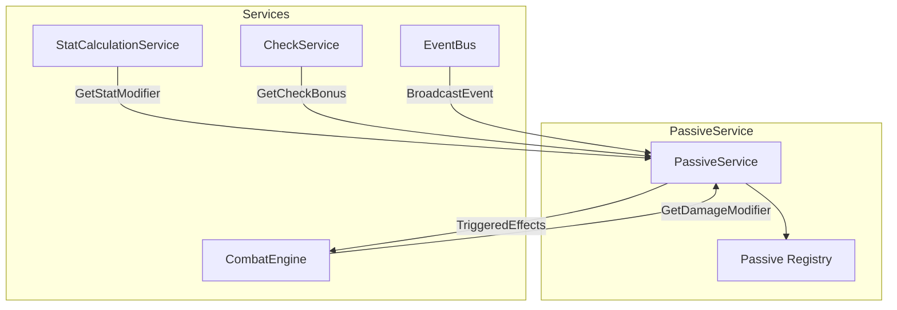

# Passive Abilities — System Specification

> *"The strongest foundations are invisible. They don't announce themselves—they simply hold everything together."*

---

## 1. Overview

### 1.1 Identity Table

| Property | Value |
|----------|-------|
| Spec ID | `SPEC-COMBAT-PASSIVE-ABILITIES` |
| Category | Character System |
| Type | Core Mechanics |
| Dependencies | Stat Calculation, Combat Resolution, Event System |

### 1.2 Core Philosophy

Passive abilities are **permanent, baked-in subroutines of a character's personal operating system**. They are not actions the player takes, but fundamental truths about who their character has become—the cumulative effect of training, innate nature, and the permanent scars or adaptations gained from their journey through the broken world.

**Design Pillars:**

| Pillar | Description | Implementation |
|--------|-------------|----------------|
| **Build Definition** | Passives define character identity beyond attributes | Primary customization mechanism |
| **Always Active** | No activation cost or decision | Automatic, consistent application |
| **Role Reinforcement** | Passives strengthen chosen archetype/specialization | Skjaldmær tanks better, Myrk-gengr assassinates better |
| **Invisible Foundation** | Players feel powerful without managing complexity | Effects apply "under the hood" |

---

## 2. Passive Anatomy

### 2.1 Core Properties

Every passive ability is defined by a consistent set of properties:

| Property | Type | Description |
|----------|------|-------------|
| **PassiveId** | GUID | Unique identifier |
| **Name** | String | Thematic ability name (`Warrior's Vigor`, `Primal Clarity`) |
| **Description** | String | Player-facing effect explanation |
| **TriggerType** | TriggerType | When the passive is evaluated |
| **TriggerCondition** | String? | Additional conditions for activation |
| **EffectScript** | String | Mechanical outcome definition |
| **Source** | PassiveSource | Where the passive comes from |
| **Tier** | Int | Progression tier (1-4) |
| **Rank** | Int | Power level (1-3) |

### 2.2 Data Model

```csharp
public record PassiveAbility
{
    public Guid PassiveId { get; init; }
    public string Name { get; init; } = string.Empty;
    public string Description { get; init; } = string.Empty;

    // Trigger
    public TriggerType TriggerType { get; init; }
    public string? TriggerCondition { get; init; }  // e.g., "DamageType:Fire"
    public string? TriggerEvent { get; init; }      // For event-driven passives

    // Effect
    public string EffectScript { get; init; } = string.Empty;
    public IReadOnlyList<PassiveEffect> Effects { get; init; } = [];

    // Source
    public PassiveSource Source { get; init; }
    public string? SpecializationId { get; init; }
    public string? ArchetypeId { get; init; }
    public string? LineageId { get; init; }
    public string? SagaFeatId { get; init; }

    // Progression
    public int Tier { get; init; }
    public int CurrentRank { get; init; }
}

public enum TriggerType
{
    // Category 1: Constant-State Modifiers
    OnStatCalculation,      // Always-on stat modifications

    // Category 2: Conditional Modifiers
    OnCheckGeneration,      // Before dice rolls
    OnDamageCalculation,    // When calculating damage dealt/received

    // Category 3: Event-Driven Effects
    OnGameEvent,            // After specific events resolve
    OnCombatStart,          // When combat begins
    OnCombatEnd,            // When combat ends
    OnTurnStart,            // At start of character's turn
    OnTurnEnd,              // At end of character's turn
    OnRoomEnter,            // When entering a new room
    OnStatusApplied,        // When a status effect is applied
    OnStatusRemoved         // When a status effect expires/removed
}

public enum PassiveSource
{
    Archetype,              // From base archetype (Warrior, Mystic, etc.)
    Lineage,                // From racial/background choice
    Specialization,         // From skill tree investment
    SagaFeat,               // Awarded for major accomplishments
    Equipment,              // From equipped items
    Corruption,             // From Blight exposure
    Blessing                // From divine/runic sources
}
```

---

## 3. Trigger Categories

### 3.1 Category 1: Constant-State Modifiers

**Trigger:** `OnStatCalculation`

The simplest and most common passives. They provide permanent, "always-on" modifications to derived stats.

**Implementation:** The `StatCalculationService` applies these modifiers as the final step in stat calculation methods.

| Stat Category | Examples |
|---------------|----------|
| **Health** | Max HP, HP Regeneration |
| **Resources** | Max Stamina, Max AP, Regen rates |
| **Combat** | Attack bonus, Defense bonus, Damage |
| **Skills** | Skill bonuses, Check modifiers |
| **Movement** | Speed, Vigilance |

**Example Passives:**

```
Warrior's Vigor (Warrior Archetype)
├── Trigger: OnStatCalculation
├── Effect: MaxHp +10%
└── Description: "Years of physical training have hardened your body."

Fleet Footed (Skirmisher)
├── Trigger: OnStatCalculation
├── Effect: Vigilance +2
└── Description: "You are always aware of escape routes."

Aether-Tainted (Mystic Archetype)
├── Trigger: OnStatCalculation
├── Effect: MaxAP +10%
└── Description: "Your connection to the aether deepens your reserves."

Ironclad Resolve (Skjaldmær Tier 1)
├── Trigger: OnStatCalculation
├── Effect: StressCap +15
└── Description: "Your discipline allows you to endure greater mental strain."
```

**Effect Script Syntax:**
```
Stat:<StatName>,Modifier:<Flat|Percent>,Value:<Amount>

Examples:
Stat:MaxHp,Modifier:Percent,Value:0.10      // +10% Max HP
Stat:Vigilance,Modifier:Flat,Value:2        // +2 Vigilance
Stat:DamageReduction,Modifier:Percent,Value:0.05  // 5% damage reduction
```

### 3.2 Category 2: Conditional Modifiers

**Trigger:** `OnCheckGeneration` or `OnDamageCalculation`

These passives grant bonuses to specific dice rolls or damage calculations, but only under certain conditions.

**Implementation:** Services that build dice pools or calculate damage query the `PassiveService` for relevant conditional modifiers.

| Condition Type | Examples |
|----------------|----------|
| **Skill Type** | Runeforging, Stealth, Persuasion |
| **Damage Type** | Fire, Cold, Physical |
| **Target Type** | Constructs, Corrupted, Humanoid |
| **State** | Hidden, Wounded, Full HP |
| **Environment** | In darkness, In hazard, Near ally |

**Example Passives:**

```
Master Carver I (Dvergr Runesmith Tier 1)
├── Trigger: OnCheckGeneration
├── Condition: SkillType:Runeforging
├── Effect: DicePool +1
└── Description: "Your hands know the runes by heart."

Hazard Acclimation (Ruin-Stalker Tier 2)
├── Trigger: OnCheckGeneration
├── Condition: CheckType:Resolve AND Source:Environmental
├── Effect: DicePool +1
└── Description: "You've learned to endure the citadel's dangers."

Blight-Hunter (Veiðimaðr Tier 2)
├── Trigger: OnDamageCalculation
├── Condition: TargetTrait:Corrupted
├── Effect: Damage +25%
└── Description: "Your arrows seek the corruption within."

Ambush Specialist (Myrk-gengr Tier 1)
├── Trigger: OnDamageCalculation
├── Condition: State:Hidden
├── Effect: CritChance +15%
└── Description: "Striking from shadow grants devastating advantage."
```

**Effect Script Syntax:**
```
Check:<CheckType>,Condition:<ConditionExpr>,Modifier:<Flat|Percent>,Value:<Amount>

Examples:
Check:Skill,Condition:Runeforging,Modifier:Flat,Value:1
Check:Attack,Condition:Target.HasTrait(Corrupted),Modifier:Percent,Value:0.25
Check:Resolve,Condition:Source.IsEnvironmental,Modifier:Flat,Value:1
```

### 3.3 Category 3: Event-Driven Effects

**Trigger:** `OnGameEvent` (and specific event subtypes)

Reactive passives that trigger secondary effects in response to game events.

**Implementation:** The `PassiveService` subscribes to game events via the `IEventBus`. When events fire, it checks affected characters for matching passives and executes their effects.

| Event Type | Description | Example Triggers |
|------------|-------------|------------------|
| `OnDamageTaken` | Character receives damage | Feedback Loop, Adrenaline Surge |
| `OnDamageDealt` | Character deals damage | Life Drain, Momentum Builder |
| `OnEnemyDefeated` | Character kills enemy | No Quarter, Blood Harvest |
| `OnCriticalHit` | Character scores critical | Savage Momentum, Execute |
| `OnFumble` | Character fumbles | Desperate Recovery |
| `OnStatusApplied` | Status applied to self | Corruption Resistance |
| `OnAllyDamaged` | Adjacent ally takes damage | Guardian's Instinct |
| `OnTrapTriggered` | Trap activates | Runic Synergy |
| `OnResourceDepleted` | Stamina/AP reaches 0 | Second Wind |

**Example Passives:**

```
No Quarter (Strandhögg Tier 2)
├── Trigger: OnGameEvent
├── Event: OnEnemyDefeated
├── Condition: Source:Self
├── Effect: GrantAction:BonusMove
└── Description: "Each kill fuels your momentum—you gain a free move."

Feedback Loop (Iron-Hearted Tier 1)
├── Trigger: OnGameEvent
├── Event: OnDamageTaken
├── Condition: None
├── Effect: GenerateResource:Strain,Amount:1
└── Description: "Pain becomes power. Damage taken generates Strain."

Runic Synergy (Ruin-Stalker Tier 2)
├── Trigger: OnGameEvent
├── Event: OnTrapTriggered
├── Condition: Source:Self
├── Effect: RegenerateResource:Stamina,Amount:10
└── Description: "Your traps feed your resolve—triggering them restores Stamina."

Guardian's Instinct (Skjaldmær Tier 3)
├── Trigger: OnGameEvent
├── Event: OnAllyDamaged
├── Condition: Distance:Adjacent
├── Effect: GrantReaction:InterposingShield
└── Description: "When allies fall, your shield rises unbidden."

Corruption Resistance (Lineage: Dvergr)
├── Trigger: OnGameEvent
├── Event: OnStatusApplied
├── Condition: Status:Corrupted
├── Effect: ReduceDuration:Corrupted,Amount:1
└── Description: "Dvergr resilience halts the spread of corruption."
```

**Effect Script Syntax:**
```
Event:<EventType>,Condition:<ConditionExpr>,Action:<ActionType>,Params:<Params>

Examples:
Event:OnEnemyDefeated,Condition:Source.IsSelf,Action:GrantAction,Params:BonusMove
Event:OnDamageTaken,Action:GenerateResource,Params:Strain|1
Event:OnTrapTriggered,Condition:Trap.Owner.IsSelf,Action:RegenerateResource,Params:Stamina|10
```

---

## 4. Acquisition Sources

### 4.1 Archetype Passives

Gained during character creation based on archetype choice. Define the foundational identity.

| Archetype | Passive | Effect |
|-----------|---------|--------|
| **Warrior** | `Warrior's Vigor` | +10% Max HP |
| **Mystic** | `Aether-Tainted` | +10% Max AP |
| **Skirmisher** | `Fleet Footed` | +2 Vigilance |
| **Specialist** | `Adaptive Training` | +1 to all skill checks |

### 4.2 Lineage Passives

Every lineage grants a unique passive trait reflecting heritage.

| Lineage | Passive | Effect |
|---------|---------|--------|
| **Human** | `Adaptive Spirit` | +1 PP per 5 Milestones |
| **Dvergr** | `Corruption Resistance` | -1 turn on [Corrupted] duration |
| **Rig-Born** | `Mechanical Affinity` | +2 to System Bypass checks |
| **Alfar-Touched** | `Paradox Sense` | Detect Blight anomalies passively |

### 4.3 Specialization Passives

The majority of passives come from skill tree investment.

**Tier Distribution:**

| Tier | PP Cost | Starting Rank | Typical Effect |
|------|---------|---------------|----------------|
| Tier 1 | 2 PP | Rank 1 | Minor bonus (+5%, +1 die) |
| Tier 2 | 4 PP | Rank 2 | Moderate bonus (+10%, +2 dice) |
| Tier 3 | 5 PP | Rank 3 | Major bonus (+15%, special effect) |
| Capstone | 6 PP | Rank 3 | Transformative (unique mechanic) |

### 4.4 Saga Feats

Unique, powerful passives **awarded** (not purchased) for major accomplishments.

| Saga Feat | Source | Effect |
|-----------|--------|--------|
| `Blight-Walker` | Survive Alfheim Core | Immune to [Corrupted] |
| `Jötun-Slayer` | Kill a Jötun Construct | +25% damage vs Constructs |
| `Voice of the Coherent` | Complete Galdr mastery | Chants cannot be interrupted |
| `Death's Refusal` | Return from 0 HP 3 times | Once per sector, survive lethal damage |

**Saga Feat Characteristics:**
- Cannot be purchased—only earned through play
- Permanent once acquired
- Often narrative-defining
- Visible as achievement markers

---

## 5. Rank Progression

### 5.1 Automatic Rank-Up System

Passives follow the same rank progression as active abilities:

| Rank | Trigger | Scaling |
|------|---------|---------|
| **Rank 1** | Passive learned | Base effect |
| **Rank 2** | Learn 2nd Tier 2 ability in spec | +50% effect |
| **Rank 3** | Learn Capstone | +100% effect, may gain bonus |

**Reference:** [Active Abilities — Rank Progression](active-abilities.md#6-acquisition--progression)

### 5.2 Rank Scaling Examples

```
Warrior's Vigor
├── Rank 1: +10% Max HP
├── Rank 2: +15% Max HP
└── Rank 3: +20% Max HP, +5 HP regeneration per rest

Master Carver I
├── Rank 1: +1d10 to Runeforging
├── Rank 2: +2d10 to Runeforging
└── Rank 3: +2d10 to Runeforging, crafting time -25%

No Quarter
├── Rank 1: Free move action on kill
├── Rank 2: Free move action on kill, +5 Stamina
└── Rank 3: Free move OR bonus attack on kill, +5 Stamina
```

---

## 6. Service Architecture

### 6.1 PassiveService Interface

```csharp
public interface IPassiveService
{
    // Query
    IReadOnlyList<PassiveAbility> GetCharacterPassives(Character character);
    IReadOnlyList<PassiveAbility> GetPassivesByTrigger(Character character, TriggerType trigger);

    // Category 1: Stat Modifiers
    StatModifier GetStatModifier(Character character, string statName);
    float GetStatMultiplier(Character character, string statName);
    int GetStatFlatBonus(Character character, string statName);

    // Category 2: Conditional Modifiers
    int GetCheckBonus(Character character, CheckContext context);
    float GetDamageModifier(Character character, DamageContext context);
    int GetBonusDice(Character character, CheckContext context);

    // Category 3: Event Processing
    void ProcessGameEvent(GameEvent gameEvent);
    IReadOnlyList<PassiveEffect> GetTriggeredEffects(Character character, GameEvent gameEvent);

    // Lifecycle
    void AddPassive(Character character, PassiveAbility passive);
    void RemovePassive(Character character, Guid passiveId);
    void RankUpPassives(Character character, string specializationId, int newRank);
}
```

### 6.2 Integration with Other Services



### 6.3 Event Processing Flow

```csharp
public class PassiveService : IPassiveService, IEventHandler
{
    private readonly IEventBus _eventBus;
    private readonly IPassiveRepository _repository;

    public PassiveService(IEventBus eventBus, IPassiveRepository repository)
    {
        _eventBus = eventBus;
        _repository = repository;

        // Subscribe to all game events
        _eventBus.Subscribe<DamageTakenEvent>(OnDamageTaken);
        _eventBus.Subscribe<EnemyDefeatedEvent>(OnEnemyDefeated);
        _eventBus.Subscribe<StatusAppliedEvent>(OnStatusApplied);
        // ... etc
    }

    private void OnEnemyDefeated(EnemyDefeatedEvent evt)
    {
        var character = evt.Killer;
        var passives = GetPassivesByTrigger(character, TriggerType.OnGameEvent)
            .Where(p => p.TriggerEvent == "OnEnemyDefeated");

        foreach (var passive in passives)
        {
            if (EvaluateCondition(passive.TriggerCondition, evt))
            {
                ExecuteEffect(character, passive, evt);
            }
        }
    }
}
```

---

## 7. Effect Types

### 7.1 Stat Modification Effects

| Effect | Parameters | Description |
|--------|------------|-------------|
| `ModifyStat` | `Stat`, `Type`, `Value` | Permanent stat change |
| `ModifyResource` | `Resource`, `Type`, `Value` | Resource pool change |
| `ModifyRegeneration` | `Resource`, `Value` | Regen rate change |

### 7.2 Check Modification Effects

| Effect | Parameters | Description |
|--------|------------|-------------|
| `BonusDice` | `CheckType`, `Condition`, `Amount` | Extra dice to pool |
| `AutoSuccess` | `CheckType`, `Condition`, `Amount` | Automatic successes |
| `Reroll` | `CheckType`, `Condition`, `Count` | Reroll failed dice |

### 7.3 Combat Modification Effects

| Effect | Parameters | Description |
|--------|------------|-------------|
| `DamageBonus` | `DamageType`, `Condition`, `Value` | Extra damage |
| `DamageReduction` | `DamageType`, `Condition`, `Value` | Reduce incoming damage |
| `CritBonus` | `Condition`, `Value` | Increase crit chance |
| `ArmorPenetration` | `Condition`, `Value` | Ignore armor |

### 7.4 Event-Triggered Effects

| Effect | Parameters | Description |
|--------|------------|-------------|
| `GrantAction` | `ActionType` | Grant bonus action |
| `GrantReaction` | `ReactionId` | Enable reaction use |
| `GenerateResource` | `Resource`, `Amount` | Add to resource pool |
| `ApplyStatus` | `StatusId`, `Target`, `Duration` | Apply status effect |
| `Heal` | `Amount`, `Target` | Restore HP |
| `TriggerAbility` | `AbilityId`, `Target` | Auto-cast ability |

---

## 8. Stacking Rules

### 8.1 Same-Source Stacking

Passives from the same source (e.g., two Tier 1 specialization passives) **do stack** unless explicitly noted.

### 8.2 Same-Effect Stacking

| Effect Type | Stacking Rule |
|-------------|---------------|
| **Flat Bonuses** | Additive (+2 and +3 = +5) |
| **Percentage Bonuses** | Multiplicative (×1.1 × 1.1 = ×1.21) |
| **Dice Bonuses** | Additive (+1d10 and +2d10 = +3d10) |
| **Event Triggers** | All matching passives fire |
| **Unique Effects** | Only strongest applies |

### 8.3 Cap Limits

| Stat | Maximum Bonus |
|------|---------------|
| Max HP | +100% |
| Damage Bonus | +100% |
| Damage Reduction | 75% |
| Bonus Dice | +5d10 |
| Crit Chance | 50% |

---

## 9. TUI Presentation

### 9.1 Character Sheet Display

```
┌─ PASSIVE ABILITIES ─────────────────────────────────────────┐
│                                                              │
│ ARCHETYPE                                                    │
│ └─ Warrior's Vigor [Rank 2]     +15% Max HP                  │
│                                                              │
│ LINEAGE                                                      │
│ └─ Adaptive Spirit              +1 PP per 5 Milestones       │
│                                                              │
│ SPECIALIZATION: Skjaldmær                                    │
│ ├─ Ironclad Resolve [Rank 2]    +15 Stress Cap               │
│ ├─ Shield Expertise [Rank 2]    +2d10 to Block checks        │
│ └─ Guardian's Instinct [Rank 3] Auto-Interpose for allies    │
│                                                              │
│ SAGA FEATS                                                   │
│ └─ Jötun-Slayer                 +25% damage vs Constructs    │
│                                                              │
└──────────────────────────────────────────────────────────────┘
```

### 9.2 Combat Log Notifications

When event-driven passives trigger:

```
> Gorm kills the Corrupted Servitor!

  [NO QUARTER] triggers!
  Gorm gains a free move action.

> The Forlorn Shriek blasts Eira for 18 damage.

  [FEEDBACK LOOP] triggers!
  Eira gains 1 Strain.
```

### 9.3 Stat Screen Breakdown

```
┌─ MAX HP CALCULATION ────────────────────────────────────────┐
│                                                              │
│ Base HP (STURDINESS 6)          60                           │
│ Warrior's Vigor [Rank 2]        +15%                         │
│ Ironclad Constitution           +10                          │
│ ─────────────────────────────────────────                    │
│ Total Max HP                    79                           │
│                                                              │
└──────────────────────────────────────────────────────────────┘
```

---

## 10. Database Schema

### 10.1 Passive Abilities Table

```sql
CREATE TABLE PassiveAbilities (
    PassiveId           UNIQUEIDENTIFIER PRIMARY KEY,
    Name                NVARCHAR(100) NOT NULL,
    Description         NVARCHAR(500) NOT NULL,

    -- Trigger
    TriggerType         NVARCHAR(30) NOT NULL,
    TriggerCondition    NVARCHAR(200) NULL,
    TriggerEvent        NVARCHAR(50) NULL,

    -- Effect
    EffectScript        NVARCHAR(MAX) NOT NULL,

    -- Source
    Source              NVARCHAR(30) NOT NULL,
    SpecializationId    NVARCHAR(50) NULL,
    ArchetypeId         NVARCHAR(50) NULL,
    LineageId           NVARCHAR(50) NULL,
    SagaFeatId          NVARCHAR(50) NULL,

    -- Progression
    Tier                INT NOT NULL DEFAULT 1,

    -- Metadata
    CreatedAt           DATETIME2 DEFAULT GETUTCDATE(),
    IsActive            BIT DEFAULT 1
);

CREATE INDEX IX_Passives_TriggerType ON PassiveAbilities(TriggerType);
CREATE INDEX IX_Passives_Source ON PassiveAbilities(Source);
CREATE INDEX IX_Passives_Spec ON PassiveAbilities(SpecializationId);
```

### 10.2 Character Passives Table

```sql
CREATE TABLE CharacterPassives (
    CharacterPassiveId  UNIQUEIDENTIFIER PRIMARY KEY,
    CharacterId         UNIQUEIDENTIFIER NOT NULL,
    PassiveId           UNIQUEIDENTIFIER NOT NULL,
    CurrentRank         INT NOT NULL DEFAULT 1,
    AcquiredAt          DATETIME2 DEFAULT GETUTCDATE(),
    AcquiredFrom        NVARCHAR(100) NULL,  -- e.g., "Completed Jötun's Fall"

    CONSTRAINT FK_CharPassive_Character FOREIGN KEY (CharacterId)
        REFERENCES Characters(CharacterId),
    CONSTRAINT FK_CharPassive_Passive FOREIGN KEY (PassiveId)
        REFERENCES PassiveAbilities(PassiveId)
);

CREATE UNIQUE INDEX IX_CharPassive_Unique ON CharacterPassives(CharacterId, PassiveId);
```

---

## 11. Phased Implementation Guide

### Phase 1: Core Framework
- [ ] **Data Model**: Implement `PassiveAbility`, `TriggerType`, `PassiveSource` enums
- [ ] **Repository**: Implement `PassiveRepository` with CRUD operations
- [ ] **Service**: Implement basic `IPassiveService` interface

### Phase 2: Constant-State Modifiers
- [ ] **Stat Integration**: Hook `GetStatModifier()` into `StatCalculationService`
- [ ] **Character Sheet**: Display passive bonuses on stats
- [ ] **Archetype Passives**: Implement starting passives

### Phase 3: Conditional Modifiers
- [ ] **Check Integration**: Hook `GetCheckBonus()` into `CheckService`
- [ ] **Combat Integration**: Hook `GetDamageModifier()` into `CombatEngine`
- [ ] **Context Evaluation**: Implement condition parsing

### Phase 4: Event-Driven Effects
- [ ] **Event Bus**: Implement `IEventBus` subscription system
- [ ] **Event Handlers**: Subscribe `PassiveService` to game events
- [ ] **Effect Execution**: Implement triggered effect resolution

### Phase 5: Progression
- [ ] **Rank System**: Implement automatic rank-up triggers
- [ ] **Saga Feats**: Implement award system for achievements
- [ ] **Scaling**: Implement rank-based effect scaling

### Phase 6: UI Integration
- [ ] **Passive List**: Display in character sheet
- [ ] **Trigger Notifications**: Show combat log messages
- [ ] **Stat Breakdown**: Show passive contributions

---

## 12. Testing Requirements

### 12.1 Unit Tests

- [ ] **Stat Modifiers**: Flat and percent bonuses apply correctly
- [ ] **Stacking**: Multiple bonuses combine per rules
- [ ] **Caps**: Maximum bonuses enforced
- [ ] **Conditions**: Conditional modifiers only apply when valid
- [ ] **Events**: Event triggers fire correct passives

### 12.2 Integration Tests

- [ ] **Combat Flow**: Passives modify damage correctly
- [ ] **Check Flow**: Bonus dice added to pools
- [ ] **Event Chain**: Kill → No Quarter → Free move granted
- [ ] **Rank Up**: Learning abilities triggers passive rank-up

### 12.3 Manual QA

- [ ] **UI**: Passive list displays correct ranks and effects
- [ ] **Feedback**: Trigger notifications appear in combat log
- [ ] **Breakdown**: Stat screen shows passive contributions

---

## 13. Logging Requirements

**Reference:** [logging.md](../00-project/logging.md)

### 13.1 Log Events

| Event | Level | Message Template | Properties |
|-------|-------|------------------|------------|
| Passive Applied | Debug | "Applied {Passive} to {Character}: {Effect}." | `Passive`, `Character`, `Effect` |
| Passive Triggered | Info | "{Character}'s {Passive} triggered by {Event}." | `Character`, `Passive`, `Event` |
| Passive Rank Up | Info | "{Character}'s {Passive} advanced to Rank {Rank}." | `Character`, `Passive`, `Rank` |
| Saga Feat Awarded | Info | "{Character} earned Saga Feat: {Feat}!" | `Character`, `Feat` |

---

## 14. Related Specifications

| Spec ID | Relationship |
|---------|--------------|
| [Active Abilities](active-abilities.md) | Companion ability system |
| [Combat Resolution](combat-resolution.md) | Passives modify combat |
| [Status Effects](status-effects.md) | Passives can apply/resist statuses |
| [Ability Template](../.templates/ability.md) | Individual ability documentation |
| [Dice System](../01-core/dice-system.md) | Bonus dice from passives |

---

## 15. Changelog

| Version | Date | Changes |
|---------|------|---------|
| 1.0 | 2025-12-14 | Initial specification (migrated and adapted from legacy) |
