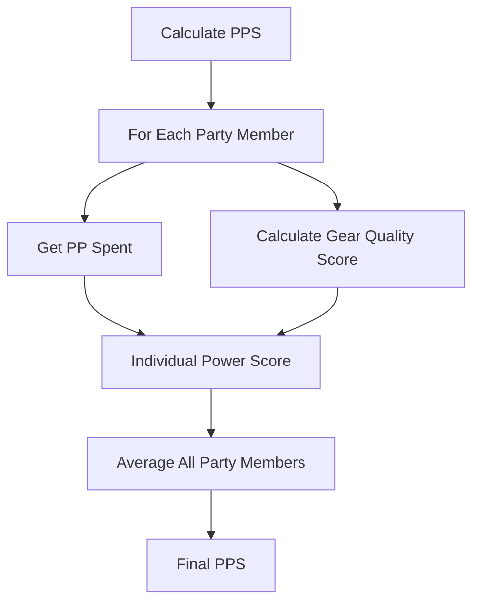

# Spawn Scaling & Difficulty System

> "The Blight remembers your strength. It adapts. It escalates. The deeper you go, the more it knows—and the harder it pushes back."

---

## 1. Overview

### 1.1 Identity Table

| Property | Value |
|----------|-------|
| Spec ID | `SPEC-COMBAT-017` |
| Category | Combat / Scaling |
| Priority | Must-Have |
| Status | Draft |
| Domain | Combat, Difficulty, Progression |
| Parent Spec | SPEC-COMBAT-016 (Encounter Generation) |

### 1.2 Core Philosophy

The **Spawn Scaling & Difficulty System** ensures encounters remain meaningful throughout the game by dynamically adjusting enemy statistics based on player progression. This system prevents both trivial grinding and impossible early-game roadblocks while maintaining the intended challenge curve.

**This is not a forgiving system.** Players who are underprepared will struggle. Players who ignore warnings will die. The scaling exists to ensure *fair* challenge, not *easy* challenge.

**Design Pillars:**

1. **Power-Based Scaling:** Difficulty tracks player investment (PP spent + gear quality), not arbitrary "levels"
2. **Zone Minimums:** Areas have TDR floors—you cannot out-level a zone completely
3. **Anti-Grinding:** Trivial encounters award zero Legend, preventing farming
4. **Transparent Assessment:** Players can gauge relative difficulty before engagement

---

## 2. Player Experience

### 2.1 How Players Interact

Players experience scaling through:

- **Progressive Challenge:** As they spend PP and acquire better gear, enemies in new areas scale to match
- **Zone Difficulty Floors:** Returning to early areas still presents some challenge (minimum TDR)
- **Threat Indicators:** UI displays relative difficulty (Trivial → Impossible) based on PPS vs TDR
- **Legend Rewards:** Harder encounters award more Legend; trivial ones award nothing

### 2.2 Key Features

- **Party Power Score (PPS):** Aggregate measure of party strength (PP + gear)
- **Target Difficulty Rating (TDR):** Per-encounter difficulty value
- **Stat Scaling:** Enemy HP, Damage, and Defense scale with TDR
- **Legend Multipliers:** Reward scaling based on relative difficulty
- **Minimum TDR Floors:** Zones maintain baseline danger regardless of player power

### 2.3 Edge Cases

| Case | Behavior |
|------|----------|
| New character (0 PP, starting gear) | PPS ~5; matches tutorial TDR |
| Naked run (no equipment) | Gear quality contributes 0; PPS = PP only |
| Mixed party power (companion variance) | PPS = average of all party members |
| Massive gear upgrade mid-dungeon | PPS recalculates; current encounter TDR unchanged |
| Boss encounters | Bosses have fixed minimum TDR; never scale below design intent |

---

## 3. Mechanics

### 3.1 Party Power Score (PPS) Calculation

PPS represents the party's aggregate combat capability.



**Formula:**

```
Individual Power Score (IPS) = PP_Spent + (GearQualityScore / 2)

Party Power Score (PPS) = Average(All Party Member IPS)
```

**Gear Quality Values:**

| Quality Tier | Quality Value | Typical Source |
|--------------|---------------|----------------|
| Jury-Rigged | 0.5 | Starting gear, improvised |
| Scavenged | 1.0 | Common loot drops |
| Clan-Forged | 2.0 | Crafted, mid-tier loot |
| Optimized | 4.0 | Elite drops, advanced crafting |
| Myth-Forged | 6.0 | Boss drops, legendary finds |

**Gear Quality Score Calculation:**

```
GearQualityScore = Sum of equipped item quality values

Slots Counted:
  - Weapon (Primary): Full value
  - Weapon (Secondary): Half value (if dual-wielding)
  - Armor (Head): Full value
  - Armor (Chest): Full value
  - Armor (Hands): Full value
  - Armor (Legs): Full value
  - Accessory (×2): Half value each

Maximum Possible GQS: ~42 (all Myth-Forged)
Typical Mid-Game GQS: 12-18 (mixed Clan-Forged/Optimized)
```

### 3.2 Target Difficulty Rating (TDR) Calculation

TDR represents the intended difficulty of an encounter.

**Formula:**

```
Base TDR = Sum of (Enemy Threat Values)

Enemy Threat Value = BaseThreat × TierMultiplier

Tier Multipliers:
  - Minion: 0.5×
  - Standard: 1.0×
  - Elite: 2.0×
  - Boss: 5.0×

Final TDR = Max(BaseTDR, ZoneMinimumTDR) × BiomeDangerMod × DepthMod
```

**Base Threat Values (from enemy-design.md):**

| Threat Tier | Base Threat | After Multiplier (Standard) |
|-------------|-------------|----------------------------|
| Low | 10-20 | 10-20 |
| Medium | 25-50 | 25-50 |
| High | 55-75 | 55-75 |
| Lethal | 80-100 | 80-100 |
| Boss | 100-150 | 500-750 (×5) |

### 3.3 Zone Minimum TDR Floors

Zones have minimum TDR values that prevent complete trivialization.

| Zone / Biome | Min TDR | Rationale |
|--------------|---------|-----------|
| Tutorial / The Roots (Depth 1) | 10 | New players learn mechanics |
| The Roots (Depth 2-3) | 20 | Early game exploration |
| Muspelheim | 35 | Mid-game challenge |
| Niflheim | 35 | Mid-game challenge |
| Jötunheim | 50 | Late mid-game |
| Alfheim | 60 | Late game |
| Asgard | 80 | Endgame content |
| Post-Game / NG+ | 100 | Maximum challenge |

**Floor Enforcement:**

```
If CalculatedTDR < ZoneMinimumTDR:
    FinalTDR = ZoneMinimumTDR
```

### 3.4 Difficulty Ratio & Legend Multipliers

The ratio between TDR and PPS determines relative difficulty and rewards.

```
DifficultyRatio = TDR / PPS
```

| Ratio Range | Difficulty | Legend Multiplier | Player Experience |
|-------------|------------|-------------------|-------------------|
| < 0.5 | Trivial | 0.0× | No reward, waste of time |
| 0.5 - 0.79 | Easy | 0.5× | Minor challenge, reduced reward |
| 0.8 - 1.19 | Standard | 1.0× | Fair fight, full reward |
| 1.2 - 1.74 | Hard | 1.5× | Challenging, bonus reward |
| 1.75 - 2.49 | Deadly | 2.0× | Very dangerous, high reward |
| ≥ 2.5 | Impossible | 2.5×* | Retreat advised |

*Impossible encounters award 2.5× Legend **if** somehow won, but are designed to be unwinnable at current power level.

---

## 4. Calculations

### 4.1 Enemy Stat Scaling

Enemy base stats are modified by TDR to ensure appropriate challenge.

**HP Scaling:**

```
ScaledHP = BaseHP + (TDR × HPScalingFactor)

HP Scaling Factors by Tier:
  - Minion: 0.3
  - Standard: 0.5
  - Elite: 0.8
  - Boss: 1.2
```

**Example (Standard enemy, Base HP 30, TDR 50):**
```
ScaledHP = 30 + (50 × 0.5) = 30 + 25 = 55 HP
```

**Damage Scaling:**

```
ScaledDamage = BaseDamage + (TDR / DamageScalingDivisor)

Damage Scaling Divisors by Tier:
  - Minion: 25 (slow scaling)
  - Standard: 20
  - Elite: 15
  - Boss: 12 (fast scaling)

Result is added bonus damage (flat), not dice.
```

**Example (Standard enemy, Base 2d6, TDR 50):**
```
BonusDamage = 50 / 20 = 2.5 → 2 (rounded down)
ScaledDamage = 2d6 + 2
```

**Defense Scaling:**

```
ScaledDefense = BaseDefense + (TDR / DefenseScalingDivisor)

Defense Scaling Divisor: 30 (all tiers)
```

**Example (Base Defense 12, TDR 50):**
```
BonusDefense = 50 / 30 = 1.67 → 1 (rounded down)
ScaledDefense = 13
```

### 4.2 Complete Scaling Example

**Scenario:** Party with PPS 40 enters a Medium room in Jötunheim (Depth 5) with 2 Standard enemies and 4 Minions.

**Step 1: Calculate Base TDR**
```
Enemy Composition:
  - 2× Rusted Warden (Standard, Medium threat) = 2 × 35 × 1.0 = 70
  - 4× Vörðr-Drone (Minion, Low threat) = 4 × 15 × 0.5 = 30

Base TDR = 70 + 30 = 100
```

**Step 2: Apply Zone Floor**
```
Jötunheim Min TDR = 50
Calculated TDR (100) > Floor (50)
TDR remains 100
```

**Step 3: Calculate Difficulty Ratio**
```
Ratio = TDR / PPS = 100 / 40 = 2.5
Difficulty: Impossible (≥ 2.5)
Legend Multiplier: 2.5× (if won)
```

**Step 4: Scale Enemy Stats**

*Rusted Warden (Standard):*
```
Base: 40 HP, 2d6 damage, 14 Defense
ScaledHP = 40 + (100 × 0.5) = 90 HP
ScaledDamage = 2d6 + (100/20) = 2d6 + 5
ScaledDefense = 14 + (100/30) = 17
```

*Vörðr-Drone (Minion):*
```
Base: 12 HP, 1d6 damage, 10 Defense
ScaledHP = 12 + (100 × 0.3) = 42 HP
ScaledDamage = 1d6 + (100/25) = 1d6 + 4
ScaledDefense = 10 + (100/30) = 13
```

### 4.3 Legend Award Calculation

```
LegendAwarded = BaseEncounterLegend × DifficultyMultiplier × SurvivalBonus

Base Encounter Legend = Sum of enemy Legend values (from enemy-design.md)
Survival Bonus = 1.0 (normal) or 1.25 (no party member downed)
```

**Example:**
```
Rusted Warden Legend: 35 each × 2 = 70
Vörðr-Drone Legend: 15 each × 4 = 60
Base Legend = 130

With Deadly difficulty (2.0×) and survival bonus:
Final Legend = 130 × 2.0 × 1.25 = 325 Legend
```

### 4.4 PPS Progression Reference Table

Expected PPS at various progression milestones:

| Milestone | PP Spent | Typical Gear | GQS | IPS | Notes |
|-----------|----------|--------------|-----|-----|-------|
| Start | 0 | Jury-Rigged | 3 | 1.5 | Tutorial |
| Early Game | 10 | Scavenged | 6 | 13 | The Roots cleared |
| Mid Game | 25 | Clan-Forged | 14 | 32 | First boss down |
| Late Game | 45 | Mixed Opt/Clan | 22 | 56 | Multiple biomes |
| Endgame | 70 | Optimized | 28 | 84 | Pre-final boss |
| Post-Game | 100+ | Myth-Forged | 40 | 120+ | NG+ ready |

---

## 5. Integration Points

### 5.1 Dependencies

| System | Dependency Type |
|--------|-----------------|
| **Saga System (saga-system.md)** | Reads PP spent per character |
| **Equipment System** | Reads equipped item quality values |
| **Enemy Design (enemy-design.md)** | Reads base threat values, Legend values |
| **Companion System (npc-companions.md)** | Includes companion stats in PPS average |

### 5.2 Triggered By

| Trigger | Source |
|---------|--------|
| Party composition change | Companion join/leave |
| Equipment change | Inventory system |
| PP expenditure | Sanctuary rest |
| Encounter generation | Encounter Generation System (SPEC-COMBAT-016) |

### 5.3 Modifies

| Target | Modification |
|--------|--------------|
| Enemy Stats | HP, Damage, Defense scaling |
| Legend Awards | Multiplier based on difficulty |
| Threat Assessment | Difficulty ratio for UI |
| Encounter Generation | TDR input for spawn decisions |

---

## 6. UI Requirements

### 6.1 Power Score Display

```
┌─────────────────────────────────┐
│  PARTY STATUS                   │
│                                 │
│  ⚔ Party Power Score: 42       │
│                                 │
│  Kára       IPS: 45  [████████] │
│  Finnr      IPS: 38  [██████░░] │
│  Player     IPS: 44  [████████] │
│                                 │
└─────────────────────────────────┘
```

### 6.2 Encounter Difficulty Display

```
┌─────────────────────────────────────┐
│  THREAT ASSESSMENT                  │
│                                     │
│  Your Power:    ████████░░░░  42    │
│  Enemy Threat:  ████████████  65    │
│                                     │
│  Difficulty: HARD (+50% Legend)     │
│  Ratio: 1.55                        │
│                                     │
└─────────────────────────────────────┘
```

### 6.3 Color Coding

| Difficulty | Bar Color | Text Color |
|------------|-----------|------------|
| Trivial | Grey | Grey (dim) |
| Easy | Green | Green |
| Standard | Yellow | White |
| Hard | Orange | Orange |
| Deadly | Red | Red |
| Impossible | Purple/Black | Flashing Red |

### 6.4 Feedback Messages

| Event | Message Template |
|-------|------------------|
| PPS Updated | `"Party power recalculated: {PPS}"` |
| Trivial Encounter | `"This fight offers no meaningful challenge. No Legend will be awarded."` |
| Hard Encounter | `"Threat level elevated. Proceed with caution. (+50% Legend)"` |
| Deadly Encounter | `"DANGER: This encounter exceeds recommended power level. (+100% Legend)"` |
| Impossible Encounter | `"CRITICAL: Threat assessment indicates near-certain defeat. Retreat advised."` |

---

## 7. Balance Data

### 7.1 Design Intent

The scaling system aims to:

- Maintain **10-15 turn average combat length** at Standard difficulty
- Ensure **no one-shot deaths** at Standard difficulty (max hit < 50% HP)
- Provide **meaningful progression** where gear and PP investment matter
- Prevent **trivial farming** through zero-Legend penalties
- Allow **skilled players to punch above weight** through Deadly/Impossible bonuses

### 7.2 Scaling Curves

**HP Scaling Curve (Standard Enemy):**

| TDR | Base HP | Scaled HP | % Increase |
|-----|---------|-----------|------------|
| 20 | 30 | 40 | +33% |
| 40 | 30 | 50 | +67% |
| 60 | 30 | 60 | +100% |
| 80 | 30 | 70 | +133% |
| 100 | 30 | 80 | +167% |

**Damage Scaling Curve (Standard Enemy):**

| TDR | Base Damage | Scaled Damage | Avg Increase |
|-----|-------------|---------------|--------------|
| 20 | 2d6 | 2d6+1 | +1 |
| 40 | 2d6 | 2d6+2 | +2 |
| 60 | 2d6 | 2d6+3 | +3 |
| 80 | 2d6 | 2d6+4 | +4 |
| 100 | 2d6 | 2d6+5 | +5 |

### 7.3 Tuning Rationale

**Why these scaling factors?**

- **HP scales faster than damage:** Longer fights, more tactical decisions
- **Minions scale slowest:** They should remain fodder, not become threats
- **Bosses scale fastest:** Climactic fights should always feel epic
- **Defense scales slowly:** Ensures player attacks remain relevant

**Anti-Grinding Philosophy:**

The 0× Legend for Trivial encounters is **intentional and aggressive**. Players should:
- Push into harder content for progression
- Not be able to "farm" early zones indefinitely
- Feel genuine accomplishment from challenging victories

### 7.4 Comeback Mechanics

If the party wipes repeatedly in the same zone:

```
WipeCount 1: No change
WipeCount 2: TDR reduced by 5% for next encounter
WipeCount 3: TDR reduced by 10%
WipeCount 4+: TDR reduced by 15% (cap)

Reset on: Zone change, successful encounter, or rest at Sanctuary
```

This prevents frustration spirals while maintaining challenge.

---

## 8. Voice Guidance

**Reference:** [../.templates/flavor-text/combat-flavor.md](../.templates/flavor-text/combat-flavor.md)

### 8.1 System Tone

| Context | Tone |
|---------|------|
| Power assessment | Clinical, diagnostic (Layer 2) |
| Difficulty warnings | Urgent, foreboding |
| Scaling notifications | Technical, matter-of-fact |

### 8.2 Difficulty Flavor Text

**Trivial:**
> "Threat assessment: negligible. These processes pose no meaningful danger to your current configuration. Engagement not recommended—no growth potential detected."

**Standard:**
> "Threat assessment: nominal. Combat parameters within acceptable ranges. Standard engagement protocols advised."

**Hard:**
> "Threat assessment: elevated. Enemy processes exceed baseline parameters. Tactical caution recommended. Potential for significant growth."

**Deadly:**
> "WARNING: Threat assessment critical. Enemy combat potential significantly exceeds party baseline. Engagement carries high termination risk. Proportional rewards available."

**Impossible:**
> "ALERT: UNWINNABLE SCENARIO DETECTED. All simulation paths terminate in party destruction. Immediate disengagement strongly advised. This is not a challenge—this is a death sentence."

---

## 9. Implementation

### 9.1 Service Interface

```csharp
public interface ISpawnScalingService
{
    /// <summary>
    /// Calculates Party Power Score for the current party.
    /// </summary>
    int CalculatePPS(Party party);

    /// <summary>
    /// Calculates Individual Power Score for a single character.
    /// </summary>
    int CalculateIPS(Character character);

    /// <summary>
    /// Calculates Gear Quality Score from equipped items.
    /// </summary>
    decimal CalculateGearQualityScore(IEnumerable<Equipment> equipped);

    /// <summary>
    /// Calculates Target Difficulty Rating for an encounter.
    /// </summary>
    int CalculateTDR(IEnumerable<EnemySpawn> enemies, Biome biome, int depth);

    /// <summary>
    /// Calculates difficulty ratio and returns assessment.
    /// </summary>
    DifficultyAssessment AssessDifficulty(int tdr, int pps);

    /// <summary>
    /// Scales enemy stats based on TDR.
    /// </summary>
    ScaledEnemyStats ScaleEnemyStats(EnemyBaseStats baseStats, EnemyTier tier, int tdr);

    /// <summary>
    /// Calculates Legend award with difficulty multiplier.
    /// </summary>
    int CalculateLegendAward(int baseLegend, DifficultyLevel difficulty, bool noPartyMemberDowned);

    /// <summary>
    /// Gets minimum TDR floor for a zone.
    /// </summary>
    int GetZoneMinimumTDR(Biome biome, int depth);
}
```

### 9.2 Data Model

```csharp
public class PartyPowerScore
{
    public int TotalPPS { get; set; }
    public List<IndividualPowerScore> MemberScores { get; set; }
    public DateTime CalculatedAt { get; set; }
}

public class IndividualPowerScore
{
    public Guid CharacterId { get; set; }
    public string CharacterName { get; set; }
    public int PPSpent { get; set; }
    public decimal GearQualityScore { get; set; }
    public int FinalIPS { get; set; }
}

public class DifficultyAssessment
{
    public int TDR { get; set; }
    public int PPS { get; set; }
    public decimal Ratio { get; set; }
    public DifficultyLevel Level { get; set; }
    public decimal LegendMultiplier { get; set; }
    public string WarningMessage { get; set; }
}

public class ScaledEnemyStats
{
    public int ScaledHP { get; set; }
    public string ScaledDamage { get; set; }  // e.g., "2d6+3"
    public int ScaledDefense { get; set; }
    public int SourceTDR { get; set; }
}

public enum DifficultyLevel
{
    Trivial = 0,
    Easy = 1,
    Standard = 2,
    Hard = 3,
    Deadly = 4,
    Impossible = 5
}
```

### 9.3 Database Schema

```sql
-- Cached PPS calculations (refreshed on party/gear changes)
CREATE TABLE party_power_cache (
    party_id UUID PRIMARY KEY,
    total_pps INTEGER NOT NULL,
    member_scores JSONB NOT NULL,
    calculated_at TIMESTAMP NOT NULL DEFAULT CURRENT_TIMESTAMP,

    CONSTRAINT chk_pps_positive CHECK (total_pps >= 0)
);

-- Zone TDR floors (configuration table)
CREATE TABLE zone_tdr_floors (
    biome TEXT NOT NULL,
    depth_min INTEGER NOT NULL,
    depth_max INTEGER NOT NULL,
    minimum_tdr INTEGER NOT NULL,

    PRIMARY KEY (biome, depth_min),
    CONSTRAINT chk_depth_range CHECK (depth_max >= depth_min),
    CONSTRAINT chk_tdr_positive CHECK (minimum_tdr > 0)
);

-- Scaling configuration
CREATE TABLE scaling_config (
    tier TEXT PRIMARY KEY,
    hp_scaling_factor DECIMAL(3,2) NOT NULL,
    damage_scaling_divisor INTEGER NOT NULL,
    defense_scaling_divisor INTEGER NOT NULL,
    threat_multiplier DECIMAL(3,2) NOT NULL,

    CONSTRAINT chk_tier CHECK (tier IN ('minion', 'standard', 'elite', 'boss'))
);

-- Seed scaling config
INSERT INTO scaling_config VALUES
    ('minion', 0.30, 25, 30, 0.5),
    ('standard', 0.50, 20, 30, 1.0),
    ('elite', 0.80, 15, 30, 2.0),
    ('boss', 1.20, 12, 30, 5.0);
```

---

## 10. Logging Requirements

**Reference:** [../01-core/logging.md](../01-core/logging.md)

### 10.1 Log Events

| Event | Level | Message Template | Properties |
|-------|-------|------------------|------------|
| PPS Calculated | Debug | "PPS calculated for party {PartyId}: {PPS}" | `PartyId`, `PPS`, `MemberCount` |
| IPS Calculated | Verbose | "IPS for {CharacterName}: PP={PP}, GQS={GQS}, IPS={IPS}" | `CharacterId`, `CharacterName`, `PP`, `GQS`, `IPS` |
| TDR Calculated | Debug | "TDR calculated: {TDR} (Base: {BaseTDR}, Floor: {Floor})" | `EncounterId`, `TDR`, `BaseTDR`, `Floor` |
| Difficulty Assessed | Information | "Difficulty: {Level} (Ratio: {Ratio}, TDR: {TDR}, PPS: {PPS})" | `Level`, `Ratio`, `TDR`, `PPS` |
| Stats Scaled | Debug | "Enemy {EnemyType} scaled: HP {BaseHP}→{ScaledHP}, Dmg {BaseDmg}→{ScaledDmg}" | `EnemyType`, `BaseHP`, `ScaledHP`, `BaseDmg`, `ScaledDmg` |
| Trivial Warning | Information | "Trivial encounter detected—no Legend awarded" | `EncounterId`, `Ratio` |
| Impossible Warning | Warning | "IMPOSSIBLE encounter: Ratio {Ratio} exceeds threshold" | `EncounterId`, `Ratio`, `TDR`, `PPS` |

### 10.2 Example Implementation

```csharp
public DifficultyAssessment AssessDifficulty(int tdr, int pps)
{
    var ratio = (decimal)tdr / pps;
    var level = GetDifficultyLevel(ratio);
    var multiplier = GetLegendMultiplier(level);

    var assessment = new DifficultyAssessment
    {
        TDR = tdr,
        PPS = pps,
        Ratio = ratio,
        Level = level,
        LegendMultiplier = multiplier,
        WarningMessage = GetWarningMessage(level)
    };

    _logger.Information("Difficulty: {Level} (Ratio: {Ratio}, TDR: {TDR}, PPS: {PPS})",
        level, ratio, tdr, pps);

    if (level == DifficultyLevel.Impossible)
    {
        _logger.Warning("IMPOSSIBLE encounter: Ratio {Ratio} exceeds threshold", ratio);
    }
    else if (level == DifficultyLevel.Trivial)
    {
        _logger.Information("Trivial encounter detected—no Legend awarded");
    }

    return assessment;
}
```

---

## 11. Testing

### 11.1 Unit Test Coverage

| Area | Coverage | Missing |
|------|----------|---------|
| PPS Calculation | 0% | Full formula validation |
| TDR Calculation | 0% | Threat aggregation tests |
| Stat Scaling | 0% | All tier scaling curves |
| Difficulty Assessment | 0% | Boundary condition tests |
| Legend Calculation | 0% | Multiplier verification |

### 11.2 Key Test Cases

```csharp
[TestMethod]
public void CalculatePPS_PartyOfThree_ReturnsAverageIPS()
{
    // Arrange: Party with IPS 30, 40, 50
    // Act: Calculate PPS
    // Assert: PPS = 40
}

[TestMethod]
public void CalculateTDR_BelowZoneFloor_ReturnsFloorValue()
{
    // Arrange: Weak enemies in Jötunheim (floor 50)
    // Act: Calculate TDR (base 30)
    // Assert: TDR = 50 (floor enforced)
}

[TestMethod]
public void AssessDifficulty_Ratio2Point5_ReturnsImpossible()
{
    // Arrange: TDR 100, PPS 40
    // Act: Assess difficulty
    // Assert: Level = Impossible, Multiplier = 2.5
}

[TestMethod]
public void ScaleEnemyStats_TDR100Standard_CorrectlyScalesAll()
{
    // Arrange: Standard enemy, base HP 30, TDR 100
    // Act: Scale stats
    // Assert: HP = 80, Damage includes +5, Defense +3
}

[TestMethod]
public void CalculateLegendAward_TrivialDifficulty_ReturnsZero()
{
    // Trivial encounters should award 0 Legend
}

[TestMethod]
public void CalculateGearQualityScore_MixedGear_CorrectWeighting()
{
    // Test slot weighting (secondary weapon half, accessories half)
}
```

### 11.3 QA Checklist

- [ ] PPS correctly averages all party members including companions
- [ ] Zone TDR floors are enforced (cannot go below minimum)
- [ ] Trivial encounters award exactly 0 Legend
- [ ] Difficulty colors match documented thresholds
- [ ] Stat scaling produces expected values at TDR 20, 50, 100
- [ ] Boss encounters never scale below design minimum
- [ ] Comeback mechanics reduce TDR after repeated wipes
- [ ] UI correctly displays PPS and threat assessment

---

## 12. Known Issues

| Issue | Status | Priority |
|-------|--------|----------|
| Companion gear not yet tracked in equipment system | Open | High |
| Comeback mechanic wipe counter needs persistence | Open | Medium |
| Zone floor table incomplete for all biome/depth combinations | Open | Medium |

---

## 13. Phased Implementation Guide

### Phase 1: Data & Persistence
- [ ] **Entities**: Define `PartyPowerScore`, `DifficultyAssessment`, `ScaledEnemyStats`
- [ ] **Schema**: Create zone_tdr_floors, scaling_config, party_power_cache tables
- [ ] **Config**: Add gear quality values to item definitions
- [ ] **Seed Data**: Populate zone floors and scaling factors

### Phase 2: Core Logic (The "Cold" Integration)
- [ ] **Interface**: Define `ISpawnScalingService`
- [ ] **PPS Calculator**: Implement PP + GQS aggregation
- [ ] **TDR Calculator**: Implement threat summation with floors
- [ ] **Stat Scaler**: Implement HP/Damage/Defense scaling formulas
- [ ] **Unit Tests**: Test all calculation paths

### Phase 3: Systems Integration
- [ ] **Encounter Hook**: Connect to `IEncounterGenerationService`
- [ ] **Combat Init**: Pass scaled stats to combat system
- [ ] **Legend Hook**: Connect to saga system for award calculation
- [ ] **Party Change Hook**: Recalculate PPS on composition/gear changes

### Phase 4: UI & Feedback
- [ ] **PPS Display**: Show party power in status panel
- [ ] **Threat Bar**: Visual comparison of PPS vs TDR
- [ ] **Difficulty Labels**: Color-coded difficulty text
- [ ] **Warnings**: Impossible encounter alerts

---

## 14. Related Specifications

| Spec | Relationship |
|------|--------------|
| **SPEC-COMBAT-016** | Parent — Encounter Generation uses TDR/PPS |
| **SPEC-COMBAT-020** | Sibling — Impossible Encounters uses difficulty thresholds |
| **SPEC-COMBAT-012** | Dependency — Enemy Design provides base stats |
| **saga-system.md** | Dependency — Provides PP spent values |
| **npc-companions.md** | Dependency — Companion stats included in PPS |

---

## 15. Changelog

| Version | Date | Changes |
|---------|------|---------|
| 1.0.0 | 2025-12-14 | Initial specification |
