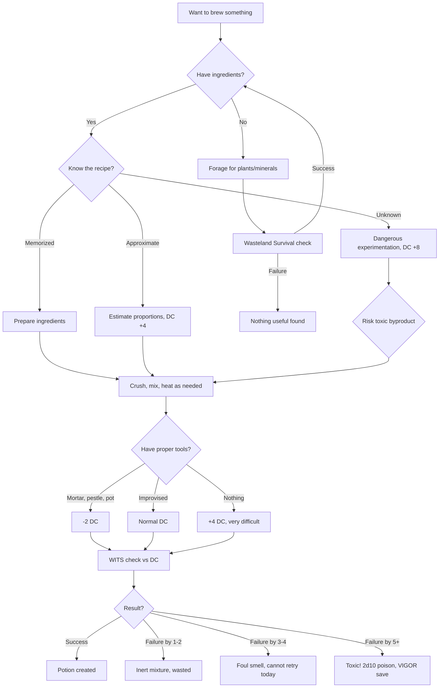
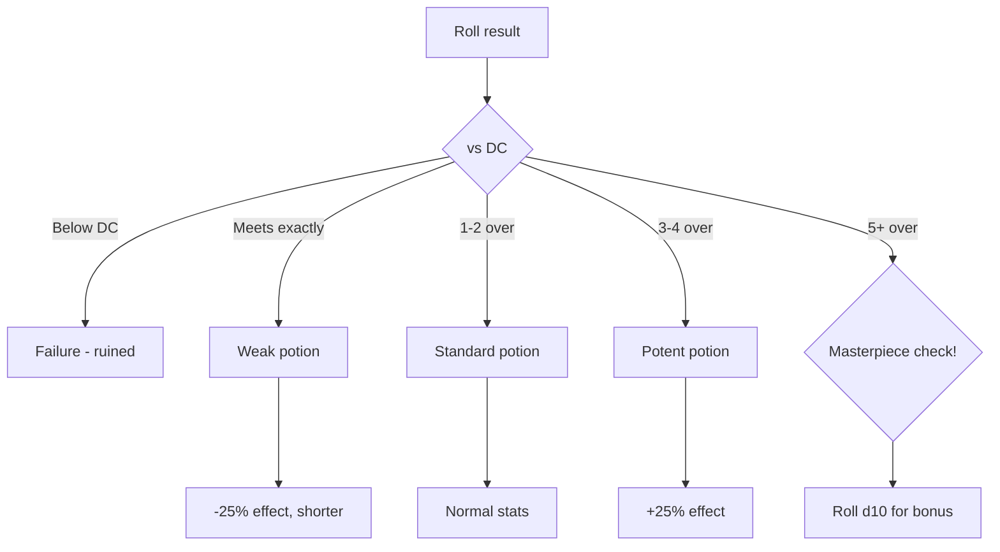
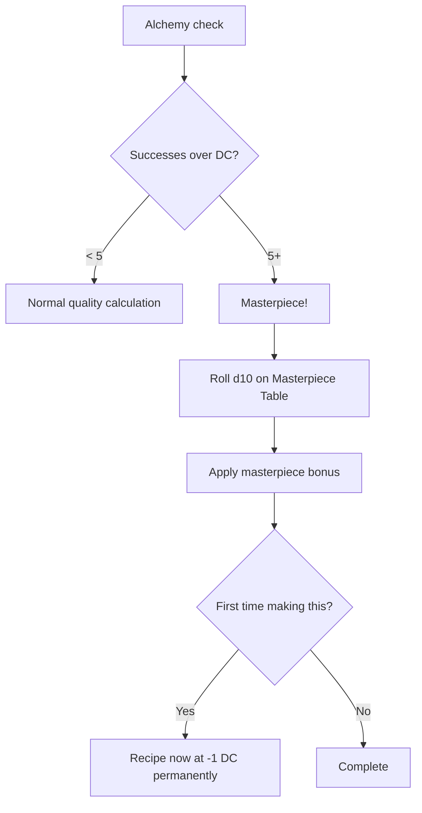
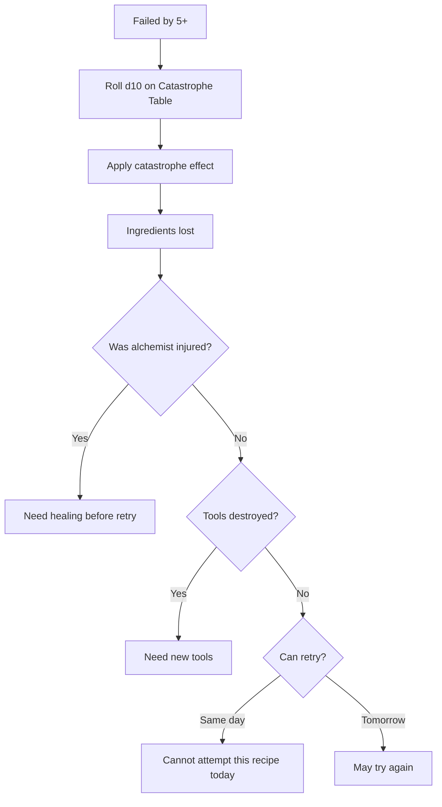

# Alchemy

**Governing Attribute:** WITS

---

## 1. What Is Alchemy?

**Alchemy** is the craft of combining plants, minerals, and salvaged chemicals to create potions, salves, and poisons. Alchemists work through inherited recipes and observed effects — they don't understand chemistry, but they know that "red moss plus burnt copper makes healing paste."

**Core Principle:** Recipes are memorized formulas, not understood science.

**Common Outputs:**
- Healing poultices and potions
- Antidotes and cures
- Poisons and venoms
- Performance enhancers
- Salves and ointments

---

## 2. Alchemy Procedure

### 2.1 Core Workflow



### 2.2 Step-by-Step Procedure

| Step | Action | Notes |
|------|--------|-------|
| 1. Gather | Collect required ingredients | Foraging via Wasteland Survival |
| 2. Prepare | Clean and sort ingredients | Remove debris, select best parts |
| 3. Process | Crush, grind, chop as needed | Mortar and pestle preferred |
| 4. Combine | Mix in correct proportions | Recipe specifies amounts |
| 5. Heat (if needed) | Apply fire carefully | Many recipes require heating |
| 6. Cool/Store | Let settle, bottle result | Container affects shelf life |

---

## 3. DC Table

| Potion Complexity | Base DC | Time Required | Example |
|-------------------|---------|---------------|---------|
| Simple remedy | 8 | 30 minutes | Painkiller, mild tonic |
| Standard potion | 12 | 1 hour | Healing poultice, antidote |
| Complex brew | 16 | 2 hours | Regenerative salve, strong poison |
| Master formula | 20 | 4 hours | Powerful elixirs, rare cures |
| Legendary | 24 | 8+ hours | Mythic potions, permanent effects |

---

## 4. Ingredients

### 4.1 Plant Ingredients

| Ingredient | Where Found | Properties | Rarity |
|------------|-------------|------------|--------|
| **Red Moss** | Damp ruins, caves | Healing, stops bleeding | Common |
| **Ash Lichen** | Burnt areas, volcanic | Pain relief, numbness | Common |
| **Corpse Flower** | Battlefields, graves | Poison base, paralytic | Uncommon |
| **Iron Root** | Rocky terrain | Strength enhancement | Uncommon |
| **Dream Fungus** | Dark caves, cellars | Hallucinations, visions | Uncommon |
| **Blight Bloom** | [Blighted] zones | Corrosive, dangerous | Rare |
| **Frost Fern** | Cold ruins, mountains | Preservation, cooling | Rare |
| **Sun Thistle** | Open wasteland, midday | Energy, wakefulness | Common |

### 4.2 Mineral/Salvaged Ingredients

| Ingredient | Where Found | Properties | Rarity |
|------------|-------------|------------|--------|
| **Burnt Copper** | Salvaged wiring | Binding agent, antiseptic | Common |
| **Rendered Fat** | Animals, beasts | Base for salves | Common |
| **Clean Water** | Springs, rain, trade | Required for all potions | Common |
| **Salt** | Coastal areas, trade | Preservation, purification | Common |
| **Charite Powder** | Grinding charcoal | Filtering, absorption | Common |
| **Blight Crystal** | [Blighted] zones | Corrosive, dangerous | Rare |
| **Aetheric Dust** | Old World machines | Unknown properties | Rare |

### 4.3 Monster Ingredients

| Ingredient | Source | Properties | Rarity |
|------------|--------|------------|--------|
| **Gas Bell Membrane** | Aether-Jelly | Light, airborne effects | Common |
| **Neurotoxin Extract** | Aether-Jelly | Paralytic, fast-acting | Rare |
| **Ash Sample** | Ash-Crow | Corrosive, caustic | Common |
| **Crow Feather** | Ash-Crow | Swiftness, light | Common |
| **Chitin Plate** | Chasm-Crawler | Hardening, resistance | Common |
| **Bio-Adhesive Gland** | Chasm-Crawler | Binding, sticky | Uncommon |
| **Mimicry Organ** | Chasm-Crawler | Sound manipulation | Rare |
| **Resonator Tissue** | Chasm-Crawler | Sonic amplification | Rare |
| **Psionic Spore** | Mycelian Weaver | Mind-altering, confusion | Rare |
| **Uncorrupted Mycelial** | Mycelian Weaver | Regrowth, purging | Very Rare |
| **Receptor Organ** | Deep-Stalker | Sensory enhancement | Very Rare |
| **Sonic Gland** | Deep-Stalker | Stun, impact | Very Rare |
| **Ear Membrane** | Deep-Stalker | Acoustic sensitivity | Rare |
| **Cable Filament** | Scrap-Hydra | Structural tensile strength | Common |
| **Harmonic Resonator** | Scrap-Hydra | Tuning, coordination | Rare |
| **Ghost-Scream Residue** | Husked | Fear, ectoplasm | Rare |

### 4.4 [Glitched] Ingredients

When using ingredients from [Glitched] areas, roll on the chaos table:

| d10 | Effect |
|-----|--------|
| 1 | Potion becomes toxic (2d10 poison to user) |
| 2-3 | Potion inert (no effect, ingredients wasted) |
| 4-5 | Potion works but causes mild hallucinations |
| 6-7 | Normal effect |
| 8-9 | Potion unexpectedly potent (+50% effect) |
| 10 | Miraculous! Double effect, no side effects |

---

## 5. Modifiers

### 5.1 Tool Modifiers

| Tools Available | Modifier |
|-----------------|----------|
| Full alchemy setup (workshop) | -4 DC |
| Proper tools (mortar, pestle, pot, fire) | -2 DC |
| Improvised tools | +0 |
| No tools | +4 DC |

### 5.2 Knowledge Modifiers

| Knowledge Source | Modifier |
|------------------|----------|
| Taught properly by master alchemist | -2 DC |
| Taught casually | +0 |
| Working from written notes | +2 DC |
| Seen someone else make it | +4 DC |
| Experimenting blindly | +8 DC |

### 5.3 Ingredient Modifiers

| Ingredient Quality | Modifier |
|--------------------|----------|
| Fresh (gathered today) | -2 DC |
| Standard (within 1 week) | +0 |
| Old (1-4 weeks) | +2 DC |
| Degraded (1+ months) | +4 DC |
| [Glitched] ingredient | Chaos roll |

### 5.4 Situation Modifiers

| Situation | Modifier |
|-----------|----------|
| Clean workspace | -1 DC |
| Standard conditions | +0 |
| Dusty/dirty area | +1 DC |
| Hostile environment | +2 DC |
| Rushing (half time) | +4 DC |

---

## 6. Recipes

### 6.1 Healing Recipes

| Recipe | DC | Ingredients | Time | Effect |
|--------|-----|-------------|------|--------|
| Wound Salve | 10 | Red Moss × 1, Burnt Copper × 1, Fat × 1 | 30 min | Prevents infection |
| Healing Poultice | 10 | Red Moss × 2, Fat × 1, Water × 1 | 30 min | Heal 2d10 HP over 1 min |
| Strong Healer | 14 | Red Moss × 4, Burnt Copper × 2, Fat × 2, Water | 1 hr | Heal 4d10 HP over 1 min |
| Regenerative Salve | 18 | Red Moss × 3, Iron Root × 1, Fat × 2, Water | 2 hrs | Heal 1d10/hour for 8 hrs |
| Mycelian Regrowth Poultice | 20 | Uncorrupted Mycelial × 1, Red Moss × 2, Water | 4 hrs | Strong HoT, cures physical trauma |
| Liquid Suture | 14 | Cable Filament × 1, Bio-Adhesive Gland × 1 | 10 min | Instantly stops Bleeding, stabilizes Dying |

### 6.2 Cure/Antidote Recipes

| Recipe | DC | Ingredients | Time | Effect |
|--------|-----|-------------|------|--------|
| Antidote | 12 | Ash Lichen × 2, Water × 2 | 1 hr | Cure poison |
| Painkiller Tonic | 8 | Ash Lichen × 1, Water × 1 | 30 min | Ignore 5 damage for 1 hr |
| Disease Cure | 16 | Red Moss × 2, Ash Lichen × 2, Burnt Copper × 1 | 2 hrs | Cure common diseases |
| Numbness Draught | 10 | Ash Lichen × 3, Water × 2 | 1 hr | No pain for 4 hrs (risk) |

### 6.3 Enhancement Recipes

| Recipe | DC | Ingredients | Time | Effect |
|--------|-----|-------------|------|--------|
| Strength Elixir | 16 | Iron Root × 2, Water × 1, Fat × 1 | 2 hrs | +2 VIGOR for 10 min |
| Stimulant | 12 | Sun Thistle × 2, Water × 1 | 1 hr | No sleep needed for 24 hrs |
| Focus Tonic | 14 | Dream Fungus × 1, Ash Lichen × 1, Water × 2 | 1 hr | +1d10 to WITS checks for 1 hr |
| Endurance Brew | 14 | Iron Root × 1, Sun Thistle × 2, Water × 2 | 1 hr | +2d10 HP for 1 hr (temporary) |
| Iron-Blood Brew | 16 | Iron Root × 2, Chitin Plate × 1, Water | 2 hrs | +15 Temp HP buffer |
| Chitin-Skin Salve | 14 | Chitin Plate × 2, Fat × 2 | 1 hr | +2 Armor vs Physical, 1 hr |
| Crow-Feather Oil | 12 | Crow Feather × 3, Oil base | 1 hr | Weapon is Light property, +Initiative if on armor |
| Mimic's Throat-Spray | 16 | Mimicry Organ × 1, Water × 2 | 2 hrs | Advantage on Deception (Voice/Disguise) |
| Stalker’s Night-Eye Drops | 18 | Receptor Organ × 1, Water × 1 | 2 hrs | Grants Darkvision (30m) or Blight-Sight |
| Adrenaline-Surge Shot | 16 | Stimulant generic OR Adrenal Gland (Stalker), Water | 1 hr | +2 AP for 1 turn, then 1 level Exhaustion |
| Blight-Ward Tincture | 20 | Uncorrupted Mycelial × 1, Clean Water × 3 | 4 hrs | Advantage on saves vs Corruption/Blight (1 hr) |

### 6.4 Poison Recipes

| Recipe | DC | Ingredients | Time | Effect |
|--------|-----|-------------|------|--------|
| Contact Poison | 14 | Corpse Flower × 2, Fat × 1 | 1 hr | 3d10 poison damage |
| Blade Venom | 12 | Corpse Flower × 1, Water × 1 | 30 min | +1d10 poison on weapon (3 hits) |
| Paralytic Toxin | 16 | Corpse Flower × 3, Ash Lichen × 1 | 2 hrs | VIGOR save or paralyzed 1 min |
| Sleep Poison | 14 | Dream Fungus × 3, Fat × 1 | 1 hr | WILL save or sleep 1 hr |
| Aetheric Paralysis Extract | 18 | Neurotoxin Extract × 1, Water | 2 hrs | VIGOR save or Paralyzed (Hard DC) |
| Ghost-Scream Oil | 16 | Ghost-Scream Residue × 1, Fat × 1 | 1 hr | Weapon applies [Fear] on hit (WILL save) |

### 6.5 Utility Recipes

| Recipe | DC | Ingredients | Time | Effect |
|--------|-----|-------------|------|--------|
| Fire Oil | 14 | Rendered Fat × 3, Ash Lichen × 1 | 1 hr | Burns 2d10/round for 3 rounds |
| Smoke Paste | 12 | Charcoal × 2, Fat × 1, Salt × 1 | 30 min | Creates smoke on ignition |
| Preservation Solution | 10 | Salt × 2, Water × 2 | 30 min | Preserves food/ingredients |
| Scent Mask | 12 | Ash Lichen × 2, Fat × 1 | 30 min | Hides scent for 4 hrs |
| Levitation Gas Vial | 16 | Gas Bell Membrane × 1, Sealed Vial | 1 hr | Thrown: Creates low-G zone / slow fall |
| Ash-Caustic Bomb | 14 | Ash Sample × 2, Blight Crystal × 1 | 1 hr | Thrown: 2d10 Acid + Armor Corrosion |
| Spider-Gum Grenade | 14 | Bio-Adhesive Gland × 1, Solvent | 1 hr | Thrown: AoE [Immobilized] (STR save) |
| Spore-Haze Grenade | 16 | Psionic Spore × 1, Powder Base | 2 hrs | Thrown: AoE [Confused] (WILL save) |
| Sonic-Bang Vial | 14 | Sonic Gland × 1, Resonator Tissue × 1 | 2 hrs | Thrown: AoE [Stunned] (CON save) |
| Silencing Grease | 12 | Ear Membrane × 1, Fat × 2 | 1 hr | Adv on Stealth, armor silent |
| Resonating Oil | 16 | Resonator Tissue × 1, Oil | 2 hrs | Blunt weapon deals +1d8 Sonic/Shattering |
| Deep-Warmth Balm | 12 | Frost Fern × 2, Fat × 2 | 1 hr | Resistance to Cold (Environmental only) |
| Harmonic Tuning Paste | 18 | Harmonic Resonator × 1, Oil | 4 hrs | Adv on complex crafting/tuning checks |

---

## 7. Quality Levels

### 7.1 Potion Quality Tiers

Every brewed item has a quality level based on the crafting roll:

| Quality | Successes Over DC | Effect |
|---------|-------------------|--------|
| **Weak** | Met DC exactly | -25% effectiveness, shorter duration |
| **Standard** | 1-2 over DC | Normal effect |
| **Potent** | 3-4 over DC | +25% effectiveness |
| **Masterwork** | 5+ over DC | +50% effectiveness, special property |

### 7.2 Quality Decision Tree



### 7.3 Quality Effects by Potion Type

| Potion Type | Weak | Standard | Potent | Masterwork |
|-------------|------|----------|--------|------------|
| Healing | Heal -25% | Normal | Heal +25% | Heal +50% + faster |
| Poison | Damage -25% | Normal | Damage +25% | Damage +50% + hard save |
| Buff | Duration halved | Normal | Duration +50% | Duration doubled + stronger |
| Antidote | 75% cure chance | 100% cure | Cures + resist | Full immunity 1 hr |

---

## 8. Masterpieces

When exceeding the DC by 5+, roll for a **masterpiece bonus**:

### 8.1 Masterpiece Table (d10)

| d10 | Bonus | Description |
|-----|-------|-------------|
| 1-2 | **Long-Lasting** | Duration doubled |
| 3-4 | **Concentrated** | Half dose works fully |
| 5-6 | **Pure** | No side effects possible |
| 7-8 | **Syrupy** | Pleasant taste, easy to administer |
| 9 | **Signature** | Recognizable work, +reputation |
| 10 | **Miraculous** | Roll twice, keep both bonuses |

### 8.2 Masterpiece Workflow



### 8.3 Masterpiece Example

> **Scenario:** Sigrid brews an antidote and rolls 7 successes vs DC 12 (5+ over).
>
> **Masterpiece Roll:** d10 → 3 (Concentrated)
>
> **Result:** Antidote requires only half the normal dose, effectively yielding 2 doses from 1 brew.

---

## 9. Catastrophic Failures

When failing by 5+ successes below DC, something goes **catastrophically wrong**.

### 9.1 Catastrophic Failure Table (d10)

| d10 | Failure | Consequence |
|-----|---------|-------------|
| 1 | **Toxic Cloud** | 2d10 poison damage, VIGOR save for half |
| 2 | **Explosion** | Pot explodes, 1d10 fire + 1d10 shrapnel |
| 3 | **Corrosion** | Acid eats tools, mortar/pestle destroyed |
| 4 | **Hallucinogen** | Crafter inhales, confused for 1 hr |
| 5 | **Stench** | Nauseating smell, area unusable for 4 hrs |
| 6 | **Fire** | Uncontrolled fire starts |
| 7 | **Ingredient Curse** | Ingredients of this type unusable for 24 hrs |
| 8 | **Skin Burn** | Chemical burns, 1d6 damage, -1d10 to crafting until healed |
| 9 | **Poisoned Self** | Ingest trace, sickened for 24 hrs |
| 10 | **Cursed Brew** | Potion created but has opposite/harmful effect |

### 9.2 Catastrophic Failure Workflow



---

## 10. Brewing Process Details

### 7.1 Preparation Methods

| Method | Description | When Used |
|--------|-------------|-----------|
| **Grinding** | Mortar and pestle to powder | Dried ingredients |
| **Crushing** | Break into small pieces | Fresh plants |
| **Chopping** | Cut finely | Roots, stems |
| **Rendering** | Melt over fire | Fats, waxes |
| **Infusing** | Soak in liquid over time | Extracting properties |
| **Boiling** | Heat liquid to bubbling | Mixing, purifying |
| **Simmering** | Low heat for long time | Concentrating |

### 7.2 Common Mistakes

| Mistake | Consequence |
|---------|------------|
| Wrong proportions | Potion too weak or too strong |
| Insufficient grinding | Lumpy, uneven effect |
| Overheating | Burns active ingredients |
| Underheating | Ingredients don't combine |
| Contamination | Unpredictable side effects |
| Using old ingredients | Reduced potency or failure |

---

## 8. Example: Brewing a Healing Poultice

> **Scenario:** Sigrid brews a healing poultice to treat a wounded companion.
>
> **Setup:**
> - WITS: 6
> - Mortar and pestle, fire: -2 DC
> - Fresh Red Moss (just gathered): -2 DC
> - Taught by clan healer: -2 DC
> - Ingredients: Red Moss × 3, Fat × 2, Water (enough)
>
> ---
>
> **Step 1 - Gather Ingredients:**
> - Red Moss × 2 ✓ (have 3)
> - Fat × 1 ✓ (have 2)
> - Water ✓
>
> **Step 2 - Prepare Workspace:**
> - Sets up near campfire
> - Arranges mortar, pestle, small pot
>
> **Step 3 - Process Ingredients:**
> - Grinds Red Moss to paste
> - Renders fat in pot over fire
>
> **Step 4 - Calculate DC:**
> - Base DC: 10 (standard potion)
> - Tools: -2
> - Fresh: -2
> - Knowledge: -2
> - **Final DC: 4**
>
> **Step 5 - Roll:**
> - Pool: 6d10 → [8, 3, 7, 9, 2, 7] = 4 successes
> - DC 4 threshold = 1 success needed
> - Result: **SUCCESS!**
>
> **Step 6 - Output:**
> - Healing Poultice created
> - Effect: Heals 2d10 HP over 1 minute
> - Time spent: 30 minutes
> - Ingredients consumed: Red Moss × 2, Fat × 1, Water

---

## 9. Shelf Life and Storage

| Potion Type | Shelf Life | Storage Requirements |
|-------------|------------|---------------------|
| Salves/ointments | 1 month | Sealed container, cool |
| Water-based potions | 1 week | Sealed, away from light |
| Oils | 2 weeks | Sealed, cool |
| Powders | 3 months | Dry, sealed |
| Poisons | 2 weeks | Sealed, careful handling |

**Spoiled Potions:** Roll d10 — 1-3 inert, 4-6 reduced effect, 7-9 side effects, 10 toxic

---

## 10. Specialization: Alka-hestur (Combat Alchemist)

Characters with the **Alka-hestur** specialization gain:

| Bonus | Effect |
|-------|--------|
| DC Reduction | -2 to all alchemy checks |
| Toxic Immunity | Immune to own crafting failures |
| Quick Brew | Can rush at only +2 DC (instead of +4) |
| Potent Mixtures | +25% effect strength on poisons |

---

## 11. Phased Implementation Guide

### Phase 1: Data & Persistence
- [ ] **Data Definition**: Create `Recipe` class (ID, Inputs, Outputs, DC).
- [ ] **Seed Data**: Add all recipes from Section 6 to `RecipeRegistry`.
- [ ] **Inventory**: Ensure `Character.Inventory` supports adding/removing multiple items.

### Phase 2: Core Logic (Dice System)
- [ ] **Process**: Implement `AlchemyService.Craft(character, recipe, quality)` method.
- [ ] **Modifiers**: Implement `GetCraftingModifiers()` including Tool/Environment checks.
- [ ] **Quality Logic**: Implement 4-tier success table (Weak/Standard/Potent/Masterwork).
- [ ] **Unit Tests**: Verify DC calculations and modifier stacking.

### Phase 3: Systems Integration
- [ ] **Survival Hook**: Link `WastelandSurvival` for foraging ingredients (see Integrated Systems).
- [ ] **Masterpiece**: Implement 5+ success "Masterpiece Table" lookup.
- [ ] **Catastrophe**: Implement fail-by-5 "Catastrophe Table" lookup.

### Phase 4: UI & Feedback
- [ ] **TUI**: Create "Crafting Station" window with recipe list.
- [ ] **Logs**: Generate "Created {Item}" logs (Info level).
- [ ] **Feedback**: Show "You lack a mortar and pestle (+4 DC)" warning in UI.

---

## 12. Testing Requirements

### 12.1 Unit Tests
- [ ] **Recipe Validation**: Verify all seeded recipes have valid ingredient IDs.
- [ ] **Modifier Calc**: Verify `ToolModifier` applies correct values (-4/0/+4).
- [ ] **Result Tiers**: Verify roll of DC+1 = Standard, DC+5 = Masterwork.
- [ ] **Catastrophe**: Verify roll of DC-5 triggers Catastrophe event.

### 12.2 Key Test Cases
- [ ] **Inventory Check**: Confirm crafting fails if 1 ingredient missing.
- [ ] **Output Check**: Confirm ingredients removed and potion added on success.
- [ ] **Quality Effect**: Confirm "Potent" potion has higher stats than "Standard".

### 12.3 Manual QA
- [ ] **UI**: Select recipe -> Press Craft -> Verify log output.
- [ ] **Edge Case**: Attempt craft with full inventory (should fail or drop to ground).

---

## 13. Integration Points

| System | Integration |
|--------|-------------|
| **Wasteland Survival** | Foraging ingredients |
| **Combat** | Consumable usage, poisons |
| **Field Medicine** | Healing integration |
| **Economy** | Trading potions |

---

## 14. Voice Guidance

**Theme:** Practical, ritualistic, observant. Science without theory.

### 14.1 Tone Profile

| Property | Value |
|----------|-------|
| **Tone** | Focused, instructional, cautious |
| **Key Words** | Mix, bind, settle, fumes, reaction |
| **Sentence Style** | Instructions, observations of physical changes |

### 14.2 Example Voice

> **Gathering:** "The leaves are spotted with grey. Good. Potent."
> **Brewing:** "Three turns clockwise. Add the ash. Wait for the hiss... there."
> **Success:** "The fumes clear. The color turns deep amber. It is done."
> **Failure:** "It smells of sulfur and rot. Useless. Dump it."

---

## 15. Logging Requirements

**Reference:** [../../01-core/logging.md](../../01-core/logging.md)

### 15.1 Log Events

| Event | Level | Message Template | Properties |
|-------|-------|------------------|------------|
| Craft Start | Debug | "Alchemy craft started: {RecipeId} by {CharacterId}" | `RecipeId`, `CharacterId` |
| Roll Result | Verbose | "Craft check: {Successes} vs DC {DC} ({Quality})" | `Successes`, `DC`, `Quality` |
| Item Created | Info | "Created {ItemName} (Quality: {Quality})" | `ItemName`, `Quality`, `CharacterId` |
| Masterpiece | Info | "Masterpiece created! Bonus: {Bonus}" | `CharacterId`, `Bonus` |
| Catastrophe | Warning | "Alchemy catastrophe: {Effect}" | `CharacterId`, `Effect` |

### 15.2 Example Implementation

```csharp
public CraftResult CraftPotion(Character crafter, Recipe recipe)
{
    _logger.Debug("Alchemy craft started: {RecipeId} by {CharacterId}", recipe.Id, crafter.Id);
    
    var check = ResolveCheck(crafter, recipe.Difficulty);
    _logger.Verbose("Craft check: {Successes} vs DC {DC} ({Quality})", check.Successes, recipe.Difficulty, check.Quality);
    
    if (check.IsSuccess)
    {
        _logger.Info("Created {ItemName} (Quality: {Quality})", recipe.OutputName, check.Quality);
    }
    else if (check.IsCatastrophe)
    {
        _logger.Warning("Alchemy catastrophe: {Effect}", check.CatastropheEffect);
    }
    
    return check.Result;
}
```

---

## 16. Related Documentation

| Document | Purpose |
|----------|---------|
| [Crafting Overview](overview.md) | Trade comparison |
| [Crafting UI](../../08-ui/crafting-ui.md) | Unified TUI/GUI interface |
| [Bodging](bodging.md) | Companion craft |
| [Wasteland Survival](../../01-core/skills/wasteland-survival.md) | Foraging mechanics |
