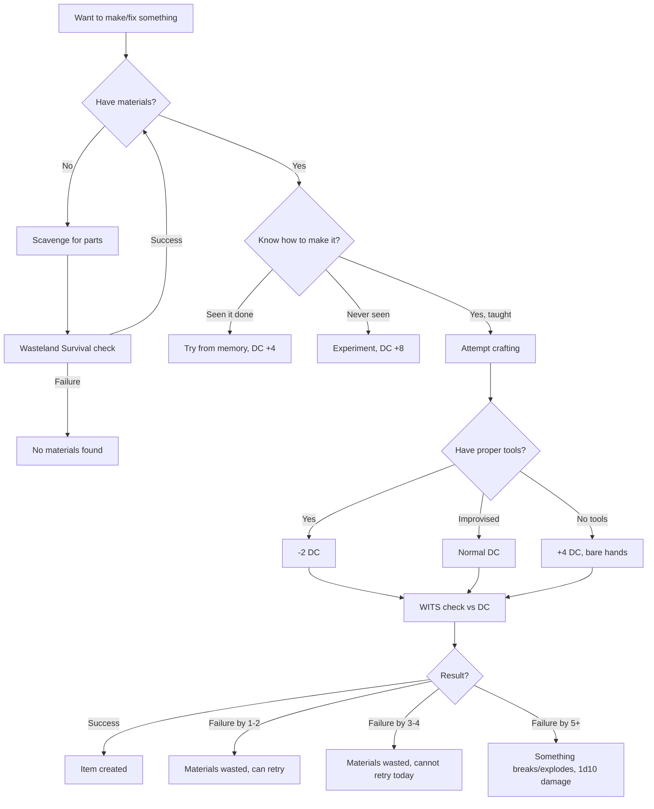
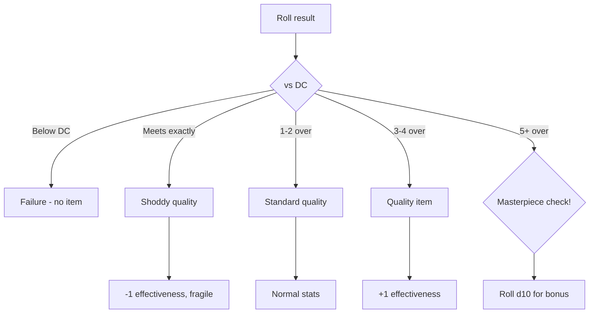
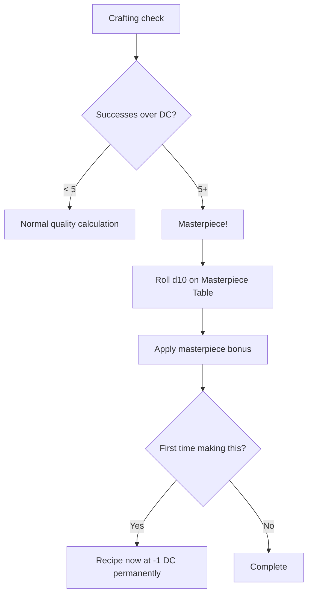
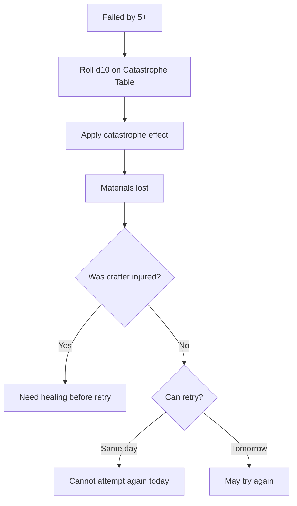
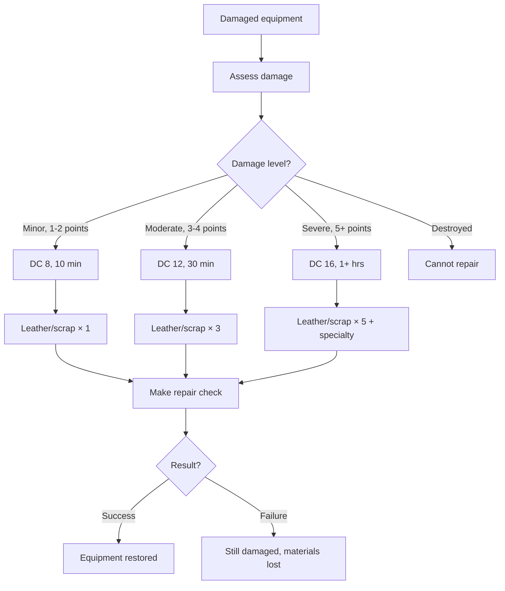

# Bodging (Tinkering)

**Governing Attribute:** WITS

---

## 1. What Is Bodging?

**Bodging** is the art of making things work through improvisation, salvage, and stubborn determination. A bodger doesn't understand *why* connecting the copper wire to the glowing bit makes the mechanism function — they just know it does because their master taught them.

**Core Principle:** Knowledge is passed down as rote sequences of actions, not understanding.

**Common Outputs:**
- Repaired equipment
- Improvised traps
- Jury-rigged tools
- Scavenged weapons
- Lockpicks and specialty tools

---

## 2. Bodging Procedure

### 2.1 Core Workflow



### 2.2 Step-by-Step Procedure

| Step | Action | Notes |
|------|--------|-------|
| 1. Gather | Collect required materials | Wasteland Survival if needed |
| 2. Prepare | Set up workspace | Fire, light, flat surface |
| 3. Recall | Remember the technique | Or experiment at +8 DC |
| 4. Work | Perform the craft | Time varies by complexity |
| 5. Test | Check if it works | Part of the check |
| 6. Adjust | Minor fixes if needed | Included in success |

---

## 3. DC Table

| Item Complexity | Base DC | Time Required | Example |
|-----------------|---------|---------------|---------|
| Simple repair | 8 | 10 minutes | Patch a hole, reattach handle |
| Basic item | 10 | 30 minutes | Shiv, club, simple trap |
| Standard item | 14 | 1 hour | Lockpicks, crossbow bolts |
| Complex item | 18 | 4 hours | Traps with mechanisms |
| Intricate item | 22 | 8+ hours | Jury-rigged tech device |

---

## 4. Materials

### 4.1 Common Materials

| Material | Where Found | Common Uses |
|----------|-------------|-------------|
| **Scrap metal** | Ruins, junk piles, machines | Weapons, repairs, traps |
| **Wire/cable** | Old buildings, terminals | Binding, triggers, repairs |
| **Leather/cloth** | Animals, corpses, traders | Armor, handles, bindings |
| **Bone/wood** | Animals, trees, structures | Handles, frames, arrows |
| **Salvaged components** | Terminals, machines | Poorly-understood tech bits |
| **Rivets/nails** | Construction sites, furniture | Fastening, reinforcement |

### 4.2 Salvaged Tech Components

Nobody understands these, but bodgers know "the blue thing makes sparks":

| Component | Source | Bodger's Name | Use |
|-----------|--------|---------------|-----|
| Capacitor | Terminals, machines | "Spark-holder" | Store charge |
| Wire coil | Motors, generators | "Spinner guts" | Electromagnetic traps |
| Circuit board | Any electronics | "Spirit plate" | Unknown, valuable |
| Battery cell | Vehicles, devices | "Dead lightning" | Power source |
| Lens | Cameras, scopes | "Eye glass" | Focus, magnification |

### 4.3 Monster Salvage

Bodgers see monsters as walking piles of "wet scrap."

| Component | Source | Bodger's Name | Use |
|-----------|--------|---------------|-----|
| **Chitin Plate** | Chasm-Crawler | "Bug-Iron" | Heavy armor, shields |
| **Leg Joint** | Chasm-Crawler | "Climber's Limb" | Grapples, articulated frames |
| **Resonator** | Crawler/Hydra | "Hummer-Stone" | Sonic weapons, shields |
| **Sonic Gland** | Deep-Stalker | "Screaming Meat" | Stun traps, alarms |
| **Ear Membrane** | Deep-Stalker | "Listener Skin" | Acoustic amplification |
| **Deep-Hide** | Deep-Stalker | "Shadow Leather" | Stealth gear |
| **Cable Bundle** | Scrap-Hydra | "Steel Snake" | Binding, whips, nets |
| **Repair Node** | Scrap-Hydra | "Mender's Heart" | Auto-constricting traps |
| **Logic-Shard** | Husked/Hydra | "Spirit Glass" | Targeting scopes, tracking |
| **Neural Lace** | Husked | "Mind-Wire" | Reflex enhancement, grips |
| **Gas Bell** | Aether-Jelly | "Float-Sac" | Lift assistance, slow fall |
| **Ash-Feather** | Ash-Crow | "Grey Needle" | Armor piercing ammo |
| **Carapace** | Weaver | "Dream-Shell" | Psychic shielding |

---

## 5. Modifiers

### 5.1 Tool Modifiers

| Tools Available | Modifier |
|-----------------|----------|
| Full workshop | -4 DC |
| Proper tools (hammer, pliers, file) | -2 DC |
| Improvised tools (rocks, sticks) | +0 |
| No tools (bare hands) | +4 DC |

### 5.2 Knowledge Modifiers

| Knowledge Source | Modifier |
|------------------|----------|
| Taught properly by master | -2 DC |
| Taught casually | +0 |
| Seen someone do it once | +4 DC |
| Working from memory | +4 DC |
| Never attempted, experimenting | +8 DC |

### 5.3 Material Modifiers

| Material Quality | Modifier |
|------------------|----------|
| High-quality, new | -2 DC |
| Standard, salvaged | +0 |
| Damaged, rusted | +2 DC |
| Barely functional | +4 DC |

### 5.4 Situation Modifiers

| Situation | Modifier |
|-----------|----------|
| Well-lit, comfortable | -1 DC |
| Standard conditions | +0 |
| Dim lighting | +1 DC |
| Complete darkness | +4 DC |
| Under time pressure | +2 DC |
| Hostile environment | +2 DC |

---

## 6. Recipes

### 6.1 Starter Recipes

| Recipe | DC | Materials | Time | Output |
|--------|-----|-----------|------|--------|
| Patch armor | 8 | Leather × 2, thread | 10 min | Repair 1 armor point |
| Simple trap | 10 | Wire × 2, scrap × 3 | 30 min | 2d10 damage on trigger |
| Shiv | 8 | Scrap × 1, leather × 1 | 10 min | 1d6 damage weapon |
| Club | 8 | Wood × 2, leather × 1 | 15 min | 1d8 damage weapon |
| Shim picks | 12 | Scrap metal × 3 | 1 hr | +1d10 to lock bypass |
| Crossbow bolts (5) | 10 | Wood × 2, scrap × 1 | 30 min | Standard ammunition |
| Alarm trap | 12 | Wire × 3, bells/cans × 2 | 30 min | Noise on trigger |

### 6.2 Intermediate Recipes

| Recipe | DC | Materials | Time | Output |
|--------|-----|-----------|------|--------|
| Smoke bomb | 14 | Powder × 1, cloth × 2, container | 1 hr | Smoke (10 ft radius) |
| Reinforced shield | 16 | Scrap × 5, leather × 3, rivets | 2 hrs | +1 block value |
| Caltrops (10) | 12 | Scrap × 4 | 1 hr | Slows movement |
| Grappling hook | 14 | Scrap × 3, rope × 1 | 1 hr | Climbing tool |
| Bear trap | 16 | Scrap × 6, wire × 2 | 2 hrs | 3d10 + immobilize |

### 6.3 Advanced Recipes

| Recipe | DC | Materials | Time | Output |
|--------|-----|-----------|------|--------|
| Explosive device | 18 | Powder × 3, container, fuse | 4 hrs | 4d10 fire damage (5 ft) |
| Jury-rigged scope | 18 | Lens × 2, scrap × 2 | 4 hrs | +1d10 to ranged attacks |
| Tripwire network | 16 | Wire × 8, bells × 4 | 3 hrs | Alarms across large area |
| Mechanical trap | 18 | Scrap × 8, wire × 4, springs × 2 | 4 hrs | Customizable trap |

### 6.4 Monster Salvage Blueprints (Blueprints)

"Blueprints" are what Bodgers call recipes using monster parts. They don't write them down; they just know "if you wire the Screaming Meat to the tripline, it yells."

> [!NOTE]
> Names reflect "Bodger" terminology (Cargo Cult), not scientific understanding.

| Blueprint | DC | Materials | Time | Output |
|-----------|----|-----------|------|--------|
| **Bug-Shell Plate** | 14 | Chitin × 4, Leather × 2 | 4 hrs | Heavy Armor (AC 16), heavy but durable |
| **Hook-Leg Climber** | 12 | Leg Joint × 1, Cable × 1 | 1 hr | Climbing Kit, Advantage on Athletics (Climb) |
| **Humming Shield** | 16 | Resonator × 1, Scrap Shield | 2 hrs | Shield, deals 1d4 Thunder dmg to attacker on miss |
| **Scream-Mine** | 14 | Sonic Gland × 1, Trigger | 30 min | Trap, 15ft cone [Stun] (CON save) |
| **Echo-Hood** | 12 | Ear Membrane × 2, Leather | 1 hr | Headgear, Advantage on Perception (Hearing) |
| **Shadow-Hide Cloak** | 16 | Deep-Hide × 3, Oil | 3 hrs | Cloak, Advantage on Stealth in dim light |
| **Web-Catcher** | 14 | Cable Bundle × 1, Weights | 1 hr | Thrown Weapon (Range 20/60), Restrains target |
| **Strangler Snare** | 18 | Repair Node × 1, Cable × 2 | 2 hrs | Trap, auto-tightens (1d8 Crush + Fast Restrain) |
| **Ghost-Eye Scope** | 20 | Logic-Shard × 1, Lens × 1 | 6 hrs | Weapon Mod, ignores Half Cover |
| **Tuner-Pick** | 16 | Resonator × 1, Scrap × 1 | 1 hr | Tool, Advantage on picking electronic locks |
| **Husk-Wall** | 14 | Husked Plate × 2, Frame | 2 hrs | Deployable Cover (50 HP), heavy |
| **Twitch-Grip** | 18 | Neural Lace × 1, Weapon | 2 hrs | Weapon Mod, cannot be disarmed/dropped |
| **Float-Bladder Rig** | 12 | Gas Bell × 1, Harness | 1 hr | Backpack, reduces falling speed/lift 50 lbs |
| **Ash-Needles (10)** | 12 | Ash-Feathers × 10, Shafts | 1 hr | Bolts/Arrows, +1 Dmg, corrosive tip |
| **Spore-Mesh Lining** | 16 | Carapace × 1, Helmet | 2 hrs | Helm Mod, Resistance to Psychic Dmg |
| **Spark-Lattice** | 18 | Neural Lace × 1, Wire × 2 | 3 hrs | Armor Mod, reaction deal 1d6 Lightning to melee hit |
| **Mender's Whip** | 14 | Cable Bundle × 1, Node × 1 | 2 hrs | Reach Weapon (1d6 Slashing), Grapple on crit |
| **Sick-Light Lantern** | 18 | Receptor Organ × 1, Jar | 2 hrs | Glows green when near [Blight] (30ft) |
| **Stick-Bomb** | 12 | Adhesive Gland × 1, Jar | 1 hr | Thrown (Range 20), creates 5ft sticky zone |
| **Leech-Patch** | 16 | Symbiotic Plate × 1, Needles | 10 min | Consumable, fuse to skin for 15 Temp HP (One use) |

---

## 7. Quality Levels

### 7.1 Quality Tiers

Every crafted item has a quality level based on the crafting roll:

| Quality | Successes Over DC | Effect |
|---------|-------------------|--------|
| **Shoddy** | Met DC exactly | -1 to item effectiveness, breaks on critical fail |
| **Standard** | 1-2 over DC | Normal item stats |
| **Quality** | 3-4 over DC | +1 to item effectiveness |
| **Masterwork** | 5+ over DC | +2 to effectiveness, special bonus |

### 7.2 Quality Decision Tree



### 7.3 Quality Effects by Item Type

| Item Type | Shoddy | Standard | Quality | Masterwork |
|-----------|--------|----------|---------|------------|
| Weapon | -1 damage | Normal | +1 damage | +2 damage + special |
| Trap | -1d10 damage | Normal | +1d10 damage | +2d10 + auto-trigger |
| Tool | +1 DC to use | Normal | -1 DC to use | -2 DC + durability |
| Armor repair | Half points | Normal | Full points | Full + bonus point |

---

## 8. Masterpieces

When exceeding the DC by 5+, roll for a **masterpiece bonus**:

### 8.1 Masterpiece Table (d10)

| d10 | Bonus | Description |
|-----|-------|-------------|
| 1-2 | **Durable** | Item has double normal durability |
| 3-4 | **Precise** | +1d10 when using this item |
| 5-6 | **Efficient** | Uses 50% less resources (traps, etc.) |
| 7-8 | **Intimidating** | Enemies react with fear (+1d10 intimidation) |
| 9 | **Signature** | Recognizable work, +reputation |
| 10 | **Legendary** | Roll twice, keep both bonuses |

### 8.2 Masterpiece Workflow



### 8.3 Masterpiece Example

> **Scenario:** Kira crafts a bear trap and rolls 8 successes vs DC 16 (5+ over).
>
> **Masterpiece Roll:** d10 → 6 (Efficient)
>
> **Result:** Bear trap deals 3d10 + immobilize AND only triggers on 50% of false activations (more selective mechanism).

---

## 9. Catastrophic Failures

When failing by 5+ successes below DC, something goes **catastrophically wrong**.

### 9.1 Catastrophic Failure Table (d10)

| d10 | Failure | Consequence |
|-----|---------|-------------|
| 1 | **Explosion** | 2d10 fire damage to crafter |
| 2 | **Shrapnel** | 1d10 damage to crafter + 1d6 to anyone nearby |
| 3 | **Tool Destruction** | Primary tool breaks, needs repair |
| 4 | **Material Ruination** | Double materials consumed |
| 5 | **Injury** | Crafter takes 1d6 damage, -1d10 to crafting for 24 hrs |
| 6 | **Surface Damage** | Workspace temporarily unusable |
| 7 | **Fire Hazard** | Small fire starts, must extinguish |
| 8 | **Poisoned** | Inhale fumes, sickened for 1 hr |
| 9 | **Noise** | Alerts enemies within 100 ft |
| 10 | **Cursed Creation** | Item created but has hidden flaw (GM decides) |

### 9.2 Catastrophic Failure Workflow



---

## 10. Repair Mechanics

### 7.1 Repair Procedure



### 7.2 Repair DC Table

| Damage Level | DC | Materials | Time |
|--------------|-----|-----------|------|
| Minor (1-2 points) | 8 | 1 per point | 10 min |
| Moderate (3-4 points) | 12 | 2 per point | 30 min |
| Severe (5+ points) | 16 | 3 per point + specialty | 1+ hr |

---

## 8. Example: Crafting Shim Picks

> **Scenario:** Torsten wants to craft shim picks to help bypass locks.
>
> **Setup:**
> - WITS: 5
> - Proper tools (hammer, pliers): -2 DC
> - Taught by his father: -2 DC
> - Materials: Scrap metal × 4 (enough)
>
> ---
>
> **Step 1 - Gather Materials:**
> - Has scrap × 4 ✓
>
> **Step 2 - Prepare Workspace:**
> - Finds flat rock near fire
> - Good lighting from flames
>
> **Step 3 - Recall Technique:**
> - Father showed him: flatten, shape, file edges
> - Modifier: -2 DC (taught properly)
>
> **Step 4 - Calculate DC:**
> - Base DC: 12 (standard item)
> - Tools: -2
> - Knowledge: -2
> - **Final DC: 8**
>
> **Step 5 - Roll:**
> - Pool: 5d10 → [7, 3, 9, 4, 8] = 3 successes
> - DC 8 threshold = 1 success needed
> - Result: **SUCCESS!**
>
> **Step 6 - Output:**
> - Shim picks created (+1d10 to lock bypass)
> - Time spent: 1 hour
> - Materials consumed: Scrap metal × 3

---

## 9. Technical Implementation

### 9.1 Data Model
(See `SPEC-CRAFTING` Core Data Model)

```csharp
public enum RepairDifficulty { Minor, Moderate, Severe, Destroyed }

public class BodgingContext
{
    public bool HasTools { get; set; }
    public bool InWorkshop { get; set; }
    public bool IsScrapTinker { get; set; }
}

public class RepairResult
{
    public bool Success { get; set; }
    public int PointsRepaired { get; set; }
    public bool MaterialsConsumed { get; set; }
}
```

### 9.2 Service Interface

```csharp
public interface IBodgingService
{
    // Extends ICraftingService
    RepairResult AttemptRepair(Character character, Item item, BodgingContext context);
    int CalculateRepairDc(RepairDifficulty difficulty, BodgingContext context);
    List<Item> ScavengeForParts(Character character, Room room); // Helper interaction
}
```

---

## 10. Phased Implementation Guide

### Phase 1: Core Systems
- [ ] **Data Model**: Extend `Item` with `Durability` properties.
- [ ] **Service**: Implement `CalculateRepairDc` logic.
- [ ] **Scavenging**: Implement basic `ScavengeForParts` loot table lookup.

### Phase 2: Crafting Logic
- [ ] **Recipes**: Implement Recipe Database for Start/Intermediate recipes.
- [ ] **Tools**: Implement Tool Modifier context check.
- [ ] **Failure**: Implement "Partial Material Loss" logic.

### Phase 3: Advanced Mechanics
- [ ] **Masterpiece**: Implement Masterpiece Bonus Table (d10).
- [ ] **Catastrophe**: Implement Catastrophic Failure Table (Explosions!).
- [ ] **Traps**: Implement Trap Creation & Deployment logic.

### Phase 4: UI & Feedback
- [ ] **Repair**: "Repair Bench" UI with material costs.
- [ ] **Scavenge**: "Searching..." progress bar and loot popup.
- [ ] **Visuals**: Sparks/Smoke effects during crafting.

---

## 11. Testing Requirements

### 11.1 Unit Tests
- [ ] **Tools**: No Tools -> +4 DC. Workshop -> -4 DC.
- [ ] **Repair**: Minor Dmg (DC 8) vs Severe Dmg (DC 16).
- [ ] **Scrap-Tinker**: Failure recovers 50% materials.
- [ ] **Masterpiece**: 5+ Successes -> Bonus applied.

### 11.2 Integration Tests
- [ ] **Repair Flow**: Select Damaged Item -> Has Scrap -> Success -> Item Durability Restored.
- [ ] **Trap**: Craft Trap -> Deploy -> Enemy triggers -> Damage dealt.
- [ ] **Scavenge**: Room has Scrap -> Scavenge -> Inventory +Scrap.

### 11.3 Manual QA
- [ ] **UI**: Verify Repair cost displayed correctly.
- [ ] **Bodge**: Attempt craft without recipe (Experiment) -> Verify +8 DC.

---

## 12. Logging Requirements

**Reference:** [logging.md](../logging.md)

### 12.1 Log Events

| Event | Level | Message Template | Properties |
|-------|-------|------------------|------------|
| Bodge Craft | Info | "{Character} bodged {Item} ({Quality})." | `Character`, `Item`, `Quality` |
| Repair | Info | "{Character} repaired {Item} (+{Amount} durability)." | `Character`, `Item`, `Amount` |
| Catastrophe | Warning | "Bodging DISASTER! {Effect}" | `Effect` |

---

## 13. Related Specifications

| Document | Purpose |
|----------|---------|
| [Crafting Overview](overview.md) | Trade comparison |
| [Crafting UI](../../08-ui/crafting-ui.md) | Unified TUI/GUI interface |
| [Alchemy](alchemy.md) | Companion craft |
| [Wasteland Survival](../../01-core/skills/wasteland-survival.md) | Material gathering |
| [System Bypass](../../01-core/skills/system-bypass.md) | Using crafted tools |
