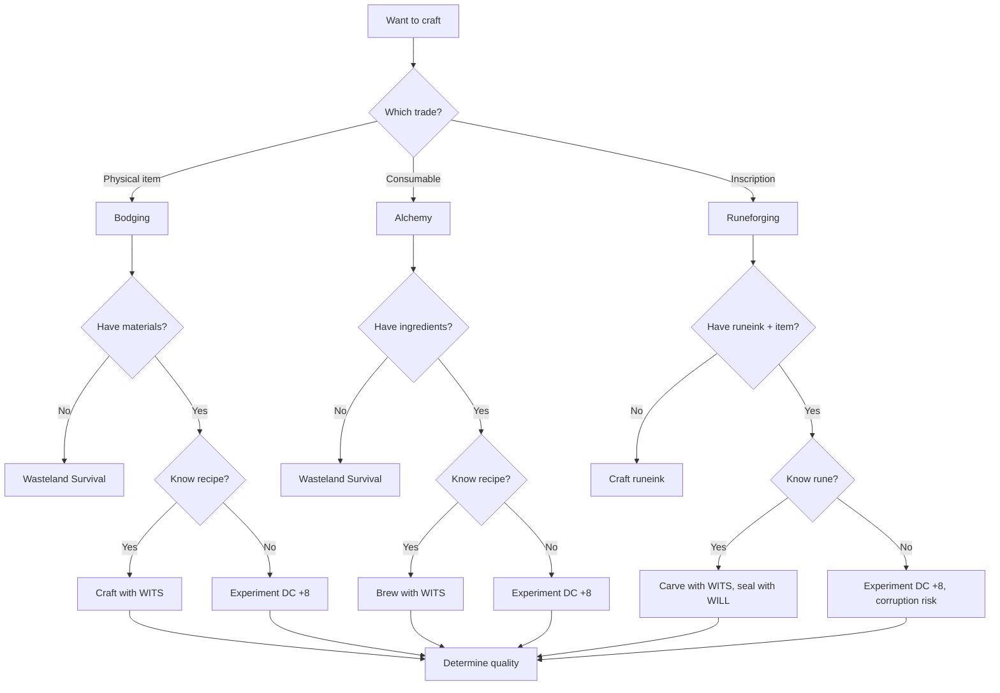
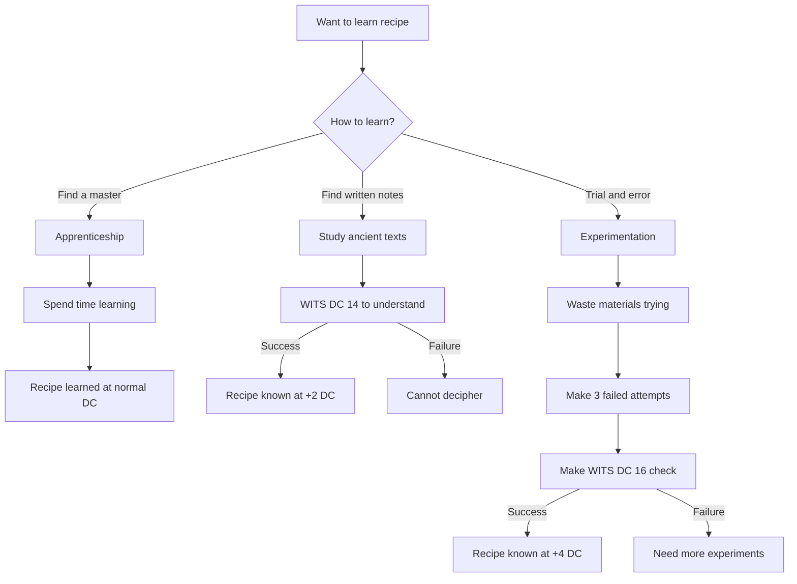

# Crafting System

---

## 1. Core Philosophy

Crafting in Aethelgard is **primitive reclamation** — survivors combining scavenged Old World materials with traditional knowledge passed down through generations. Nobody truly understands the technology they salvage; they simply know that "this thing mixed with that thing makes medicine."

**Design Pillars:**
- **Medieval Methods** — No power tools, no factories, no programming
- **Traditional Knowledge** — Recipes passed down orally, learned by apprenticeship
- **Salvage Economy** — Old World components repurposed for new uses
- **Simple Tools** — Mortar and pestle, hammers, fire pits, leather working

---

## 2. Crafting Trades

| Trade | Governing | Primary Output | Tools | Spec Document |
|-------|-----------|----------------|-------|---------------|
| **[Bodging](bodging.md)** | WITS | Gear repairs, gadgets, traps | Hammer, wire, salvage | Full specification |
| **[Alchemy](alchemy.md)** | WITS | Potions, salves, poisons | Mortar, pestle, fire | Full specification |
| **[Runeforging](runeforging.md)** | WITS + WILL | Equipment inscriptions, wards | Carving knife, runeink | Full specification |
| **[Field Medicine](field-medicine.md)** | WITS | Healing supplies, antidotes | Medical kit, campfire | Full specification |

> [!NOTE]
> Runeforging differs from other trades — it carries **corruption risk** due to channeling incomprehensible ancient forces.

> **What Crafting Isn't:**
> - No complex machinery or factories
> - No programming or technical understanding
> - No mass production
> - No blueprint reading

---

## 3. Universal Crafting Workflow



---

## 4. Quality System

All trades use the same quality tier system:

| Quality | Successes Over DC | Effect |
|---------|-------------------|--------|
| **Shoddy/Weak/Flawed** | Met DC exactly | -25% or -1 effectiveness |
| **Standard** | 1-2 over DC | Normal stats |
| **Quality/Potent** | 3-4 over DC | +25% or +1 effectiveness |
| **Masterwork** | 5+ over DC | +50% or +2, special bonus |

### Masterpieces (5+ over DC)

When exceeding DC by 5+, roll d10 for a special bonus. See individual trade documents for specific masterpiece tables.

### Catastrophic Failures (5+ under DC)

When failing by 5+, roll d10 for catastrophic consequences. See individual trade documents for specific failure tables.

> [!WARNING]
> **Runeforging** catastrophic failures can cause **corruption** and **trauma**, not just physical damage.

---

## 5. Learning Recipes

Characters don't automatically know how to craft things — knowledge must be acquired.

### 5.1 Learning Decision Tree



### 5.2 Learning Modifiers

| Source | DC to Craft After |
|--------|-------------------|
| Taught by master (proper) | Base DC |
| Taught by journeyman | Base DC + 2 |
| Read from ancient text | Base DC + 2 |
| Figured out through experimentation | Base DC + 4 |
| Saw someone do it once | Base DC + 6 |

---

## 6. Specializations

| Specialization | Trade | Key Bonus |
|----------------|-------|-----------|
| **Scrap-Tinker** | Bodging | -2 DC, recover 50% materials on failure |
| **Alka-hestur** | Alchemy | -2 DC, immune to own toxic failures |
| **[Rúnasmiðr](../03-character/specializations/runasmidr.md)** | Runeforging | -2 DC, halve corruption from failures |
| **Bone-Setter** | Bodging/Alchemy | -2 DC to healing items only |
| **Veiðimaðr** | Alchemy | -2 DC to poisons and traps |

---

## 7. Integration Points

| System | Integration |
|--------|-------------|
| **Wasteland Survival** | Foraging for materials/ingredients |
| **Combat** | Consumable usage, crafted weapons |
| **Economy** | Trading crafted goods |
| **Equipment** | Repairs and modifications |
| **System Bypass** | Crafted lockpicks, tools |

---

## 8. Technical Implementation

### 8.1 Data Model

```csharp
public enum CraftingTrade { Bodging, Alchemy, Runeforging, FieldMedicine }
public enum CraftQuality { Shoddy, Standard, Potent, Masterwork, Catastrophic }

public class Recipe
{
    public string Id { get; set; }
    public CraftingTrade Trade { get; set; }
    public int BaseDc { get; set; }
    public List<Ingredient> Inputs { get; set; }
    public Item Output { get; set; }
    public bool IsKnown { get; set; }
}

public class CraftingResult
{
    public CraftQuality Quality { get; set; }
    public Item? CreatedItem { get; set; }
    public List<string> Messages { get; set; }
    public bool ConsumedMaterials { get; set; }
}
```

### 8.2 Service Interface

```csharp
public interface ICraftingService
{
    // === Core Crafting Operations ===
    CraftingResult CraftItem(Character character, string recipeId, List<Ingredient> materials);
    bool KnowsRecipe(Character character, string recipeId);
    void LearnRecipe(Character character, string recipeId, LearningMethod method);
    int CalculateDc(Character character, Recipe recipe);

    // === UI-Focused Methods ===
    /// <summary>Returns breakdown of all modifiers affecting DC for UI display.</summary>
    ModifierBreakdown GetModifierBreakdown(Character character, Recipe recipe);

    /// <summary>Returns ingredient availability and status for recipe.</summary>
    IReadOnlyList<IngredientStatus> GetIngredientStatus(Character character, Recipe recipe);

    /// <summary>Returns final DC after all modifiers (convenience wrapper).</summary>
    int GetFinalDc(Character character, Recipe recipe);

    /// <summary>Calculates success probability for UI preview.</summary>
    double GetSuccessProbability(Character character, Recipe recipe);

    /// <summary>Checks if recipe can be crafted at current location.</summary>
    bool CanCraftAtLocation(string recipeId, LocationType location);

    /// <summary>Returns all recipes for a trade, filtered by known status.</summary>
    IReadOnlyList<RecipeSummary> GetRecipesForTrade(CraftingTrade trade, Character character);

    /// <summary>Checks if character has access to a trade (specialization/training).</summary>
    bool HasTradeAccess(Character character, CraftingTrade trade);
}
```

### 8.3 UI Support Types

```csharp
/// <summary>Breakdown of modifiers for transparent DC calculation display.</summary>
public class ModifierBreakdown
{
    public int BaseDc { get; set; }
    public int ToolModifier { get; set; }        // -2 to +4
    public int KnowledgeModifier { get; set; }   // 0 to +6 (learning method)
    public int MaterialModifier { get; set; }    // -2 to +2 (quality/glitched)
    public int SituationModifier { get; set; }   // -2 to +8 (location, weather)
    public int SpecializationModifier { get; set; } // -2 to 0
    public int FinalDc => BaseDc + ToolModifier + KnowledgeModifier
                        + MaterialModifier + SituationModifier + SpecializationModifier;

    public string ToolDescription { get; set; }       // e.g., "Full toolkit (-2)"
    public string KnowledgeDescription { get; set; }  // e.g., "Taught by master (+0)"
    public string MaterialDescription { get; set; }   // e.g., "Standard materials (+0)"
    public string SituationDescription { get; set; }  // e.g., "Alchemist's Lab (-2)"
    public string SpecDescription { get; set; }       // e.g., "Scrap-Tinker (-2)"
}

/// <summary>Status of a single ingredient for a recipe.</summary>
public class IngredientStatus
{
    public string IngredientId { get; set; }
    public string Name { get; set; }
    public int Required { get; set; }
    public int Available { get; set; }
    public bool IsSatisfied => Available >= Required;
    public bool IsGlitched { get; set; }  // Runeforging: corruption risk
    public string? QualityNote { get; set; }  // e.g., "Aged herbs (+1 potency)"
}

/// <summary>Summary for recipe list display.</summary>
public class RecipeSummary
{
    public string RecipeId { get; set; }
    public string Name { get; set; }
    public CraftingTrade Trade { get; set; }
    public int BaseDc { get; set; }
    public bool IsKnown { get; set; }
    public bool CanCraftNow { get; set; }  // Has materials + correct location
    public string OutputDescription { get; set; }
}
```

---

## 9. Phased Implementation Guide

### Phase 1: Core Logic
- [ ] **Data Model**: Implement `Recipe`, `Ingredient`, `CraftQuality` definitions.
- [ ] **Service**: Implement `CalculateDc` (Stats + Tools + Modifiers).
- [ ] **Checks**: Implement `CraftItem` logic (Roll vs DC -> Quality).

### Phase 2: Recipe Management
- [ ] **Database**: Seed initial recipe list for Bodging/Alchemy.
- [ ] **Learning**: Implement "Recipe Book" state (Known vs Unknown).
- [ ] **Discovery**: Implement "Experimentation" flow (Fail -> Fail -> Insight).

### Phase 3: Trade Specifics
- [ ] **Bodging**: Implement Repair logic.
- [ ] **Alchemy**: Implement Potion effect scaling by Quality.
- [ ] **Runeforging**: Implement Corruption risk logic.

### Phase 4: UI & Feedback
- [ ] **Menu**: Crafting UI selecting recipes and showing ingredients.
- [ ] **Feedback**: "You crafted a [Quality] [Item]!" toast.
- [ ] **Visuals**: Sound/Particle effects for success/fail.

---

## 10. Testing Requirements

### 10.1 Unit Tests
- [ ] **Quality**: Roll = DC -> Standard. Roll = DC+5 -> Masterwork.
- [ ] **Modifiers**: Scrap-Tinker -> -2 DC on Bodging.
- [ ] **Consumption**: Success -> Remove ingredients. Fail -> Remove ingredients (unless spec saves them).
- [ ] **Learning**: 3 Fails + 1 Insight Check -> Unlock Recipe.

### 10.2 Integration Tests
- [ ] **Flow**: Select Recipe -> Click Craft -> Verify Inventory +1 Item.
- [ ] **Fail**: Click Craft -> Force Fail -> Verify Inventory unchanged, Mats lost.

### 10.3 Manual QA
- [ ] **UI**: Verify insufficient ingredients disables "Craft" button.
- [ ] **Tooltips**: Verify Masterwork items show boosted stats.

---

## 11. Logging Requirements

**Reference:** [logging.md](../logging.md)

### 11.1 Log Events

| Event | Level | Message Template | Properties |
|-------|-------|------------------|------------|
| Craft Item | Info | "{Character} crafted {Item} ({Quality})." | `Character`, `Item`, `Quality` |
| Craft Fail | Info | "{Character} failed to craft {Recipe}. {Consequence}" | `Character`, `Recipe`, `Consequence` |
| Recipe Learned | Info | "{Character} learned {Recipe} via {Method}." | `Character`, `Recipe`, `Method` |

---

## 12. Related Specifications

| Document | Purpose |
|----------|---------|
| [Bodging](bodging.md) | Physical crafting, repairs, traps, weapons |
| [Alchemy](alchemy.md) | Potions, salves, poisons, ingredients |
| [Runeforging](runeforging.md) | Equipment inscriptions, wards |
| [Field Medicine](field-medicine.md) | Healing supplies, antidotes |
| [Crafting UI](../../08-ui/crafting-ui.md) | Unified TUI/GUI interface specification |
| [Wasteland Survival](../../01-core/skills/wasteland-survival.md) | Scavenging source |
