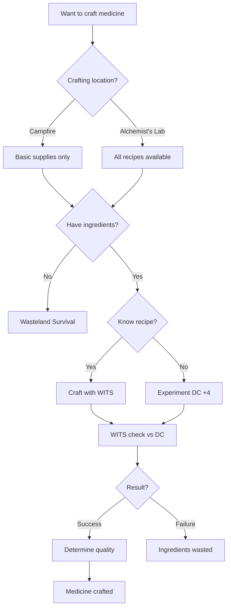
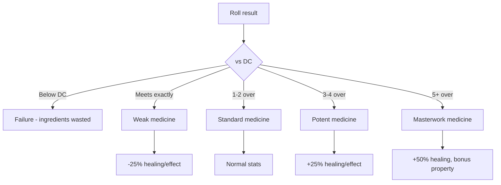

# Field Medicine

**Governing Attribute:** WITS

---

## 1. What Is Field Medicine?

**Field Medicine** is the craft of preparing medical supplies, healing poultices, and restorative draughts using salvaged materials and traditional herbalism. Unlike alchemy (which produces potions for buffs and poisons), Field Medicine focuses purely on **restoration** — healing wounds, cleansing afflictions, and stabilizing the injured.

**Core Principle:** Medical knowledge passed down through generations. The Bone-Setter doesn't understand *why* certain plants heal — they know that this herb on this wound produces healing, because their master taught them so.

**Common Outputs:**
- Healing poultices (HP restoration)
- Antidotes (cleanse [Poisoned])
- Stabilizing draughts (stress reduction)
- Bandages (cleanse [Bleeding])
- Miracle tinctures (emergency revival)

> [!NOTE]
> Field Medicine is the **primary craft** for the **Bone-Setter** specialization. While anyone can attempt basic first aid, only trained Bone-Setters can craft advanced medical supplies.

---

## 2. Field Medicine Procedure

### 2.1 Core Workflow



### 2.2 Step-by-Step Procedure

| Step | Action | Check | Time |
|------|--------|-------|------|
| 1. Gather | Collect ingredients | Wasteland Survival | Varies |
| 2. Prepare | Set up workspace | None | 10 min |
| 3. Process | Grind/boil/mix | None | Variable |
| 4. Craft | Main crafting check | WITS vs DC | Variable |
| 5. Store | Package for use | None | 5 min |

---

## 3. DC Table

### 3.1 Recipe Complexity

| Recipe Tier | Base DC | Crafting Time | Example |
|-------------|---------|---------------|---------|
| Basic | 10 | 30 min | Standard Bandage |
| Standard | 12 | 1 hour | Healing Poultice |
| Advanced | 16 | 2 hours | Common Antidote |
| Expert | 20 | 4 hours | Stabilizing Draught |
| Legendary | 24 | 8 hours | Miracle Tincture |

### 3.2 Location Modifiers

| Location | Modifier | Recipes Available |
|----------|----------|-------------------|
| Alchemist's Lab | -2 DC | All |
| Campfire | +0 | Basic, Standard only |
| Field (no fire) | +4 DC | Basic only |
| Combat | +8 DC | Emergency only |

---

## 4. Recipes

### 4.1 Healing Recipes

| Recipe | DC | Ingredients | Time | Effect |
|--------|-----|-------------|------|--------|
| Standard Bandage | 10 | Clean cloth × 2 | 15 min | Stops bleeding (mundane) |
| Soot-Stained Bandage | 12 | Cloth × 2, Ash × 1 | 30 min | Removes up to 3 [Bleeding] |
| Healing Poultice | 12 | Herbs × 2, Water × 1 | 1 hr | Heals 2d6 + WITS HP |
| Strong Poultice | 16 | Herbs × 3, Water × 1, Fat × 1 | 2 hrs | Heals 4d6 + WITS HP |
| Emergency Suture Kit | 14 | Thread × 2, Needle × 1, Alcohol × 1 | 1 hr | Heals 3d6, stops all bleeding |

### 4.2 Cleansing Recipes

| Recipe | DC | Ingredients | Time | Effect |
|--------|-----|-------------|------|--------|
| Common Antidote | 16 | Charcoal × 2, Herbs × 2, Water × 1 | 2 hrs | Removes [Poisoned] |
| Stabilizing Draught | 20 | Rare herbs × 2, Alcohol × 1, Honey × 1 | 4 hrs | Removes [Feared]/[Disoriented], -Stress |
| Neutralizing Agent | 18 | Charcoal × 2, Ash × 2, Water × 2 | 2 hrs | Removes [Corroded] |
| Smelling Salts | 14 | Mineral salts × 2, Alcohol × 1 | 1 hr | Wake unconscious, remove [Stunned] (legendary) |

### 4.3 Legendary Recipes

| Recipe | DC | Ingredients | Time | Effect |
|--------|-----|-------------|------|--------|
| Miracle Tincture | 24 | Rare herbs × 4, Mineral extract × 2, Blessed water × 1 | 8 hrs | Massive heal + remove all physical effects |
| Trauma Purge | 22 | Stabilizing draught × 2, Rare herbs × 2 | 6 hrs | Remove 5 Stress |
| Life's Last Chance | 26 | All rare × 5 | 12 hrs | Revive from 0 HP |

---

## 5. Materials

### 5.1 Common Ingredients

| Ingredient | Source | Rarity |
|------------|--------|--------|
| Clean Cloth | Salvage, trade | Common |
| Herbs | Foraging | Common |
| Water | Wells, streams | Common |
| Charcoal | Fires | Common |
| Ash | Fires | Common |
| Fat/Tallow | Hunting | Common |
| Alcohol | Brewing, trade | Uncommon |

### 5.2 Rare Ingredients

| Ingredient | Source | Rarity |
|------------|--------|--------|
| Rare Herbs | Deep wilderness | Rare |
| Mineral Salts | Caves, ruins | Uncommon |
| Blessed Water | Sacred sites | Rare |
| Mineral Extract | Mining, ruins | Rare |
| Honey | Foraging (dangerous) | Uncommon |

---

## 6. Modifiers

### 6.1 Tool Modifiers

| Tools | Modifier |
|-------|----------|
| Full medical kit | -2 DC |
| Basic supplies | +0 |
| Improvised | +4 DC |

### 6.2 Specialization Modifiers

| Specialization | Modifier |
|----------------|----------|
| Bone-Setter | -2 DC, +1d10 |
| Field Medic I (ability) | +1d10 |
| Alka-hestur | +0 (different focus) |

---

## 7. Quality Levels

### 7.1 Medicine Quality Tiers

| Quality | Successes Over DC | Effect |
|---------|-------------------|--------|
| **Weak** | Met DC exactly | -25% effectiveness |
| **Standard** | 1-2 over DC | Normal effect |
| **Potent** | 3-4 over DC | +25% effectiveness |
| **Masterwork** | 5+ over DC | +50% effectiveness |

### 7.2 Quality Decision Tree



---

## 8. Masterpieces

When exceeding DC by 5+, roll for a **masterpiece bonus**:

### 8.1 Masterpiece Table (d10)

| d10 | Bonus | Description |
|-----|-------|-------------|
| 1-2 | **Fast-Acting** | Effect instant, no delay |
| 3-4 | **Long-Lasting** | Duration doubled |
| 5-6 | **Concentrated** | Half dose works fully |
| 7-8 | **Painless** | No side effects |
| 9 | **Signature** | Recognizable, +reputation |
| 10 | **Miraculous** | Roll twice, keep both |

---

## 9. Catastrophic Failures

When failing by 5+ under DC, roll on the **Catastrophe Table**:

### 9.1 Catastrophic Failure Table (d10)

| d10 | Failure | Consequence |
|-----|---------|-------------|
| 1-2 | **Contaminated** | Medicine applies [Poisoned] instead |
| 3-4 | **Spoiled** | Ingredients ruined, smell attracts creatures |
| 5-6 | **Explosion** | Volatile mix, 1d6 damage to crafter |
| 7-8 | **Allergen** | User has allergic reaction |
| 9 | **Reversed** | Medicine has opposite effect |
| 10 | **Cursed Batch** | All medicine from this batch is poisoned |

---

## 10. Example: Crafting a Healing Poultice

> **Scenario:** Sigrid (Bone-Setter) crafts Healing Poultices at camp.
>
> **Setup:**
> - WITS: 6
> - Bone-Setter: +1d10, -2 DC
> - Field Medic I: +1d10
> - Campfire location: +0
> - Full medical kit: -2 DC
>
> **Check:**
> - Base DC: 12
> - Modifiers: -2 (specialization) -2 (kit) = DC 8
> - Pool: 6 + 1 + 1 = 8d10
> - Roll: [8, 7, 9, 4, 7, 8, 3, 9] = 6 successes ✓
>
> **Result:** Exceeds DC 8 by 6 → **Masterwork quality!**
> - Heals 2d6 + 6 (WITS) + 50% = ~15 HP per poultice
>
> **Masterpiece Roll:** d10 → 3 (Long-Lasting)
> - Healing continues for extra round

---

## 11. Technical Implementation

### 11.1 Data Model
(See `SPEC-CRAFTING` Core Data Model)

```csharp
public enum MedicineType { Healing, Cleansing, Stabilizing, Revive }
public enum LocationModifier { Lab = -2, Campfire = 0, Field = 4, Combat = 8 }

public class MedicineContext
{
    public MedicineType Type { get; set; }
    public LocationModifier Location { get; set; }
    public bool HasKit { get; set; }
}
```

### 11.2 Service Interface

```csharp
public interface IFieldMedicineService
{
    // Extends ICraftingService
    int CalculateHealingRefill(Character character); // For Bone-Setter refill
    bool CanCraftAtLocation(Recipe recipe, LocationModifier location);
    void ApplyMedicineEffect(Character target, Item medicine, CraftQuality quality);
}
```

---

## 12. Phased Implementation Guide

### Phase 1: Core Systems
- [ ] **Data Model**: Extend `Recipe` with `MedicineType` metadata.
- [ ] **Service**: Implement `CanCraftAtLocation` validation logic.
- [ ] **Base Recipes**: Implement Basic/Standard Healing Poultice.

### Phase 2: Effects & Status
- [ ] **Healing**: Implement `ApplyMedicineEffect` (Restore HP).
- [ ] **Status**: Implement Cleansing logic (Remove Specific Status).
- [ ] **Stabilize**: Implement Stress reduction logic.

### Phase 3: Specializations
- [ ] **Bone-Setter**: Implement `CalculateHealingRefill` (Free 3/run).
- [ ] **Modifiers**: Implement -2 DC for Bone-Setters.
- [ ] **Legendary**: Implement `Miracle Tincture` logic (Revive).

### Phase 4: UI & Feedback
- [ ] **Campfire**: UI for crafting at rest sites.
- [ ] **Combat**: "Emergency Craft" action button (High DC).
- [ ] **Visuals**: Green healing particle effects.

---

## 13. Testing Requirements

### 13.1 Unit Tests
- [ ] **Location**: Field (+4 DC) vs Lab (-2 DC).
- [ ] **Bone-Setter**: Refill = 3 Poultices per run.
- [ ] **Healing**: Standard = 2d6. Masterwork = 2d6 + 50%.
- [ ] **Cleansing**: Antidote removes [Poisoned] but not [Bleeding].

### 13.2 Integration Tests
- [ ] **Craft**: Craft Antidote -> Use on Poisoned Ally -> Status Cleared.
- [ ] **Fail**: Fail Craft check -> Ingredients removed, no item.
- [ ] **Combat**: Attempt craft in combat -> Verify +8 DC applied.

### 13.3 Manual QA
- [ ] **UI**: Verify Recipe list filters by available location (e.g. at Campfire).
- [ ] **Tooltip**: Medicine tooltip updates with Quality bonuses.

---

## 14. Logging Requirements

**Reference:** [logging.md](../logging.md)

### 14.1 Log Events

| Event | Level | Message Template | Properties |
|-------|-------|------------------|------------|
| Medicine Craft | Info | "{Character} crafted {Medicine} ({Quality}) [Loc: {Loc}]." | `Character`, `Medicine`, `Quality`, `Loc` |
| Medicine Use | Info | "{Character} used {Medicine} on {Target}. Effect: {Effect}" | `Character`, `Medicine`, `Target`, `Effect` |
| Catastrophe | Warning | "Medicine Catastrophe! {Consequence}" | `Consequence` |

---

## 15. Related Specifications

| Document | Purpose |
|----------|---------|
| [Crafting Overview](overview.md) | Trade comparison |
| [Crafting UI](../../08-ui/crafting-ui.md) | Unified TUI/GUI interface |
| [Alchemy](alchemy.md) | Companion craft (buffs/poisons) |
| [Bone-Setter](../../03-character/specializations/bone-setter/bone-setter-overview.md) | Primary specialization |
| [Status Effects](../status-effects/status-effects-overview.md) | Effects cleansed |
