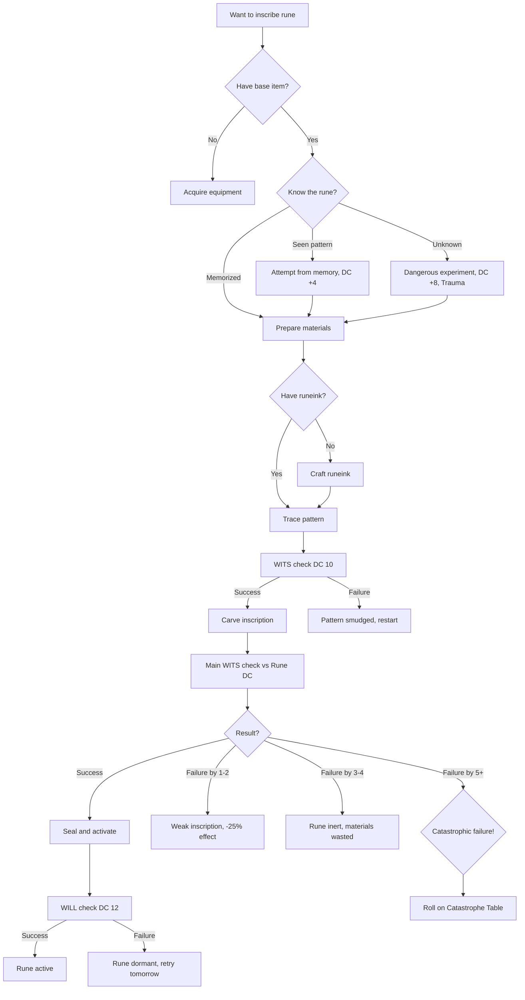
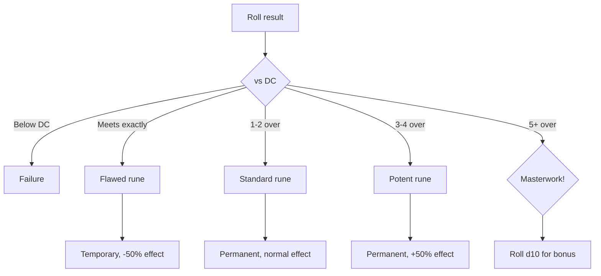
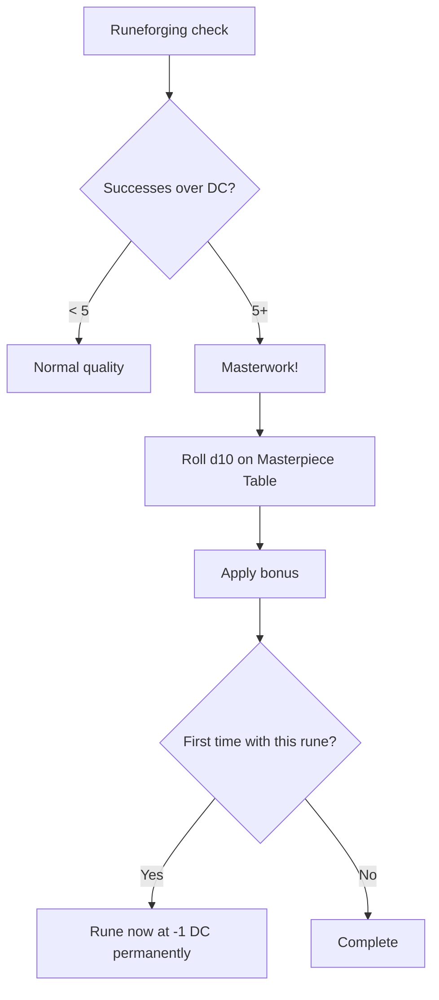
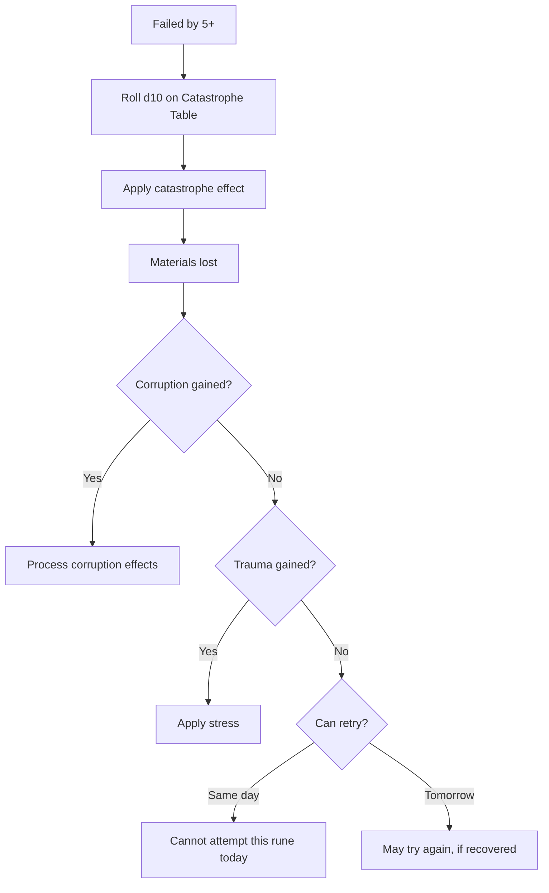
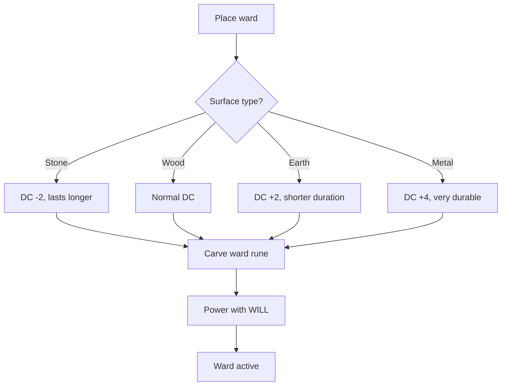

# Runeforging

**Governing Attribute:** WITS (precision) + WILL (activation)

---

## 1. What Is Runeforging?

**Runeforging** is the ancient craft of carving Elder Futhark runes into equipment to imbue it with power. Rúnasmiðr do not understand *why* the symbols produce effects — they simply know that ᚦ carved in the correct sequence with the correct ink creates lightning, because their masters taught them so.

**Core Principle:** Runes are patterns inherited from the Old World. The patterns work. Why they work is forgotten.

**Common Outputs:**
- Weapon inscriptions (damage bonuses, effects)
- Armor inscriptions (protection, resistances)
- Ward runes (protective barriers)
- Binding runes (restraints, traps)

> [!WARNING]
> **Rune Danger:** Unlike bodging or alchemy, runeforging channels incomprehensible ancient forces. Catastrophic failures can cause **corruption** and **trauma**, not just physical damage.

---

## 2. Runeforging Procedure

### 2.1 Core Workflow



### 2.2 Step-by-Step Procedure

| Step | Action | Check | Time |
|------|--------|-------|------|
| 1. Prepare | Clean item surface, set up workspace | None | 10 min |
| 2. Mix Ink | Combine runeink ingredients | WITS DC 8 | 30 min |
| 3. Trace Pattern | Draw rune outline in ink | WITS DC 10 | 15 min |
| 4. Carve | Cut rune into surface | Main check | 1-4 hrs |
| 5. Seal | Close the pattern | None | 10 min |
| 6. Activate | Channel will into rune | WILL DC 12 | 5 min |
| 7. Test | Verify rune functions | None | 5 min |

---

## 3. DC Table

### 3.1 Rune Complexity

| Rune Tier | Base DC | Carving Time | Example |
|-----------|---------|--------------|---------|
| Simple | 10 | 1 hour | Fehu (wealth), Uruz (strength) |
| Standard | 14 | 2 hours | Thurisaz (lightning), Kenaz (fire) |
| Complex | 18 | 4 hours | Tiwaz (victory), Ansuz (mind) |
| Elder | 22 | 8 hours | Combination runes |
| Forbidden | 26 | 12+ hours | All-Rune fragments |

### 3.2 Item Type Modifiers

| Base Item | Modifier | Notes |
|-----------|----------|-------|
| Bone/wood | -2 DC | Softer, easier to carve |
| Leather | +0 | Standard |
| Iron/steel | +2 DC | Harder material |
| Dvergr alloy | +4 DC | Requires special tools |
| Jötun metal | +6 DC | Near-impossible, legendary |

---

## 4. The Rune Library

### 4.1 Elder Futhark Runes

| Symbol | Name | Translation | Effect | DC |
|--------|------|-------------|--------|-----|
| ᚠ | **Fehu** | Wealth | +25% selling value | 10 |
| ᚢ | **Uruz** | Strength | +1 weapon damage | 12 |
| ᚦ | **Thurisaz** | Thor/Giant | +1d6 lightning damage | 14 |
| ᚨ | **Ansuz** | God/Breath | +1d10 to WILL saves | 14 |
| ᚱ | **Raido** | Journey | +1 movement speed | 12 |
| ᚲ | **Kenaz** | Torch | +1d6 fire damage | 14 |
| ᚷ | **Gebo** | Gift | +1d10 to Rhetoric | 12 |
| ᚹ | **Wunjo** | Joy | +1d10 to resist fear | 12 |
| ᚺ | **Hagalaz** | Hail | +1d6 cold damage | 14 |
| ᚾ | **Nauthiz** | Need | Reduce item weight 25% | 10 |
| ᛁ | **Isa** | Ice | Cold resistance +2 | 12 |
| ᛃ | **Jera** | Year/Harvest | +healing received 25% | 14 |
| ᛈ | **Perthro** | Fate | Re-roll 1 die per day | 18 |
| ᛇ | **Eihwaz** | Yew | +1 armor | 14 |
| ᛉ | **Algiz** | Protection | +2 to all saves | 16 |
| ᛊ | **Sowilo** | Sun | +1d6 radiant damage | 16 |
| ᛏ | **Tiwaz** | Victory | +2 to hit | 16 |
| ᛒ | **Berkano** | Growth | +1 HP regeneration/hour | 14 |
| ᛖ | **Ehwaz** | Horse | Mount speed +25% | 12 |
| ᛗ | **Mannaz** | Man | +1d10 to social checks | 14 |
| ᛚ | **Laguz** | Water | Water breathing 1 hr/day | 16 |
| ᛜ | **Ingwaz** | Ing | Fertility/luck, reroll 1s | 18 |
| ᛞ | **Dagaz** | Day | Darkvision 30 ft | 14 |
| ᛟ | **Othala** | Heritage | +1 to all attributes for 1 min | 22 |

### 4.2 Combination Runes

Experienced Rúnasmiðr can combine runes for greater effects:

| Combination | Runes | Effect | DC |
|-------------|-------|--------|-----|
| **Warrior's Blessing** | ᚢ + ᛏ | +2 damage, +2 hit | 20 |
| **Storm-Caller** | ᚦ + ᚺ | +2d6 lightning + cold | 22 |
| **Ironhide** | ᛇ + ᛉ | +2 armor, +2 saves | 22 |
| **Worldwalker** | ᚱ + ᛖ | +3 movement | 18 |
| **Mind-Ward** | ᚨ + ᛉ | Immunity to fear, +3 WILL saves | 24 |

---

## 5. Materials

### 5.1 Runeink Ingredients

| Ink Type | Ingredients | Effect Compatibility |
|----------|-------------|---------------------|
| **Blood Ink** | Blood × 3, ash × 1 | Damage runes |
| **Ash Ink** | Ash × 3, water × 1 | Protection runes |
| **Blight Ink** | Blight residue × 2, water × 1 | Forbidden runes (dangerous) |
| **Iron Ink** | Iron shavings × 2, blood × 1 | Weapon runes |
| **Herb Ink** | Crushed herbs × 3, fat × 1 | Healing/growth runes |

### 5.2 Tools Required

| Tool | Purpose | Quality Effect |
|------|---------|----------------|
| Carving knife | Cutting runes | -2 DC if quality |
| Stylus | Tracing patterns | -1 DC if quality |
| Burnisher | Smoothing cuts | Reduces time 25% |
| Ritual cloth | Clean surface | Prevents contamination |

### 5.3 Runeink Crafting

Creating runeink is an alchemy-adjacent process:

| Ink Type | DC | Time | Shelf Life |
|----------|-----|------|------------|
| Blood Ink | 10 | 30 min | 1 week |
| Ash Ink | 10 | 30 min | 2 weeks |
| Iron Ink | 12 | 1 hr | 2 weeks |
| Herb Ink | 12 | 1 hr | 1 week |
| Blight Ink | 18 | 2 hrs | 3 days |

---

## 6. Modifiers

### 6.1 Tool Modifiers

| Tools Available | Modifier |
|-----------------|----------|
| Rúnasmiðr workshop | -4 DC |
| Full toolset (knife, stylus, burnisher) | -2 DC |
| Basic tools (knife only) | +0 |
| Improvised tools | +4 DC |

### 6.2 Knowledge Modifiers

| Knowledge Source | Modifier |
|------------------|----------|
| Taught by master Rúnasmiðr | -2 DC |
| Learned from runestone study | +0 |
| Working from copied pattern | +2 DC |
| Seen rune once | +4 DC |
| Experimenting blindly | +8 DC, Trauma risk |

### 6.3 Material Modifiers

| Material Quality | Modifier |
|------------------|----------|
| Fresh runeink (today) | -2 DC |
| Standard runeink | +0 |
| Old runeink (>1 week) | +2 DC |
| Contaminated ink | +4 DC, Corruption risk |

---

## 7. Quality Levels

### 7.1 Inscription Quality Tiers

| Quality | Successes Over DC | Effect |
|---------|-------------------|--------|
| **Flawed** | Met DC exactly | -50% effect, fades in 1 week |
| **Standard** | 1-2 over DC | Normal effect, permanent |
| **Potent** | 3-4 over DC | +50% effect |
| **Masterwork** | 5+ over DC | +100% effect, special property |

### 7.2 Quality Decision Tree



---

## 8. Masterpieces

When exceeding DC by 5+, roll for a **masterpiece bonus**:

### 8.1 Masterpiece Table (d10)

| d10 | Bonus | Description |
|-----|-------|-------------|
| 1-2 | **Resonant** | Rune glows faintly, +1d10 to related skill |
| 3-4 | **Efficient** | Effect costs no resources to maintain |
| 5-6 | **Bonded** | Cannot be removed/dispelled by enemies |
| 7-8 | **Awakened** | Can activate/deactivate at will |
| 9 | **Signature** | Recognizable as your work, +reputation |
| 10 | **Elder-Touched** | Roll twice, keep both; slight corruption risk |

### 8.2 Masterpiece Workflow



---

## 9. Catastrophic Failures

When failing by 5+ successes below DC, roll on the **Catastrophe Table**.

> [!CAUTION]
> Unlike bodging/alchemy, runic catastrophes can cause **corruption** and **trauma** — you are channeling forces you do not understand.

### 9.1 Catastrophic Failure Table (d10)

| d10 | Failure | Consequence |
|-----|---------|-------------|
| 1 | **Rune Backlash** | Take 3d10 psychic damage |
| 2 | **Corruption Surge** | Gain +2 Corruption |
| 3 | **Inverted Rune** | Rune has opposite effect (permanently) |
| 4 | **Tool Shatter** | Carving tools destroyed |
| 5 | **Soul Echo** | Whispers for 24 hrs, -1d10 to concentration |
| 6 | **Item Destruction** | Base item ruined beyond repair |
| 7 | **Minor Blight** | Workspace becomes [Blighted] temporarily |
| 8 | **Trauma** | Gain 1 Stress, -1d10 to runeforging for 1 week |
| 9 | **Corruption Leak** | All within 10 ft gain +1 Corruption |
| 10 | **All-Rune Glimpse** | See fragment of All-Rune: +3 Corruption, +5 Trauma, but learn ONE Elder rune instantly |

### 9.2 Catastrophic Failure Workflow



---

## 10. Example: Inscribing Thurisaz

> **Scenario:** Bjorn wants to inscribe ᚦ (Thurisaz) onto his axe for +1d6 lightning damage.
>
> **Setup:**
> - WITS: 6
> - Rúnasmiðr specialization: -2 DC
> - Full toolset: -2 DC
> - Taught by master: -2 DC
> - Materials: Iron ink (fresh), quality axe
>
> ---
>
> **Step 1 - Prepare Workspace:**
> - Cleans axe head, sets up at forge
> - Time: 10 minutes
>
> **Step 2 - Mix Ink:**
> - Already has fresh iron ink ✓
>
> **Step 3 - Trace Pattern:**
> - Check: WITS DC 10
> - Roll: 6d10 → [8, 3, 9, 7, 2, 8] = 4 successes ✓
> - Pattern traced clearly
>
> **Step 4 - Carve Inscription:**
> - Base DC: 14 (Thurisaz is standard)
> - Specialization: -2
> - Tools: -2
> - Knowledge: -2
> - **Final DC: 8**
> - Roll: 6d10 → [7, 9, 8, 4, 7, 9] = 5 successes ✓
> - Exceeds DC by 4 → **Potent quality!**
>
> **Step 5 - Seal and Activate:**
> - Check: WILL DC 12
> - WILL: 5
> - Roll: 5d10 → [8, 7, 3, 9, 6] = 3 successes ✓
> - Rune seals successfully
>
> **Result:**
> - Thurisaz inscribed: +1d6 lightning damage (Potent: **+1d8** instead)
> - Time spent: ~2.5 hours
> - Effect: Permanent

---

## 11. Ward Runes

Special runes that protect locations rather than equipment:

### 11.1 Ward Types

| Ward | Effect | Duration | DC |
|------|--------|----------|-----|
| **Alarm Ward** | Psychic alert when crossed | 24 hours | 12 |
| **Protection Ward** | +2 saves within 10 ft | 8 hours | 16 |
| **Barrier Ward** | Blocks passage (breakable) | 4 hours | 18 |
| **Concealment Ward** | Hides area from detection | 12 hours | 18 |
| **Binding Ward** | Traps crossing creature | 1 trigger | 20 |

### 11.2 Ward Placement

Wards are carved into surfaces (floor, wall, doorway) rather than equipment:



---

## 12. Technical Implementation

### 12.1 Data Model
(See `SPEC-CRAFTING` Core Data Model)

```csharp
public enum RuneTier { Simple, Standard, Complex, Elder, Forbidden }
public enum WardType { Alarm, Protection, Barrier, Concealment, Binding }

public class RuneContext
{
    public RuneTier Tier { get; set; }
    public bool HasRúnasmiðr { get; set; }
    public Item BaseItem { get; set; }
    public bool Experimenting { get; set; }
}

public class Ward
{
    public WardType Type { get; set; }
    public RuneTier Tier { get; set; }
    public DateTime ExpiresAt { get; set; }
    public Action EffectDelegate { get; set; }
}
```

### 12.2 Service Interface

```csharp
public interface IRuneforgingService
{
    // Extends ICraftingService
    CraftingResult InscribeRune(Character character, Item item, Rune rune);
    void PlaceWard(Character character, WardType type, Room location);
    void ActivateRune(Character character, Item inscribedItem); // The WILL check
    void TriggerCatastrophe(Character character, int severity);
}
```

---

## 13. Phased Implementation Guide

### Phase 1: Core Logic
- [ ] **Data Model**: Extend `Item` with `Inscriptions` list.
- [ ] **Service**: Implement `InscribeRune` basic flow (Trace -> Carve -> Seal).
- [ ] **Runes**: Implement data definitions for The 24 Elder Futhark.

### Phase 2: Mechanics
- [ ] **Effects**: Implement passive item bonuses (e.g. `Uruz` = +1 Dmg).
- [ ] **Corruption**: Hook into `CorruptionService` for failure penalties.
- [ ] **Wards**: Implement `PlaceWard` and Room Trigger logic.

### Phase 3: Specialization
- [ ] **Rúnasmiðr**: Implement -2 DC and Half Corruption logic.
- [ ] **Masterpiece**: Implement Masterpiece Table (d10).
- [ ] **Forbidden**: Implement "All-Rune Glimpse" mechanics.

### Phase 4: UI & Feedback
- [ ] **Visuals**: Glowing rune overlay on item sprites.
- [ ] **Carving**: TUI minigame for "Traveling the lines"? (Optional).
- [ ] **Feedback**: Purple/Black smoke on corruption events.

---

## 14. Testing Requirements

### 14.1 Unit Tests
- [ ] **DC**: Standard Rune (14) - Spec (2) = 12.
- [ ] **Corruption**: Catastrophic Fail -> Corruption counter increases.
- [ ] **Ward**: Place Barrier -> Duration 4 hours.
- [ ] **Stacking**: Prevent multiple runes on same item slot (unless Master).

### 14.2 Integration Tests
- [ ] **Combat**: Attack with `Uruz` Axe -> Verify +1 Damage in logs.
- [ ] **WardTrigger**: Enemy enters Warded Room -> Alarm triggers.
- [ ] **Trauma**: Fail Forbidden Rune -> Character gains Stress/Trauma instantly.

### 14.3 Manual QA
- [ ] **UI**: Verify Rune tooltip shows "Active" or "Dormant".
- [ ] **Visual**: Inscribe `Kenaz` -> Item should emit light/particles.

---

## 15. Logging Requirements

**Reference:** [logging.md](../logging.md)

### 15.1 Log Events

| Event | Level | Message Template | Properties |
|-------|-------|------------------|------------|
| Rune Inscribe | Info | "{Character} inscribed {Rune} on {Item} ({Quality})." | `Character`, `Rune`, `Item`, `Quality` |
| Ward Placed | Info | "{Character} placed {Ward} in {Room} (Expires: {Time})." | `Character`, `Ward`, `Room`, `Time` |
| Rune Catastrophe | Error | "RUNE SURGE! {Character} suffered {Effect}. Corruption: {Corr}" | `Character`, `Effect`, `Corr` |

---

## 16. Related Specifications

| Document | Purpose |
|----------|---------|
| [Crafting Overview](overview.md) | Trade comparison |
| [Crafting UI](../../08-ui/crafting-ui.md) | Unified TUI/GUI interface |
| [Bodging](bodging.md) | Physical crafting |
| [Alchemy](alchemy.md) | Chemical crafting |
| [Rúnasmiðr Specialization](../../03-character/specializations/runasmidr.md) | Primary Spec |
| [Corruption System](../../01-core/corruption.md) | Consequences |
