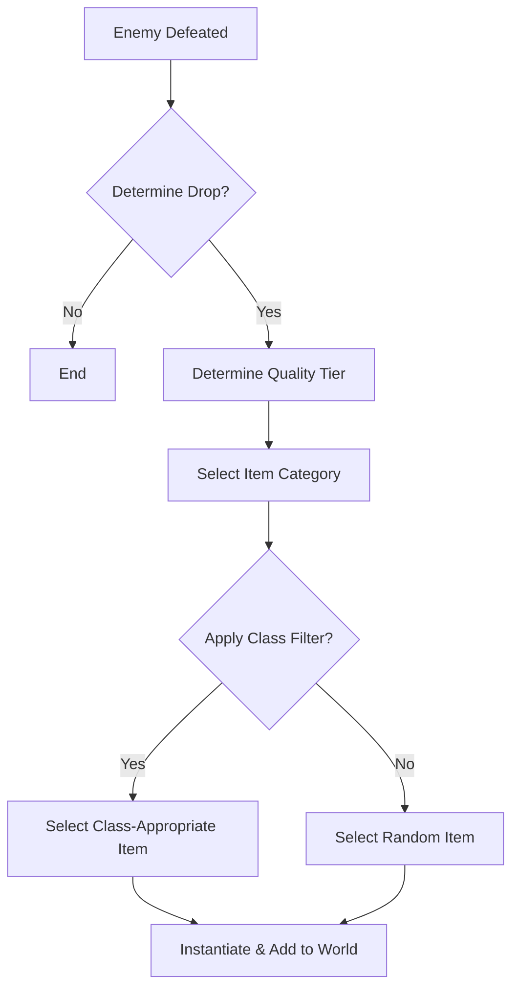

# Loot & Equipment System — Power from the Ruins

> *"The Dvergr forged wonders in the deep. Now, they are rust and memory. Claim their legacy, or become part of the wreckage."*

---

## 1. Overview

### 1.1 Identity Table

| Property | Value |
|----------|-------|
| Spec ID | `SPEC-ECONOMY-LOOT` |
| Category | Economy System |
| Priority | Must-Have |
| Status | Planned |
| Dependencies | Combat Resolution, Character Progression |

### 1.2 Core Philosophy

The Loot & Equipment System provides the primary power progression mechanism beyond character attributes. It uses a five-tier quality system (Jury-Rigged → Myth-Forged) where drops scale character effectiveness throughout a run.

**Design Pillars:**
1.  **Progressive Power Fantasy**: Each tier represents a significant, tangible upgrade (~50-80% power increase) that changes combat effectiveness.
2.  **Class Identity**: Weapons align with archetypes (Warrior=MIGHT, Skirmisher=FINESSE), ensuring loot reinforces playstyles.
3.  **Meaningful Choices**: Trade-offs in armor (mobility vs. protection) and weapon types (reach vs. speed) force decisions.
4.  **Excitement Through Rarity**: Tier rarity creates anticipation; Myth-Forged items are memorable, run-defining moments.

---

## 2. Player Experience

### 2.1 How Players Interact

-   **Discovery**: Enemies and containers drop loot with visual cues (e.g., gold beams for Myth-Forged).
-   **Evaluation**: Players compare drops against current gear using clear stat differences (Damage, HP, Attribute Bonuses).
-   **Progression**: Early game is about replacing "Jury-Rigged" trash; late game is hunting specific "Myth-Forged" unique effects.

### 2.2 Key Features

-   **Five Quality Tiers**: 0. Jury-Rigged, 1. Scavenged, 2. Clan-Forged, 3. Optimized, 4. Myth-Forged.
-   **Class-Appropriate Drops**: "Smart loot" system biases drops toward the player's class (60% chance) to reduce frustration.
-   **Attribute Breakpoints**: High-tier equipment grants bonuses that exceed natural attribute caps (e.g., MIGHT 6 + 3 = 9).
-   **Dual-Mode Compatibility**: Items have descriptions suitable for both GUI (tooltips) and TUI (ASCII art/text details).

### 2.3 Edge Cases

| Case | Behavior |
|------|----------|
| **No Loot Drop** | RNG roll falls within "null" range (e.g., 10% for trash mobs). |
| **Wrong Class Drop** | 40% chance remains for off-class items to encourage experimentation or companion gearing. |
| **Inventory Full** | Drop remains on the ground until picked up or level exit. |
| **Duplicate Unique** | Myth-Forged items have a "Unique" flag prevents duplicate drops in one run. |

---

## 3. Mechanics

### 3.1 Loot Generation Flow



### 3.2 Equipment Slots & Categories

| Slot | Categories | Attribute Scaling |
|------|------------|-------------------|
| **Weapon** | Axe, Greatsword, Blunt, HeavyBlunt | MIGHT |
| | Spear, Dagger, Blade, Rifle | FINESSE |
| | Staff, Focus | WILL |
| | EnergyMelee, Arc-Cannon | WITS |
| **Armor** | Light | FINESSE (Bonus) |
| | Medium | Balanced |
| | Heavy | STURDINESS (Bonus) |
| **Accessory** | Ring, Amulet, Tool | Varies |

### 3.3 Formulas

**Drop Quality Calculation**
```
Roll = Random(0-99)
Tier = Lookup(EnemyType, Roll)
```

**Variables:**
-   `EnemyType`: Servitor (Trash), Drone (Standard), Warden (Boss).
-   `Roll`: 0-99 integer.

---

## 4. Calculations

### 4.1 Drop Tables (Probability Matrix)

| Enemy Type | Tier 0 | Tier 1 | Tier 2 | Tier 3 | Tier 4 | None |
|------------|--------|--------|--------|--------|--------|------|
| **Servitor** | 60% | 30% | 0% | 0% | 0% | 10% |
| **Drone** | 0% | 40% | 40% | 20% | 0% | 0% |
| **Boss** | 0% | 0% | 0% | 30% | 70% | 0% |

### 4.2 Class-Appropriate Filtering

```
Input: Player Class, Quality Tier
Check: Random(0-99) < 60 (60% Chance)
If Check Pass: Filter database for Class == PlayerClass AND Tier == Quality
If Check Fail OR No Items Found: Select from all items of Tier == Quality
```

### 4.3 Stat Scaling by Tier

| Tier | Weapon Dmg | Accuracy | Armor HP | Def Bonus | Attr Bonus |
|------|------------|----------|----------|-----------|------------|
| 0 | 1d6 | -1 | +5 | +1 | None |
| 1 | 1d6+1 | 0 | +10 | +1 | None |
| 2 | 1d6+3 | 0 | +15 | +2 | +1 |
| 3 | 2d6 | +1 | +20 | +2 | +1 to +2 |
| 4 | 2d6+4 | +2 | +30 | +3 | +2 to +4 |

**Example Calculation (Warrior Damage):**
```
Base MIGHT: 6 (Cap)
Weapon: Dvergr Maul (Tier 4) -> +2 MIGHT, 2d6+4 Damage
Total MIGHT: 8 (8 dice pool)
Avg Roll Successes: ~2.6
Weapon Avg Dmg: 11
Expected Dmg Output: High
```

---

## 5. Integration Points

### 5.1 Dependencies

| System | Dependency Type |
|--------|-----------------|
| `SPEC-COMBAT-RESOLUTION` | Triggers loot generation on enemy death. |
| `SPEC-COMBAT-OUTCOMES` | Uses weapon stats for damage calculation. |
| `SPEC-COMBAT-DEFENSE` | Uses armor stats/penalties for mitigation. |
| `SPEC-PROGRESSION-001` | Reads player class for smart loot; extends attribute caps. |

### 5.2 Modifies

| Target | Modification |
|--------|--------------|
| **Player Attributes** | Equipment bonuses add directly to MIGHT/FINESSE/etc. totals. |
| **Inventory** | Adds Item objects to player inventory list. |
| **Room State** | Adds Item objects to `ItemsOnGround` list. |

---

## 6. UI Requirements

### 6.1 Display Elements (TUI/GUI)

```
[ASCII/Text Representation]
  Name: [Myth-Forged] Dvergr Maul
  Type: Weapon (Axe)
  Stats: 2d6+4 Dmg | +2 MIGHT | Ignores Armor
  Desc: "A heavy hammer humming with ancient power."
```

### 6.2 Color Coding

| Tier | Color | Hex | Meaning |
|------|-------|-----|---------|
| Jury-Rigged | Gray | #808080 | Trash/Starter |
| Scavenged | White | #FFFFFF | Standard |
| Clan-Forged | Green | #00FF00 | Enhanced |
| Optimized | Purple| #800080 | Superior |
| Myth-Forged | Gold | #FFD700 | Legendary |

### 6.3 Feedback Messages

| Event | Message Template |
|-------|------------------|
| Drop | `"[Color]A [ItemName] clatters to the floor![/]"` |
| Pickup | `"You equip the [ItemName]. You feel power surge."` |
| No Space| `"Your pack is too heavy to carry the [ItemName]."` |

---

## 7. Balance Data

### 7.1 Design Intent

Equipment is the primary vertical progression. A Tier 4 character should be ~3-4x more powerful than a Tier 0 character to match the escalating threat of enemies (Legend scaling).

### 7.2 Power Budget

| Item Type | Low (T0-1) | Mid (T2-3) | High (T4) | Notes |
|-----------|------------|------------|-----------|-------|
| Weapon DPR | 3.5 - 4.5 | 6.5 - 7.0 | 11.0+ | Massive jump at T4 |
| Armor EHP | +5 - 10 | +15 - 20 | +30 | Heavy armor scales best |

### 7.3 Tuning Rationale

-   **Weapon Bias**: Weapon upgrades are prioritized (3x power increase) over armor (2x increase) to keep combat fast and lethal.
-   **Heavy Armor Trade-off**: Tier 2+ Heavy Armor has a `-1 FINESSE` penalty. This prevents it from being the "best" choice for everyone, forcing Skirmishers to stick to Light/Medium.
-   **Myth-Forged Rarity**: Capped at ~5% drop rate globally to maintain "legendary" status.
-   **Attribute Caps**: While equipment bonuses allow attributes to exceed the natural cap of 6, a soft cap of 10 is enforced to prevent mathematical breakdown in d10 dice pools.

---

## 8. Voice Guidance

Reference: `docs/.templates/flavor-text/README.md`

### 8.1 System Tone

| Context | Tone |
|---------|------|
| **Description** | Archaic, industrial, respectful of the "Old Makers" (Dvergr). |
| **Jury-Rigged** | Dismissive: "Scrap," "Rust," "Garbage." |
| **Myth-Forged** | Reverent: "Relic," "Singing," "Eternal." |

### 8.2 Feedback Text Examples

| Event | Text |
|-------|------|
| Myth Drop | `"The air hums. A relic of the Deep Kings lies before you."` |
| Cursed Equip | `"The handle bites into your palm. Power flows, but at a cost."` |
| Identification | `"Runes glow beneath the grime. It is [Clan-Forged] quality."` |

---

## 9. Technical Implementation

### 9.1 Data Model

```csharp
public enum QualityTier { JuryRigged, Scavenged, ClanForged, Optimized, MythForged }

public class Equipment
{
    public string Name { get; set; }
    public QualityTier Quality { get; set; }
    public EquipmentType Type { get; set; }
    public List<EquipmentBonus> Bonuses { get; set; }
    public string SpecialEffect { get; set; } // For Myth-Forged
}
```

### 9.2 Loot Service Interface

```csharp
public interface ILootService
{
    // Generates loot for a specific enemy type
    Equipment? GenerateLoot(Enemy enemy, PlayerCharacter? player);

    // Generates a random item of specific tier
    Equipment GenerateRandomItem(QualityTier quality, PlayerCharacter? player);

    // Filters for class appropriateness
    Equipment? GetRandomWeaponForClass(CharacterClass charClass, QualityTier quality);
}
```

---

## 10. Phased Implementation Guide

### Phase 1: Core Systems
- [ ] **Data Model**: Implement `Equipment`, `QualityTier` enums.
- [ ] **Tables**: Implement Probability Matrix for drops.
- [ ] **Service**: Implement `GenerateLoot` basic randomization.

### Phase 2: Item Logic
- [ ] **Stats**: Implement Attribute Scaling logic (Tier 4 = +2 Might).
- [ ] **Classes**: Implement "Smart Loot" filtering (60% class bias).
- [ ] **Integration**: Hook into `OnEnemyDeath`.

### Phase 3: Advanced Loot
- [ ] **Myth-Forged**: Implement Unique Item registry and limiting logic.
- [ ] **Descriptions**: Add "Dual-Mode" text generator (TUI/GUI strings).
- [ ] **Durability**: (If planned) Implement durability loss/repair.

### Phase 4: UI & Feedback
- [ ] **Beams**: Visual indicator for rarity (Color coding).
- [ ] **Pickup**: "Press E to Equip" comparison tooltip.
- [ ] **Inventory**: Icon generation based on item type/rarity.

---

## 11. Testing Requirements

### 11.1 Unit Tests
- [ ] **Probabilities**: Servitor -> 10% No Drop, 90% Tier 0/1. Boss -> 100% Tier 3+.
- [ ] **Scaling**: Tier 4 weapon has ~11 damage vs Tier 0 ~3.5.
- [ ] **Smart Loot**: 1000 generations -> ~600 match player class.
- [ ] **Null Check**: Ensure `GenerateLoot` handles null player gracefully.

### 11.2 Integration Tests
- [ ] **Drop**: Kill Enemy -> Loot object spawned in world.
- [ ] **Equip**: Pickup Tier 4 -> Stats increase massively.
- [ ] **Mythic**: Generate Mythic -> Verify Unique Effect works.

### 11.3 Manual QA
- [ ] **Visuals**: Kill Boss -> Verify Gold/Purple beam.
- [ ] **Tooltips**: Hover item -> Verify stats match Tier colors.

---

## 12. Logging Requirements

**Reference:** [logging.md](../logging.md)

### 12.1 Log Events

| Event | Level | Message Template | Properties |
|-------|-------|------------------|------------|
| Loot Drop | Info | "Loot Generated: {Item} ({Quality}) from {Source}" | `Item`, `Quality`, `Source` |
| Mythic Drop | Warning | "LEGENDARY DROP: {Item} spawned!" | `Item` |
| Loot Error | Error | "Failed to generate loot for {Source}: {Error}" | `Source`, `Error` |

---

## 13. Known Issues

| Issue | Status | Priority |
|-------|--------|----------|
| **Durability** | Deferred | Low |
| **Crafting** | Deferred | Medium |

---

## 14. Related Specifications

| Spec | Relationship |
|------|--------------|
| `SPEC-COMBAT-OUTCOMES` | Defines damage application. |
| `SPEC-COMBAT-DEFENSE` | Defines armor mitigation application. |
| `SPEC-COMBAT-RESOLUTION` | Defines turn loop and drop timing. |
| `SPEC-PROGRESSION-001` | Defines character attributes. |

---

## 15. Changelog

| Version | Date | Changes |
|---------|------|---------|
| 1.0 | 2025-12-07 | Initial specification created from project requirements. |
