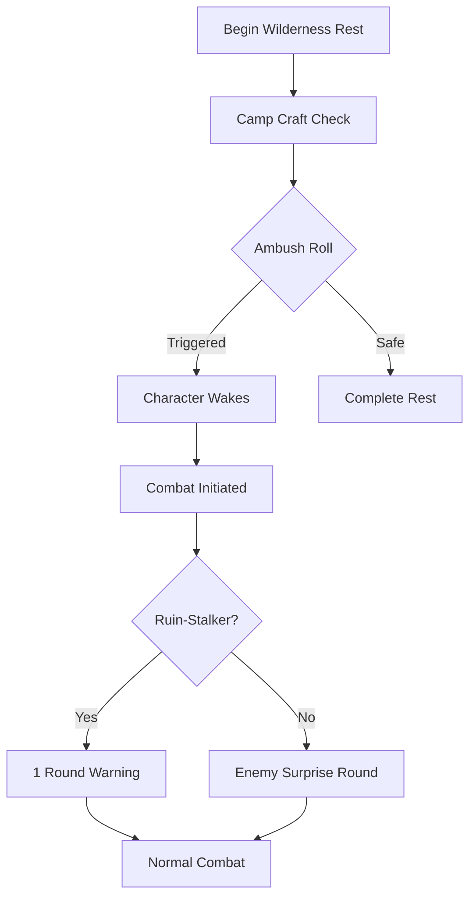

# Resting System — Recovery, Resources, and Risk

> *"The Völva's fire burns low, but never out. Rest is not retreat—it is the system defragmenting, preparing for the next execution cycle."*

---

## Document Control

| Version | Date | Changes |
|---------|------|---------|
| 1.0 | 2025-12-14 | Initial specification |

---

## 1. Overview

### 1.1 Identity Table

| Property | Value |
|----------|-------|
| Spec ID | `SPEC-SYS-REST` |
| Category | Core Systems |
| Type | Resource Recovery |
| Dependencies | Trauma Economy, Resources, Room Engine |

### 1.2 Design Philosophy

Rest serves as the primary **system defragmentation** mechanism—the point where accumulated damage, fatigue, and psychological strain are processed and resolved. Unlike combat (which applies entropy) or exploration (which accumulates risk), rest provides the **reset cadence** that defines the game's pacing.

**Core Principles:**

1. **Rest is a Decision, Not a Default** — Players choose when and where to rest, weighing recovery against time, resources, and risk.
2. **Location Matters** — Sanctuary Rest (at Runic Anchors) provides full recovery; Wilderness Rest provides partial recovery with inherent danger.
3. **Resources Have Weight** — Rations and clean water are consumed during wilderness rest, creating economic pressure.
4. **Corruption is Permanent** — Rest heals the body and calms the mind, but cannot cleanse Runic Blight. This asymmetry is critical to the horror economy.

---

## 2. Rest Types

### 2.1 Comparison Table

| Aspect | Sanctuary Rest | Wilderness Rest |
|--------|----------------|-----------------|
| **Location** | Runic Anchor | Cleared hostile room |
| **HP Recovery** | 100% | 75% |
| **Stamina Recovery** | 100% | 75% |
| **Aether Pool Recovery** | 100% | 75% |
| **Stress Recovery** | Reset to 0 | WILL check (successes removed) |
| **Corruption Recovery** | ❌ None | ❌ None |
| **Resource Cost** | None | 1 Ration + 1 Clean Water |
| **Ambush Risk** | None | Camp Craft check |
| **Time Cost** | 8 hours | 8 hours |
| **Progression Access** | Yes (Saga, Attune) | No |

### 2.2 Critical Design Note

> [!WARNING]
> **Corruption is NEVER affected by rest.** This is intentional. Runic Blight represents permanent metaphysical damage that cannot be "slept off." Only specific rituals, consumables, or story events can reduce Corruption. This asymmetry drives the horror economy—players can recover from most setbacks, but heretical choices leave lasting marks.

---

## 3. Sanctuary Rest

### 3.1 Definition

Sanctuary Rest occurs at **Runic Anchors**—fixed points in the world where the fabric of reality remains stable. These locations serve as both respawn points and full recovery stations.

### 3.2 Mechanics

```
SANCTUARY REST PROCEDURE
========================
1. Character arrives at Runic Anchor
2. Execute 'rest' command
3. Time advances 8 hours
4. All recoverable resources reset:
   - HP → MaxHP
   - Stamina → MaxStamina
   - AetherPool → MaxAP
   - Stress → 0
5. Progression systems unlock:
   - 'saga' command available (spend PP)
   - 'attune' command available (bind anchor, artifacts)
6. Save checkpoint created
```

### 3.3 Stress Reset Rationale

Sanctuary Rest reduces Stress to exactly 0, not by a percentage or formula. This provides:

- **Clear Mental Reset** — The player knows they start fresh from sanctuary
- **Strategic Value** — High-stress characters benefit enormously from reaching sanctuary
- **Pacing Control** — Encourages exploration toward Runic Anchors as "checkpoints"

### 3.4 Sanctuary Locations

| Location Type | Description | Frequency |
|---------------|-------------|-----------|
| **Runic Anchor** | Primary sanctuary, always safe | 1 per sector |
| **Settlement Temple** | Town/city sanctuary | Major settlements |
| **Hidden Shrine** | Discoverable sanctuary | Rare, secret |

---

## 4. Wilderness Rest

### 4.1 Definition

Wilderness Rest occurs in **cleared hostile rooms**—areas where enemies have been defeated but danger still lurks. Recovery is partial and carries risk.

### 4.2 Prerequisites

| Requirement | Details |
|-------------|---------|
| **Room Cleared** | All hostile entities defeated |
| **Not in Combat** | No active combat encounter |
| **Time Available** | 8 hours uninterrupted |
| **Resources (Recommended)** | 1 Ration + 1 Clean Water |

### 4.3 Camp Craft Check

Before rest begins, the character rolls a **Camp Craft check** to determine rest quality and ambush risk.

```
CAMP CRAFT CHECK
================
Dice Pool: WITS + Wasteland Survival
Success Threshold: 8+ on d10

Modifiers:
  - Einbui specialization: -2 to DC
  - Veiðimaðr specialization: -1 to DC
  - Sheltered location: -2 to DC
  - Exposed location: +2 to DC
  - Recent enemy activity: +1 to DC
```

### 4.4 Ambush Chance

The Camp Craft check determines ambush probability:

| Check Result | Ambush Chance | Description |
|--------------|---------------|-------------|
| **Critical Success (5+ over DC)** | 5% | Near-perfect concealment |
| **Success** | 15% | Adequate shelter found |
| **Failure** | 35% | Poor camp placement |
| **Critical Failure (5+ under DC)** | 60% | Danger magnetically attracted |

### 4.5 Recovery Values

```
WILDERNESS RECOVERY
===================
HP:      Current + (MaxHP - Current) × 0.75
         (Effectively: recover to 75% of max)

Stamina: Current + (MaxStamina - Current) × 0.75

Aether:  Current + (MaxAP - Current) × 0.75

Stress:  Roll WILL dice pool
         Each success (8+) removes 5 Stress
         Minimum result: current Stress - 5
         Maximum reduction: WILL × 5
```

### 4.6 Wilderness Stress Example

```
Character: Stress 72, WILL 4
Roll: 4d10 → [3, 8, 9, 2] = 2 successes
Stress Reduction: 2 × 5 = 10
New Stress: 72 - 10 = 62

Note: Unlike Sanctuary (→ 0), wilderness rest only
provides incremental stress relief.
```

---

## 5. Resource Consumption

### 5.1 Required Resources

Wilderness Rest consumes:

| Resource | Quantity | Per |
|----------|----------|-----|
| **Ration** | 1 | Character |
| **Clean Water** | 1 | Character |

For parties, multiply by character count.

### 5.2 Missing Resources

If resources are unavailable, players may still rest with penalties:

```
EXHAUSTED DEBUFF
================
Duration: Until next full rest (with resources)
Effects:
  - Recovery capped at 50% instead of 75%
  - -1 to all dice pools
  - Cannot benefit from stress reduction
  - Ambush chance +10%
```

### 5.3 Economic Integration

Resource consumption creates systemic pressure:

| System | Integration |
|--------|-------------|
| **Scavenging** | Rations and water are common finds, rewarding exploration |
| **Trading** | Merchants sell provisions; prices vary by settlement |
| **Crafting** | Field Medicine can create emergency rations |
| **Corruption** | Some corrupted food provides sustenance with Blight cost |

---

## 6. Ambush System

### 6.1 Ambush Trigger

When the ambush roll succeeds (against the chance determined by Camp Craft):



### 6.2 Ambush Consequences

| Outcome | Effect |
|---------|--------|
| **Ambush Triggered** | Combat begins, no rest benefits received |
| **Enemy Surprise** | Enemies get free round; party is [Prone] |
| **Ruin-Stalker Warning** | Party warned 1 round early, no surprise |
| **Combat Victory** | May attempt rest again (new check) |
| **Combat Retreat** | Rest failed, must find new location |

### 6.3 Ambush Encounter Scaling

Ambush encounters scale with:

- Current sector danger level
- Room type (e.g., Skittering Warrens = insectoid ambush)
- Time of "day" (nocturnal enemies at night)
- Recent activity (rooms recently cleared = lower spawns)

---

## 7. Survivalist Integration

### 7.1 Survivalist Specializations

Certain specializations excel at wilderness survival:

| Specialization | Camp Craft Bonus | Special |
|----------------|------------------|---------|
| **Einbui** | -2 DC | Can rest with half resources |
| **Veiðimaðr** | -1 DC | Forage check before rest (may find rations) |
| **Ruin-Stalker** | None | Automatic ambush detection |

### 7.2 Einbui "Self-Sufficient" Passive

```
SELF-SUFFICIENT (Einbui Passive)
================================
Trigger: OnRestResourceCheck
Effect: Resource requirement reduced by 50%
        (1 ration per 2 characters, round up)

Also: Can consume "scavenged" items (reduced quality)
      with no [Exhausted] penalty
```

### 7.3 Veiðimaðr "Wasteland Provider" Passive

```
WASTELAND PROVIDER (Veiðimaðr Passive)
======================================
Trigger: OnWildernessRestStart
Effect: Roll WITS + Wasteland Survival
        Success: Find 1d2 Rations and/or Water
        Critical: Find 1d4 resources + chance for
                  rare crafting materials
```

---

## 8. Trauma Economy Integration

### 8.1 Stress Recovery Comparison

| Rest Type | Stress Recovery | Formula |
|-----------|-----------------|---------|
| **Sanctuary Rest** | Full reset | Stress → 0 |
| **Wilderness Rest** | Partial | WILL × successes × 5 |
| **Short Rest (legacy)** | Minimal | WILL × 2 (if implemented) |

### 8.2 Corruption Non-Recovery

Rest has **no effect** on Runic Blight Corruption. This is the critical asymmetry:

```
TRAUMA ECONOMY SUMMARY
======================
Stress (Psychic):
  - Volatile: Fluctuates rapidly
  - Recoverable: Rest removes stress
  - Breaking Point: 100 = trauma check

Corruption (Runic Blight):
  - Persistent: Rarely decreases
  - Non-Recoverable: Rest has NO effect
  - Threshold: 100 = character transformation

This asymmetry makes Corruption terrifying—players
cannot simply "rest away" their heretical choices.
```

### 8.3 Corruption Recovery Methods

Since rest doesn't affect Corruption, these are the only methods:

| Method | Corruption Reduction | Availability |
|--------|---------------------|--------------|
| **Purification Ritual** | -10 to -25 | Temple service, high cost |
| **Atonement Quest** | -15 to -40 | Story-driven, difficult |
| **Coherent Blessing** | -5 to -10 | Rare consumable |
| **Ancient Relic** | Varies | Unique artifacts |

---

## 9. Technical Implementation

### 9.1 Data Models

```csharp
public enum RestType
{
    Sanctuary,
    Wilderness
}

public record RestAttempt
{
    public Guid CharacterId { get; init; }
    public Guid RoomId { get; init; }
    public RestType Type { get; init; }
    public bool HasResources { get; init; }
    public int CampCraftSuccesses { get; init; }
    public int AmbushChance { get; init; }
}

public record RestResult
{
    public RestType Type { get; init; }
    public bool WasAmbushed { get; init; }
    public int HpRecovered { get; init; }
    public int StaminaRecovered { get; init; }
    public int AetherRecovered { get; init; }
    public int StressReduced { get; init; }
    public int ResourcesConsumed { get; init; }
    public int HoursElapsed { get; init; } = 8;
    public bool GainedExhausted { get; init; }
}

public record AmbushResult
{
    public bool Triggered { get; init; }
    public IReadOnlyList<Guid> EnemyIds { get; init; } = [];
    public bool PartySurprised { get; init; }
    public string AmbushSource { get; init; } = string.Empty;
}
```

### 9.2 Service Interface

```csharp
public interface IRestService
{
    /// <summary>Determines if character can rest at current location.</summary>
    RestAvailability CanRest(Character character, Room room);

    /// <summary>Executes sanctuary rest (full recovery).</summary>
    RestResult SanctuaryRest(Character character, RunicAnchor anchor);

    /// <summary>Executes wilderness rest (partial recovery, ambush risk).</summary>
    RestResult WildernessRest(Character character, Room room);

    /// <summary>Performs Camp Craft check for wilderness rest.</summary>
    CampCraftResult RollCampCraft(Character character, Room room);

    /// <summary>Rolls for ambush during wilderness rest.</summary>
    AmbushResult RollForAmbush(Character character, Room room, int campCraftSuccesses);

    /// <summary>Consumes rations and water for rest.</summary>
    ResourceConsumptionResult ConsumeRestResources(Character character);

    /// <summary>Applies recovery values based on rest type.</summary>
    void ApplyRecovery(Character character, RestType type, bool hasResources);

    /// <summary>Rolls WILL for wilderness stress recovery.</summary>
    int RollStressRecovery(Character character);
}

public record RestAvailability(
    bool CanRest,
    RestType AvailableType,
    string? BlockReason,
    bool HasResources,
    bool WillFailQuest
);

public record CampCraftResult(
    int DiceRolled,
    int Successes,
    int AmbushChance,
    string QualityDescription
);

public record ResourceConsumptionResult(
    bool HadSufficientResources,
    int RationsConsumed,
    int WaterConsumed,
    bool AppliedExhausted
);
```

### 9.3 Event System

```csharp
public record RestStartedEvent(
    Guid CharacterId,
    RestType Type,
    Guid LocationId
) : IGameEvent;

public record RestCompletedEvent(
    Guid CharacterId,
    RestResult Result
) : IGameEvent;

public record AmbushTriggeredEvent(
    Guid CharacterId,
    AmbushResult Ambush
) : IGameEvent;

public record ResourcesConsumedEvent(
    Guid CharacterId,
    int RationsUsed,
    int WaterUsed
) : IGameEvent;
```

---

## 10. Phased Implementation Guide

### Phase 1: Core Rest Logic
- [ ] **Data Models**: Implement `RestAttempt`, `RestResult`, `AmbushResult`
- [ ] **Sanctuary Rest**: Full recovery logic (HP, Stamina, AP, Stress → 0)
- [ ] **Wilderness Rest**: 75% recovery logic, WILL-based stress reduction
- [ ] **Time Advance**: Hook rest to world clock (+8 hours)

### Phase 2: Resource System
- [ ] **Resource Check**: Query inventory for rations/water
- [ ] **Consumption**: Deduct resources on wilderness rest
- [ ] **Exhausted Debuff**: Apply when resources missing
- [ ] **Einbui Integration**: Reduced resource requirement

### Phase 3: Ambush System
- [ ] **Camp Craft Check**: WITS + Wasteland Survival roll
- [ ] **Ambush Calculation**: Success-based chance table
- [ ] **Encounter Generation**: Scale ambush encounters appropriately
- [ ] **Ruin-Stalker Warning**: 1-round advance notice passive

### Phase 4: Integration
- [ ] **Command Hook**: Connect to `rest` and `camp` commands
- [ ] **Sanctuary Detection**: Identify Runic Anchors for sanctuary rest
- [ ] **Event Emission**: Fire rest events for other systems
- [ ] **Progression Unlock**: Enable `saga` and `attune` after sanctuary rest

---

## 11. Testing Requirements

### 11.1 Unit Tests

| Test Case | Expected Result |
|-----------|-----------------|
| Sanctuary rest HP recovery | HP = MaxHP |
| Sanctuary rest stress reset | Stress = 0 |
| Wilderness rest HP recovery | HP = prev + (max - prev) × 0.75 |
| Wilderness stress recovery | Reduction = WILL successes × 5 |
| Resource consumption | Ration -1, Water -1 |
| Exhausted without resources | Recovery capped at 50% |
| Camp Craft modifiers | Einbui -2 DC, Veiðimaðr -1 DC |

### 11.2 Integration Tests

| Scenario | Validation |
|----------|------------|
| Full wilderness rest flow | Camp check → ambush roll → recovery → resource use |
| Ambush triggers combat | Combat initiated, no recovery applied |
| Sanctuary unlocks progression | `saga` command available after rest |
| Corruption unchanged | Corruption identical before/after rest |

### 11.3 Edge Cases

- [ ] Rest with exactly 0 resources (should prompt, allow with exhausted)
- [ ] Rest at 100% HP (should still advance time, reset stress if sanctuary)
- [ ] Ambush at 1 HP (combat begins, defeat = death or respawn)
- [ ] Party rest resource scaling (N characters = N rations/water)

---

## 12. Logging Requirements

**Reference:** [logging.md](../01-core/logging.md)

### 12.1 Log Events

| Event | Level | Message Template | Properties |
|-------|-------|------------------|------------|
| Rest Start | Info | "{CharacterName} begins {RestType} rest at {Location}" | `CharacterName`, `RestType`, `Location` |
| Camp Craft | Debug | "Camp Craft: {Successes} successes, {AmbushChance}% ambush chance" | `Successes`, `AmbushChance` |
| Ambush Triggered | Warning | "AMBUSH! {EnemyCount} enemies attack {CharacterName}" | `EnemyCount`, `CharacterName` |
| Rest Complete | Info | "{CharacterName} rested: HP+{Hp}, Stamina+{Stam}, Stress-{Stress}" | `CharacterName`, `Hp`, `Stam`, `Stress` |
| Resources Consumed | Debug | "Consumed {Rations} rations, {Water} water" | `Rations`, `Water` |
| Exhausted Applied | Warning | "{CharacterName} rested without supplies — [Exhausted] applied" | `CharacterName` |

### 12.2 Player-Facing Messages

| Event | Display |
|-------|---------|
| Sanctuary Rest Start | "You settle near the Runic Anchor. Its steady hum calms your mind as you drift into deep, restorative sleep." |
| Wilderness Rest Start | "You make camp in the ruins. It's not safe, but you need recovery." |
| Ambush | "[!] Your camp was discovered!" |
| Resource Warning | "You don't have enough supplies for a proper rest." |
| Exhausted | "Without proper supplies, exhaustion gnaws at you. [-Exhausted]" |

---

## 13. Related Specifications

| Spec ID | Relationship |
|---------|--------------|
| [rest-camp.md](../08-ui/commands/rest-camp.md) | Command implementation details |
| [trauma-economy.md](../01-core/trauma-economy.md) | Stress/Corruption recovery rules |
| [stress.md](../01-core/resources/stress.md) | Stress mechanics |
| [combat-resolution.md](../03-combat/combat-resolution.md) | Ambush combat initiation |
| [room-engine/core.md](../07-environment/room-engine/core.md) | Room safety detection |
| [status-effects.md](../03-combat/status-effects.md) | [Exhausted] debuff definition |

---

## 14. Appendix: Exhausted Status Effect

To be added to the status effects registry:

```
[EXHAUSTED]
===========
Category: Debuff
Source: Resting without resources
Duration: Until next full rest (with resources)

Effects:
- Recovery capped at 50% (was 75%)
- -1 to all dice pools
- No stress reduction from wilderness rest
- +10% ambush chance

Cure: Complete a rest with full resources
```
