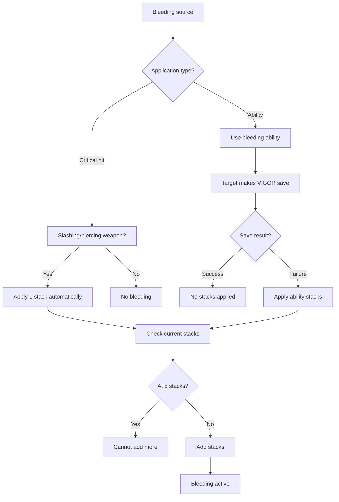
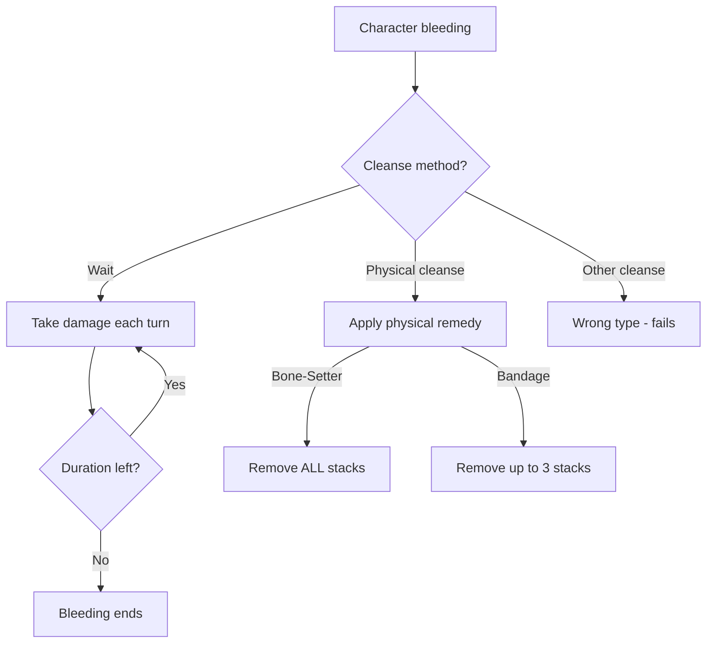

# [Bleeding]

**Category:** Debuff (Damage Over Time) | **Icon:** 🩸

---

## 1. Overview

| Property | Value |
|----------|-------|
| **Type** | Physical DoT |
| **Duration** | 3 rounds |
| **Stacking** | Intensify |
| **Max Stacks** | 5 |
| **Resistance** | VIGOR |
| **Cleanse Type** | Physical |

---

## 2. Description

> Character suffers ongoing blood loss, taking Physical damage at the start of each turn. Stacks up to 5 times for cumulative effect.

**Thematic:** Catastrophic breach in physical "hardware" — arterial damage that won't self-seal without intervention.

---

## 3. Mechanical Effects

### 3.1 Damage Formula

```
Damage per turn = 1d6 × Current Stacks
```

| Stacks | Damage/Turn | Total (3 rounds) |
|--------|-------------|------------------|
| 1 | 1d6 (1-6) | 3d6 (3-18) |
| 2 | 2d6 (2-12) | 6d6 (6-36) |
| 3 | 3d6 (3-18) | 9d6 (9-54) |
| 4 | 4d6 (4-24) | 12d6 (12-72) |
| 5 | 5d6 (5-30) | 15d6 (15-90) |

### 3.2 Special Property

> [!IMPORTANT]
> **Bleeding damage ignores Soak.** Internal damage beneath armor makes this exceptionally powerful against high-Soak tanks.

---

## 4. Application Workflow



### 4.1 Application Methods

| Source | Stacks | Resist? | Notes |
|--------|--------|---------|-------|
| Critical hit (slash/pierce) | 1 | No | Automatic |
| Vargr-Born "Savage Claws" | 1-2 | Yes | VIGOR DC varies |
| Hólmgangr "Hemorrhaging Strike" | 2 | No | On hit |
| Veiðimaðr "Barbed Arrows" | 1 | Yes | Crafted ammo |

---

## 5. Resistance & Immunity

### 5.1 Resistance Check

| Property | Value |
|----------|-------|
| **Attribute** | VIGOR |
| **DC Range** | 10-16 |
| **Success** | No stacks applied |
| **Failure** | Full stacks applied |

### 5.2 Immunity

| Entity Type | Reason |
|-------------|--------|
| **Constructs** | No biological systems |
| **Incorporeal Undead** | No physical form |
| **Elementals** | No blood or vital fluids |

### 5.3 Resistance

| Entity Type | Effect |
|-------------|--------|
| **Stone-Kin** | Higher DC required |
| **Carapace creatures** | Natural armor resistance |

---

## 6. Cleansing Workflow



### 6.1 Cleanse Methods

| Method | Effect | Action |
|--------|--------|--------|
| Bone-Setter "Apply Tourniquet" | Remove all stacks | Standard |
| [Soot-Stained Bandage] | Remove up to 3 stacks | Standard |
| Natural expiration | Effect ends after duration | None |

### 6.2 What Doesn't Work

- Alchemical antidotes (wrong type)
- Standard magical healing
- Mental abilities

---

## 7. Tactical Decision Tree

```mermaid
flowchart TD
    ENCOUNTER[Combat situation] --> ENEMY{Enemy type?}
    
    ENEMY --> |High Soak tank| BLEED[Prioritize bleeding!]
    ENEMY --> |High evasion| OTHER[Use [Poisoned] instead]
    ENEMY --> |Construct| IMMUNE[Cannot bleed]
    
    BLEED --> STRATEGY{Strategy?}
    STRATEGY --> |Burst| STACK[Stack to 5 fast]
    STRATEGY --> |Attrition| SPREAD[Spread across targets]
    
    STACK --> DAMAGE[5d6/turn, ignores Soak]
    SPREAD --> PRESSURE[Multiple targets bleeding]
```

### 7.1 Tactical Applications

| Situation | Application |
|-----------|-------------|
| **High-Soak enemy** | Primary anti-tank tool |
| **Party coordination** | Multiple characters stack bleed |
| **Forcing action economy** | Enemy must cleanse or die |

### 7.2 Counter-Play

| Threat | Counter |
|--------|---------|
| Enemy bleeding you | High VIGOR for resistance |
| Stacked bleeding | Bone-Setter in party |
| Bleed-focused enemy | Avoid critical hits |

---

## 8. Synergies & Conflicts

### 8.1 Synergies

| Combination | Effect |
|-------------|--------|
| + [Corroded] | Reduce Soak (even though bleed ignores it, helps others) |
| + Critical builds | More crits = more stacks |
| + Party focus fire | Stack bleeds on priority target |

### 8.2 Conflicts

| Situation | Issue |
|-----------|-------|
| vs Constructs | Immune, wasted effort |
| vs Incorporeal | Immune |
| Spread too thin | Low stacks = low damage |

---

## 9. Balance Data

### 9.1 Damage Analysis

| Scenario | Avg Damage | Notes |
|----------|------------|-------|
| 3 stacks, 3 turns | 31.5 total | 3d6 × 3 |
| 5 stacks, 3 turns | 52.5 total | 5d6 × 3 |
| Combined with [Corroded] | +50% party DPS | Tanks exposed |

### 9.2 Effect Severity

| Stack Level | Severity | Priority to Cleanse |
|-------------|----------|---------------------|
| 1-2 | Minor | Low |
| 3-4 | Moderate | Medium |
| 5 | Severe | High |

### 9.3 Comparison to Other DoTs

| DoT | Damage | Soak | Secondary |
|-----|--------|------|-----------|
| **[Bleeding]** | 1d6/stack | **Ignores** | None |
| [Poisoned] | 1d6/stack | Affected | -Defense |
| [Burning] | 2d6 flat | Affected | Spread |

---

## 10. Voice Guidance

**Reference:** [/docs/.templates/flavor-text/status-effects.md#bleeding]

### 10.1 Flavor Text Templates

| Phase | Text |
|-------|------|
| **Application** | "Blood flows! The wound is deep and won't stop bleeding!" |
| **Tick** | "Blood loss continues! [1d6 × stacks damage]" |
| **Expiration** | "The bleeding finally clots naturally. You're pale but stable." |
| **Cleansed** | "The wound is bound! Bleeding controlled!" |

### 10.2 Severity Scaling

| Stacks | Verb | Adjective |
|--------|------|-----------|
| 1-2 | seeps, trickles | minor, light |
| 3-4 | flows, pours | serious, heavy |
| 5 | gushes, hemorrhages | critical, arterial |

---

## 11. Logging Requirements

**Reference:** [../../01-core/logging.md](../../01-core/logging.md) | [../../01-core/logging-matrix.md](../../01-core/logging-matrix.md)

### 11.1 Log Events

| Event | Level | Message Template | Properties |
|-------|-------|------------------|------------|
| Bleeding applied | Debug | "[Bleeding] applied to {CharacterId}: {StackCount} stacks, {Duration} rounds" | `CharacterId`, `StackCount`, `Duration`, `SourceId` |
| Stack added | Verbose | "[Bleeding] stack added to {CharacterId}, now {StackCount}" | `CharacterId`, `StackCount`, `PreviousCount` |
| Damage tick | Verbose | "[Bleeding] tick on {CharacterId}: {Damage} damage ({StackCount} stacks)" | `CharacterId`, `Damage`, `StackCount` |
| Expired | Debug | "[Bleeding] expired on {CharacterId}" | `CharacterId`, `FinalStackCount` |
| Cleansed | Debug | "[Bleeding] cleansed from {CharacterId} via {Method}" | `CharacterId`, `Method`, `StacksRemoved` |
| Resisted | Debug | "{CharacterId} resisted [Bleeding] (DC {DC})" | `CharacterId`, `DC`, `SourceId` |
| Immunity triggered | Debug | "[Bleeding] blocked on {CharacterId}: {Reason}" | `CharacterId`, `Reason` |

### 11.2 Context Enrichment

All bleeding logs should include these properties (via LogContext):

| Property | Source | Description |
|----------|--------|-------------|
| `CharacterId` | GameStateEnricher | Affected character |
| `CombatId` | LogContext scope | Active combat (if any) |
| `TurnNumber` | GameStateEnricher | Current turn |

### 11.3 Example Implementation

```csharp
public void ApplyBleeding(Guid targetId, int stacks, Guid? sourceId = null)
{
    using (LogContext.PushProperty("SourceId", sourceId))
    {
        var current = GetCurrentStacks(targetId);
        var newTotal = Math.Min(current + stacks, MaxStacks);
        
        _logger.Debug(
            "[Bleeding] applied to {CharacterId}: {StackCount} stacks, {Duration} rounds",
            targetId, newTotal, DefaultDuration);
        
        if (current > 0)
        {
            _logger.Verbose(
                "[Bleeding] stack added to {CharacterId}, now {StackCount}",
                targetId, newTotal);
        }
    }
}

public void ProcessTick(Guid targetId)
{
    var stacks = GetCurrentStacks(targetId);
    var damage = RollDamage(stacks);
    
    _logger.Verbose(
        "[Bleeding] tick on {CharacterId}: {Damage} damage ({StackCount} stacks)",
        targetId, damage, stacks);
}
```

### 11.4 Player-Facing Activity Log

**Reference:** [../../08-ui/tui-layout.md](../../08-ui/tui-layout.md)

In addition to developer logs, bleeding events appear in the player's Activity Log:

| Event | Activity Log Message | Type |
|-------|---------------------|------|
| Applied | `[Status] {TargetName} is now [Bleeding] ({stacks}d4/turn)` | StatusApplied |
| Tick | `[Status] [Bleeding] deals {damage} damage to {TargetName}` | Damage |
| Expired | `[Status] [Bleeding] has worn off from {TargetName}` | StatusExpired |
| Cleansed | `[Status] [Bleeding] cleansed from {TargetName}` | StatusExpired |

**Implementation:**

```csharp
// After developer log, add player-facing log
_activityLog.AddEntry(new ActivityLogEntry(
    $"[Status] {targetName} is now [Bleeding] ({stacks}d4/turn, {duration} turns)",
    ActivityLogType.StatusApplied,
    TargetId: targetId));
```

---

## 12. Phased Implementation Guide

### Phase 1: Definition & Rules
- [ ] **Data Definition**: Create `BleedingStatus` record/class with Stack limit (5) and Duration (3).
- [ ] **Registry**: Register in `StatusEffectRegistry`.
- [ ] **Properties**: Add `IsPhysical = true` and `IgnoresSoak = true` flags.

### Phase 2: Core Logic (Tick System)
- [ ] **Tick Processor**: Implement `OnTurnStart` handler that deals `1d6 * Stacks` damage.
- [ ] **Soak Bypass**: Ensure damage calculation explicitly skips Armor reduction.
- [ ] **Stacking Logic**: Implement `AddStack()` that resets duration to 3 rounds.
- [ ] **Decay Logic**: Implement turn-end tick that reduces duration (but not stacks).

### Phase 3: Systems Integration
- [ ] **Combat Hooks**: Hook `CriticalHit` event to apply 1 stack automatically.
- [ ] **Resistance**: Connect `VIGOR` save logic to application inputs.
- [ ] **Cleanse**: Map `Bandage` item and `Tourniquet` ability to remove stacks.

### Phase 4: UI & Feedback
- [ ] **VFX**: Add "Blood Spray" particle trigger on tick.
- [ ] **HUD**: Show Bleed icon with stack count.
- [ ] **Logs**: Generate "Bleeding tick: X damage" logs (Verbose level).

---

## 13. Testing Requirements

### 13.1 Unit Tests
- [ ] **Damage Calculation**: Verify 5 stacks = 5d6 damage.
- [ ] **Soak Bypass**: Verify damage ignores armor value.
- [ ] **Stacking**: Verify adding stack resets duration.
- [ ] **Expiration**: Verify effect removes itself after 3 rounds.

### 13.2 Key Test Cases
- [ ] **Crit Application**: Confirm crit with piercing weapon applies bleed.
- [ ] **Construct Immunity**: Confirm Apply() returns false on Construct target.
- [ ] **Max Stacks**: Confirm applying 6th stack does nothing.

### 13.3 Manual QA
- [ ] **UI Sync**: Verify stack counter matches backend value.
- [ ] **Combat Flow**: Verify tick happens at START of turn.
- [ ] **Log Check**: Verify tick logs appear in activity feed.

---

## 14. Changelog

| Version | Date | Changes |
|---------|------|---------|
| 1.0 | 2025-12-07 | Initial specification |
| 1.1 | 2025-12-08 | Added Balance Data, Voice Guidance, Changelog (golden standard) |
| 1.2 | 2025-12-11 | Added Logging Requirements section |
| 1.3 | 2025-12-13 | Added Phased Implementation Guide and Testing Requirements |

