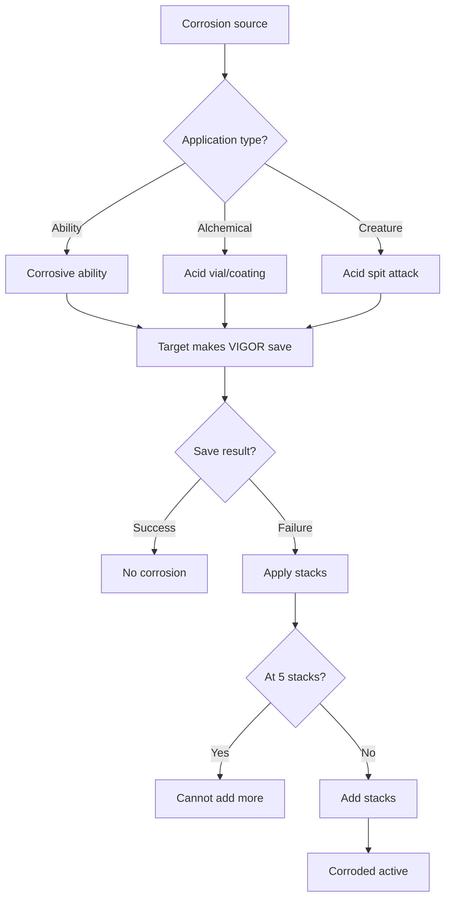
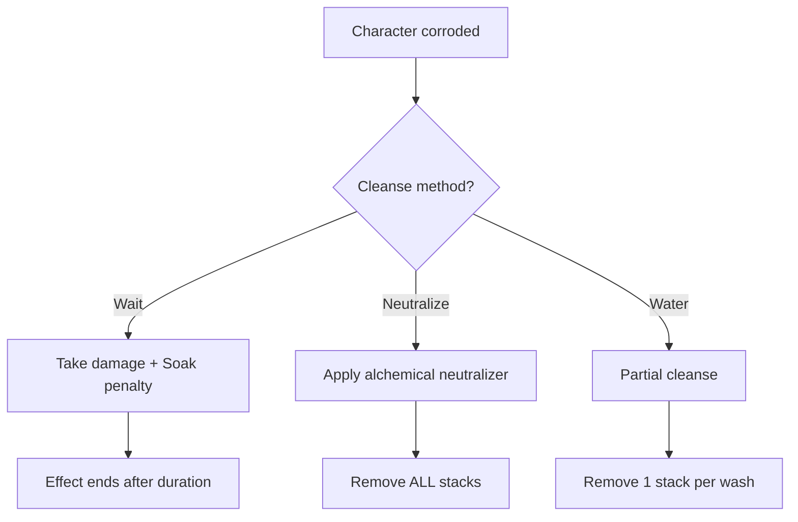
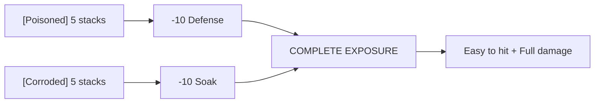

# [Corroded]

**Category:** Debuff (DoT + Impairment) | **Icon:** 🧪

---

## 1. Overview

| Property | Value |
|----------|-------|
| **Type** | Acid DoT + Soak reduction |
| **Duration** | 3 rounds |
| **Stacking** | Intensify |
| **Max Stacks** | 5 |
| **Resistance** | VIGOR |
| **Cleanse Type** | Alchemical |

---

## 2. Description

> Character's armor is being eaten away by corrosive substances. Takes acid damage AND suffers reduced Soak. The anti-armor debuff.

**Thematic:** Industrial-grade corrosive agents breaking down physical protection, exposing vulnerable flesh beneath.

---

## 3. Mechanical Effects

### 3.1 Dual Effect Formula

```
Damage per turn = 1d4 × Current Stacks
Soak Penalty = -2 × Current Stacks
```

| Stacks | Damage/Turn | Soak Penalty |
|--------|-------------|--------------|
| 1 | 1d4 | -2 |
| 2 | 2d4 | -4 |
| 3 | 3d4 | -6 |
| 4 | 4d4 | -8 |
| 5 | 5d4 | -10 |

### 3.2 Comparison to Other DoTs

| Aspect | [Corroded] | [Poisoned] | [Bleeding] |
|--------|-----------|-----------|----------|
| Damage | 1d4/stack | 1d6/stack | 1d6/stack |
| Secondary | -Soak | -Defense | None |
| Target type | Armored | Evasive | Tanks |
| Best vs | High Soak | High Defense | Soak users |

---

## 4. Application Workflow



### 4.1 Application Methods

| Source | Stacks | DC | Notes |
|--------|--------|-----|-------|
| Rust-Witch "Corrosive Touch" | 2 | 14 | Melee |
| Alchemist "Acid Vial" | 1-2 | 12 | Thrown |
| Myr-Drekar acid spit | 2 | 14 | Enemy |
| Corroded environment | 1 | 10 | Hazard |

---

## 5. Resistance & Immunity

### 5.1 Resistance Check

| Property | Value |
|----------|-------|
| **Attribute** | VIGOR |
| **DC Range** | 10-16 |
| **Success** | No corrosion applied |
| **Failure** | Full stacks applied |

### 5.2 Immunity

| Entity Type | Reason |
|-------------|--------|
| **Incorporeal** | Nothing to corrode |
| **Acid elementals** | Made of acid |

### 5.3 Reduced Effect

| Entity Type | Effect |
|-------------|--------|
| **Stone/metal constructs** | +2 DC, shorter duration |

---

## 6. Cleansing Workflow



### 6.1 Cleanse Methods

| Method | Effect | Action |
|--------|--------|--------|
| Bone-Setter "Neutralize Acid" | Remove all stacks | Standard |
| [Neutralizing Agent] | Remove all stacks | Item |
| Water/washing | Remove 1 stack | Standard |

---

## 7. Tactical Decision Tree

```mermaid
flowchart TD
    ENCOUNTER[Combat] --> ENEMY{Enemy type?}
    
    ENEMY --> |Heavy armor| CORRODE[Prioritize corrosion!]
    ENEMY --> |Light armor| OTHER[Use [Poisoned] or [Bleeding]]
    ENEMY --> |Incorporeal| IMMUNE[Cannot corrode]
    
    CORRODE --> COMBO{Party composition?}
    COMBO --> |High damage| STRIP[Strip Soak → burst]
    COMBO --> |Multiple attackers| VALUE[Each attack benefits]
```

### 7.1 Complete Exposure Combo



---

## 8. Synergies

| Combination | Effect |
|-------------|--------|
| + [Poisoned] | Complete Exposure (both defenses stripped) |
| + High-damage builds | Maximum damage through |
| + Party focus fire | Everyone deals more damage |

---

## 9. Balance Data

### 9.1 Damage Efficiency
| Stacks | Damage/Turn | Soak Reduction | Rating |
|--------|-------------|----------------|--------|
| 1 | 2.5 (1d4) | -2 (Minor) | Low |
| 5 | 12.5 (5d4) | -10 (Massive) | Very High |

### 9.2 Soak Penalty Value
| Stacks | Penalty | Value vs Tank | Context |
|--------|---------|---------------|---------|
| 5 Stacks | -10 | Nullifies Plate Armor | Critical for Boss DPS |

---

## 10. Voice Guidance

**Reference:** [combat-flavor.md](../../../.templates/flavor-text/combat-flavor.md)

### 10.1 Tone Profile
| Property | Value |
|----------|-------|
| **Visual** | Smoking fluid, dissolving metal, hissing sound |
| **Audio** | Sizzling, popping, pained groans |
| **Keywords** | Dissolve, melt, burn, strip |

### 10.2 Example Barks
> **Applied:** "My armor! It's melting!"
> **Ticking:** *Hissing smoke rises from armor*
> **Recovered:** "The burning stops..."

---

## 11. Phased Implementation Guide

### Phase 1: Core Mechanics
- [ ] **Modifier**: Create `CorrodedStatus` class implementing `IDamageStatus` and `IStatModifier`.
- [ ] **Stats**: Implement `-2 per stack` modifier to Soak.

### Phase 2: Logic Integration
- [ ] **Turn**: Implement `ProcessTurnStart` to deal Acid damage.
- [ ] **Stacking**: Implement `Intensify` logic (Add stacks up to 5).
- [ ] **Immunity**: Add check for Incorporeal tag.

### Phase 3: Mitigation
- [ ] **Water**: Implement special "Wash" action interact.
- [ ] **Reduction**: Implement Half-Effect for Constructs (+2 DC, Half Dur).

### Phase 4: UI & Feedback
- [ ] **Icon**: Smoking vial/drop icon.
- [ ] **Floaters**: Yellow/Green acid damage numbers.

---

## 12. Testing Requirements

### 12.1 Unit Tests
- [ ] **Soak**: 1 Stack -> Soak -2. 5 Stacks -> Soak -10.
- [ ] **Damage**: 5 Stacks -> Deals 5d4 damage.
- [ ] **Immunity**: Apply to Incorporeal -> Returns Failed.
- [ ] **Construct**: Apply to Construct -> Verify reduced duration/effect if applicable.

### 12.2 Integration Tests
- [ ] **Combat**: Player deals more damage to Corroded target due to Soak reduction.
- [ ] **Cleanse**: "Wash" action reduces stacks by 1.

### 12.3 Manual QA
- [ ] **Visual**: Smoke particle effect.
- [ ] **Log**: "Armor sizzles (-2 Soak)" message.

---

## 13. Logging Requirements

**Reference:** [logging.md](../../../00-project/logging.md)

### 13.1 Log Events
| Event | Level | Message Template | Properties |
|-------|-------|------------------|------------|
| Applied | Info | "{Target} is CORRODED ({Stacks} stacks)!" | `Target`, `Stacks` |
| Intensify | Info | "{Target}'s corrosion worsens! ({Old} -> {New})" | `Target`, `Old`, `New` |
| Tick | Info | "{Target} takes {Damage} acid damage." | `Target`, `Damage` |
| Immune | Info | "{Target} is immune to corrosion." | `Target` |

---

## 14. Related Documentation
| Document | Purpose |
|----------|---------|
| [Status Overview](overview.md) | System overview |
| [Alchemy](../../04-systems/crafting/alchemy.md) | Acid source |
| [Poisoned](poisoned.md) | Synergy partner |

---

## 15. Changelog
| Version | Date | Changes |
|---------|------|---------|
| 1.0 | 2025-12-07 | Initial specification |
| 1.1 | 2025-12-14 | Standardized with Balance, Voice, Phased Guide, Testing, and Logging |
