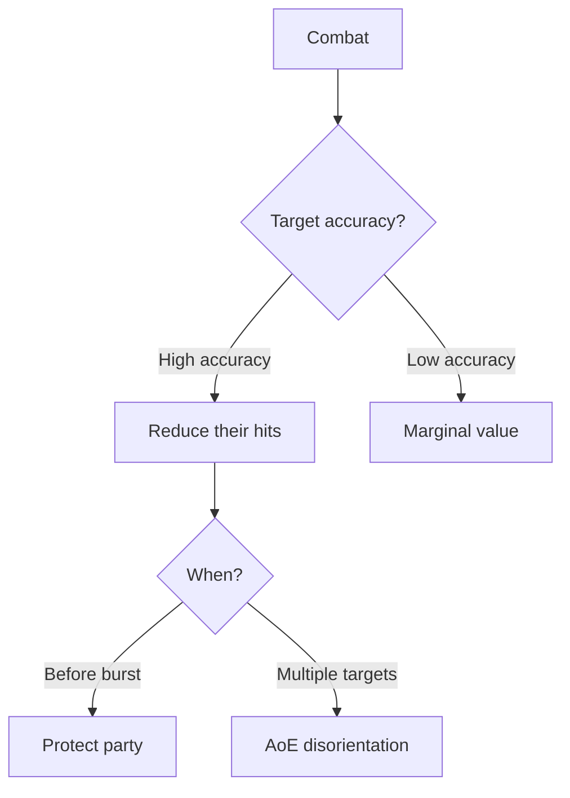

# [Disoriented]

**Category:** Debuff (Impairment) | **Icon:** 💫

---

## 1. Overview

| Property | Value |
|----------|-------|
| **Type** | Accuracy penalty |
| **Duration** | 2 rounds |
| **Stacking** | Refresh |
| **Max Stacks** | 1 |
| **Resistance** | WILL |
| **Cleanse Type** | Mental |

---

## 2. Description

> Character's senses are scrambled. All attacks suffer accuracy penalty, and perception checks are impaired.

**Thematic:** Sensory overload or confusion — visual static, ringing ears, scrambled priorities.

---

## 3. Mechanical Effects

### 3.1 Accuracy Penalty

```
Attack penalty = -2d10 to all attacks
Perception penalty = -3d10 to perception checks
```

### 3.2 Effect Details

| Aspect | Penalty |
|--------|---------|
| Attack rolls | -2d10 |
| Perception | -3d10 |
| Movement | Normal |
| Defense | Normal |

---

## 4. Application Workflow

```mermaid
flowchart TD
    SOURCE[Disorientation source] --> RESIST[Target makes WILL save]
    
    RESIST --> RESULT{Save result?}
    RESULT --> |Success| BLOCKED[Clear headed]
    RESULT --> |Failure| APPLY[Apply [Disoriented]]
    
    APPLY --> EXISTING{Already disoriented?}
    EXISTING --> |Yes| REFRESH[Refresh duration]
    EXISTING --> |No| NEW[Apply fresh]
```

### 4.1 Application Methods

| Source | Duration | DC | Notes |
|--------|----------|-----|-------|
| Flash-bang | 2 | 12 | Sensory overload |
| Concussion | 2 | 14 | Head trauma |
| Psychic static | 2 | 16 | Mental attack |
| Sonic attack | 2 | 14 | Ear damage |

---

## 5. Resistance & Immunity

### 5.1 Resistance Check

| Property | Value |
|----------|-------|
| **Attribute** | WILL |
| **DC Range** | 12-16 |

### 5.2 Immunity

| Entity Type | Reason |
|-------------|--------|
| **Constructs** | No organic senses |
| **Blind creatures** | Already alternate senses |

---

## 6. Cleansing Methods

| Method | Effect |
|--------|--------|
| Bone-Setter "Clear Head" | Remove effect |
| Natural expiration | Ends after duration |
| Focus ability | WILL vs DC |

---

## 7. Tactical Decision Tree



### 7.1 Tactical Applications

| Situation | Application |
|-----------|-------------|
| **vs Snipers** | -2d10 ruins accuracy |
| **Defensive** | Reduce incoming damage |
| **AoE** | Disorient multiple enemies |

---

## 8. Balance Data

### 8.1 Accuracy Value
| Penalty | Rating | Context |
|---------|--------|---------|
| -2d10 (Disoriented) | High | Equivalent to ~2-3 Attribute points |
| -4d10 (Blind) | Critical | Near total miss chance |

### 8.2 Application Cost
| Source | Stamina Cost | DC |
|--------|--------------|----|
| Flashbang | 20 (Item) | 12 |
| Psychic Blast | 30 | 16 |

---

## 9. Voice Guidance

**Reference:** [combat-flavor.md](../../../.templates/flavor-text/combat-flavor.md)

### 9.1 Tone Profile
| Property | Value |
|----------|-------|
| **Visual** | Stumbling, shaking head, looking wrong way |
| **Audio** | High-pitched whine, confused mumbling |
| **Keywords** | Dizzy, spinning, ringing, blurred |

### 9.2 Example Barks
> **Applied:** "Everything's spinning..."
> **Missed:** *Swings wildly at air*
> **Recovered:** "World... stopped turning."

---

## 10. Phased Implementation Guide

### Phase 1: Core Mechanics
- [ ] **Modifier**: Create `DisorientedStatus` class implementing `IStatModifier`.
- [ ] **Stats**: Implement `-2d10` to Attack Rolls and `-3d10` to Perception.

### Phase 2: Logic Integration
- [ ] **Combat**: Hook into `ResolveAttack()` to subtract dice.
- [ ] **Skill**: Hook into `SkillCheck()` for Perception.
- [ ] **Stacking**: Implement `Refresh` logic.

### Phase 3: Mitigation
- [ ] **Focus**: interaction with `Clear Head` ability.
- [ ] **Immunity**: Check Construct tag.

### Phase 4: UI & Feedback
- [ ] **Icon**: Swirling stars/spiral icon.
- [ ] **Floaters**: "Miss (Disoriented)" text on failed attacks.

---

## 11. Testing Requirements

### 11.1 Unit Tests
- [ ] **Attack**: Base Attack (6d10) + Disoriented -> 4d10.
- [ ] **Perception**: Base (6d10) + Disoriented -> 3d10.
- [ ] **Stacking**: Refresh duration on re-apply.
- [ ] **Immunity**: Construct -> Effect failed.

### 11.2 Integration Tests
- [ ] **Combat**: Verify hit rate drops significantly.
- [ ] **Cleanse**: "Clear Head" removes effect.

### 11.3 Manual QA
- [ ] **Visual**: Spiral particle effect on head.
- [ ] **Log**: "Attack penalty (-2d10)" explained in roll breakdown.

---

## 12. Logging Requirements

**Reference:** [logging.md](../../../00-project/logging.md)

### 12.1 Log Events
| Event | Level | Message Template | Properties |
|-------|-------|------------------|------------|
| Applied | Info | "{Target} is DISORIENTED!" | `Target` |
| Miss | Info | "{Target} misses wildly due to disorientation." | `Target` |
| Expire | Debug | "{Target} regains their senses." | `Target` |

---

## 13. Related Documentation
| Document | Purpose |
|----------|---------|
| [Status Overview](overview.md) | System overview |
| [Feared](feared.md) | Similar mental effect |

---

## 14. Changelog
| Version | Date | Changes |
|---------|------|---------|
| 1.0 | 2025-12-07 | Initial specification |
| 1.1 | 2025-12-14 | Standardized with Balance, Voice, Phased Guide, Testing, and Logging |
