# [Feared]

**Category:** Debuff (Impairment) | **Icon:** 😱

---

## 1. Overview

| Property | Value |
|----------|-------|
| **Type** | Forced behavior |
| **Duration** | 2-3 rounds |
| **Stacking** | Refresh |
| **Max Stacks** | 1 |
| **Resistance** | WILL |
| **Cleanse Type** | Mental |

---

## 2. Description

> Character is overwhelmed by terror and must flee from the fear source. Cannot approach source, all attacks against source suffer penalty.

**Thematic:** Primal terror overriding higher functions — fight-or-flight triggered to "flight."

---

## 3. Mechanical Effects

### 3.1 Forced Behavior

```
Must move: AWAY from fear source
Cannot: Approach fear source willingly
Attack penalty: -4 dice vs fear source
```

### 3.2 Effect Details

| Aspect | Effect |
|--------|--------|
| Movement | Must flee from source |
| Approach | Cannot move toward source |
| Attack penalty | -4d10 vs source |
| Other actions | Normal |

---

## 4. Application Workflow

```mermaid
flowchart TD
    SOURCE[Fear source] --> RESIST[Target makes WILL save]
    
    RESIST --> RESULT{Save result?}
    RESULT --> |Success| BLOCKED[No fear]
    RESULT --> |Failure| APPLY[Apply [Feared]]
    
    APPLY --> BEHAVIOR[Forced flee behavior]
    BEHAVIOR --> ESCAPE{Can escape?}
    ESCAPE --> |Yes| FLEE[Move away from source]
    ESCAPE --> |No| COWER[Cower in corner]
```

### 4.1 Application Methods

| Source | Duration | DC | Notes |
|--------|----------|-----|-------|
| Terrifying presence | 2 | 14 | Boss aura |
| Fear spell | 3 | 16 | Mental attack |
| Monstrous appearance | 2 | 12 | First sight |

---

## 5. Resistance & Immunity

### 5.1 Resistance Check

| Property | Value |
|----------|-------|
| **Attribute** | WILL |
| **DC Range** | 12-18 |

### 5.2 Immunity

| Entity Type | Reason |
|-------------|--------|
| **Constructs** | No emotions |
| **Undead** | No survival instinct |
| **[Inspired]** | Fear immunity while inspired |

---

## 6. Cleansing Workflow


### 6.1 Cleanse Methods

| Method | Effect | Action |
|--------|--------|--------|
| Skald "Rally" | Remove fear | Standard |
| [Inspired] buff | Immune to fear | Prevents |
| Self-control | WILL vs DC | Free |

---

## 7. Tactical Decision Tree

```mermaid
flowchart TD
    COMBAT[Combat] --> ROLE{Your role?}
    
    ROLE --> |Causing fear| SCARE[Break morale]
    ROLE --> |Avoiding fear| WILL[Stack WILL]
    
    SCARE --> PRIORITY{Priority target?}
    PRIORITY --> |Damage dealer| FEAR_DPS[Fear them → runs away]
    PRIORITY --> |Healer| FEAR_HEAL[Fear them → party vulnerable]
```



### 7.1 Tactical Applications

| Situation | Application |
|-----------|-------------|
| **Breaking formation** | Fear key targets |
| **Protecting self** | Feared enemies flee |
| **Boss encounter** | Expect fear mechanics |

---

## 8. Balance Data

### 8.1 Control Efficiency
| Duration | Behavior | Rating | Context |
|----------|----------|--------|---------|
| 2 Rounds | Flee | High | Breaks positioning |
| 3 Rounds | Cower | Critical | Hard removal from combat |

### 8.2 Application Cost
| Source | Stamina Cost | DC |
|--------|--------------|----|
| Fear Spell | 35 | 16 |
| Intimidate (Skill) | 20 | 12 |

---

## 9. Voice Guidance

**Reference:** [combat-flavor.md](../../../.templates/flavor-text/combat-flavor.md)

### 9.1 Tone Profile
| Property | Value |
|----------|-------|
| **Visual** | Eyes wide, backing away, hands up, checking exits |
| **Audio** | Screams, whimpers, rapid breathing |
| **Keywords** | No, run, away, hide, terror |

### 9.2 Example Barks
> **Applied:** "No! Get it away!"
> **Fleeing:** *Incoherent screaming while running*
> **Recovered:** "I... I'm a coward."

---

## 10. Phased Implementation Guide

### Phase 1: Core Mechanics
- [ ] **Modifier**: Create `FearedStatus` class implementing `IBehaviorOverride` and `IStatModifier`.
- [ ] **Stats**: Implement `-4d10` Attack Penalty vs Source.

### Phase 2: Logic Integration
- [ ] **AI**: Implement `FleeBehavior` (Move to furthest point from Source).
- [ ] **Player**: Restrict movement vectors toward source.
- [ ] **Combat**: Hook into `ResolveAttack` for penalty calculation.

### Phase 3: Mitigation
- [ ] **Immunity**: Check Construct/Undead traits.
- [ ] **Counter**: Check `Inspired` status (-Immunity).
- [ ] **Skill**: Implement `Rally` interaction.

### Phase 4: UI & Feedback
- [ ] **Icon**: Screaming face icon.
- [ ] **Floaters**: "Feared!" text.

---

## 11. Testing Requirements

### 11.1 Unit Tests
- [ ] **Penalty**: Attack Source -> -4 Dice. Attack Others -> Normal.
- [ ] **Movement**: Calculate Path -> Valid paths must increase distance from Source.
- [ ] **Immunity**: Undead -> Cast Fear -> Failed.

### 11.2 Integration Tests
- [ ] **AI Behavior**: Feared enemy actively runs away on their turn.
- [ ] **Player Control**: Verify movement grid prevents moving closer to source.

### 11.3 Manual QA
- [ ] **Visual**: "Feared!" text above head.
- [ ] **Gameplay**: Verify cannot click "Advance" action vs Source.

---

## 12. Logging Requirements

**Reference:** [logging.md](../../../00-project/logging.md)

### 12.1 Log Events
| Event | Level | Message Template | Properties |
|-------|-------|------------------|------------|
| Applied | Info | "{Target} is FEARED of {Source}!" | `Target`, `Source` |
| Flee | Info | "{Target} flees in terror." | `Target` |
| Resist | Info | "{Target} steels their nerves (Resist)." | `Target` |

---

## 13. Related Documentation
| Document | Purpose |
|----------|---------|
| [Status Overview](overview.md) | System overview |
| [Inspired](inspired.md) | Counter-effect |

---

## 14. Changelog
| Version | Date | Changes |
|---------|------|---------|
| 1.0 | 2025-12-07 | Initial specification |
| 1.1 | 2025-12-14 | Standardized with Balance, Voice, Phased Guide, Testing, and Logging |
