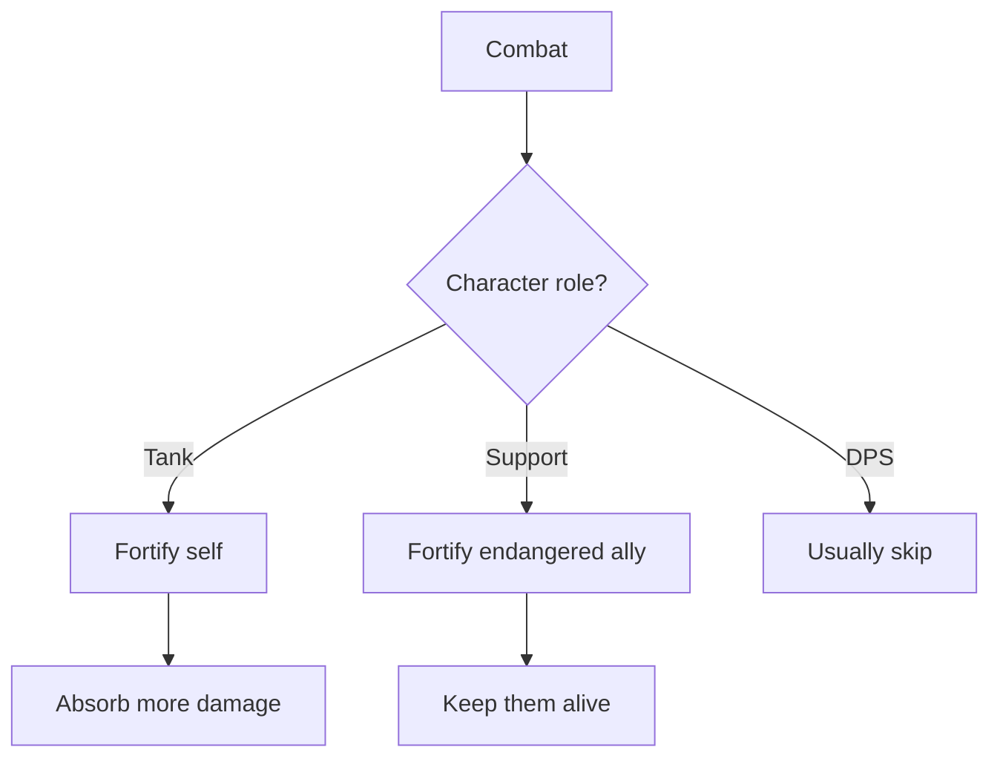

# [Fortified]

**Category:** Buff (Enhancement) | **Icon:** 🛡️

---

## 1. Overview

| Property | Value |
|----------|-------|
| **Type** | Defensive boost |
| **Duration** | 3 rounds |
| **Stacking** | No Stack |
| **Max Stacks** | 1 |
| **Cleanse Type** | N/A (beneficial) |

---

## 2. Description

> Character's defenses are significantly enhanced. Increased Soak, Defense, and resistance to control effects.

**Thematic:** Inner reserves activated, armor magically reinforced, or protective ward active.

---

## 3. Mechanical Effects

### 3.1 Defensive Boost

```
Soak Bonus = +4
Defense Bonus = +2
Control Resistance = +2d10 vs control effects
```

### 3.2 Effect Details

| Aspect | Bonus |
|--------|-------|
| Soak | +4 |
| Defense | +2 |
| vs Control | +2d10 to saves |
| Duration | 3 rounds |

---

## 4. Application Methods

| Source | Duration | Notes |
|--------|----------|-------|
| Skjaldmær "Iron Stance" | 3 | Self-buff |
| Bone-Setter "Reinforce" | 2 | Ally buff |
| [Fortification Potion] | 3 | Consumable |

---

## 5. Tactical Decision Tree



### 5.1 Tactical Applications

| Situation | Application |
|-----------|-------------|
| **Tanking** | Survive heavy damage |
| **Protecting ally** | Buff vulnerable character |
| **Boss encounter** | Survive burst phases |

---

## 6. Synergies

| Combination | Effect |
|-------------|--------|
| + High base Soak | Massive damage reduction |
| + [Inspired] | Defensive + offensive combo |

---

## 7. Balance Data

### 7.1 Defensive Value
| Bonus | Rating | Context |
|-------|--------|---------|
| +4 Soak | High | Nullifies Light Weapons completely |
| +2 Defense | Moderate | 10% less likely to be hit |

### 7.2 Application Cost
| Source | Stamina Cost | Duration |
|--------|--------------|----------|
| Battle Shout | 25 | 3 Rounds |
| Potion | 10 (Item) | 3 Rounds |

---

## 8. Voice Guidance

**Reference:** [combat-flavor.md](../../../.templates/flavor-text/combat-flavor.md)

### 8.1 Tone Profile
| Property | Value |
|----------|-------|
| **Visual** | Glowing aura, metallic sheen on skin, solid stance |
| **Audio** | Metallic resonance, stone grinding, deep breath |
| **Keywords** | Solid, unbreakable, stone, iron, shield |

### 8.2 Example Barks
> **Applied:** "I am the mountain!"
> **Soaking:** *Clang of deflected metal*
> **Expired:** "Armor fades..."

---

## 9. Phased Implementation Guide

### Phase 1: Core Mechanics
- [ ] **Modifier**: Create `FortifiedStatus` class implementing `IStatModifier`.
- [ ] **Stats**: Implement `+4` Soak and `+2` Defense.

### Phase 2: Logic Integration
- [ ] **Combat**: Ensure modifiers are applied during `ResolveDefense` and `ResolveDamage`.
- [ ] **Saves**: Add `+2d10` to Control Resist rolls.
- [ ] **Stacking**: Ensure No Stack rule (cannot double soak).

### Phase 3: Mitigation
- [ ] **Corrosion**: Interaction? (Maybe Fortified reduces Corrosion effectiveness? Logic TBD).

### Phase 4: UI & Feedback
- [ ] **Icon**: Shield icon.
- [ ] **Floaters**: "Absorbed!" text when Soak absorbs full damage.

---

## 10. Testing Requirements

### 10.1 Unit Tests
- [ ] **Soak**: Base (2) + Fortified -> Soak (6).
- [ ] **Defense**: Base (10) + Fortified -> Defense (12).
- [ ] **Resist**: Roll Save -> Add 2 bonus dice.
- [ ] **Stacking**: Apply twice -> Duration refreshed, stats do not double.

### 10.2 Integration Tests
- [ ] **Combat**: Tank takes significantly less damage from same enemy when Fortified.
- [ ] **Duration**: Lowers by 1 each turn start.

### 10.3 Manual QA
- [ ] **Visual**: Blue/Metallic shader.
- [ ] **Log**: "Damage reduced by Soak (6)" shown in log.

---

## 11. Logging Requirements

**Reference:** [logging.md](../../../00-project/logging.md)

### 11.1 Log Events
| Event | Level | Message Template | Properties |
|-------|-------|------------------|------------|
| Applied | Info | "{Target} is FORTIFIED!" | `Target` |
| Absorb | Info | "{Target}'s armor absorbs the blow." | `Target` |
| Expire | Debug | "{Target}'s fortification fades." | `Target` |

---

## 12. Related Documentation
| Document | Purpose |
|----------|---------|
| [Status Overview](overview.md) | System overview |
| [Attributes](../../01-core/attributes/sturdiness.md) | Soak mechanics |

---

## 13. Changelog
| Version | Date | Changes |
|---------|------|---------|
| 1.0 | 2025-12-07 | Initial specification |
| 1.1 | 2025-12-14 | Standardized with Balance, Voice, Phased Guide, Testing, and Logging |
