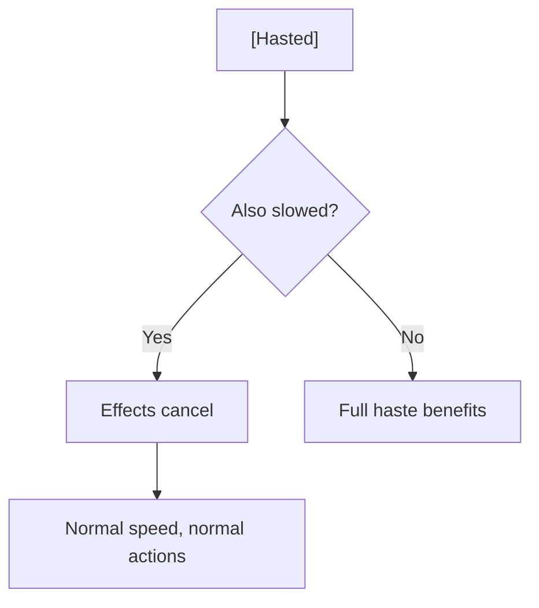

# [Hasted]

**Category:** Buff (Enhancement) | **Icon:** ⚡

---

## 1. Overview

| Property | Value |
|----------|-------|
| **Type** | Movement + action boost |
| **Duration** | 3 rounds |
| **Stacking** | No Stack |
| **Max Stacks** | 1 |
| **Cleanse Type** | N/A (beneficial) |

---

## 2. Description

> Character moves and acts with supernatural speed. Movement doubled, gains additional action.

**Thematic:** Time perception slowed, reflexes heightened, operating at peak efficiency.

---

## 3. Mechanical Effects

### 3.1 Speed Boost

```
Movement Speed = Base Speed × 2
Additional Action = +1 Standard Action per turn
```

### 3.2 Effect Details

| Aspect | Bonus |
|--------|-------|
| Movement | Doubled |
| Actions | +1 Standard Action |
| Defense | Normal |
| Initiative | +2 (if applied before combat) |

---

## 4. Application Methods

| Source | Duration | Notes |
|--------|----------|-------|
| Alchemist "Speed Tonic" | 3 | Consumable |
| Skald "Hastening Word" | 2 | Ability |
| [Runic inscription] | 1 | Item activation |

---

## 5. Interactions

### 5.1 Counter to [Slowed]



### 5.2 Synergies

| Combination | Effect |
|-------------|--------|
| + Melee DPS | More attacks per turn |
| + Positioning | Dominate the battlefield |

---

## 6. Tactical Applications

| Situation | Application |
|-----------|-------------|
| **Alpha strike** | Double attacks round 1 |
| **Escape** | Double movement |
| **Boss fight** | More DPS uptime |

---

## 7. Balance Data

### 7.1 Action Economy Value
| Bonus | Rating | Context |
|-------|--------|---------|
| +1 Action | Critical | Doubles offensive output (if 1 attack/turn) |
| x2 Speed | High | Trivializes positioning challenges |

### 7.2 Application Cost
| Source | Stamina Cost | Duration |
|--------|--------------|----------|
| Speed Tonic | 40 (Rare Item) | 3 Rounds |
| Hastening Word | 35 | 2 Rounds |

---

## 8. Voice Guidance

**Reference:** [combat-flavor.md](../../../.templates/flavor-text/combat-flavor.md)

### 8.1 Tone Profile
| Property | Value |
|----------|-------|
| **Visual** | Blur trails, flickering movement, sparks |
| **Audio** | Air displacement cracks, high-pitched hum |
| **Keywords** | Fast, blur, unmatched, lightning |

### 8.2 Example Barks
> **Applied:** "Time slows... I fly!"
> **Moving:** *Character disappears and reappears instantly*
> **Expired:** "The world speeds up again."

---

## 9. Phased Implementation Guide

### Phase 1: Core Mechanics
- [ ] **Modifier**: Create `HastedStatus` class implementing `IActionModifier` and `IStatModifier`.
- [ ] **Stats**: Implement `x2` multiplier to Movement Speed.
- [ ] **Actions**: Implement `+1 Standard Action` hook in Action Manager.

### Phase 2: Logic Integration
- [ ] **Turn**: Grant extra Action Points or Reset Action Flag at start of turn.
- [ ] **Counter**: Check for `Slowed` status; if present, cancel both.

### Phase 3: Mitigation
- [ ] **Slow**: Start Slowed -> Apply Haste -> Both Removed.

### Phase 4: UI & Feedback
- [ ] **Icon**: Lightning bolt icon.
- [ ] **Overlay**: Blue speed lines on screen edges (optional).

---

## 10. Testing Requirements

### 10.1 Unit Tests
- [ ] **Movement**: Speed (6) + Hasted -> Speed (12).
- [ ] **Action**: Turn Start -> AvailableActions = 2 (Standard).
- [ ] **Cancellation**: Slowed + Haste -> Both Removed.

### 10.2 Integration Tests
- [ ] **Combat**: Player can Move full distance AND Attack twice (Move + Attack + Attack)? (Depends on Action Economy rules). 
    - *Correction*: If Action Point system, +Points. If Slot system, +Slot.
- [ ] **AI**: Hasted Enemy uses extra action to attack twice.

### 10.3 Manual QA
- [ ] **Visual**: Blur effect.
- [ ] **Log**: "Gained extra action from Haste" in combat log.

---

## 11. Logging Requirements

**Reference:** [logging.md](../../../00-project/logging.md)

### 11.1 Log Events
| Event | Level | Message Template | Properties |
|-------|-------|------------------|------------|
| Applied | Info | "{Target} is HASTED!" | `Target` |
| Extra Action | Debug | "{Target} takes an extra action." | `Target` |
| Cancelled | Info | "{Target}'s slow cancels the haste!" | `Target` |

---

## 12. Related Documentation
| Document | Purpose |
|----------|---------|
| [Status Overview](overview.md) | System overview |
| [Slowed](slowed.md) | Counter-effect |

---

## 13. Changelog
| Version | Date | Changes |
|---------|------|---------|
| 1.0 | 2025-12-07 | Initial specification |
| 1.1 | 2025-12-14 | Standardized with Balance, Voice, Phased Guide, Testing, and Logging |
