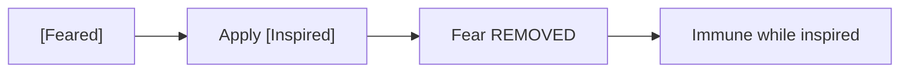

# [Inspired]

**Category:** Buff (Enhancement) | **Icon:** ✨

---

## 1. Overview

| Property | Value |
|----------|-------|
| **Type** | Morale + attack boost |
| **Duration** | 3 rounds |
| **Stacking** | No Stack |
| **Max Stacks** | 1 |
| **Cleanse Type** | N/A (beneficial) |

---

## 2. Description

> Character is filled with courage and determination. Attack bonus, fear immunity, and improved morale saves.

**Thematic:** Heart lifted by ally's words, ancestral spirits lending strength, or righteous fury.

---

## 3. Mechanical Effects

### 3.1 Morale Boost

```
Attack Bonus = +2d10 to attack rolls
Fear Immunity = IMMUNE to [Feared] while inspired
Morale Saves = +3d10 to WILL saves
```

### 3.2 Effect Details

| Aspect | Bonus |
|--------|-------|
| Attack rolls | +2d10 |
| vs [Feared] | Immune |
| WILL saves | +3d10 |
| Duration | 3 rounds |

---

## 4. Application Workflow

```mermaid
flowchart TD
    SOURCE[Inspiration source] --> APPLY[Apply [Inspired]]
    
    APPLY --> ALREADY{Already inspired?}
    ALREADY --> |Yes| REFRESH[Refresh duration]
    ALREADY --> |No| NEW[Apply fresh]
    
    NEW --> FEAR{Currently feared?}
    FEAR --> |Yes| CLEANSE[Fear immediately removed]
    FEAR --> |No| BUFF[Buff active]
```

### 4.1 Application Methods

| Source | Duration | Notes |
|--------|----------|-------|
| Skald "Inspire Valor" | 3 | Party-wide AoE |
| Berserkr "Battle Cry" | 2 | Self + allies |
| [Hero's Draught] | 3 | Consumable |

---

## 5. Key Interaction: Fear Cleanse

> [!TIP]
> **[Inspired] immediately cleanses [Feared]** and provides immunity for the duration.



---

## 6. Tactical Decision Tree

```mermaid
flowchart TD
    COMBAT[Combat] --> THREAT{Fear threats?}
    
    THREAT --> |Fear-based enemy| PREP[Pre-buff [Inspired]]
    THREAT --> |Ally feared| COUNTER[Inspire to cleanse]
    THREAT --> |No fear| OFFENSE[Inspire for +2d10 attacks]
    
    PREP --> IMMUNITY[Party immune to fear]
    COUNTER --> SAVE[Ally recovers immediately]
    OFFENSE --> DAMAGE[More hits = more damage]
```

### 6.1 Tactical Applications

| Situation | Application |
|-----------|-------------|
| **Fear-heavy encounter** | Pre-buff for immunity |
| **Rescue feared ally** | Inspire to cleanse |
| **Burst phase** | +2d10 attacks for party |
| **Boss mechanics** | Resist morale attacks |

---

## 7. Synergies

| Combination | Effect |
|-------------|--------|
| + [Fortified] | Defensive AND offensive boost |
| + [Hasted] | Attack faster AND harder |
| + Party composition | AoE inspire buffs everyone |

---

## 8. Balance Data

### 8.1 Buff Value
| Bonus | Rating | Context |
|-------|--------|---------|
| +2d10 Atk | High | Equivalent to +2 Attributes |
| Fear Immunity | Critical | Hard counter to major boss mechanic |

### 8.2 Application Cost
| Source | Stamina Cost | Duration |
|--------|--------------|----------|
| Battle Cry | 25 | 2 Rounds |
| Hero's Draught | 15 (Item) | 3 Rounds |

---

## 9. Voice Guidance

**Reference:** [combat-flavor.md](../../../.templates/flavor-text/combat-flavor.md)

### 9.1 Tone Profile
| Property | Value |
|----------|-------|
| **Visual** | Golden glow, head held high, resolute stance |
| **Audio** | Choral hum, rallying shout, clear steady voice |
| **Keywords** | Courage, valor, heart, spirit, stand |

### 9.2 Example Barks
> **Applied:** "We hold this ground!"
> **Resisting:** "Your terror has no hold here!"
> **Expired:** "The fire dims."

---

## 10. Phased Implementation Guide

### Phase 1: Core Mechanics
- [ ] **Modifier**: Create `InspiredStatus` class implementing `IStatModifier` and `IImmunityProvider`.
- [ ] **Stats**: Implement `+2d10` to Attack Rolls and `+3d10` to Will Saves.

### Phase 2: Logic Integration
- [ ] **Combat**: Hook into `ResolveAttack`.
- [ ] **Saves**: Hook into `ResolveSave`.
- [ ] **Immunity**: Return `True` for `IsImmune(StatusEffectType.Feared)`.

### Phase 3: Mitigation
- [ ] **Cleanse**: On Application -> Check for `Feared` -> Remove if present.

### Phase 4: UI & Feedback
- [ ] **Icon**: Shining star icon.
- [ ] **Floaters**: "Immune!" when Fear is attempted.

---

## 11. Testing Requirements

### 11.1 Unit Tests
- [ ] **Attack**: Base (6d10) + Inspired -> 8d10.
- [ ] **Save**: Base Will (4d10) + Inspired -> 7d10.
- [ ] **Immunity**: Apply Fear -> Returns Failed (Immune).
- [ ] **Cleanse**: Apply Fear -> Apply Inspire -> Fear removed.

### 11.2 Integration Tests
- [ ] **Combat**: Feared party member is Inspired -> Runs back into fight next turn.
- [ ] **Boss**: Fear Aura has no effect on Inspired party.

### 11.3 Manual QA
- [ ] **Visual**: Gold aura.
- [ ] **Log**: "Immune to Fear (Inspired)" message.

---

## 12. Logging Requirements

**Reference:** [logging.md](../../../00-project/logging.md)

### 12.1 Log Events
| Event | Level | Message Template | Properties |
|-------|-------|------------------|------------|
| Applied | Info | "{Target} is INSPIRED!" | `Target` |
| Cleanse Fear | Info | "{Target} shakes off the terror!" | `Target` |
| Immune | Info | "{Target} is immune to fear." | `Target` |

---

## 13. Related Documentation
| Document | Purpose |
|----------|---------|
| [Status Overview](overview.md) | System overview |
| [Feared](feared.md) | Counter-effect |

---

## 14. Changelog
| Version | Date | Changes |
|---------|------|---------|
| 1.0 | 2025-12-07 | Initial specification |
| 1.1 | 2025-12-14 | Standardized with Balance, Voice, Phased Guide, Testing, and Logging |
