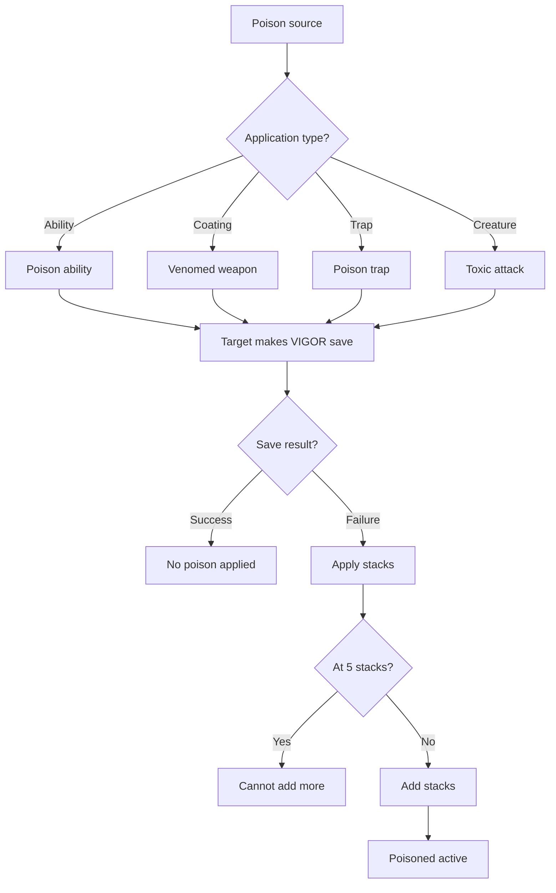
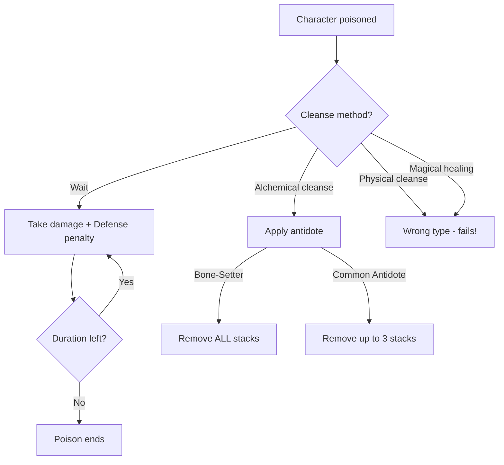
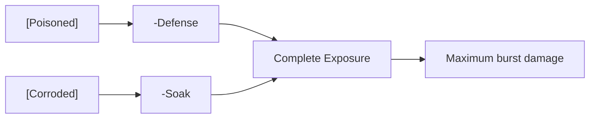

# [Poisoned]

**Category:** Debuff (DoT + Impairment) | **Icon:** ☠️

---

## 1. Overview

| Property | Value |
|----------|-------|
| **Type** | Alchemical DoT + Defense debuff |
| **Duration** | 3 rounds |
| **Stacking** | Intensify |
| **Max Stacks** | 5 |
| **Resistance** | VIGOR |
| **Cleanse Type** | Alchemical |

---

## 2. Description

> Character suffers toxic damage over time AND reduced Defense Score. Dual-threat debuff that both damages and softens target for party.

**Thematic:** Corrupting agent invading biological system — invasive internal sickness degrading from within.

---

## 3. Mechanical Effects

### 3.1 Dual Effect Formula

```
Damage per turn = 1d6 × Current Stacks
Defense Penalty = -2 × Current Stacks
```

| Stacks | Damage/Turn | Defense Penalty |
|--------|-------------|-----------------|
| 1 | 1d6 | -2 |
| 2 | 2d6 | -4 |
| 3 | 3d6 | -6 |
| 4 | 4d6 | -8 |
| 5 | 5d6 | -10 |

### 3.2 Key Differences from Bleeding

| Aspect | [Poisoned] | [Bleeding] |
|--------|-----------|----------|
| Damage Type | Poison | Physical |
| Soak | IS mitigated | Ignores Soak |
| Secondary | -Defense | None |
| Counter | Antidote | Bandage |

---

## 4. Application Workflow



### 4.1 Application Methods

| Source | Stacks | DC | Notes |
|--------|--------|-----|-------|
| Myr-Stalker "Envenomed Strike" | 1-2 | Varies | Melee |
| Spore Trap | 1 | 12 | AoE |
| Venom coating | 1 | 14 | 3 attacks |
| Veiðimaðr "Poisoned Arrow" | 2 | 14 | Single shot |
| Toxic creatures | 1-3 | Varies | Enemy attacks |

---

## 5. Resistance & Immunity

### 5.1 Resistance Check

| Property | Value |
|----------|-------|
| **Attribute** | VIGOR |
| **DC Range** | 10-16 |
| **Success** | No poison applied |
| **Failure** | Full stacks applied |

### 5.2 Immunity

| Entity Type | Reason |
|-------------|--------|
| **Constructs** | No biology to poison |
| **Incorporeal Undead** | No physical form |
| **Myr-Stalker** | Toxic Acclimation passive |

---

## 6. Cleansing Workflow



### 6.1 Cleanse Methods

| Method | Effect | Action |
|--------|--------|--------|
| Bone-Setter "Administer Antidote" | Remove all stacks | Standard |
| [Common Antidote] | Remove up to 3 stacks | Standard |
| [Alchemical Purge] | Remove all stacks | Item |

### 6.2 What Doesn't Work

- Bandages (physical, wrong type)
- Standard healing magic
- Apply Tourniquet (wrong type)

---

## 7. Tactical Decision Tree

```mermaid
flowchart TD
    ENCOUNTER[Combat situation] --> ENEMY{Enemy type?}
    
    ENEMY --> |High evasion| POISON[Prioritize poison!]
    ENEMY --> |High Soak| BLEED[Use [Bleeding] instead]
    ENEMY --> |Construct| IMMUNE[Cannot poison]
    
    POISON --> WHY{Why poison?}
    WHY --> |Reduce-Defense| PARTY[Party hits more often]
    WHY --> |DoT| DAMAGE[Damage while evading]
    
    PARTY --> COMBO{Combo with?}
    COMBO --> |[Corroded]| EXPOSURE[Complete exposure!]
    COMBO --> |Focus fire| BURST[Burst down target]
```

### 7.1 Tactical Applications

| Situation | Application |
|-----------|-------------|
| **High-evasion enemy** | -Defense makes them hittable |
| **Party coordination** | -10 Defense at 5 stacks = everyone hits |
| **Synergy with Corroded** | -Defense AND -Soak = maximum vulnerability |

### 7.2 Counter-Play

| Threat | Counter |
|--------|---------|
| Being poisoned | High VIGOR resistance |
| Stacked poison | Alchemist in party |
| Poison-focused enemy | Antidote consumables |

---

## 8. Synergies & Conflicts

### 8.1 Synergies (Complete Exposure Combo)



| Combination | Effect |
|-------------|--------|
| + [Corroded] | Target exposed: -Defense AND -Soak |
| + High-accuracy builds | More reliable hits |
| + Burst damage | Delete softened targets |

### 8.2 Conflicts

| Situation | Issue |
|-----------|-------|
| vs Constructs | Immune |
| vs Myr-Stalker | Immune |
| High-Soak targets | Poison damage gets soaked |

---

## 9. Comparison: Poison vs Bleed

| Factor | [Poisoned] | [Bleeding] |
|--------|-----------|----------|
| **Best vs** | Evasive targets | Tanks |
| **Damage** | Blocked by Soak | Ignores Soak |
| **Secondary** | -Defense | None |
| **Cleanse** | Antidote | Bandage |
| **Party benefit** | Everyone hits more | Personal damage |

---

## 10. Balance Data

### 10.1 Damage Efficiency
| Stacks | Damage/Turn | Turns to Kill (100 HP) | Rating |
|--------|-------------|------------------------|--------|
| 1 | 3.5 (1d6) | ~28 | Low |
| 5 | 17.5 (5d6) | ~6 | Very High |

### 10.2 Defense Penalty Value
| Stacks | Penalty | Hit Chance Increase | Rating |
|--------|---------|---------------------|--------|
| 1 | -2 | +10% | Moderate |
| 5 | -10 | +50% | Critical |

---

## 11. Voice Guidance

**Reference:** [combat-flavor.md](../../../.templates/flavor-text/combat-flavor.md)

### 11.1 Tone Profile
| Property | Value |
|----------|-------|
| **Visual** | Green veins, coughing, pale skin, stumbling |
| **Audio** | Retches, wet coughs, groans |
| **Keywords** | Sick, burning, venom, weakness |

### 11.2 Example Barks
> **Applied:** "It burns in my veins!"
> **Ticking:** *Violent coughing fit*
> **Recovered:** "The fever breaks..."

---

## 12. Phased Implementation Guide

### Phase 1: Core Mechanics
- [ ] **Modifier**: Create `PoisonedStatus` class implementing `IDamageStatus` and `IStatModifier`.
- [ ] **Stats**: Implement `-2 per stack` modifier to Defense.

### Phase 2: Logic Integration
- [ ] **Turn**: Implement `ProcessTurnStart` to deal Poison damage.
- [ ] **Stacking**: Implement `Intensify` logic (Add stacks up to 5).
- [ ] **Immunity**: Add check for Construct/UD tag.

### Phase 3: Mitigation
- [ ] **Soak**: Ensure Poison damage is checked against Soak (unlike Bleed).
- [ ] **Cleansing**: Implement Antidote item logic.

### Phase 4: UI & Feedback
- [ ] **Icon**: Green skull icon with stack count.
- [ ] **Floaters**: Green damage numbers on tick.

---

## 13. Testing Requirements

### 13.1 Unit Tests
- [ ] **Defense**: 1 Stack -> Defense -2. 5 Stacks -> Defense -10.
- [ ] **Damage**: 5 Stacks -> Deals 5d6 damage.
- [ ] **Soak**: Poison Damage (10) vs Soak (5) -> Takes 5 Damage.
- [ ] **Immunity**: Apply to Construct -> Returns Failed.

### 13.2 Integration Tests
- [ ] **Combat**: Poisoned target gets hit more often due to Defense penalty.
- [ ] **Cleanse**: Antidote removes stacks correctly.

### 13.3 Manual QA
- [ ] **Visual**: Green veins shader on model (optional) or icon.
- [ ] **Log**: "Taken 15 Poison Damage (Soaked 5)" message.

---

## 14. Logging Requirements

**Reference:** [logging.md](../../../00-project/logging.md)

### 14.1 Log Events
| Event | Level | Message Template | Properties |
|-------|-------|------------------|------------|
| Applied | Info | "{Target} is POISONED ({Stacks} stacks)!" | `Target`, `Stacks` |
| Intensify | Info | "{Target}'s poison intensifies! ({Old} -> {New})" | `Target`, `Old`, `New` |
| Tick | Info | "{Target} suffers {Damage} poison damage." | `Target`, `Damage` |
| Immune | Info | "{Target} is immune to poison." | `Target` |

---

## 15. Related Documentation
| Document | Purpose |
|----------|---------|
| [Status Overview](overview.md) | System overview |
| [Alchemy](../../04-systems/crafting/alchemy.md) | Antidote source |
| [Bleeding](bleeding.md) | Comparison mechanic |

---

## 16. Changelog
| Version | Date | Changes |
|---------|------|---------|
| 1.0 | 2025-12-07 | Initial specification |
| 1.1 | 2025-12-14 | Standardized with Balance, Voice, Phased Guide, Testing, and Logging |
