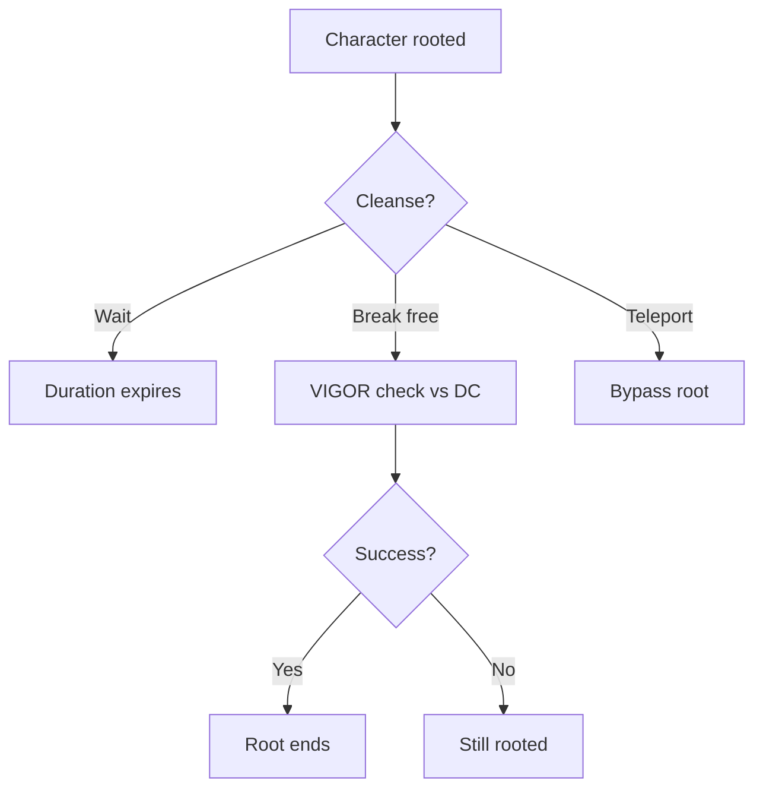
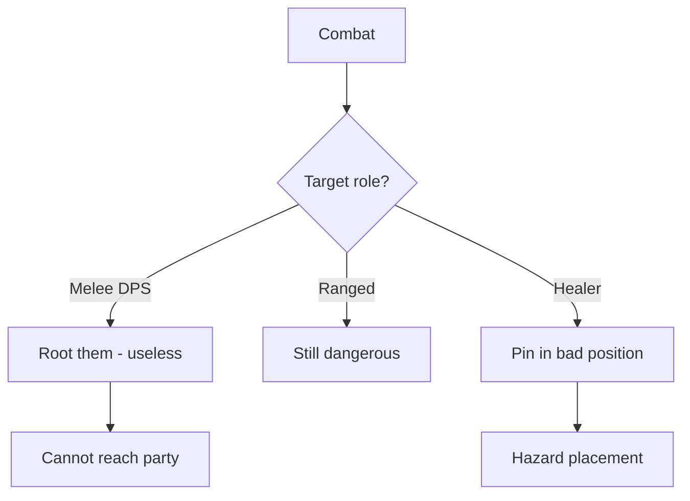

# [Rooted]

**Category:** Debuff (Soft Control) | **Icon:** 🌿

---

## 1. Overview

| Property | Value |
|----------|-------|
| **Type** | Movement denial |
| **Duration** | 2-3 rounds |
| **Stacking** | No Stack |
| **Max Stacks** | 1 |
| **Resistance** | VIGOR |
| **Cleanse Type** | Physical |

---

## 2. Description

> Character cannot move from current position but can still act. Movement completely denied, but attacks and abilities function normally.

**Thematic:** Feet locked in place — entangling vines, ice frozen to ground, or psychic anchor.

---

## 3. Mechanical Effects

### 3.1 Movement Denial

```
Movement Speed = 0 (cannot move)
Can still: Attack, Use abilities, Defend
Cannot: Move, Charge, Retreat
```

### 3.2 What [Rooted] Does NOT Affect

| Can Do | Cannot Do |
|--------|-----------|
| Standard Actions | Move |
| Free Actions | Charge |
| Reactions | Retreat |
| Ranged attacks | Reposition |
| Defense | Flee |

---

## 4. Application Workflow

```mermaid
flowchart TD
    SOURCE[Root source] --> RESIST[Target makes VIGOR save]
    
    RESIST --> RESULT{Save result?}
    RESULT --> |Success| BLOCKED[No root]
    RESULT --> |Failure| APPLY[Apply [Rooted]]
    
    APPLY --> ALREADY{Already rooted?}
    ALREADY --> |Yes| BLOCKED2[No stack - blocked]
    ALREADY --> |No| ACTIVE[Rooted active]
```

### 4.1 Application Methods

| Source | Duration | DC | Notes |
|--------|----------|-----|-------|
| Entangling vines | 2 | 12 | Nature ability |
| Ice trap | 3 | 14 | Cold ability |
| Binding sigil | 2 | 14 | Runeforging |
| Grapple | Varies | Contested | Physical |

---

## 5. Resistance & Immunity

### 5.1 Resistance Check

| Property | Value |
|----------|-------|
| **Attribute** | VIGOR |
| **DC Range** | 12-16 |
| **Success** | No root applied |
| **Failure** | Apply [Rooted] |

### 5.2 Immunity

| Entity Type | Reason |
|-------------|--------|
| **Incorporeal** | Phase through bindings |
| **Teleporters** | Alternative escape |
| **Flying** | Not touching ground |

---

## 6. Cleansing Workflow



### 6.1 Cleanse Methods

| Method | Effect | Action |
|--------|--------|--------|
| Break free check | VIGOR vs DC | Standard |
| Natural expiration | Ends after duration | None |
| Teleport abilities | Bypass root | Ability |

---

## 7. Tactical Decision Tree



### 7.1 Tactical Applications

| Situation | Application |
|-----------|-------------|
| **vs Melee** | Completely neutralizes threat |
| **Zone control** | Keep enemies in hazards |
| **Protecting backline** | Root advancing enemies |

---

## 8. Synergies

| Combination | Effect |
|-------------|--------|
| + [Slowed] | Total lockdown when root ends |
| + Ranged party | Free shots at stuck target |
| + Hazard zones | Forced to stand in fire |
| + AoE attacks | Easy targeting |

---

## 9. Balance Data

### 9.1 Control Value Model
| Duration | Value Rating | Context |
|----------|--------------|---------|
| 2 Rounds | High | Stops Melee completely |
| 3 Rounds | Critical | Death sentence against Ranged party |

### 9.2 Cost per Application
| Source | Stamina Cost | DC |
|--------|--------------|----|
| Vine Trap (Skill) | 25 | 12 |
| Ice Spell | 40 | 14 |

---

## 10. Voice Guidance

**Reference:** [combat-flavor.md](../../../.templates/flavor-text/combat-flavor.md)

### 10.1 Tone Profile
| Property | Value |
|----------|-------|
| **Visual** | Vines erupting, ice freezing feet, boots stuck in mire |
| **Audio** | Cracking wood, snapping ice, squelching mud |
| **Keywords** | Stuck, trapped, bound, held, frozen |

### 10.2 Example Barks
> **Applied:** "Can't... move!"
> **Struggling:** *Grunts of effort*
> **Recovered:** "Free! I'm free!"

---

## 11. Phased Implementation Guide

### Phase 1: Core Mechanics
- [ ] **Modifier**: Create `RootedStatus` class implementing `IStatModifier` and `IMovementBlocker`.
- [ ] **Stats**: Implement `MovementSpeed = 0` override.

### Phase 2: Logic Integration
- [ ] **Movement**: Hook into `CalculateMovementRange` to return 0.
- [ ] **Actions**: Ensure Dash/Charge abilities are disabled.
- [ ] **Cleanse**: Implement `BreakFree` action (Standard Action, Vigor Check).

### Phase 3: Mitigation
- [ ] **Immunity**: Check Flying/Incorporeal tags.
- [ ] **Teleport**: Ensure Teleport abilities bypass Root check.

### Phase 4: UI & Feedback
- [ ] **Grid**: Movement grid shows 0 range (Red tint?).
- [ ] **Icon**: Vines wrapping legs icon.

---

## 12. Testing Requirements

### 12.1 Unit Tests
- [ ] **Movement**: Base (6) + Rooted -> Speed (0).
- [ ] **Action**: CanMove() returns False. CanAct() returns True.
- [ ] **Break**: BreakFree Check Success -> Root Removed.

### 12.2 Integration Tests
- [ ] **Pathfinding**: Player cannot select any tile to move to.
- [ ] **Teleport**: Player can still use "Blink" to move.

### 12.3 Manual QA
- [ ] **Visual**: Vines model at feet.
- [ ] **Log**: "Rooted by Vines" message.

---

## 13. Logging Requirements

**Reference:** [logging.md](../../../00-project/logging.md)

### 13.1 Log Events
| Event | Level | Message Template | Properties |
|-------|-------|------------------|------------|
| Applied | Info | "{Target} is ROOTED!" | `Target` |
| Break Attempt | Info | "{Target} struggles against the roots (Roll: {Roll})." | `Target`, `Roll` |
| Break Success | Info | "{Target} breaks free!" | `Target` |
| Expire | Debug | "{Target} is no longer rooted." | `Target` |

---

## 14. Related Documentation
| Document | Purpose |
|----------|---------|
| [Status Overview](overview.md) | System overview |
| [Slowed](slowed.md) | Synergy effect |

---

## 15. Changelog
| Version | Date | Changes |
|---------|------|---------|
| 1.0 | 2025-12-07 | Initial specification |
| 1.1 | 2025-12-14 | Standardized with Balance, Voice, Phased Guide, Testing, and Logging |
