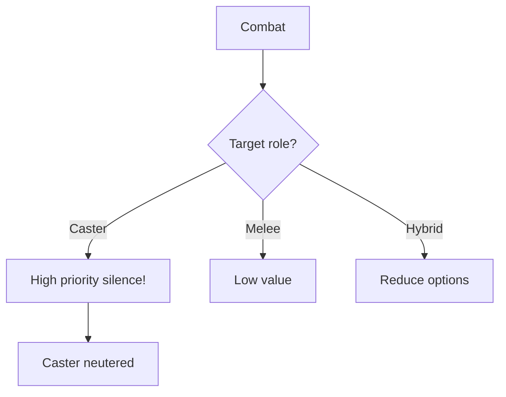

# [Silenced]

**Category:** Debuff (Soft Control) | **Icon:** 🔇

---

## 1. Overview

| Property | Value |
|----------|-------|
| **Type** | Ability denial |
| **Duration** | 2 rounds |
| **Stacking** | No Stack |
| **Max Stacks** | 1 |
| **Resistance** | WILL |
| **Cleanse Type** | Mental |

---

## 2. Description

> Character cannot use verbal component abilities (spells, Galdr, commands). Can still attack physically and use non-verbal abilities.

**Thematic:** Voice caught in throat, psychic interference disrupting command protocols, or throat injury.

---

## 3. Mechanical Effects

### 3.1 Ability Restriction

```
Verbal abilities = BLOCKED
Physical attacks = ALLOWED
Non-verbal abilities = ALLOWED
```

| Can Do | Cannot Do |
|--------|-----------|
| Physical attacks | Cast spells |
| Move | Use Galdr |
| Defend | Issue commands |
| Non-verbal abilities | Verbal abilities |

### 3.2 Affected Ability Types

| Type | Affected? |
|------|-----------|
| Galdr (runic magic) | Yes |
| Command abilities | Yes |
| Shouts/roars | Yes |
| Physical attacks | No |
| Passive abilities | No |

---

## 4. Application Workflow

```mermaid
flowchart TD
    SOURCE[Silence source] --> RESIST[Target makes WILL save]
    
    RESIST --> RESULT{Save result?}
    RESULT --> |Success| BLOCKED[No silence]
    RESULT --> |Failure| APPLY[Apply [Silenced]]
    
    APPLY --> ALREADY{Already silenced?}
    ALREADY --> |Yes| BLOCKED2[No stack]
    ALREADY --> |No| ACTIVE[Silenced active]
```

### 4.1 Application Methods

| Source | Duration | DC | Notes |
|--------|----------|-----|-------|
| Skald "Silencing Word" | 2 | 14 | Counter-magic |
| Throat strike | 1 | 12 | Physical |
| Psychic disruption | 2 | 16 | Mental attack |

---

## 5. Resistance & Immunity

### 5.1 Resistance Check

| Property | Value |
|----------|-------|
| **Attribute** | WILL |
| **DC Range** | 12-16 |

### 5.2 Immunity

| Entity Type | Reason |
|-------------|--------|
| **Constructs** | No verbal component |
| **Mute creatures** | Already non-verbal |

---

## 6. Tactical Decision Tree



### 6.1 Tactical Applications

| Situation | Application |
|-----------|-------------|
| **vs Casters** | Completely neutralizes |
| **vs Commanders** | Blocks command abilities |
| **vs Healers** | Blocks verbal heals |

---

## 7. Balance Data

### 7.1 Control Value Model
| Duration | Value Rating | Context |
|----------|--------------|---------|
| 2 Rounds | High | Neutered Boss/Caster |
| 3 Rounds | Critical | Prolonged shutdown |

### 7.2 Application Cost
| Source | Stamina Cost | DC |
|--------|--------------|----|
| Silencing Word | 30 | 14 |
| Throat Strike | 20 (Called Shot) | 12 |

---

## 8. Voice Guidance

**Reference:** [combat-flavor.md](../../../.templates/flavor-text/combat-flavor.md)

### 8.1 Tone Profile
| Property | Value |
|----------|-------|
| **Visual** | Clutching throat, runic gag, mute mouth |
| **Audio** | Choking sounds, muted static |
| **Keywords** | Mute, quiet, hush, choke |

### 8.2 Example Barks
> **Applied:** "Mmmph!"
> **Trying to cast:** *Gags silently, runelight failing*
> **Recovered:** "*Gasps* ...breath returns."

---

## 9. Phased Implementation Guide

### Phase 1: Core Mechanics
- [ ] **Modifier**: Create `SilencedStatus` class.
- [ ] **Stats**: Implement boolean `IsSilenced` state.

### Phase 2: Logic Integration
- [ ] **Abilities**: Add `Tags.Verbal` to abilities.
- [ ] **Check**: In `AbilityManager.CanCast()`, check `IsSilenced` vs `Ability.HasTag(Verbal)`.

### Phase 3: Mitigation
- [ ] **Immunity**: Check Construct tag.
- [ ] **Check**: Galdr/Shouts blocked, but Strikes allowed.

### Phase 4: UI & Feedback
- [ ] **Icon**: Mute speaker icon.
- [ ] **Tooltip**: "Silenced" on ability buttons (Greyed out).

---

## 10. Testing Requirements

### 10.1 Unit Tests
- [ ] **Block**: Silenced + Cast Fireball (Verbal) -> False.
- [ ] **Allow**: Silenced + Slash (Physical) -> True.
- [ ] **Duration**: 2 Rounds -> Decrements correctly.

### 10.2 Integration Tests
- [ ] **Combat**: Enemy Caster tries to cast, fails, forced to use melee or pass.
- [ ] **UI**: Player spellbar grays out verbal spells.

### 10.3 Manual QA
- [ ] **Visual**: Gagged model/icon.
- [ ] **Log**: "Failed to cast (Silenced)" message.

---

## 11. Logging Requirements

**Reference:** [logging.md](../../../00-project/logging.md)

### 11.1 Log Events
| Event | Level | Message Template | Properties |
|-------|-------|------------------|------------|
| Applied | Info | "{Target} is SILENCED!" | `Target` |
| Blocked | Info | "{Target} tries to speak, but no sound comes out." | `Target` |
| Expire | Debug | "{Target} can speak again." | `Target` |

---

## 12. Related Documentation
| Document | Purpose |
|----------|---------|
| [Status Overview](overview.md) | System overview |
| [Attributes](../../01-core/attributes/will.md) | WILL resistance source |

---

## 13. Changelog
| Version | Date | Changes |
|---------|------|---------|
| 1.0 | 2025-12-07 | Initial specification |
| 1.1 | 2025-12-14 | Standardized with Balance, Voice, Phased Guide, Testing, and Logging |
