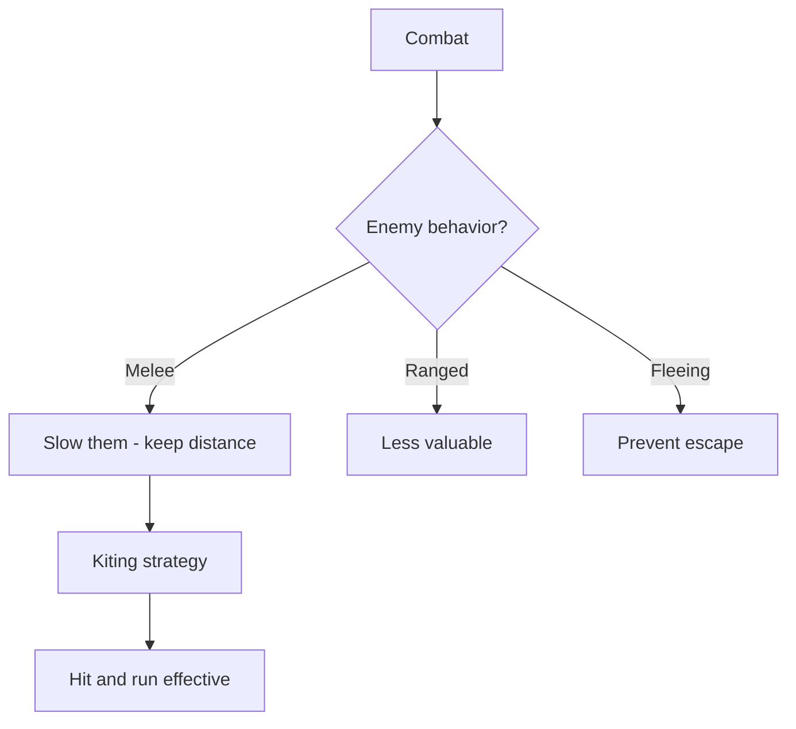

# [Slowed]

**Category:** Debuff (Impairment) | **Icon:** 🐢

---

## 1. Overview

| Property | Value |
|----------|-------|
| **Type** | Movement reduction |
| **Duration** | 2-3 rounds |
| **Stacking** | Refresh |
| **Max Stacks** | 1 |
| **Resistance** | VIGOR |
| **Cleanse Type** | Physical |

---

## 2. Description

> Character's movement speed is reduced by half. Can still act normally, but cannot reposition effectively.

**Thematic:** System operating at reduced efficiency — damaged locomotion, numbed muscles, or psychic weight.

---

## 3. Mechanical Effects

### 3.1 Movement Reduction

```
Movement Speed = Base Speed × 0.5
```

| Base Speed | Slowed Speed |
|------------|--------------|
| 6 tiles | 3 tiles |
| 8 tiles | 4 tiles |
| 10 tiles | 5 tiles |

### 3.2 What [Slowed] Does NOT Affect

- Standard Actions (full attacks still possible)
- Free Actions
- Reactions (Parry, Block)
- Defense Score

---

## 4. Application Workflow

```mermaid
flowchart TD
    SOURCE[Slow source] --> RESIST[Target makes VIGOR save]
    
    RESIST --> RESULT{Save result?}
    RESULT --> |Success| BLOCKED[No slow]
    RESULT --> |Failure| APPLY[Apply [Slowed]]
    
    APPLY --> EXISTING{Already slowed?}
    EXISTING --> |Yes| REFRESH[Refresh duration]
    EXISTING --> |No| NEW[Apply fresh]
    
    REFRESH --> ACTIVE[Slowed active]
    NEW --> ACTIVE
```

### 4.1 Application Methods

| Source | Duration | DC | Notes |
|--------|----------|-----|-------|
| Ice/cold effects | 2 | 12 | Numbed muscles |
| Leg injuries | 3 | 14 | Physical damage |
| Web/entangle | 2 | 12 | Restraints |
| Exhaustion | 3 | - | Automatic |

---

## 5. Resistance & Immunity

### 5.1 Resistance Check

| Property | Value |
|----------|-------|
| **Attribute** | VIGOR |
| **DC Range** | 10-14 |
| **Success** | No slow applied |
| **Failure** | Apply [Slowed] |

### 5.2 Immunity

| Entity Type | Reason |
|-------------|--------|
| **Incorporeal** | No physical movement |
| **Teleporters** | Alternative movement |

---

## 6. Cleansing Workflow

```mermaid
flowchart TD
    SLOWED[Character slowed] --> METHOD{Cleanse?}
    
    METHOD --> |Wait| EXPIRE[Duration expires]
    METHOD --> |[Hasted]| COUNTER[Haste counters slow]
    METHOD --> |Mobility ability| OVERRIDE[Temporary override]
    
    COUNTER --> CANCEL[Effects cancel out]
```

### 6.1 Cleanse Methods

| Method | Effect |
|--------|--------|
| [Hasted] buff | Cancels [Slowed] |
| Natural expiration | Ends after duration |
| Mobility abilities | May override |

---

## 7. Tactical Decision Tree



### 7.1 Tactical Applications

| Situation | Application |
|-----------|-------------|
| **Kiting melees** | Slow + ranged attacks |
| **Preventing escape** | Slow fleeing enemies |
| **Zone control** | Keep enemies in hazards |

---

## 8. Synergies

| Combination | Effect |
|-------------|--------|
| + [Rooted] | Complete immobilization |
| + Ranged party | Enemies can't close |
| + Hazard zones | Enemies stuck in fire/acid |

---

## 9. Balance Data

### 9.1 Movement Value Model
| Reduction | Value Rating | Context |
|-----------|--------------|---------|
| 50% Speed | High | Melee kiting effective |
| 75% Speed | Critical | Only rarely available |

### 9.2 Cost per Application
| Source | Stamina Cost | Duration |
|--------|--------------|----------|
| Leg Shot | 20 | 2 Rounds |
| Frost Spell | 30 | 3 Rounds |

---

## 10. Voice Guidance

**Reference:** [combat-flavor.md](../../../.templates/flavor-text/combat-flavor.md)

### 10.1 Tone Profile
| Property | Value |
|----------|-------|
| **Visual** | Frost forming, limping gait, heavy breathing |
| **Audio** | Dragging footsteps, labored breath |
| **Keywords** | Numbs, drags, freezes, heaviness |

### 10.2 Example Barks
> **Applied:** "Legs... like lead..."
> **Moving:** *Groans with effort*
> **Recovered:** "Blood flows again."

---

## 11. Phased Implementation Guide

### Phase 1: Core Mechanics
- [ ] **Modifier**: Create `SlowedStatus` class implementing `IStatModifier`.
- [ ] **Stats**: Implement `-50%` multiplier to Movement Speed.

### Phase 2: Logic Integration
- [ ] **Movement**: Hook into `CalculateMovementRange()`.
- [ ] **Stacking**: Implement `Refresh` logic (reset duration to Max).
- [ ] **Counter**: Check for `Hasted` status; if present, cancel both.

### Phase 3: Mitigation
- [ ] **Haste**: Start Hasted -> Apply Slow -> Both Removed.
- [ ] **Duration**: Ensure decrements correctly.

### Phase 4: UI & Feedback
- [ ] **Grid**: Show reduced movement range overlay (blue tint?).
- [ ] **Icon**: Turtle/Ice icon.

---

## 12. Testing Requirements

### 12.1 Unit Tests
- [ ] **Movement**: Speed (6) + Slowed -> Speed (3).
- [ ] **Stacking**: Apply Slow (2 turns) -> Wait 1 turn -> Apply Slow (2 turns) -> Duration is 2 (Refreshed).
- [ ] **Cancellation**: Hasted + Slowed -> Both removed.

### 12.2 Integration Tests
- [ ] **Pathfinding**: Character can only move 3 tiles instead of 6.
- [ ] **Combat**: Enemies kite slowed character successfully? (AI Behavior).

### 12.3 Manual QA
- [ ] **Visual**: Movement grid shrinks when slowed.
- [ ] **Log**: "Slowed refreshed" message appears.

---

## 13. Logging Requirements

**Reference:** [logging.md](../../../00-project/logging.md)

### 13.1 Log Events
| Event | Level | Message Template | Properties |
|-------|-------|------------------|------------|
| Applied | Info | "{Target} is SLOWED by {Source}." | `Target`, `Source` |
| Refreshed | Debug | "{Target}'s slow duration refreshed." | `Target` |
| Cancelled | Info | "{Target}'s haste cancels the slow!" | `Target` |

---

## 14. Related Documentation
| Document | Purpose |
|----------|---------|
| [Status Overview](overview.md) | System overview |
| [Hasted](hasted.md) | Counter-effect |

---

## 15. Changelog
| Version | Date | Changes |
|---------|------|---------|
| 1.0 | 2025-12-07 | Initial specification |
| 1.1 | 2025-12-14 | Standardized with Balance, Voice, Phased Guide, Testing, and Logging |
