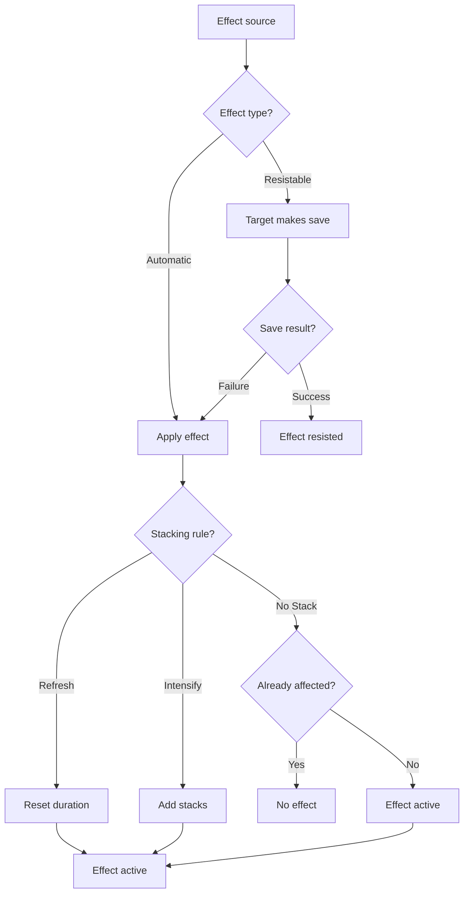
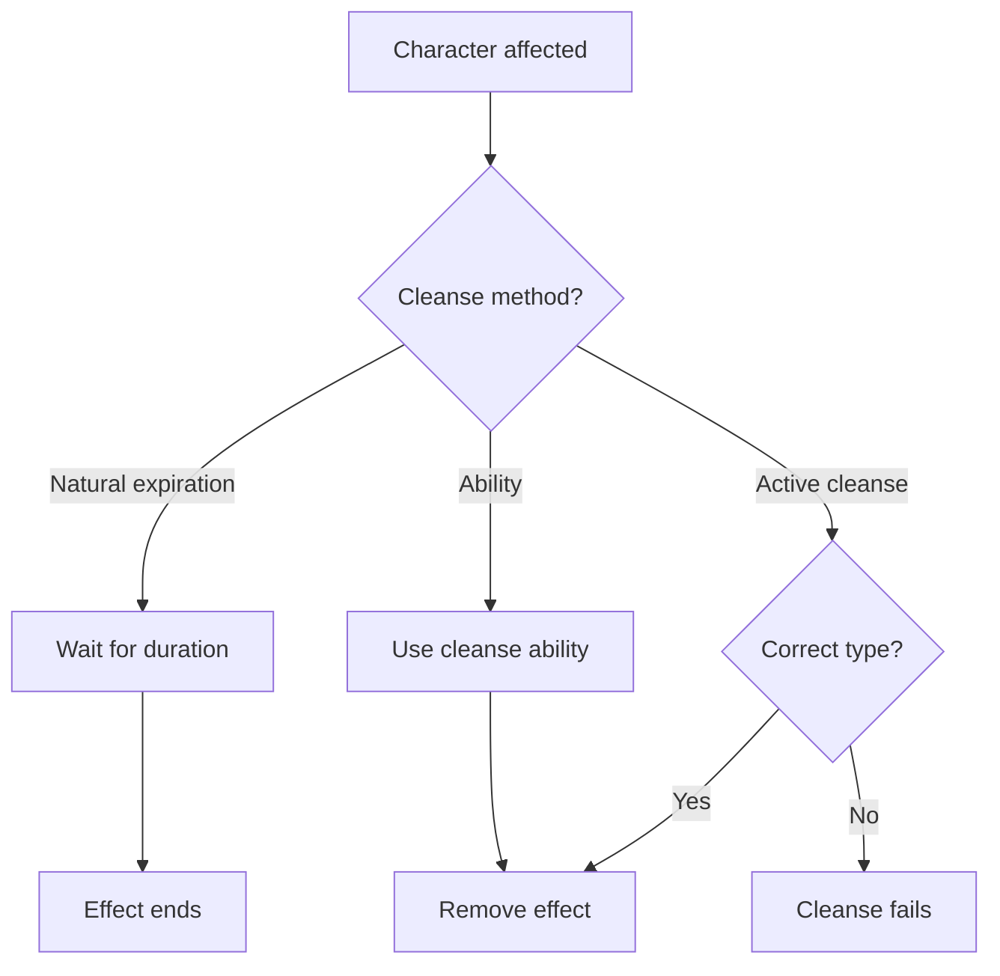

# Status Effect System

---

## 1. Overview

Status effects are temporary conditions that modify a character's capabilities. They can be **debuffs** (negative) or **buffs** (positive), and each has specific application, resistance, and cleansing mechanics.

---

## 2. Effect Categories

### 2.1 Debuffs

| Category | Description | Effects |
|----------|-------------|---------|
| **Control** | Restrict actions | [Stunned], [Rooted], [Silenced] |
| **DoT** | Damage over time | [Bleeding], [Poisoned], [Corroded] |
| **Impairment** | Reduce capabilities | [Slowed], [Disoriented], [Feared] |

### 2.2 Buffs

| Category | Description | Effects |
|----------|-------------|---------|
| **Enhancement** | Boost capabilities | [Hasted], [Fortified], [Inspired] |

---

## 3. Universal Mechanics

### 3.1 Duration Types

| Type | Behavior | Example |
|------|----------|---------|
| **Fixed Rounds** | Lasts X turns | [Stunned] 1 round |
| **Concentration** | Until caster ends/damaged | Channeled effects |
| **Until Cleansed** | Must be actively removed | [Poisoned] with antidote |

### 3.2 Stacking Rules

| Rule | Behavior | Effects Using |
|------|----------|---------------|
| **No Stack** | Cannot reapply while active | [Stunned] |
| **Refresh** | Resets duration, same intensity | [Slowed] |
| **Intensify** | Stacks increase effect strength | [Bleeding], [Poisoned] |

### 3.3 Duration Decrement

All durations decrease at **start of affected character's turn**.

---

## 4. Application Workflow



---

## 5. Resistance System

### 5.1 Resistance Types

| Type | Attribute | Used For |
|------|-----------|----------|
| **Physical Resolve** | VIGOR | [Stunned], [Bleeding], [Poisoned] |
| **Mental Resolve** | WILL | [Feared], [Disoriented] |
| **Reflex** | FINESSE | Area effects |

### 5.2 Resistance Check

```
Pool = Attribute dice
DC = Set by ability (typically 10-20)
Success = Successes ≥ DC threshold
```

### 5.3 Immunity

Some entities are immune to specific effects:
- **Constructs**: Immune to [Bleeding], [Poisoned]
- **Bosses**: Immune to [Stunned]
- **Incorporeal**: Immune to physical effects

---

## 6. Cleansing System

### 6.1 Cleanse Types

| Type | Methods | Effects Cleansed |
|------|---------|------------------|
| **Physical** | Bandages, first aid | [Bleeding] |
| **Alchemical** | Antidotes, potions | [Poisoned], [Corroded] |
| **Mental** | Rallying, abilities | [Feared], [Disoriented] |
| **None** | Must expire naturally | [Stunned] |

### 6.2 Cleansing Workflow



---

## 7. Effect Index

### 7.1 Debuffs

| Effect | Category | Stacking | Max | Spec |
|--------|----------|----------|-----|------|
| [Bleeding](bleeding.md) | DoT | Intensify | 5 | Full |
| [Poisoned](poisoned.md) | DoT + Impair | Intensify | 5 | Full |
| [Corroded](corroded.md) | DoT + Impair | Intensify | 5 | Full |
| [Stunned](stunned.md) | Control | No Stack | 1 | Full |
| [Rooted](rooted.md) | Control | No Stack | 1 | Full |
| [Silenced](silenced.md) | Control | No Stack | 1 | Full |
| [Slowed](slowed.md) | Impairment | Refresh | 1 | Full |
| [Disoriented](disoriented.md) | Impairment | Refresh | 1 | Full |
| [Feared](feared.md) | Impairment | Refresh | 1 | Full |

### 7.2 Buffs

| Effect | Category | Stacking | Max | Spec |
|--------|----------|----------|-----|------|
| [Hasted](hasted.md) | Enhancement | No Stack | 1 | Full |
| [Fortified](fortified.md) | Enhancement | No Stack | 1 | Full |
| [Inspired](inspired.md) | Enhancement | No Stack | 1 | Full |

---

## 8. Tactical Interactions

### 8.1 Synergy Combinations

| Combo | Effects | Result |
|-------|---------|--------|
| **Complete Exposure** | [Poisoned] + [Corroded] | -Defense AND -Soak |
| **Lockdown** | [Rooted] + [Slowed] | Cannot move at all |
| **Burst Window** | [Stunned] + any DoT | Free damage turns |

### 8.2 Counter Strategies

| Status | Counter |
|--------|---------|
| DoT stacking | Bone-Setter cleanses |
| Control effects | High VIGOR/WILL saves |
| Debuff spam | Buff immunity abilities |

---

## 9. Integration Points

| System | Integration |
|--------|-------------|
| **Combat** | Core status application |
| **Alchemy** | Poison/antidote crafting |
| **Abilities** | Source of most effects |
| **Equipment** | Resistance bonuses |

---

## 10. Technical Implementation

### 10.1 Data Structures

```csharp
public enum StatusEffectType
{
    Bleeding, Poisoned, Corroded, // DoT
    Stunned, Rooted, Silenced,    // Control
    Slowed, Disoriented, Feared,  // Impairment
    Hasted, Fortified, Inspired   // Buffs
}

public class ActiveStatusEffect
{
    public StatusEffectType Type { get; set; }
    public int DurationRemaining { get; set; }
    public int Stacks { get; set; }
    public IEffectSource Source { get; set; }
}

public interface IStatusEffectManager
{
    void ApplyEffect(Character target, StatusEffectType type, int duration, int stacks = 1);
    void RemoveEffect(Character target, StatusEffectType type);
    void ProcessTurnStart(Character character);
    bool HasEffect(Character character, StatusEffectType type);
    int GetStackCount(Character character, StatusEffectType type);
}
```

---

## 11. Phased Implementation Guide

### Phase 1: Core System
- [ ] **Enum**: Define `StatusEffectType`.
- [ ] **Model**: Create `ActiveStatusEffect` class.
- [ ] **Manager**: Implement `StatusEffectManager` basics (Apply/Remove).

### Phase 2: Turn Processing
- [ ] **Tick**: Implement `ProcessTurnStart` to decrement durations and Apply DoT damage.
- [ ] **Expiration**: Auto-remove effects when duration reaches 0.

### Phase 3: Effect Logic Hookups
- [ ] **Modifiers**: Implement stat modifiers (e.g., Slowed -> Speed -1).
- [ ] **Control**: Implement action blocking (e.g., Stunned -> Skip Turn).

### Phase 4: UI & Feedback
- [ ] **Icons**: Display active status icons on Unit Frames.
- [ ] **Floating Text**: Show "Stunned!" or "-5 HP (Bleed)" popups.

---

## 12. Testing Requirements

### 12.1 Unit Tests
- [ ] **Application**: Apply Stunned (1 turn) -> character.HasEffect(Stunned) is true.
- [ ] **Stacking**: Apply Bleed (3) + Bleed (2) with Intensify -> Stacks = 5.
- [ ] **Expiration**: ProcessTurn with Duration 1 -> Duration 0 -> Effect Removed.
- [ ] **Immunity**: Apply Poison to Construct -> Effect not applied.

### 12.2 Integration Tests
- [ ] **Combat**: Stunned character skips turn in Game Loop.
- [ ] **Cleanse**: Use Antidote -> Poisoned effect currently active is removed.

### 12.3 Manual QA
- [ ] **Visual**: Apply effect -> Icon appears with tooltip.
- [ ] **Log**: Verify combat log shows "Character is Stunned."

---

## 13. Logging Requirements

**Reference:** [logging.md](../../../00-project/logging.md)

### 13.1 Log Events

| Event | Level | Message Template | Properties |
|-------|-------|------------------|------------|
| Apply | Info | "{Target} gained {Effect} ({Duration} turns)." | `Target`, `Effect`, `Duration` |
| Resist | Info | "{Target} resisted {Effect}." | `Target`, `Effect` |
| Expire | Debug | "{Effect} on {Target} expired." | `Target`, `Effect` |
| Tick | Info | "{Target} takes {Damage} damage from {Effect}." | `Target`, `Damage`, `Effect` |

---

## 14. Related Documentation

| Document | Purpose |
|----------|---------|
| [Combat System](../../03-combat/combat-resolution.md) | Combat integration |
| [Alchemy](../../04-systems/crafting/alchemy.md) | Poison crafting |

---

## 15. Changelog

| Version | Date | Changes |
|---------|------|---------|
| 1.0 | 2025-12-07 | Initial specification |
| 1.1 | 2025-12-14 | Standardized with Technical Implementation, Phased Guide, Testing, and Logging |
