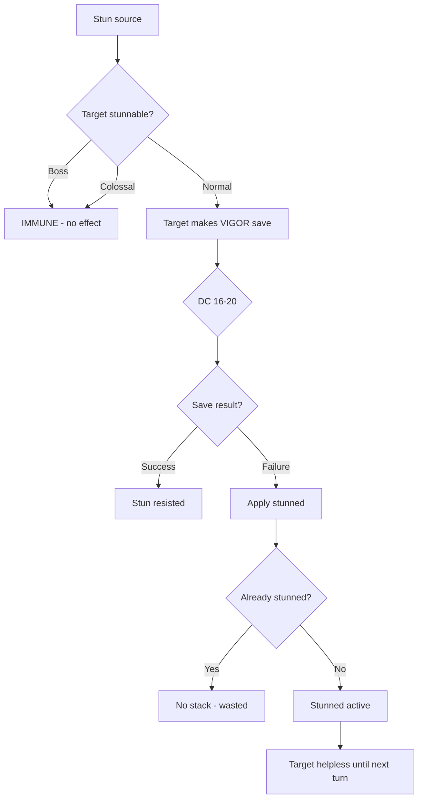
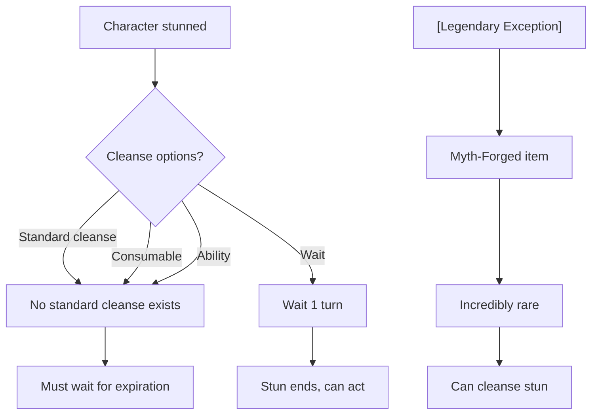
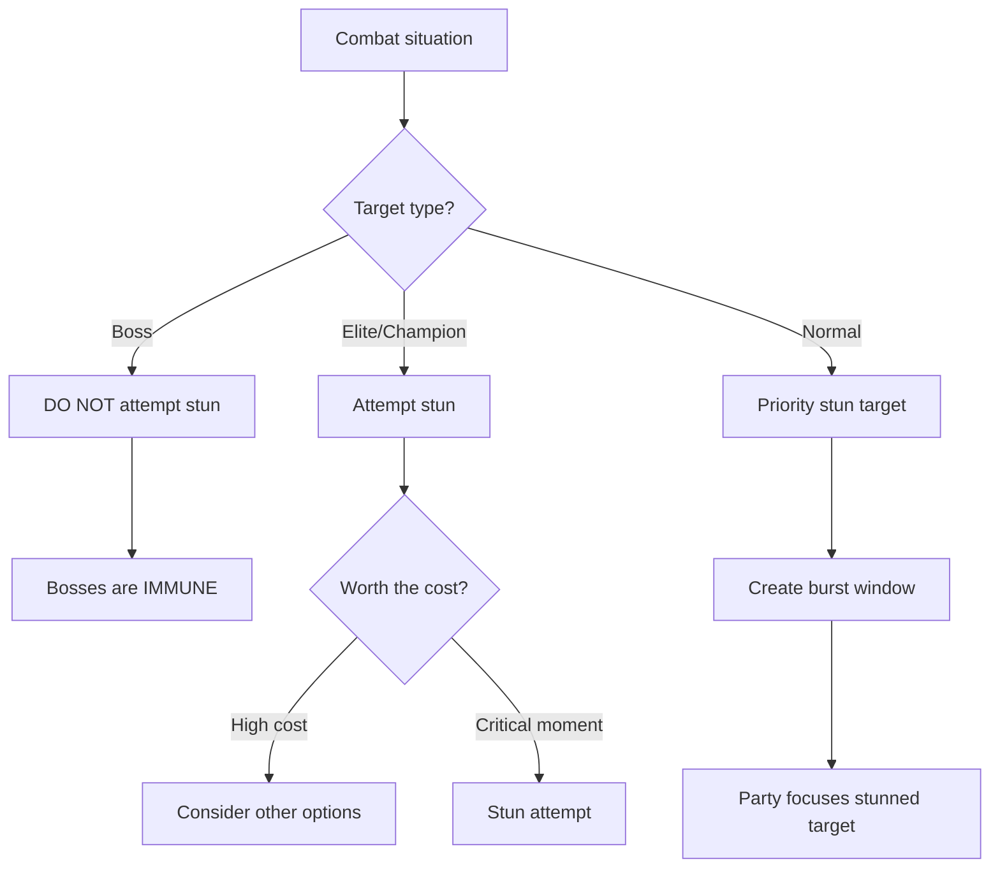
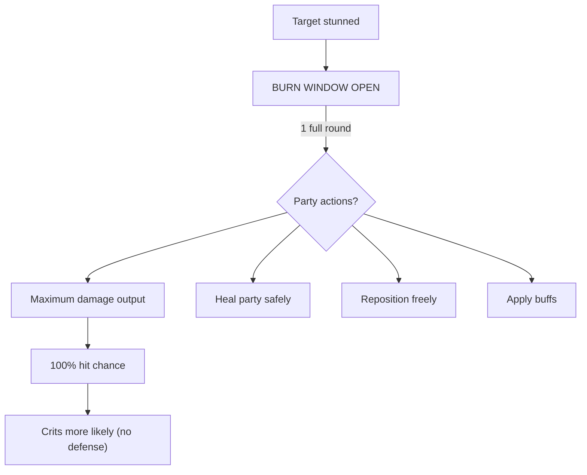
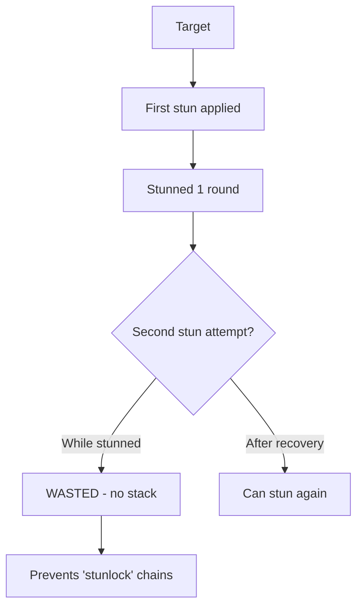

# [Stunned]

**Category:** Debuff (Hard Control) | **Icon:** 💥

---

## 1. Overview

| Property | Value |
|----------|-------|
| **Type** | Turn denial + vulnerability |
| **Duration** | 1 round (rarely 2) |
| **Stacking** | No Stack |
| **Max Stacks** | 1 |
| **Resistance** | VIGOR |
| **Cleanse Type** | None |

---

## 2. Description

> Most potent hard control effect. Character loses entire turn AND becomes completely defenseless. Cannot act, Defense reduced to zero, all incoming attacks guaranteed hits.

**Thematic:** Critical temporary system crash — overwhelming concussive force causing all higher functions to shut down.

---

## 3. Mechanical Effects

### 3.1 Complete Turn Denial

```
Actions Lost:
- Standard Actions: DENIED
- Free Actions: DENIED  
- Reactions (Parry, Block): DENIED
```

### 3.2 Complete Vulnerability

```
Defense Score = 0 (reduced to zero)
Parry/Block = DISABLED
Incoming attacks = GUARANTEED HIT
```

### 3.3 Effect Summary

| Aspect | Effect |
|--------|--------|
| Actions | None available |
| Defense | 0 |
| Reactions | Disabled |
| Dodge | Impossible |
| Hit chance vs | 100% (auto-hit) |

> [!WARNING]
> Stunned characters are completely helpless. This is the most powerful control effect in the game.

---

## 4. Application Workflow



### 4.1 Application Methods

| Source | DC | Notes |
|--------|-----|-------|
| Gorge-Maw "Shattering Wave" | 18 | AoE concussive |
| Skar-Horde "Overcharged Piston Slam" | 16 | Single-target |
| Scrap-Tinker "EMP Grenade" | 14 | vs Constructs only |
| Rust-Witch "System Shock" | 16 | vs Constructs |
| Boss telegraphed attacks | - | Often unresistable |

---

## 5. Resistance & Immunity

### 5.1 Resistance Check

| Property | Value |
|----------|-------|
| **Attribute** | VIGOR |
| **DC Range** | 16-20 (very high) |
| **Success** | Completely resist |
| **Failure** | Apply [Stunned] |

### 5.2 Immunity

> [!CAUTION]
> **All Bosses are immune to [Stunned].** This prevents trivializing major encounters.

| Entity Type | Reason |
|-------------|--------|
| **All Bosses** | Design: cannot trivialize encounters |
| **Colossal creatures** | Too massive to stun |

### 5.3 Resistance

| Entity Type | Effect |
|-------------|--------|
| **Champion/Elite** | Can be stunned, higher DC |

---

## 6. Cleansing Workflow



### 6.1 Cleanse Methods

| Method | Effect |
|--------|--------|
| **None** | No standard cleanse available |
| Natural expiration | Effect ends after 1 turn |
| Legendary item | Potential artifact exception |

**Rationale:** Duration too short to warrant cleanse — by the time ally could cleanse, effect would expire.

---

## 7. Tactical Decision Tree



### 7.1 Tactical Applications

| Situation | Application |
|-----------|-------------|
| **Burst window** | Party unloads damage on helpless target |
| **Interrupt** | Stop enemy channeled ability |
| **Healing window** | Heal party without reprisal |
| **Boss add management** | Stun dangerous adds |

### 7.2 Counter-Play

| Threat | Counter |
|--------|---------|
| Being stunned | High VIGOR for resistance |
| Stun-focused enemy | Spread out (avoid AoE stun) |
| Ally stunned | Protect them, wait 1 turn |

---

## 8. Burn Window Workflow

When a target is stunned, the party has a "burn window":



---

## 9. Cost-Benefit Analysis

### 9.1 Costs

| Factor | Impact |
|--------|--------|
| High resource cost | 40-60 Stamina typical |
| Low success rate | DC 16-20 is hard to fail |
| Long cooldowns | Cannot spam |
| Boss immunity | Useless on major threats |

### 9.2 Benefits

| Factor | Impact |
|--------|--------|
| Complete helplessness | Target cannot respond |
| 100% hit chance | Guaranteed damage |
| No defensive options | All reactions disabled |
| Party synergy | Everyone benefits |

---

## 10. No Stack Rule Impact



**Design Intent:** Prevents trivializing encounters through permanent stun chains.

---

## 11. Balance Data

### 11.1 Control Value Model
| Duration | Stacking | Value Rating |
|----------|----------|--------------|
| 1 Round | No | High (Game changing) |
| 2 Rounds | No | Critical (Boss mechanic only) |

### 11.2 Application Cost
| Source | Stamina Cost | Cooldown |
|--------|--------------|----------|
| Player Ability | 40-60 | 3-5 Turns |
| Consumable | High (Rare) | One-time |

---

## 12. Voice Guidance

**Reference:** [combat-flavor.md](../../../.templates/flavor-text/combat-flavor.md)

### 12.1 Tone Profile
| Property | Value |
|----------|-------|
| **Visual** | Reeling, eyes glazed, stumbling, weapon dropped |
| **Audio** | Heavy thud, silence, ringing tone |
| **Keywords** | Reeling, dazed, helpless, open |

### 12.2 Example Barks
> **Applied:** "My head... it rings..."
> **Helpless:** *Sways unsteadily, guard down*
> **Recovered:** "Clear! I'm clear!"

---

## 13. Phased Implementation Guide

### Phase 1: Core Mechanics
- [ ] **Modifier**: Create `StunnedStatus` class implementing `IControlStatus`.
- [ ] **State**: Implement `IsStunned` flag on Character.

### Phase 2: Logic Integration
- [ ] **Turn**: Skip `StartTurn` logic if `IsStunned`.
- [ ] **Defense**: Override `CalculateDefense()` to return 0 if Stunned.
- [ ] **Actions**: Disable Ability usage check.

### Phase 3: Immunity
- [ ] **Boss**: Add `ImmuneToStun` trait to Boss Archetypes.
- [ ] **Stacking**: Ensure applying Stun to Stunned target returns "Immune/No Stack".

### Phase 4: UI & Feedback
- [ ] **Icon**: Swirling stars/impact icon over head.
- [ ] **Portrait**: Grayed out or "Stunned" overlay.

---

## 14. Testing Requirements

### 14.1 Unit Tests
- [ ] **Defense**: Stunned -> Defense is 0.
- [ ] **Action**: Stunned -> CanAct returns false.
- [ ] **Stacking**: Apply Stun -> Apply Stun again -> Duration remains 1 (no extend).
- [ ] **Boss**: Apply Stun to Boss -> Returns "Immune".

### 14.2 Integration Tests
- [ ] **Combat Loop**: Stunned character is skipped in Turn Order.
- [ ] **Damage**: Attack vs Stunned -> 100% Hit Chance verified.

### 14.3 Manual QA
- [ ] **Visual**: "Stunned" text appears. Character animation is idle/dazed.
- [ ] **Recovery**: Next turn character acts normally.

---

## 15. Logging Requirements

**Reference:** [logging.md](../../../00-project/logging.md)

### 15.1 Log Events
| Event | Level | Message Template | Properties |
|-------|-------|------------------|------------|
| Applied | Info | "{Target} is STUNNED!" | `Target` |
| Denied | Info | "{Target} is already stunned!" | `Target` |
| Skipped | Info | "{Target} skips turn due to stun." | `Target` |
| Boss Immune | Info | "{Target} shrugs off the stun (Immune)." | `Target` |

---

## 16. Related Documentation
| Document | Purpose |
|----------|---------|
| [Combat Overview](../../03-combat/combat-resolution.md) | Turn structure |
| [Attributes](../../01-core/attributes/sturdiness.md) | VIGOR resistance source |

---

## 17. Changelog
| Version | Date | Changes |
|---------|------|---------|
| 1.0 | 2025-12-07 | Initial specification |
| 1.1 | 2025-12-14 | Standardized with Balance, Voice, Phased Guide, Testing, and Logging |
