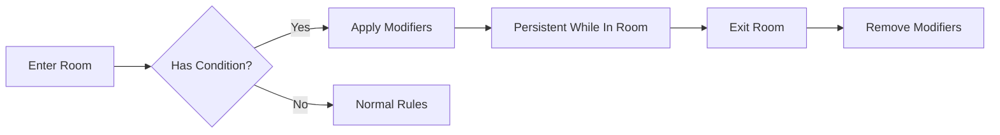

# Ambient Conditions — The State of the Operating System

> *"The Völva's whisper warns: 'This place remembers its wounds. The very air here is infected with the echoes of the Great Silence.'"*

---

## Document Control

| Version | Date | Changes |
|---------|------|---------|
| 1.0 | 2025-12-14 | Initial specification |

---

## 1. Overview

### 1.1 Identity Table

| Property | Value |
|----------|-------|
| Spec ID | `SPEC-ENV-AMBIENT` |
| Category | Environment System |
| Type | Room Modifiers |
| Dependencies | Room Engine, Combat Resolution, Trauma Economy |

### 1.2 Core Philosophy

Ambient Conditions define the **fundamental "error state" of the local reality-OS**. These are not physical traps or discrete objects, but room-wide, persistent, metaphysical or atmospheric effects that change the very rules of engagement. An Ambient Condition is the "weather" of a corrupted world—a pervasive environmental modifier that reflects the dominant nature of the Runic Blight's influence in that specific data-sector.

**Design Pillars:**

1. **Area Distinction** — Each major area feels distinct and mechanically unique
2. **Strategic Adaptation** — Players must adapt strategies to the environment, not just enemies
3. **Persistent Threat** — Conditions are always-on, constant tactical considerations
4. **Specialization Relevance** — Certain builds excel against specific conditions

### 1.3 Condition vs. Hazard

| Aspect | Ambient Condition | Dynamic Hazard |
|--------|-------------------|----------------|
| **Scope** | Room-wide or sector-wide | Specific tile/area |
| **Duration** | Permanent (room property) | Lifecycle (dormant → triggered → cooldown) |
| **Interaction** | Mitigation, not removal | Avoidance, exploitation, triggering |
| **Nature** | Atmospheric/metaphysical | Physical/mechanical |
| **Examples** | [Psychic Resonance], [Thick Fog] | Steam Vent, Pressure Plate |

---

## 2. Condition Anatomy

### 2.1 Core Properties

Every Ambient Condition has the following properties:

```csharp
public record AmbientCondition
{
    public string ConditionId { get; init; }
    public string Name { get; init; }           // e.g., "[Psychic Resonance]"
    public ConditionType Type { get; init; }    // Metaphysical, Atmospheric, PhysicalGlitch
    public string Description { get; init; }    // Thematic flavor text
    public string EffectScript { get; init; }   // Mechanical modifiers
    public string[] ApplicableBiomes { get; init; }
    public int SeverityTier { get; init; }      // 1-3 (Minor, Moderate, Severe)
}

public enum ConditionType
{
    Metaphysical,    // Blight's direct influence (psychic, corruption)
    Atmospheric,     // Environmental phenomena (fog, heat, cold)
    PhysicalGlitch   // Reality distortion (gravity, darkness, spatial)
}
```

### 2.2 Condition Lifecycle



**Key Points:**
- **Persistence** — Conditions are **static room properties**. Active the moment a player enters, remain active until they leave.
- **No Duration** — Conditions do not have turn counts. They do not expire.
- **No Cleansing** — Players cannot remove conditions (except specific temporary overrides like Consecrate Ground).
- **Mitigation Only** — Skills, gear, and abilities can **reduce** negative effects, not eliminate them.

---

## 3. Condition Categories

### 3.1 Metaphysical Conditions

Effects that stem directly from the Runic Blight's influence on local reality.

#### 3.1.1 [Psychic Resonance]

| Property | Value |
|----------|-------|
| Type | Metaphysical |
| Biomes | The Roots, Alfheim, Universal (high-corruption zones) |
| Severity | 2 (Moderate) |

**Description:**
> *"The air is thick with a palpable sense of dread, and a low, dissonant hum vibrates at the edge of hearing. This is a place of great psychic trauma."*

**Mechanical Effects:**
```
1. All characters passively gain +5 Psychic Stress at the start of their turn
2. All characters are [Vulnerable] to Psychic damage (+25% damage taken)
3. WILL checks to resist Stress suffer -1 die penalty
```

**Mitigation:**
- Skjaldmær's `Bastion of Sanity` negates stress gain for allies in aura
- Vard-Warden's `Consecrate Ground` creates a safe zone that suppresses effect
- High WILL characters resist more stress via Resolve checks

---

#### 3.1.2 [Runic Instability]

| Property | Value |
|----------|-------|
| Type | Metaphysical |
| Biomes | Alfheim, The Roots (corrupted cores) |
| Severity | 2 (Moderate) |

**Description:**
> *"The very fabric of reality feels thin and frayed here. The air shimmers with static, and runes carved into the walls glow with an unsteady, chaotic light."*

**Mechanical Effects:**
```
1. Wild Magic Surge chance increased by +30% for all magical abilities
2. Reality Glitch chance +20% per round (triggers random minor glitch)
3. Mystic spells cost +1 AP but deal +1d6 damage
```

**Mitigation:**
- Seiðkona's `Ride the Echoes` can harness instability for bonus effects
- Coherent faction gear provides stability bonuses
- Avoiding magic entirely sidesteps the risk

---

#### 3.1.3 [Metaphysical Corruption]

| Property | Value |
|----------|-------|
| Type | Metaphysical |
| Biomes | Deep Roots, Corrupted Sanctuaries, Epicenters of the Great Silence |
| Severity | 3 (Severe) |
| Intensity Levels | Low, Medium, High |
| Rarity | Rare — reserved for end-game, narratively significant locations |

**Description:**
> *"The very air in this chamber feels oily and thick, tasting of rust and ozone. It clings to you like a shroud, and you feel a deep, spiritual sickness, as if the world's very code is trying to overwrite your own. This is not passive corruption—the Runic Blight here is an active, infectious agent, a virus in the source code of reality."*

**Design Philosophy:**
This condition represents the game's **ultimate environmental threat**. It is the only ambient condition that passively inflicts **permanent Runic Blight Corruption**. These zones trade a character's very soul for the rewards within—profound, high-stakes decisions with lasting consequences.

**Primary Effect — The Corruption Timer:**
```
All characters within the zone passively gain Runic Blight Corruption over time.
A persistent timer ticks for every combat round or minute of exploration.
When threshold reached: ALL party members gain +1 PERMANENT Corruption.

INTENSITY SCALING:
┌──────────────┬─────────────────────┬─────────────────────┐
│ Intensity    │ Exploration         │ Combat              │
├──────────────┼─────────────────────┼─────────────────────┤
│ Low          │ +1 Corruption / 10 min │ +1 Corruption / 10 rounds │
│ Medium       │ +1 Corruption / 5 min  │ +1 Corruption / 5 rounds  │
│ High         │ +1 Corruption / 2 min  │ +1 Corruption / 2 rounds  │
└──────────────┴─────────────────────┴─────────────────────┘

This creates a "soft enrage timer" on the entire zone, pushing players
to be as efficient and decisive as possible.
```

**Secondary Effect — Impeded Coherence:**
```
The ambient anti-logic interferes with attempts to restore stability:
  • All HEALING received from any source: -10% effectiveness
  • All Psychic Stress RECOVERY from any source: -25% effectiveness
  • Corruption resistance checks suffer -2 dice penalty
  • Heretical abilities cost -2 resources BUT apply +2 additional Corruption
```

**UI Presentation:**
```
LOOK COMMAND:
  "The very air in this chamber feels oily and thick, tasting of
   rust and ozone. It clings to you like a shroud, and you feel a
   deep, spiritual sickness, as if the world's very code is trying
   to overwrite your own."

LOCATION PANE:
  [Metaphysical Corruption (High)] — displayed in pulsing sickly red

CORRUPTION GAIN EVENT (dramatic, terrifying moment):
  "A wave of anti-logic washes over you. You feel a fundamental part
   of your code being rewritten, a piece of your coherence permanently
   deleted. **You have gained 1 Runic Blight Corruption!**"

  [Screen flash effect, unique chilling message per character]
```

> [!DANGER]
> **The Ultimate High-Stakes Environment**: This is the ONLY condition that passively inflicts permanent Corruption. Extended exposure will permanently alter characters. There is NO way to "rest off" Corruption—see [Trauma Economy](../01-core/trauma-economy.md) for the near-impossible recovery methods.

**Specialization Counters:**

| Specialization | Ability | Effect |
|----------------|---------|--------|
| **Vard-Warden** | `Consecrate Ground` | Creates bubble that **PAUSES the Corruption Timer** for allies within. The most powerful counter—makes Vard-Warden indispensable. |
| **Rúnasmiðr** | `Ward Stone` (consumable) | Craftable item that creates temporary safe zone. Rare, expensive. |
| **Myr-Stalker** | `Blighted Symbiosis` | **Immune to passive Corruption gain**. Lore: their code is already so similar to the Blight's that it sees them as "native." Chilling implication. |

**Other Mitigations (Partial):**
| Strategy | Effect | Limitation |
|----------|--------|------------|
| **Purification Consumables** | Offset gained corruption | Expensive, limited supply |
| **Speed Run Tactics** | Minimize time exposure | Riskier combat, potential TPK |
| **Coherent Faction Gear** | Extend timer threshold by 25% | Still ticking, just slower |
| **Limiting Exploration** | Reduce passive gain | May miss rewards, incomplete objectives |

**The Hard Choice:**
```
This system creates profound strategic decisions:

  "We've found the location of the legendary Artifact, but it's
   deep within a [High] intensity corruption zone."

  OPTION A: Speed Run
    - Rush in, grab objective, rush out
    - Minimize timer ticks
    - Risk: Difficult combat while rushing, potential wipe

  OPTION B: Careful Approach
    - Take time, clear threats, ensure survival
    - Accept multiple Corruption gains
    - Risk: Permanent soul damage to entire party

  OPTION C: Retreat
    - Decide the price is too high
    - Preserve character integrity
    - Risk: Miss legendary rewards, fail quest

This is the Trauma Economy at its most potent.
```

**Placement Rules:**
Reserved for the most narratively significant, end-game locations:
- Chamber of major Saga Quest bosses
- Epicenters of the Great Silence
- "Core logic" rooms of Jötun-Forged constructs
- Corrupted sanctuaries where reality has fully collapsed
- Artifact vaults guarding the most powerful items

**Technical Implementation Notes:**
```csharp
// Timer tracked by WorldTimeService (exploration) and CombatEngine (rounds)
public class CorruptionTimerService
{
    public void AdvanceTimer(CorruptionIntensity intensity, TimeAdvanceType type);
    public bool CheckThreshold(); // Returns true when +1 Corruption should apply
    public void ApplyCorruptionToParty(); // Called by TraumaService
}

public enum CorruptionIntensity { Low, Medium, High }
public enum TimeAdvanceType { Exploration, Combat }
```

---

#### 3.1.4 [Sanctified Ground]

| Property | Value |
|----------|-------|
| Type | Metaphysical (Positive) |
| Biomes | Runic Anchors, Temples, Holy Sites |
| Severity | 0 (Beneficial) |

**Description:**
> *"A profound sense of peace and order permeates this area. The psychic scream of the world is muted to a distant whisper. This is a bastion of coherence."*

**Mechanical Effects:**
```
1. All characters are [Resistant] to Psychic damage (-25% damage taken)
2. All characters gain +2 dice bonus to Resolve Checks against Stress
3. Corruption gain from any source reduced by 50%
4. Heretical abilities suffer -2 dice penalty
```

**Notes:**
- This is the only "positive" condition, found at safe zones
- Vard-Warden's `Consecrate Ground` can create temporary Sanctified Ground

---

### 3.2 Atmospheric Conditions

Environmental phenomena that affect visibility, movement, and combat.

#### 3.2.1 [Thick Fog]

| Property | Value |
|----------|-------|
| Type | Atmospheric |
| Biomes | Niflheim, The Roots (flooded sectors), Swamps |
| Severity | 1 (Minor) |

**Description:**
> *"A dense, swirling fog blankets the area, reducing visibility to mere feet. Shapes are indistinct and sounds are muffled."*

**Mechanical Effects:**
```
1. All characters gain [Concealed] status
2. Ranged attacks suffer -3 dice penalty to Accuracy Pool
3. Perception (WITS) checks suffer -2 dice
4. Stealth checks gain +2 dice bonus
```

**Mitigation:**
- Tremorsense (Gorge-Maw Ascetic) ignores concealment
- Thermal vision gear negates penalty
- Melee combat is unaffected

---

#### 3.2.2 [Toxic Atmosphere]

| Property | Value |
|----------|-------|
| Type | Atmospheric |
| Biomes | The Roots (chemical sectors), Muspelheim (volcanic vents) |
| Severity | 2 (Moderate) |

**Description:**
> *"The air is thick with a corrosive, alchemical haze that stings the eyes and irritates the lungs."*

**Mechanical Effects:**
```
1. All characters make STURDINESS check (DC 12) at end of each turn
2. On failure: 1d4 Poison damage
3. Prolonged exposure (5+ rounds): [Poisoned] status applied
4. Fire damage has +25% chance to ignite toxic fumes (AoE Fire damage)
```

**Mitigation:**
- Respirator gear negates breathing damage
- Myr-Stalker's `Blighted Symbiosis` provides immunity
- Alka-hestur antidotes can cure/prevent poison status

---

#### 3.2.3 [Extreme Heat]

| Property | Value |
|----------|-------|
| Type | Atmospheric |
| Biomes | Muspelheim |
| Severity | 2 (Moderate) |

**Description:**
> *"The heat is suffocating, oppressive. Sweat evaporates before it can cool you. Every breath burns."*

**Mechanical Effects:**
```
1. Stamina costs increased by +25% for all physical actions
2. Heavy armor wearers suffer -1 to all dice pools
3. Cold damage deals +50% (thermal shock)
4. Fire damage reduced by -25%
```

**Mitigation:**
- Light armor negates stamina penalty
- Heat-resistant gear available
- Cold-based abilities become more valuable

---

#### 3.2.4 [Extreme Cold]

| Property | Value |
|----------|-------|
| Type | Atmospheric |
| Biomes | Niflheim, Jotunheim (frozen sectors) |
| Severity | 2 (Moderate) |

**Description:**
> *"The cold cuts to the bone. Your breath crystallizes instantly. Exposed skin goes numb in seconds."*

**Mechanical Effects:**
```
1. At end of each turn, characters without cold protection take 1d4 Cold damage
2. FINESSE checks suffer -1 die (numb extremities)
3. Fire damage deals +50% (thermal shock)
4. Cold damage reduced by -25%
5. Water hazards instantly freeze (creates difficult terrain)
```

**Mitigation:**
- Cold-resistant gear negates damage
- Fire-based abilities provide temporary warmth
- Einbui's survival passives reduce effect

---

### 3.3 Physical Glitch Conditions

Reality distortions that alter fundamental physics or perception.

#### 3.3.1 [Absolute Darkness]

| Property | Value |
|----------|-------|
| Type | Physical Glitch / Metaphysical |
| Biomes | Svartalfheim (deepest caverns), The Roots (corrupted cores), Void Zones |
| Severity | 3 (Severe) |
| Rarity | Extremely rare — reserved for the most dangerous, uncanny zones |

**Description:**
> *"You step into the chamber and... nothing. Not just darkness, but a profound and total void. Light from your torch seems to bend inwards and vanish at the threshold. Your eyes strain to find a single shape, but there is only a crushing, absolute blackness. Sound is deadened. The air does not move. This is not a mere shadow—it is a localized NULL POINTER ERROR in reality's rendering engine, a zone where the very concept of light is being actively deleted."*

**Design Philosophy:**
This condition represents a "final exam" for parties—a terrifying, high-stakes environmental challenge that completely upends normal rules of engagement. It tests preparation, non-visual senses, and the ability to function when sight has been violently revoked.

**Primary Effect — Light Deletion:**
```
1. Mundane light sources (torches, lanterns) are AUTOMATICALLY EXTINGUISHED
   upon entering and CANNOT be re-lit while inside
2. Magical light sources (Galdr spells, enchanted weapons) are SUPPRESSED
   - Light-creating abilities fail to activate
   - Active light effects are immediately dispelled
```

**Secondary Effect — Universal [Blinded]:**
```
All characters AND enemies within the zone gain [Blinded] status:
  • 50% chance for attacks to miss completely (targeting empty adjacent tile)
  • Defense Score reduced to ZERO (cannot evade or parry)
  • Cannot target specific enemies — attacks hit random enemy in target row
  • Perception checks automatically fail (nothing to perceive)
```

**Tertiary Effect — Psychic Strain:**
```
The sensory deprivation and proximity to profound system error is deeply unsettling:
  • Functions as [Low] intensity [Psychic Resonance]
  • +2 Psychic Stress at start of each turn
  • WILL checks to resist panic suffer -1 die
```

**UI Presentation:**
```
LOOK COMMAND:
  "You step into the chamber and... nothing. Not just darkness,
   but a profound and total void. Light from your torch bends
   inwards and vanishes. Your eyes strain to find a single shape,
   but there is only crushing, absolute blackness."

MINIMAP:
  Completely blacked out, replaced by static-filled "?"
  Text displays: [SIGNAL LOST]

COMBAT LOG:
  "[Absolute Darkness] Your attack swings wildly into the void!"
  "[Absolute Darkness] You hear something move, but cannot locate it."
```

> [!WARNING]
> **The Ultimate Challenge**: This condition is a hard counter to most characters and strategies:
> - Ranged characters severely hampered (random targeting)
> - Evasion-based characters lose Defense entirely
> - Entire party under constant psychic strain
> - Standard preparation (torches, light spells) is useless

**The ONLY Hard Counter — Gorge-Maw Ascetic:**
```
The Gorge-Maw Ascetic with `Tremorsense` is COMPLETELY IMMUNE to all effects:
  • NOT [Blinded] — perceives through seismic vibration
  • Can target enemies normally
  • Does NOT suffer Defense Score penalty
  • Full combat effectiveness maintained

This transforms the Gorge-Maw Ascetic into the single most valuable
character when encountering this condition. They become the party's
eyes, protector, and only reliable damage source.
```

**Other Mitigations (Partial):**
| Strategy | Effect | Limitation |
|----------|--------|------------|
| **AoE Abilities** | Don't require specific targeting | Still blind to enemy positions |
| **Defensive Stance** | Provides flat damage reduction | Can't evade/parry |
| **Echo-Caller Echolocation** | Partial targeting (adjacent tiles) | -2 dice, psychic strain still applies |
| **Area Denial** | Bombs, traps, hazards | Setup difficulty without sight |

**Strategic Preparation:**
Parties entering known [Absolute Darkness] zones must prepare:
- Is our Ascetic with us?
- Have we stocked up on AoE consumables?
- Is our Tank prepared to absorb guaranteed hits?
- Do we have a retreat plan?

**Placement Rules:**
Reserved for extreme locations only:
- Deepest, most lightless caverns of Svartalfheim
- Ruins affected by reality-warping Artifacts
- Lairs of creatures that ARE living voids
- Corrupted data cores where rendering has failed

---

#### 3.3.2 [Low Gravity]

| Property | Value |
|----------|-------|
| Type | Physical Glitch |
| Biomes | Alfheim, Corrupted physics sectors |
| Severity | 1 (Minor) |

**Description:**
> *"A strange lightness fills your limbs, and dust motes hang in the air for an unnaturally long time. The physics of this sector are clearly compromised."*

**Mechanical Effects:**
```
1. Jump/Leap distance doubled
2. Push and Pull effects move targets +1 additional tile
3. Falling damage reduced by 50%
4. Ranged projectiles suffer -1 die (trajectory compensation)
5. Heavy weapons suffer -1 die (momentum disruption)
```

**Mitigation:**
- Experienced controllers (Atgeir-wielder, Hlekkr-master) can exploit this
- Ranged specialists should switch to melee or adapt
- Acrobatics checks gain +2 dice

---

#### 3.3.3 [High Gravity]

| Property | Value |
|----------|-------|
| Type | Physical Glitch |
| Biomes | Jotunheim (gravity wells), Deep corrupted zones |
| Severity | 2 (Moderate) |

**Description:**
> *"Every step is a labor. The air itself feels thick and heavy. Your joints ache under the increased pull."*

**Mechanical Effects:**
```
1. Movement costs +1 additional AP
2. Jump/Leap distance halved
3. Push and Pull effects reduced by 1 tile (minimum 0)
4. Falling damage increased by +50%
5. Heavy armor wearers suffer -2 to all dice pools
```

**Mitigation:**
- Light armor becomes essential
- Forced movement abilities less effective
- Gorge-Maw Ascetic's grounded stance provides stability

---

#### 3.3.4 [Temporal Flux]

| Property | Value |
|----------|-------|
| Type | Physical Glitch |
| Biomes | Alfheim, Deep corrupted zones |
| Severity | 3 (Severe) |

**Description:**
> *"Time moves strangely here. Your actions feel delayed, then suddenly accelerated. Cause and effect blur together."*

**Mechanical Effects:**
```
1. Initiative rolls are re-rolled each round
2. Status effect durations randomized: roll 1d3 (-1/+0/+1 turns)
3. 10% chance per round for "echo" — repeat last action for free
4. 10% chance per round for "stutter" — lose next action
5. +3 Stress per turn (temporal disorientation)
```

**Mitigation:**
- Seiðkona specializations can partially control temporal effects
- High WILL reduces stutter chance
- Consistent strategy over reactive play recommended

---

## 4. Condition Assignment

### 4.1 Room-Level Assignment

Conditions are assigned to rooms during dungeon generation:

```json
{
  "RoomId": "corrupted_chamber_07",
  "AmbientCondition": "psychic_resonance",
  "ConditionSeverity": 2,
  "OverrideEffects": []
}
```

### 4.2 Sector-Level Assignment

Entire sectors can share a condition:

```json
{
  "SectorId": "deep_roots_alpha",
  "BiomeId": "the_roots",
  "SectorCondition": "toxic_atmosphere",
  "RoomOverrides": [
    { "RoomId": "safe_chamber_01", "Condition": "sanctified_ground" }
  ]
}
```

### 4.3 Condition Distribution by Biome

| Biome | Common Conditions | Rare Conditions |
|-------|-------------------|-----------------|
| **The Roots** | Toxic Atmosphere, Absolute Darkness | Metaphysical Corruption |
| **Muspelheim** | Extreme Heat | Thick Fog (steam) |
| **Niflheim** | Extreme Cold, Thick Fog | Absolute Darkness |
| **Alfheim** | Runic Instability, Low Gravity | Temporal Flux |
| **Jotunheim** | High Gravity | Psychic Resonance |
| **Universal** | Psychic Resonance | Sanctified Ground (safe zones) |

---

## 5. Specialization Integration

### 5.1 Hard Counters

Some specializations completely negate specific conditions:

| Specialization | Condition Countered | Mechanism |
|----------------|---------------------|-----------|
| **Gorge-Maw Ascetic** | [Absolute Darkness] | `Tremorsense` ignores visual penalties |
| **Myr-Stalker** | [Toxic Atmosphere] | `Blighted Symbiosis` provides immunity |
| **Einbui** | [Extreme Cold] | `Hazard Acclimatization` reduces damage |

### 5.2 Mitigators

Some specializations can create temporary safe zones:

| Specialization | Ability | Effect |
|----------------|---------|--------|
| **Vard-Warden** | `Consecrate Ground` | Creates [Sanctified Ground] bubble, suppresses negative conditions |
| **Skjaldmær** | `Bastion of Sanity` | Negates stress gain from conditions for allies in aura |
| **Bone-Setter** | `Purify` | Removes condition-applied status effects |

### 5.3 Exploiters

Heretical specializations can draw power from dangerous conditions:

| Specialization | Condition | Exploitation |
|----------------|-----------|--------------|
| **Echo-Caller** | [Psychic Resonance] | +2 dice to psychic attacks, +2 Stress self |
| **Rust-Witch** | [Metaphysical Corruption] | Corruption effects trigger bonus damage |
| **Seiðkona** | [Runic Instability] | Can redirect Wild Magic Surges |

---

## 6. Technical Implementation

### 6.1 Service Architecture

```csharp
public interface IConditionService
{
    /// <summary>Gets the active condition for a room.</summary>
    AmbientCondition? GetRoomCondition(Guid roomId);

    /// <summary>Applies condition modifiers to a character entering a room.</summary>
    void ApplyConditionModifiers(Character character, AmbientCondition condition);

    /// <summary>Removes condition modifiers when character leaves room.</summary>
    void RemoveConditionModifiers(Character character, AmbientCondition condition);

    /// <summary>Processes per-turn condition effects (stress gain, damage, etc.).</summary>
    ConditionTickResult ProcessTurnTick(Character character, AmbientCondition condition);

    /// <summary>Checks if character has mitigation for a condition.</summary>
    MitigationResult CheckMitigation(Character character, AmbientCondition condition);

    /// <summary>Creates temporary condition override (e.g., Consecrate Ground).</summary>
    void CreateConditionOverride(Guid roomId, AmbientCondition overrideCondition, int duration);
}

public record ConditionTickResult(
    int StressGained,
    int DamageTaken,
    int CorruptionGained,
    IReadOnlyList<StatusEffect> StatusesApplied
);

public record MitigationResult(
    bool FullyMitigated,
    float DamageReduction,
    float StressReduction,
    string MitigationSource
);
```

### 6.2 Event Integration

```csharp
// Subscribe to turn events
public void OnTurnStart(TurnStartEvent e)
{
    var condition = GetRoomCondition(e.Character.CurrentRoomId);
    if (condition != null)
    {
        var result = ProcessTurnTick(e.Character, condition);
        // Apply stress, damage, corruption, statuses
    }
}

// Subscribe to room transitions
public void OnRoomEntered(RoomEnteredEvent e)
{
    var condition = GetRoomCondition(e.RoomId);
    if (condition != null)
    {
        ApplyConditionModifiers(e.Character, condition);
        _logger.Info("{Character} entered {Condition} zone", e.Character.Name, condition.Name);
    }
}
```

### 6.3 Modifier Application

```csharp
public void ApplyConditionModifiers(Character character, AmbientCondition condition)
{
    // Parse effect script and apply modifiers
    var effects = _effectParser.Parse(condition.EffectScript);

    foreach (var effect in effects)
    {
        switch (effect.Type)
        {
            case EffectType.DicePoolModifier:
                character.AddTemporaryModifier(effect.Target, effect.Value, condition.ConditionId);
                break;
            case EffectType.DamageVulnerability:
                character.AddVulnerability(effect.DamageType, effect.Multiplier, condition.ConditionId);
                break;
            case EffectType.Status:
                _statusService.ApplyStatus(character, effect.StatusId, permanent: true, source: condition.ConditionId);
                break;
        }
    }
}
```

---

## 7. UI Integration

### 7.1 Room Description

The `look` command **must** clearly describe active conditions:

```
> look

THE CORRUPTED CHAMBER
═══════════════════════════════════════

A vast chamber stretches before you, its walls pulsing with
sickly bioluminescence. The air tastes of rust and despair.

[!] AMBIENT CONDITION: [Psychic Resonance]
    • +5 Stress per turn
    • Vulnerable to Psychic damage
    • -1 die to Resolve checks

Exits: North (Corridor), East (sealed door)
```

### 7.2 Persistent Indicator

The location pane displays active condition:

```
┌─────────────────────────────────────┐
│ LOCATION: The Corrupted Chamber     │
│ BIOME: The Roots                    │
│ CONDITION: [Psychic Resonance] ⚠    │
└─────────────────────────────────────┘
```

### 7.3 Turn Notifications

When conditions apply effects:

```
═══════════════════════════════════════
TURN START: Torsten
═══════════════════════════════════════

[Psychic Resonance] The oppressive dread seeps into your mind.
  → +5 Psychic Stress (now 47/100)

Your turn. What do you do?
```

---

## 8. Phased Implementation Guide

### Phase 1: Data & Core
- [ ] **Data Model**: Implement `AmbientCondition` record and `ConditionType` enum
- [ ] **Registry**: Create condition registry with all standard conditions
- [ ] **Room Integration**: Add `AmbientConditionId` property to Room entity

### Phase 2: Service Logic
- [ ] **Condition Service**: Implement `IConditionService` interface
- [ ] **Modifier System**: Build effect parsing and application logic
- [ ] **Event Hooks**: Subscribe to `TurnStart` and `RoomEntered` events

### Phase 3: Combat Integration
- [ ] **Damage Modifiers**: Hook vulnerabilities/resistances into damage calculation
- [ ] **Dice Modifiers**: Apply dice pool modifiers to relevant checks
- [ ] **Status Application**: Automatic status effect application

### Phase 4: UI & Feedback
- [ ] **Look Command**: Display condition in room descriptions
- [ ] **Location Pane**: Persistent condition indicator
- [ ] **Turn Feedback**: Condition effect notifications

---

## 9. Testing Requirements

### 9.1 Unit Tests

| Test Case | Expected Result |
|-----------|-----------------|
| Enter room with [Psychic Resonance] | Character gains vulnerability modifier |
| Turn tick in [Psychic Resonance] | +5 Stress applied |
| Exit room with condition | All modifiers removed |
| Gorge-Maw in [Absolute Darkness] | Blinded status not applied (Tremorsense) |
| Vard-Warden Consecrate Ground | Override condition created |

### 9.2 Integration Tests

| Scenario | Validation |
|----------|------------|
| Combat in [Toxic Atmosphere] | STURDINESS checks occur, poison damage applied |
| Extended stay in [Metaphysical Corruption] | Corruption accumulates correctly |
| Condition stacking (room + sector) | Only one condition active (room overrides sector) |

### 9.3 Edge Cases

- [ ] Character with full mitigation enters dangerous condition
- [ ] Condition override expires mid-combat
- [ ] Multiple characters with different mitigations in same room
- [ ] Saving/loading game state preserves condition effects

---

## 10. Logging Requirements

**Reference:** [logging.md](../01-core/logging.md)

### 10.1 Log Events

| Event | Level | Message Template | Properties |
|-------|-------|------------------|------------|
| Condition Apply | Info | "{Character} entered [{Condition}] zone in {Room}" | `Character`, `Condition`, `Room` |
| Condition Tick | Debug | "{Condition} tick: {Effect} on {Character}" | `Condition`, `Effect`, `Character` |
| Mitigation | Info | "{Character}'s {Ability} mitigates [{Condition}]" | `Character`, `Ability`, `Condition` |
| Override | Info | "{Ability} creates [{Override}] zone in {Room}" | `Ability`, `Override`, `Room` |

---

## 11. Related Specifications

| Spec ID | Relationship |
|---------|--------------|
| [Room Engine Core](room-engine/core.md) | Condition assignment during generation |
| [Dynamic Hazards](dynamic-hazards.md) | Companion environmental system |
| [Combat Resolution](../03-combat/combat-resolution.md) | Modifier application |
| [Trauma Economy](../01-core/trauma-economy.md) | Stress and Corruption effects |
| [Status Effects](../03-combat/status-effects.md) | Applied statuses |
| [Biome Overview](biomes/biomes-overview.md) | Biome-specific condition distribution |
