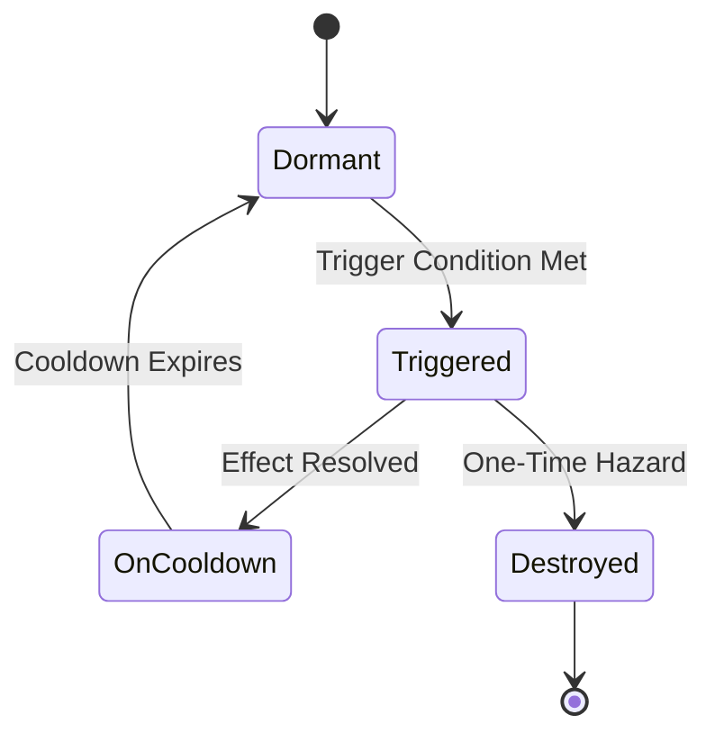
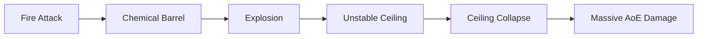

# Dynamic Hazards — The Unstable System Glitch

> *"The Jötun-Reader warns: 'That pipe isn't broken—it's dormant. Touch it wrong and you'll execute a subroutine you won't survive.'"*

---

## Document Control

| Version | Date | Changes |
|---------|------|---------|
| 1.0 | 2025-12-14 | Initial specification |

---

## 1. Overview

### 1.1 Identity Table

| Property | Value |
|----------|-------|
| Spec ID | `SPEC-ENV-HAZARDS` |
| Category | Environment System |
| Type | Interactive Battlefield Elements |
| Dependencies | Room Engine, Combat Resolution, Spatial Layout |

### 1.2 Core Philosophy

Dynamic Hazards are the mechanical representation of **unstable system glitches** in the corrupted reality of Aethelgard. They are not passive features of the environment; they are dormant, volatile "subroutines" waiting for a specific input to execute a chaotic and destructive command. A steam pipe is not just a pipe; it's a dormant `[Erupt]` function. A sparking conduit is not just scenery; it's a dormant `[Discharge]` function.

**Design Pillars:**

1. **Interactive Combat** — The battlefield actively participates in combat
2. **Emergent Gameplay** — Clever use of hazards creates memorable moments
3. **Risk/Reward** — Hazards threaten everyone but can be weaponized
4. **Tactical Depth** — Positioning matters beyond just enemy placement

### 1.3 Hazard vs. Condition

| Aspect | Dynamic Hazard | Ambient Condition |
|--------|----------------|-------------------|
| **Scope** | Specific tile/area | Room-wide |
| **State** | Three-state lifecycle | Always active |
| **Interaction** | Trigger, avoid, exploit | Mitigate only |
| **Nature** | Physical/mechanical | Atmospheric/metaphysical |
| **Combat Role** | Tactical element | Strategic modifier |

---

## 2. Hazard Anatomy

### 2.1 The Three-State Lifecycle

Every Dynamic Hazard exists in one of three states:



#### State Definitions

| State | Description | UI Indicator |
|-------|-------------|--------------|
| **[Dormant]** | Inactive, visible, not immediately dangerous | Gray/dim icon |
| **[Triggered]** | Active, executing effect | Red/flashing icon |
| **[On Cooldown]** | Temporarily inactive, cannot re-trigger | Blue/faded icon |
| **[Destroyed]** | One-time hazard expended | Removed from map |

### 2.2 Core Properties

```csharp
public record DynamicHazard
{
    public Guid HazardId { get; init; }
    public string Name { get; init; }              // e.g., "[High-Pressure Steam Vent]"
    public HazardType Type { get; init; }
    public HazardState State { get; set; }
    public TriggerCondition Trigger { get; init; }  // What activates it
    public string EffectScript { get; init; }       // What happens
    public TargetArea TargetArea { get; init; }     // Affected tiles
    public int CooldownDuration { get; init; }      // Rounds (0 = one-time)
    public int CurrentCooldown { get; set; }
    public GridPosition Position { get; init; }     // Location on grid
    public string[] ApplicableBiomes { get; init; }
}

public enum HazardType
{
    Mechanical,     // Steam vents, pressure plates, moving parts
    Electrical,     // Live conduits, arcing panels
    Structural,     // Unstable ceilings, collapsing floors
    Environmental,  // Spore pods, volatile chemicals
    Metaphysical    // Reality tears, corrupted data-spikes
}

public enum HazardState
{
    Dormant,
    Triggered,
    OnCooldown,
    Destroyed
}
```

### 2.3 Trigger Conditions

```csharp
public record TriggerCondition
{
    public TriggerType Type { get; init; }
    public string? DamageType { get; init; }       // For damage-based triggers
    public string? AbilityTag { get; init; }       // For ability-based triggers
    public GridPosition? ProximityTo { get; init; } // For proximity triggers
    public bool RequiresMovement { get; init; }    // Movement onto tile
}

public enum TriggerType
{
    OnDamage,           // Struck by any attack
    OnDamageType,       // Struck by specific damage type
    OnAbilityType,      // Specific ability used nearby
    OnProximity,        // Character moves adjacent
    OnMovement,         // Character moves onto tile
    OnInteract,         // Explicit interaction
    OnCondition         // Other hazard triggers, chain reactions
}
```

---

## 3. The Hazard Lexicon

### 3.1 Mechanical Hazards

#### 3.1.1 [High-Pressure Steam Vent]

| Property | Value |
|----------|-------|
| Type | Mechanical |
| Trigger | Struck by Physical or Fire attack |
| Effect | 2d6 Fire damage, creates [Obscuring Terrain] 1 round |
| Target Area | All tiles adjacent to vent |
| Cooldown | 2 rounds |
| Biomes | The Roots, Universal (industrial) |

**Description:**
> *"Corroded pipes run through the floor here. Pressure gauges in the red—one wrong hit and they'll blow."*

**Trigger Text:**
> *"The pipe ruptures! Superheated steam erupts in a scalding blast!"*

**Tactical Notes:**
- Can create temporary concealment for retreat
- Fire damage can chain to other flammable hazards
- Savvy enemies avoid clustering near vents

---

#### 3.1.2 [Pressure Plate]

| Property | Value |
|----------|-------|
| Type | Mechanical |
| Trigger | Character steps on tile |
| Effect | Varies (see subtypes) |
| Target Area | Character who triggered + linked mechanism |
| Cooldown | 1 round |
| Biomes | Universal |

**Subtypes:**

| Subtype | Effect |
|---------|--------|
| **Dart Trap** | 1d8 Piercing damage, chance to apply [Poisoned] |
| **Alarm** | Alerts all enemies in sector, +1 encounter wave |
| **Door Trigger** | Opens/closes connected door |
| **Pit Trap** | Floor opens, fall damage |

**Description:**
> *"A section of floor sits slightly lower than its surroundings. The seams are too precise to be natural wear."*

**Tactical Notes:**
- Can be spotted with WITS check (Ruin-Stalker advantage)
- Can be disarmed with System Bypass check
- Can be used to trap pursuing enemies

---

### 3.2 Electrical Hazards

#### 3.2.1 [Live Power Conduit]

| Property | Value |
|----------|-------|
| Type | Electrical |
| Trigger | Struck by Lightning attack OR character in adjacent [Flooded] terrain takes Lightning damage |
| Effect | 3d8 Lightning damage |
| Target Area | All characters in connected [Flooded] tiles |
| Cooldown | 3 rounds |
| Biomes | The Roots |

**Description:**
> *"Exposed cables spark and crackle overhead. Water has pooled beneath them—a deadly combination waiting to happen."*

**Trigger Text:**
> *"Lightning arcs through the flooded floor! The entire zone becomes a killing field of electrical discharge!"*

**Tactical Notes:**
- Creates massive AoE when combined with water
- Requires awareness of terrain connectivity
- Can chain-react with other electrical hazards

---

#### 3.2.2 [Overloaded Junction Box]

| Property | Value |
|----------|-------|
| Type | Electrical |
| Trigger | Any electrical damage in room OR taking more than 20 damage in single hit |
| Effect | 2d6 Lightning damage, inflicts [Stunned] 1 turn |
| Target Area | 3-tile radius from box |
| Cooldown | 2 rounds |
| Biomes | The Roots |

**Description:**
> *"A junction box hums with barely-contained power. Warning lights flash erratically. One surge and..."*

---

### 3.3 Structural Hazards

#### 3.3.1 [Unstable Ceiling]

| Property | Value |
|----------|-------|
| Type | Structural |
| Trigger | [Explosive] or [Concussive] ability used anywhere in room |
| Effect | 4d6 Physical damage, chance to inflict [Stunned] |
| Target Area | Pre-defined 3-tile area directly below |
| Cooldown | One-time use (destroyed after trigger) |
| Biomes | The Roots, Jotunheim, Universal |

**Description:**
> *"Cracks spider through the ceiling here. Dust falls with every vibration. One concussive force and this section comes down."*

**Trigger Text:**
> *"The explosion's shockwave is the final straw! With a thunderous roar, the ceiling gives way!"*

**Tactical Notes:**
- Can be deliberately triggered for massive AoE
- Changes terrain permanently (creates [Rubble] difficult terrain)
- Gorge-Maw Ascetic's `Earthshaker` reliably triggers this

---

#### 3.3.2 [Unstable Floor]

| Property | Value |
|----------|-------|
| Type | Structural |
| Trigger | More than 2 characters stand on same section OR heavy weapon impact |
| Effect | Characters fall to lower level, 2d6 Fall damage |
| Target Area | 2x2 tile section |
| Cooldown | One-time use (creates hole) |
| Biomes | The Roots, Universal |

**Description:**
> *"The floor grating here is buckled and rusted. It groans ominously under your weight."*

---

### 3.4 Environmental Hazards

#### 3.4.1 [Volatile Spore Pod]

| Property | Value |
|----------|-------|
| Type | Environmental |
| Trigger | Struck by any damaging attack |
| Effect | 1d6 Poison damage, creates [Poison Cloud] terrain 2 rounds |
| Target Area | Pod's tile and all adjacent tiles |
| Cooldown | One-time use (destroyed) |
| Biomes | The Roots, Alfheim |

**Description:**
> *"Bulbous fungal growths cling to the walls here. They pulse rhythmically, swollen with toxic spores."*

**Trigger Text:**
> *"The spore pod bursts! A cloud of toxic particles fills the air!"*

**Tactical Notes:**
- Creates area denial
- Myr-Stalker immune to poison cloud
- Can be shot to deny area to enemies

---

#### 3.4.2 [Volatile Chemical Barrel]

| Property | Value |
|----------|-------|
| Type | Environmental |
| Trigger | Struck by Fire damage OR takes more than 15 damage |
| Effect | 3d6 Fire damage, creates [Burning Ground] terrain 3 rounds |
| Target Area | 2-tile radius from barrel |
| Cooldown | One-time use (destroyed) |
| Biomes | The Roots, Muspelheim |

**Description:**
> *"Industrial barrels marked with faded hazard symbols. The contents have aged—unstable and eager to ignite."*

---

### 3.5 Metaphysical Hazards

#### 3.5.1 [Reality Tear]

| Property | Value |
|----------|-------|
| Type | Metaphysical |
| Trigger | Character is forcibly moved (Push/Pull) onto tile |
| Effect | Character removed from combat 1 turn, returns with +15 Stress and +1 Corruption |
| Target Area | Character moved onto tile |
| Cooldown | No cooldown (always active) |
| Biomes | Alfheim, Deep corrupted zones |

**Description:**
> *"A wound in reality hangs in the air—a tear where existence becomes uncertain. Things that enter don't always come back the same."*

**Trigger Text:**
> *"[Character] is hurled into the Reality Tear! For a terrible moment, they cease to exist... then reality spits them back out, changed."*

**Tactical Notes:**
- Primary tool for controllers (Atgeir-wielder, Hlekkr-master)
- Can remove powerful enemies from combat temporarily
- Dangerous to allies if positioning fails

---

#### 3.5.2 [Corrupted Data-Spike]

| Property | Value |
|----------|-------|
| Type | Metaphysical |
| Trigger | Character steps on adjacent pressure plate |
| Effect | 2d6 Psychic damage, inflicts [Disoriented] 2 turns |
| Target Area | Character who triggered plate |
| Cooldown | 1 round |
| Biomes | The Roots, Alfheim |

**Description:**
> *"A crystalline spike of solidified corruption juts from the floor. Its surface crawls with corrupted data-patterns."*

---

## 4. Hazard Placement

### 4.1 Room Generation Integration

The Dynamic Room Engine assigns hazards during room population:

```csharp
public class HazardPlacementRule
{
    public RoomArchetype[] ApplicableArchetypes { get; set; }
    public string HazardId { get; set; }
    public int MinCount { get; set; }
    public int MaxCount { get; set; }
    public PlacementStrategy Strategy { get; set; }
    public float Probability { get; set; }
}

public enum PlacementStrategy
{
    Random,           // Any valid tile
    NearEntrance,     // Close to room entry points
    CentralCluster,   // Grouped in room center
    AlongWalls,       // Against room perimeter
    AtChokepoints,    // At narrow passages
    NearCover         // Adjacent to cover positions
}
```

### 4.2 Hazard Density by Room Type

| Room Archetype | Typical Hazard Count | Hazard Types |
|----------------|---------------------|--------------|
| **EntryHall** | 0-1 | Pressure plates, alarms |
| **Corridor** | 1-2 | Steam vents, unstable floor |
| **Chamber** | 2-4 | Mixed, based on biome |
| **Junction** | 2-3 | Spore pods, electrical |
| **BossArena** | 3-6 | High density, varied |
| **SecretRoom** | 1-2 | Traps protecting treasure |

### 4.3 Biome-Specific Hazard Pools

| Biome | Primary Hazards | Rare Hazards |
|-------|-----------------|--------------|
| **The Roots** | Steam Vents, Conduits, Barrels | Unstable Ceiling, Data-Spikes |
| **Muspelheim** | Fire Jets, Lava Vents, Barrels | Volcanic Eruption |
| **Niflheim** | Ice Spikes, Frost Vents, Crevasses | Avalanche Trigger |
| **Alfheim** | Reality Tears, Data-Spikes, Spore Pods | Temporal Anomaly |
| **Jotunheim** | Unstable Ceiling, Giant Traps | Ancient Mechanisms |

---

## 5. Combat Integration

### 5.1 Initiative and Hazards

Hazards resolve at specific points in the turn order:

```
TURN ORDER
══════════════════════════════════════
1. Start of Round
   → Check for automatic hazard effects
   → Process Ambient Conditions

2. Character Turns (by Initiative)
   → Character action may trigger hazard
   → Hazard resolves IMMEDIATELY after trigger

3. End of Round
   → Decrement hazard cooldowns
   → Triggered hazards return to Dormant
   → Process terrain persistence (clouds, fire)
```

### 5.2 Chain Reactions

Hazards can trigger other hazards:



**Chain Reaction Rules:**
- Each hazard can only trigger once per chain
- Chain resolves fully before continuing turn
- Maximum chain length: 5 (prevents infinite loops)
- All damage from chain is attributed to original actor

### 5.3 Forced Movement Exploitation

Controllers can weaponize hazards via forced movement:

| Ability | Specialization | Movement | Hazard Synergy |
|---------|----------------|----------|----------------|
| `Hook and Drag` | Atgeir-wielder | Pull 2 | Into Reality Tears |
| `Grappling Hook Toss` | Hlekkr-master | Pull 3 | Into Steam Vents |
| `Fissure` | Gorge-Maw Ascetic | Push 2 | Into Chasms |
| `Entropic Cascade` | Rust-Witch | Push 1 all | Into multiple hazards |

---

## 6. Specialization Integration

### 6.1 Hazard Detection

| Specialization | Ability | Effect |
|----------------|---------|--------|
| **Ruin-Stalker** | `Hazard Mapping` | Automatically detect all hazards on room entry |
| **Jötun-Reader** | `Structural Insight` | Investigate reveals trigger conditions and cooldowns |
| **Veiðimaðr** | `Predator's Focus` | Identify exploitable hazards in combat |

### 6.2 Hazard Interaction

| Specialization | Ability | Effect |
|----------------|---------|--------|
| **Ruin-Stalker** | `Disarm Mechanism` | Can safely disarm mechanical hazards |
| **Scrap-Tinker** | `Sabotage` | Can modify trigger to activate on command |
| **Gorge-Maw Ascetic** | `Earthshaker` | Reliably triggers structural hazards |

### 6.3 Hazard Immunity/Resistance

| Specialization | Hazard Type | Effect |
|----------------|-------------|--------|
| **Myr-Stalker** | Environmental (Poison) | Immune to spore/toxic effects |
| **Einbui** | Environmental (All) | 50% damage reduction |
| **Iron-Bane** | Structural | Debris damage reduced 50% |

---

## 7. Enemy AI and Hazards

### 7.1 AI Awareness Levels

| AI Type | Hazard Awareness |
|---------|------------------|
| **Bestial** | Unaware, may blunder into hazards |
| **Standard** | Avoids obvious hazards |
| **Tactical** | Actively avoids, won't position in hazard zones |
| **Commander** | Attempts to exploit hazards against players |
| **Elite/Boss** | Full awareness, strategic exploitation |

### 7.2 AI Exploitation

High-intelligence enemies may:
- Use abilities to trigger hazards when players are in blast radius
- Position players between themselves and hazards
- Use forced movement to push players into hazards
- Avoid hazard zones while funneling players through them

```csharp
public interface IHazardAwareAI
{
    /// <summary>Evaluates if position is in hazard danger zone.</summary>
    bool IsPositionDangerous(GridPosition pos, IReadOnlyList<DynamicHazard> hazards);

    /// <summary>Finds safe positions considering hazards.</summary>
    IEnumerable<GridPosition> GetSafePositions(IReadOnlyList<DynamicHazard> hazards);

    /// <summary>Identifies opportunities to exploit hazards against targets.</summary>
    HazardExploitOpportunity? FindExploitOpportunity(Character target, IReadOnlyList<DynamicHazard> hazards);
}
```

---

## 8. Technical Implementation

### 8.1 Service Architecture

```csharp
public interface IHazardService
{
    /// <summary>Gets all hazards in a room.</summary>
    IReadOnlyList<DynamicHazard> GetRoomHazards(Guid roomId);

    /// <summary>Gets hazard at specific position.</summary>
    DynamicHazard? GetHazardAtPosition(Guid roomId, GridPosition position);

    /// <summary>Processes potential trigger event.</summary>
    HazardTriggerResult ProcessTriggerEvent(TriggerEvent triggerEvent);

    /// <summary>Executes hazard effect.</summary>
    HazardEffectResult ExecuteHazard(DynamicHazard hazard, Character? triggeredBy);

    /// <summary>Processes end-of-round cooldown decrements.</summary>
    void ProcessRoundEnd(Guid roomId);

    /// <summary>Attempts to disarm a hazard.</summary>
    DisarmResult AttemptDisarm(Character character, DynamicHazard hazard);

    /// <summary>Marks hazard for triggered-on-command (Sabotage).</summary>
    void MarkForManualTrigger(DynamicHazard hazard, Character owner);
}

public record HazardTriggerResult(
    bool Triggered,
    DynamicHazard? Hazard,
    string TriggerReason
);

public record HazardEffectResult(
    DynamicHazard Hazard,
    IReadOnlyList<Character> AffectedCharacters,
    IReadOnlyList<DamageResult> DamageResults,
    IReadOnlyList<StatusEffect> StatusesApplied,
    TerrainChange? TerrainCreated,
    bool HazardDestroyed
);

public record DisarmResult(
    bool Success,
    int SkillSuccesses,
    int RequiredSuccesses,
    string? FailureConsequence
);
```

### 8.2 Event Integration

```csharp
// Subscribe to damage events
public void OnDamageDealt(DamageDealtEvent e)
{
    var hazards = GetRoomHazards(e.RoomId)
        .Where(h => h.State == HazardState.Dormant);

    foreach (var hazard in hazards)
    {
        if (MatchesTrigger(hazard.Trigger, e))
        {
            var result = ExecuteHazard(hazard, e.Source);
            ProcessChainReactions(result);
        }
    }
}

// Subscribe to movement events
public void OnCharacterMoved(CharacterMovedEvent e)
{
    var hazard = GetHazardAtPosition(e.RoomId, e.NewPosition);
    if (hazard?.Trigger.RequiresMovement == true && hazard.State == HazardState.Dormant)
    {
        ExecuteHazard(hazard, e.Character);
    }
}
```

### 8.3 Chain Reaction Processing

```csharp
private void ProcessChainReactions(HazardEffectResult initialResult)
{
    var queue = new Queue<HazardEffectResult>();
    var triggered = new HashSet<Guid> { initialResult.Hazard.HazardId };
    queue.Enqueue(initialResult);

    int chainDepth = 0;
    const int MaxChainDepth = 5;

    while (queue.Count > 0 && chainDepth < MaxChainDepth)
    {
        var current = queue.Dequeue();

        // Check if this result triggers other hazards
        var chainTriggers = FindChainTriggers(current)
            .Where(h => !triggered.Contains(h.HazardId));

        foreach (var hazard in chainTriggers)
        {
            triggered.Add(hazard.HazardId);
            var result = ExecuteHazard(hazard, current.Hazard);
            queue.Enqueue(result);
        }

        chainDepth++;
    }
}
```

---

## 9. UI Integration

### 9.1 Room Description

The `look` command displays hazards:

```
> look

THE CORRUPTED PUMP STATION
═══════════════════════════════════════

Rust-eaten machinery fills this chamber. The air is thick with
chemical fumes and the constant hiss of escaping steam.

HAZARDS DETECTED:
  [!] Steam Vent (C4) - Dormant
  [!] Steam Vent (F2) - Dormant
  [!] Chemical Barrel (D6) - Volatile
  [!] Unstable Ceiling (E3-E5) - Fragile

Exits: North (Corridor), South (sealed)
```

### 9.2 Combat Grid Display

```
COMBAT MAP
═══════════════════════════════════════
     A   B   C   D   E   F   G
   ┌───┬───┬───┬───┬───┬───┬───┐
 1 │   │ # │   │   │   │   │   │
   ├───┼───┼───┼───┼───┼───┼───┤
 2 │   │   │   │   │   │ V │   │  V = Steam Vent [Dormant]
   ├───┼───┼───┼───┼───┼───┼───┤
 3 │   │   │ @ │   │ X │   │   │  X = Unstable Ceiling
   ├───┼───┼───┼───┼───┼───┼───┤
 4 │   │   │   │ V │ X │   │   │  B = Chemical Barrel
   ├───┼───┼───┼───┼───┼───┼───┤
 5 │   │   │   │   │ X │   │   │  @ = Player
   ├───┼───┼───┼───┼───┼───┼───┤
 6 │   │   │   │ B │   │   │   │  # = Enemy
   └───┴───┴───┴───┴───┴───┴───┘
```

### 9.3 Trigger Notifications

```
═══════════════════════════════════════
TORSTEN uses FIRE-ALE BOMB on ENEMY at D4!
═══════════════════════════════════════

The bomb explodes! [14 Fire damage to Enemy]

[!] HAZARD TRIGGERED: [Steam Vent] at C4
    → The pipe ruptures! Superheated steam erupts!
    → 8 Fire damage to Enemy (C4 adjacent)
    → 8 Fire damage to Torsten (C4 adjacent)
    → [Obscuring Terrain] created at B4, C4, D4

[!] CHAIN REACTION: [Chemical Barrel] at D6
    → Fire ignites the volatile chemicals!
    → EXPLOSION! 12 Fire damage (2-tile radius)
    → [Burning Ground] created at C5, D5, D6, E5, E6

Turn continues...
```

---

## 10. Phased Implementation Guide

### Phase 1: Data & Core
- [ ] **Data Model**: Implement `DynamicHazard`, `TriggerCondition`, `HazardState`
- [ ] **Registry**: Create hazard registry with all standard hazards
- [ ] **Placement**: Add hazard placement to room generation

### Phase 2: Trigger System
- [ ] **Event Hooks**: Subscribe to damage, movement, ability events
- [ ] **Trigger Matching**: Implement condition matching logic
- [ ] **State Transitions**: Handle Dormant → Triggered → Cooldown flow

### Phase 3: Effect Execution
- [ ] **Damage Application**: Hook into damage service
- [ ] **Status Application**: Apply statuses via status service
- [ ] **Terrain Creation**: Generate terrain changes
- [ ] **Chain Reactions**: Implement chain processing

### Phase 4: Combat Integration
- [ ] **AI Awareness**: Implement hazard-aware AI behaviors
- [ ] **Forced Movement**: Ensure push/pull checks hazard triggers
- [ ] **Disarm/Sabotage**: Implement specialization interactions

### Phase 5: UI & Feedback
- [ ] **Look Command**: Display hazards in room descriptions
- [ ] **Combat Grid**: Show hazard positions on map
- [ ] **Trigger Feedback**: Dramatic notifications for triggers

---

## 11. Testing Requirements

### 11.1 Unit Tests

| Test Case | Expected Result |
|-----------|-----------------|
| Fire damage to Steam Vent | State → Triggered, effect executes |
| Movement onto Pressure Plate | Trap effect triggers |
| Cooldown decrement | After 2 rounds, vent returns to Dormant |
| One-time hazard trigger | State → Destroyed, removed from room |
| Chain reaction | Secondary hazard triggers from first |

### 11.2 Integration Tests

| Scenario | Validation |
|----------|------------|
| Combat with multiple hazards | All triggers process correctly |
| AI avoidance | Tactical AI doesn't position in hazard zones |
| Push into Reality Tear | Character removed, returns with stress/corruption |
| Ruin-Stalker disarm | Successful disarm removes hazard safely |

### 11.3 Edge Cases

- [ ] Chain reaction reaches max depth (5)
- [ ] Multiple hazards trigger simultaneously
- [ ] Hazard triggers during another hazard's resolution
- [ ] Character immune to hazard damage type
- [ ] Hazard destroys another hazard

---

## 12. Logging Requirements

**Reference:** [logging.md](../01-core/logging.md)

### 12.1 Log Events

| Event | Level | Message Template | Properties |
|-------|-------|------------------|------------|
| Hazard Triggered | Info | "[{Hazard}] triggered by {Trigger} at {Position}" | `Hazard`, `Trigger`, `Position` |
| Hazard Effect | Debug | "[{Hazard}] dealt {Damage} to {Targets}" | `Hazard`, `Damage`, `Targets` |
| Chain Reaction | Info | "Chain reaction: [{Source}] triggered [{Target}]" | `Source`, `Target` |
| Hazard Disarmed | Info | "{Character} disarmed [{Hazard}]" | `Character`, `Hazard` |
| Hazard Destroyed | Debug | "[{Hazard}] destroyed after one-time trigger" | `Hazard` |

---

## 13. Related Specifications

| Spec ID | Relationship |
|---------|--------------|
| [Ambient Conditions](ambient-conditions.md) | Companion environmental system |
| [Room Engine Core](room-engine/core.md) | Hazard placement during generation |
| [Spatial Layout](room-engine/spatial-layout.md) | Grid positioning |
| [Combat Resolution](../03-combat/combat-resolution.md) | Damage integration |
| [Status Effects](../03-combat/status-effects.md) | Applied statuses |
| [Hazards Flavor Text](../.templates/flavor-text/hazards-environmental.md) | Descriptive text templates |
