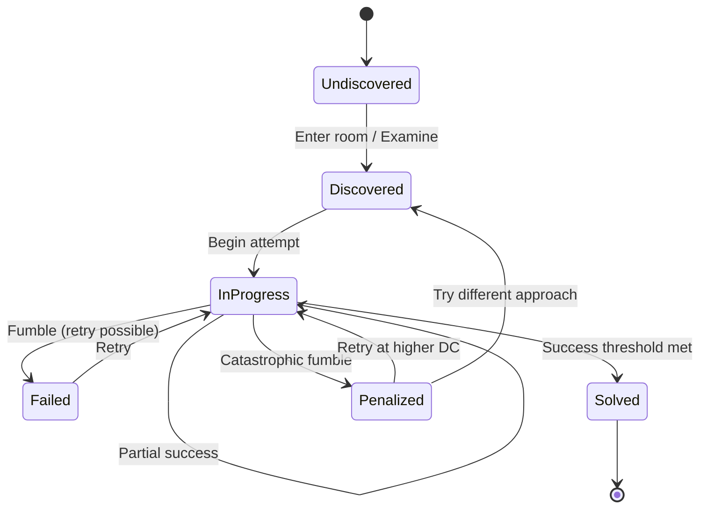

# Puzzle System Specification

**Version:** 1.0
**Last Updated:** December 2024
**Status:** Active
**Domain:** Environment Systems

---

## Table of Contents

1. [Overview](#1-overview)
2. [Design Philosophy](#2-design-philosophy)
3. [Puzzle Categories](#3-puzzle-categories)
4. [Multi-Solution Architecture](#4-multi-solution-architecture)
5. [Solution Archetypes](#5-solution-archetypes)
6. [TUI Presentation](#6-tui-presentation)
7. [GUI Presentation](#7-gui-presentation)
8. [Puzzle Generation](#8-puzzle-generation)
9. [Skill Check Integration](#9-skill-check-integration)
10. [State Management](#10-state-management)
11. [Service Interface](#11-service-interface)
12. [Related Documentation](#12-related-documentation)

---

## 1. Overview

### 1.1 Purpose

The Puzzle System defines how environmental puzzles are **generated**, **presented**, and **solved** in Rune & Rust. Puzzles provide non-combat engagement, reward exploration, and ensure every character build can contribute meaningfully to environmental challenges.

### 1.2 Core Principle: The Multi-Solution Guarantee

**Every significant puzzle MUST have at least three valid solutions**, ensuring:
- No character build is "locked out" of content
- Different approaches have meaningful trade-offs
- Players feel clever when discovering alternative solutions

### 1.3 Example: The Blast Door

A player encounters a corroded blast door. Valid solutions:

| Approach | Method | Trade-off |
|----------|--------|-----------|
| **Force it open** | MIGHT check (DC 5) | Fast but loud; may break mechanism |
| **Restore power** | FINESSE check (DC 4) | Quiet but requires wire from inventory |
| **Find alternate route** | WITS check (DC 3) | Silent but reveals different path, not this door |
| **Squeeze through vent** | FINESSE check (DC 4) | Bypasses entirely; requires small gap |
| **Jury-rig the circuit** | Scrap-Tinker ability | Specialist bypass; uses toolkit charge |

---

## 2. Design Philosophy

### 2.1 Core Pillars

| Pillar | Description | Implementation |
|--------|-------------|----------------|
| **Build Viability** | No build locked out of content | 80%+ puzzles solvable by any archetype |
| **Trade-off Differentiation** | Each solution has distinct pros/cons | Force = fast/loud; Finesse = slow/quiet |
| **Discovery Satisfaction** | Finding alternatives feels rewarding | Hints reveal options on examination |
| **Narrative Coherence** | Solutions make sense in-world | Rusted lever can be forced OR lubricated |
| **No Permanent Lockout** | Failures create obstacles, not walls | Fumbles increase DC, never block entirely |

### 2.2 The Cardinal Rule: No Dead Ends

**A player should NEVER be permanently locked out of solving a puzzle.**

Even the worst fumble creates *difficulty*, not *impossibility*:
- A jammed door becomes harder to force (DC +4), but can still be forced
- A broken lockpick jams the lock, but the door can still be kicked down
- A shorted circuit deals damage on retry, but the circuit can still be jury-rigged
- A damaged mechanism reveals weaknesses in other approaches (DC -1 elsewhere)

This ensures players always have agency and are never punished with a permanent dead end for bad luck.

### 2.3 The Three-Solution Minimum

Every significant environmental puzzle requires:

1. **Primary Solution** — The "intended" physical approach
2. **Alternative Solution** — Different attribute-based approach
3. **Specialist Solution** — Class/specialization-specific bypass

### 2.4 Anti-Patterns to Avoid

| Anti-Pattern | Problem | Solution |
|--------------|---------|----------|
| **Single Solution** | Locks out builds | Add 2+ alternatives |
| **Trivial Alternative** | No meaningful choice | Add trade-offs |
| **Impossible DC** | No build can succeed | Cap primary DC at 5 |
| **Hidden Solution** | Players never find it | Provide examination hints |
| **Mandatory Specialist** | Requires specific class | Add general alternative |
| **Moon Logic** | Arbitrary solution | Observable clues must exist |

---

## 3. Puzzle Categories

### 3.1 Category Overview

| Category | Primary Challenge | Key Skills | Biome Affinity |
|----------|-------------------|------------|----------------|
| **Mechanical** | Operate machinery | WITS, FINESSE | The Roots, Jötunheim |
| **Environmental** | Navigate hazards | FINESSE, STURDINESS | Muspelheim, Niflheim |
| **Logic** | Decode patterns | WITS, Lore | Universal |
| **Combination** | Multiple locks/safes | WITS, Search | Universal |
| **Ritual** | Follow procedures | WITS, WILL | Alfheim, Jötunheim |
| **Hardware Malfunction** | Fix degraded systems | MIGHT, FINESSE | The Roots |
| **Security** | Bypass access controls | FINESSE, WITS | Universal |
| **Obstruction** | Clear physical barriers | MIGHT, FINESSE | Universal |

### 3.2 Category: Mechanical Puzzles

**Description:** Understanding and operating ancient Dvergr machinery.

**Subtypes:**

| Subtype | Challenge | Example |
|---------|-----------|---------|
| Gear Alignment | Rotate gears to connect power | Steam pipe junction |
| Pressure Regulation | Balance multiple valves | Reactor cooling system |
| Circuit Routing | Connect power paths | Terminal power restoration |
| Lock Mechanism | Complex multi-stage lock | Vault door |

**Required Solutions:**

| # | Type | Approach | DC |
|---|------|----------|-----|
| 1 | Intellect | Analyze mechanism pattern | WITS 3-4 |
| 2 | Finesse | Carefully manipulate | FINESSE 3-4 |
| 3 | Force | Brute-force mechanism | MIGHT 4-5 (may break) |
| 4 | Bypass | Scrap-Tinker override | DC 2-3 |

### 3.3 Category: Environmental Puzzles

**Description:** Navigating dangerous terrain or conditions.

**Subtypes:**

| Subtype | Challenge | Example |
|---------|-----------|---------|
| Timed Crossing | Navigate before hazard reactivates | Steam vent corridor |
| Platforming | Traverse unstable terrain | Collapsed floor |
| Hazard Navigation | Find safe path | Electrified grid |
| Temperature Management | Survive extremes | Frozen passage |

**Required Solutions:**

| # | Type | Approach | DC |
|---|------|----------|-----|
| 1 | Finesse | Precise timing/movement | FINESSE 3-4 |
| 2 | Intellect | Analyze pattern for safe path | WITS 3-4 |
| 3 | Endurance | Push through with STURDINESS | Damage + STURDINESS 4 |
| 4 | Bypass | Find alternate route | Exploration |

### 3.4 Category: Logic Puzzles

**Description:** Pattern recognition and deduction challenges.

**Subtypes:**

| Subtype | Challenge | Example |
|---------|-----------|---------|
| Sequence | Identify and continue pattern | Rune activation order |
| Code Decryption | Break coded message | Terminal passcode |
| Symbol Matching | Associate symbols with meanings | Ancient door lock |
| Arrangement | Place objects correctly | Pressure plate puzzle |

**Required Solutions:**

| # | Type | Approach | DC |
|---|------|----------|-----|
| 1 | Solve | Deduce correct solution | None (player skill) |
| 2 | Investigate | Find clue elsewhere | WITS 2-3 |
| 3 | Trial & Error | Systematic attempts | Time cost |
| 4 | Bypass | Specialist override | Varies |

### 3.5 Category: Obstruction Puzzles

**Description:** Physical barriers blocking passage.

**Subtypes:**

| Subtype | Challenge | Example |
|---------|-----------|---------|
| Debris | Clear collapsed material | Cave-in rubble |
| Barricade | Move/destroy barrier | Welded door |
| Gap | Cross or bypass opening | Broken bridge |

**Required Solutions:**

| # | Type | Approach | DC |
|---|------|----------|-----|
| 1 | Force | MIGHT to move/break | MIGHT 4-6 |
| 2 | Navigate | Squeeze through gap | FINESSE 3-4 |
| 3 | Destruction | Combat to break | HP-based |
| 4 | Alternate | Find different route | Exploration |
| 5 | Jury-rig | Improvise solution | WITS 4 + materials |

---

## 4. Multi-Solution Architecture

### 4.1 Solution Definition

Each puzzle solution is defined by:

```
SOLUTION STRUCTURE:
├── Solution ID (unique identifier)
├── Archetype (Force | Finesse | Intellect | Bypass | Destruction)
├── Name (display name)
├── Discovery Hint (shown on examination)
├── Requirements
│   ├── Skill Check (attribute + DC)
│   ├── Specialization (if specialist)
│   └── Item (if required)
├── Trade-offs
│   ├── Time Cost (minutes)
│   ├── Noise Level (0-10)
│   └── Risk Level (fumble consequences)
└── Narratives
    ├── Success Text
    └── Failure Text
```

### 4.2 Solution Availability

Solutions become visible based on character capabilities:

| Visibility Level | Condition | Display |
|------------------|-----------|---------|
| **Always Visible** | No requirements | Full details shown |
| **Conditionally Visible** | Has required item/skill | Shown if character qualifies |
| **Specialist Only** | Requires specialization | Shown only to specialists |
| **Hidden** | Requires discovery | Revealed by examination/hint |

### 4.3 Trade-off Matrix

| Solution Type | Speed | Noise | Risk | Resource |
|---------------|-------|-------|------|----------|
| **Force** | Fast | Loud | Moderate (fumble) | None |
| **Finesse** | Moderate | Quiet | Low | Tools (sometimes) |
| **Intellect** | Variable | Silent | None | None |
| **Bypass** | Fastest | Variable | Low | Ability/Tool |
| **Destruction** | Slow | Very Loud | Collateral | HP/Stamina |
| **Jury-rig** | Moderate | Quiet | Variable | Materials |

---

## 5. Solution Archetypes

### 5.1 Force (MIGHT-Based)

**Philosophy:** Apply raw physical power.

**Applicable To:**
- Stuck mechanisms (levers, valves, wheels)
- Blocked passages (debris, doors)
- Heavy objects (crates, barricades)
- Jammed locks (forced entry)

**Example Verbs:** `force`, `push`, `break`, `pry`, `smash`, `heave`

**Trade-offs:**
- ✓ Fast resolution
- ✓ No special tools
- ✗ Creates noise (may alert enemies)
- ✗ Fumble risk (may break mechanism)

### 5.2 Finesse (FINESSE-Based)

**Philosophy:** Apply precision and dexterity.

**Applicable To:**
- Locks and latches
- Delicate mechanisms
- Trap disarmament
- Precise adjustments
- Squeezing through gaps

**Example Verbs:** `manipulate`, `pick`, `adjust`, `squeeze`, `thread`, `balance`

**Trade-offs:**
- ✓ Quiet operation
- ✓ Low fumble consequences
- ✗ May take longer
- ✗ May require tools (lockpicks)

### 5.3 Intellect (WITS-Based)

**Philosophy:** Analyze and find clever solutions.

**Applicable To:**
- Logic puzzles (codes, sequences)
- Terminal hacking
- Identifying weak points
- Discovering hidden mechanisms
- Understanding ancient tech

**Example Verbs:** `analyze`, `deduce`, `hack`, `study`, `decode`, `identify`

**Trade-offs:**
- ✓ No physical risk
- ✓ May reveal additional information
- ✗ Doesn't always directly solve
- ✗ Time investment for analysis

### 5.4 Bypass (Specialist)

**Philosophy:** Use specialized knowledge to circumvent entirely.

**Applicable To:**
- Mechanism bypass (Scrap-Tinker)
- Runic override (Rune-Singer)
- Security bypass (Ruin-Stalker)
- Structural analysis (Hólmgangr)
- Aetheric sense (Void-Touched)

**Trade-offs:**
- ✓ Often the fastest solution
- ✓ Feels rewarding when applicable
- ✗ Requires specific specialization
- ✗ May consume resources

### 5.5 Destruction (Combat)

**Philosophy:** If you can't solve it, destroy it.

**Applicable To:**
- Destructible barriers
- Weak mechanisms
- Some containers
- Non-essential obstacles

**Trade-offs:**
- ✓ Always available as last resort
- ✗ Time-consuming (HP-based)
- ✗ Very noisy
- ✗ May cause collateral damage
- ✗ Cannot destroy everything

### 5.6 Jury-Rig (Improvisation)

**Philosophy:** Improvise a creative solution with available materials.

**Applicable To:**
- Power restoration
- Mechanism repair
- Bridge construction
- Tool creation

**Example:** Using a metal pipe as a lever, wiring around a broken circuit, wedging debris to create a step.

**Trade-offs:**
- ✓ Creative problem-solving
- ✓ Uses common materials
- ✗ Consumes inventory items
- ✗ May be temporary fix

---

## 6. TUI Presentation

### 6.1 Puzzle Discovery

When a player enters a room with a puzzle:

```
┌─ The Reactor Control Room ─────────────────────────────────────┐
│                                                                 │
│  You enter a cramped chamber dominated by a massive control     │
│  console. Warning lights pulse red across its surface. Steam    │
│  hisses from overhead pipes.                                    │
│                                                                 │
│  The blast door ahead is sealed. Its control panel is dark—     │
│  the power coupling has corroded away.                          │
│                                                                 │
│  Exits: [N] Corridor  [S] Sealed Blast Door ◊                   │
│                                                                 │
│  ◊ = Unsolved puzzle                                            │
└─────────────────────────────────────────────────────────────────┘
```

### 6.2 Puzzle Examination

When the player examines the puzzle:

```
> examine door

┌─ Corroded Blast Door ──────────────────────────────────────────┐
│                                                                 │
│  A massive blast door blocks the passage. Its surface is        │
│  pitted with corrosion, and the control panel beside it is      │
│  dark and unresponsive.                                         │
│                                                                 │
│  ─── OBSERVATIONS ───                                           │
│                                                                 │
│  • The door could perhaps be forced open with sufficient        │
│    strength.                                                    │
│  • The control panel's power coupling has corroded loose.       │
│  • A maintenance duct in the ceiling might lead somewhere.      │
│  • A ventilation shaft beside the door looks just wide enough   │
│    to squeeze through.                                          │
│                                                                 │
│  [Your Scrap-Tinker training reveals an emergency override      │
│   circuit accessible through the panel.]                        │
│                                                                 │
│  Commands: [interact door] [force door] [squeeze vent]          │
└─────────────────────────────────────────────────────────────────┘
```

### 6.3 Solution Selection Menu

When the player chooses to interact:

```
> interact door

┌─ CORRODED BLAST DOOR ──────────────────────────────────────────┐
│                                                                 │
│  A massive blast door blocks the passage...                     │
│                                                                 │
├─ AVAILABLE APPROACHES ─────────────────────────────────────────┤
│                                                                 │
│  [1] Force Open                           (MIGHT DC 5) ⚠        │
│      Time: 3 min | Noise: Loud | Risk: May break mechanism     │
│                                                                 │
│  [2] Restore Power                        (FINESSE DC 4)        │
│      Time: 5 min | Noise: Quiet | Requires: Wire (1)           │
│                                                                 │
│  [3] Find Alternate Route                 (WITS DC 3)           │
│      Time: 2 min | Noise: Silent | Reveals path only           │
│                                                                 │
│  [4] Squeeze Through Vent                 (FINESSE DC 4)        │
│      Time: 1 min | Noise: Quiet | Bypasses door entirely       │
│                                                                 │
│  [5] Security Override ★                  (DC 3)                │
│      Time: 2 min | Noise: Quiet | Uses: Toolkit Charge (1)     │
│      [Scrap-Tinker Specialization]                              │
│                                                                 │
├─────────────────────────────────────────────────────────────────┤
│  ★ = Specialist solution   ⚠ = High fumble risk                 │
│                                                                 │
│  [1-5] Select approach  [E] Examine more  [C] Cancel            │
└─────────────────────────────────────────────────────────────────┘
```

### 6.4 Skill Check Resolution

When the player selects an approach:

```
> 1

┌─ FORCE OPEN ───────────────────────────────────────────────────┐
│                                                                 │
│  You brace yourself against the door frame and grip the         │
│  corroded edge. With a mighty heave, you attempt to wrench      │
│  the blast door from its tracks.                                │
│                                                                 │
│  ─── MIGHT CHECK (DC 5) ───                                     │
│                                                                 │
│  Your MIGHT: 6 → Rolling 6d10                                   │
│                                                                 │
│  Dice: [2] [8] [9] [4] [10] [7]                                 │
│        ─── ███ ███ ─── ████ ───                                 │
│                                                                 │
│  Successes: 3 (≥8)    Required: 5                               │
│                                                                 │
│  ─── RESULT: FAILURE ───                                        │
│                                                                 │
│  The door groans and shifts slightly, but refuses to budge.     │
│  Your arms ache from the effort. The mechanism remains          │
│  stubbornly sealed.                                             │
│                                                                 │
│  You may try again or choose a different approach.              │
│                                                                 │
│  [R] Retry  [B] Back to options                                 │
└─────────────────────────────────────────────────────────────────┘
```

### 6.5 Success Resolution

On success:

```
┌─ SUCCESS! ─────────────────────────────────────────────────────┐
│                                                                 │
│  With a mighty heave, you wrench the blast door from its        │
│  tracks! Metal screams in protest as the corroded mechanism     │
│  gives way. The door slides half-open—enough to pass through.   │
│                                                                 │
│  The noise echoes through the facility...                       │
│                                                                 │
│  [+25 Legend — Puzzle solved]                                   │
│  [Alert Level: +1 — Enemies may investigate]                    │
│                                                                 │
│  The passage south is now open.                                 │
│                                                                 │
│  [Continue]                                                     │
└─────────────────────────────────────────────────────────────────┘
```

### 6.6 Fumble Resolution

On fumble:

```
┌─ FUMBLE! ──────────────────────────────────────────────────────┐
│                                                                 │
│  You throw your weight against the door—and something snaps.    │
│  The door mechanism grinds and jams tighter than before.        │
│                                                                 │
│  The noise draws attention...                                   │
│                                                                 │
│  [Alert Level: +2 — Enemies alerted]                            │
│  [Force solution: DC increased to 9 (was 5)]                    │
│                                                                 │
│  The mechanism is damaged, but not destroyed:                   │
│  • Force is now much harder (DC 9)                              │
│  • Other approaches remain available at normal DC               │
│  • The exposed hinges might be exploitable (FINESSE DC 4)       │
│                                                                 │
│  [Continue]                                                     │
└─────────────────────────────────────────────────────────────────┘
```

### 6.7 Progress Tracking

For multi-stage puzzles:

```
┌─ PRESSURE REGULATION ──────────────────────────────────────────┐
│                                                                 │
│  Progress: ████████░░░░░░░░ 2/4 valves balanced                 │
│                                                                 │
│  Section A: ▓▓▓▓▓▓▓▓ GREEN (Optimal)                            │
│  Section B: ▓▓▓▓▓▓░░ YELLOW (Borderline)                        │
│  Section C: ▓▓▓░░░░░ RED (Critical!)                            │
│                                                                 │
│  The pressure in Section C is rising! You need to adjust        │
│  Valve C before the system overloads.                           │
│                                                                 │
│  Time Pressure: ████████░░ (System stable... for now)           │
│                                                                 │
│  [A] Adjust Valve A  [B] Adjust Valve B  [C] Adjust Valve C     │
└─────────────────────────────────────────────────────────────────┘
```

---

## 7. GUI Presentation

### 7.1 Puzzle Panel Layout

```
┌──────────────────────────────────────────────────────────────────┐
│ ╔═══════════════════════════════════════════════════════════════╗│
│ ║  CORRODED BLAST DOOR                                    [◊]   ║│
│ ╟───────────────────────────────────────────────────────────────╢│
│ ║                                                               ║│
│ ║  ┌─────────────────────────────────────────────────────────┐  ║│
│ ║  │                                                         │  ║│
│ ║  │                  [PUZZLE VISUAL]                        │  ║│
│ ║  │                                                         │  ║│
│ ║  │     Image of corroded blast door with visible           │  ║│
│ ║  │     damage, dark control panel, and vent shaft          │  ║│
│ ║  │                                                         │  ║│
│ ║  └─────────────────────────────────────────────────────────┘  ║│
│ ║                                                               ║│
│ ║  A massive blast door blocks the passage. Its surface is      ║│
│ ║  pitted with corrosion, and the control panel beside it       ║│
│ ║  is dark and unresponsive.                                    ║│
│ ║                                                               ║│
│ ╟───────────────────────────────────────────────────────────────╢│
│ ║  APPROACHES                                                   ║│
│ ║  ┌─────────────────────────────────────────────────────────┐  ║│
│ ║  │ ⚔ Force Open          MIGHT DC 5       ⚠ Risk: Break   │  ║│
│ ║  │   Time: 3 min | Noise: ████████░░ Loud                  │  ║│
│ ║  ├─────────────────────────────────────────────────────────┤  ║│
│ ║  │ 🔧 Restore Power       FINESSE DC 4    Needs: Wire ×1   │  ║│
│ ║  │   Time: 5 min | Noise: ██░░░░░░░░ Quiet                 │  ║│
│ ║  ├─────────────────────────────────────────────────────────┤  ║│
│ ║  │ 🔍 Find Alternate      WITS DC 3       Reveals path     │  ║│
│ ║  │   Time: 2 min | Noise: ░░░░░░░░░░ Silent                │  ║│
│ ║  ├─────────────────────────────────────────────────────────┤  ║│
│ ║  │ 🚪 Squeeze Through Vent  FINESSE DC 4  Bypass door      │  ║│
│ ║  │   Time: 1 min | Noise: ██░░░░░░░░ Quiet                 │  ║│
│ ║  ├─────────────────────────────────────────────────────────┤  ║│
│ ║  │ ★ Security Override    DC 3            Uses: Toolkit    │  ║│
│ ║  │   [Scrap-Tinker] Time: 2 min | Noise: ██░░░░░░░░        │  ║│
│ ║  └─────────────────────────────────────────────────────────┘  ║│
│ ║                                                               ║│
│ ║  [Attempt Selected]                    [Examine] [Cancel]     ║│
│ ╚═══════════════════════════════════════════════════════════════╝│
└──────────────────────────────────────────────────────────────────┘
```

### 7.2 Solution Cards

Each solution displays as a selectable card:

```
┌─────────────────────────────────────────────────────────────┐
│ ⚔ FORCE OPEN                                           [⚠]  │
├─────────────────────────────────────────────────────────────┤
│ Skill: MIGHT                    DC: 5                       │
│ Your Dice: 6d10                 Success Chance: ~65%        │
├─────────────────────────────────────────────────────────────┤
│ ⏱ Time: 3 min                                               │
│ 🔊 Noise: ████████░░ Loud                                   │
│ ⚠ Risk: May break mechanism                                 │
├─────────────────────────────────────────────────────────────┤
│ "With enough strength, you could force the door open."      │
└─────────────────────────────────────────────────────────────┘
```

### 7.3 Specialist Solution Highlight

Specialist solutions are visually distinct:

```
┌─────────────────────────────────────────────────────────────┐
│ ★ SECURITY OVERRIDE                        [Scrap-Tinker]   │
├─────────────────────────────────────────────────────────────┤
│ Your specialization grants access to this approach.         │
├─────────────────────────────────────────────────────────────┤
│ DC: 3                           Success Chance: ~85%        │
├─────────────────────────────────────────────────────────────┤
│ ⏱ Time: 2 min                                               │
│ 🔊 Noise: ██░░░░░░░░ Quiet                                  │
│ 📦 Uses: Toolkit Charge (1)                                 │
├─────────────────────────────────────────────────────────────┤
│ "Your training reveals an emergency override circuit."      │
└─────────────────────────────────────────────────────────────┘
```

### 7.4 Skill Check Visualization

```
┌─────────────────────────────────────────────────────────────┐
│                      MIGHT CHECK                            │
├─────────────────────────────────────────────────────────────┤
│                                                             │
│  Your MIGHT: 6                    DC: 5 successes           │
│                                                             │
│  ┌───┐ ┌───┐ ┌───┐ ┌───┐ ┌───┐ ┌───┐                       │
│  │ 2 │ │ 8 │ │ 9 │ │ 4 │ │10 │ │ 7 │                       │
│  └───┘ └───┘ └───┘ └───┘ └───┘ └───┘                       │
│    ─     ✓     ✓     ─     ✓     ─                         │
│                                                             │
│  Successes: 3 / 5 required                                  │
│                                                             │
│  ████████████░░░░░░░░                                       │
│                                                             │
│                     FAILURE                                 │
│                                                             │
│  The door groans but refuses to budge.                      │
│                                                             │
└─────────────────────────────────────────────────────────────┘
```

### 7.5 Multi-Stage Progress

For complex puzzles with multiple stages:

```
┌─────────────────────────────────────────────────────────────┐
│  PRESSURE REGULATION SYSTEM                                 │
├─────────────────────────────────────────────────────────────┤
│                                                             │
│  STAGE PROGRESS                                             │
│  ═══════════════════════════════════════════════            │
│  [1 ✓] [2 ✓] [3 ○] [4 ○]     2/4 Complete                   │
│                                                             │
│  ┌─────────────┐ ┌─────────────┐ ┌─────────────┐            │
│  │ SECTION A   │ │ SECTION B   │ │ SECTION C   │            │
│  │  ████████   │ │  ██████░░   │ │  ███░░░░░   │            │
│  │   GREEN     │ │   YELLOW    │ │    RED      │            │
│  │  Optimal    │ │ Borderline  │ │  CRITICAL   │            │
│  └─────────────┘ └─────────────┘ └─────────────┘            │
│                                                             │
│  ⚠ Section C pressure rising! Adjust before overload!       │
│                                                             │
│  TIME PRESSURE: ████████░░░░░░░░░░ (30 seconds)             │
│                                                             │
└─────────────────────────────────────────────────────────────┘
```

---

## 8. Puzzle Generation

### 8.1 Generation Pipeline

```
INPUT: Room Archetype + Biome + Difficulty Tier
  ↓
PHASE 1: Category Selection
  • Select puzzle category based on room archetype
  • Weight by biome affinity
  ↓
PHASE 2: Template Selection
  • Choose specific puzzle template
  • Apply biome flavor
  ↓
PHASE 3: Solution Generation
  • Generate primary solution (matches template)
  • Generate alternative solution (different archetype)
  • Generate bypass solution (if specialist)
  • Generate jury-rig option (if materials possible)
  ↓
PHASE 4: DC Calibration
  • Set DCs based on difficulty tier
  • Ensure primary DC ≤ 5
  ↓
PHASE 5: Hint Generation
  • Create examination hints for each solution
  • Place remote hints if needed
  ↓
PHASE 6: Consequence Assignment
  • Define fumble consequences
  • Define noise levels
  • Define time costs
  ↓
OUTPUT: Complete Puzzle Definition
```

### 8.2 Category Weighting by Room Archetype

| Room Archetype | Mechanical | Environmental | Logic | Obstruction | Security |
|----------------|------------|---------------|-------|-------------|----------|
| **EntryHall** | 20% | 10% | 10% | 40% | 20% |
| **Corridor** | 15% | 30% | 5% | 30% | 20% |
| **Chamber** | 30% | 20% | 30% | 10% | 10% |
| **Vault** | 20% | 5% | 25% | 10% | 40% |
| **Workshop** | 50% | 10% | 20% | 10% | 10% |

### 8.3 Biome Affinity Modifiers

| Biome | Mechanical | Environmental | Logic | Ritual |
|-------|------------|---------------|-------|--------|
| **The Roots** | +30% | +10% | +10% | -20% |
| **Muspelheim** | +10% | +40% | -10% | +10% |
| **Niflheim** | +10% | +40% | +10% | -10% |
| **Alfheim** | -20% | +10% | +20% | +40% |
| **Jötunheim** | +30% | +10% | +20% | +20% |

### 8.4 Difficulty Tier DC Ranges

| Tier | Primary DC | Alternative DC | Bypass DC |
|------|------------|----------------|-----------|
| **1 (Tutorial)** | 2-3 | 2-3 | 1-2 |
| **2 (Easy)** | 3-4 | 3-4 | 2-3 |
| **3 (Standard)** | 4-5 | 4-5 | 3-4 |
| **4 (Challenging)** | 5 | 5-6 | 4-5 |
| **5 (Expert)** | 5 | 6 | 5 |

**Rule:** Primary solution DC never exceeds 5.

### 8.5 Solution Template Library

**Force Solutions:**

| Template | Applicable To | DC Range | Noise | Fumble |
|----------|---------------|----------|-------|--------|
| `force_open` | doors, hatches | 3-6 | Loud | Break mechanism |
| `push_aside` | debris, crates | 2-5 | Moderate | Displacement |
| `break_through` | barriers | 4-6 | Very Loud | Collapse |

**Finesse Solutions:**

| Template | Applicable To | DC Range | Noise | Requirement |
|----------|---------------|----------|-------|-------------|
| `pick_lock` | locks | 3-5 | Quiet | Lockpicks |
| `manipulate` | mechanisms | 3-5 | Quiet | None |
| `squeeze_through` | gaps, vents | 3-4 | Quiet | Small gap |
| `disarm` | traps | 4-5 | Quiet | Tools |

**Intellect Solutions:**

| Template | Applicable To | DC Range | Result |
|----------|---------------|----------|--------|
| `analyze_pattern` | sequences | 2-4 | Reveals solution |
| `find_weakness` | obstacles | 3-4 | Reduces DC |
| `hack_terminal` | electronics | 3-5 | Grants access |
| `find_alternate` | any | 2-3 | Reveals bypass |

**Jury-Rig Solutions:**

| Template | Applicable To | DC Range | Materials |
|----------|---------------|----------|-----------|
| `wire_bypass` | power systems | 4-5 | Wire (1) |
| `improvise_lever` | mechanisms | 3-4 | Metal Pipe |
| `bridge_gap` | gaps | 4-5 | Planks, Rope |
| `wedge_open` | doors | 3-4 | Any solid object |

---

## 9. Skill Check Integration

### 9.1 Attribute Mapping

| Solution Type | Primary Attribute | Secondary Attribute |
|---------------|-------------------|---------------------|
| Force | MIGHT | STURDINESS |
| Finesse | FINESSE | WITS |
| Intellect | WITS | WILL |
| Endurance | STURDINESS | MIGHT |
| Bypass | Varies by specialization | — |

### 9.2 Extended Checks

Some puzzles require multiple successes (extended checks):

| Puzzle Complexity | Successes Required | Attempts Allowed |
|-------------------|-------------------|------------------|
| Simple | 1-2 | Unlimited |
| Standard | 3-4 | Unlimited |
| Complex | 5+ | Limited (usually 3) |
| Timed | Varies | Time-limited |

### 9.3 Fumble Threshold

Fumbles occur when rolling **zero successes** on an extended check:

| Roll Result | Outcome |
|-------------|---------|
| 0 successes + at least one 1 | Fumble — negative consequences |
| 0 successes | Failure — no progress, retry allowed |
| 1+ successes | Progress — accumulate toward threshold |
| Threshold met | Success — puzzle solved |

### 9.4 Consequence Severity

| Consequence Level | Effect |
|-------------------|--------|
| **None** | Can retry freely |
| **Minor** | Small damage (1d4) or resource cost |
| **Moderate** | Significant damage (2d6) or state change |
| **Severe** | Major damage (3d8) or DC increase (+2) |
| **Catastrophic** | Solution becomes much harder (see below) |

### 9.5 The "No Permanent Lockout" Rule

**Critical Design Principle:** No failure should ever permanently block a puzzle solution. Even catastrophic failures create *obstacles*, not *impossibilities*.

**Catastrophic Failure Consequences:**

| Failed Solution | Consequence | Recovery Options |
|-----------------|-------------|------------------|
| Force (mechanism breaks) | DC +4 for Force retry; mechanism damaged | Can still use other solutions at normal DC |
| Finesse (lockpick breaks in lock) | DC +3 for lockpicking; lock partially jammed | Force now easier (DC -1); key still works |
| Jury-rig (wiring shorts) | System sparks dangerously; 2d6 damage per attempt | Find insulating materials to try again; other solutions unaffected |
| Bypass (toolkit overloads) | Specialist bypass unavailable until toolkit repaired | Toolkit repair at settlement; other solutions work |

**Example: Jammed Door**

```
> force door

  [MIGHT Check vs DC 5]
  Rolling... FUMBLE (0 successes, rolled 1)

  You throw your weight against the door—and something snaps.
  The door mechanism grinds and locks up tighter than before.

  [Door Jammed: Force solution now DC 9]
  [Noise Generated: Alert Level +2]

  The door won't budge easily now, but you notice:
  • The hinges are exposed—you could try to remove them (FINESSE DC 4)
  • A maintenance panel might offer another approach (WITS DC 3)
  • Enough force could still break through (MIGHT DC 9)
  • The ventilation shaft remains an option

  [Available approaches updated]
```

**Recovery Costs for Catastrophic Failures:**

| Recovery Type | Cost | Effect |
|---------------|------|--------|
| **Retry same solution** | Higher DC (+3 to +5) | Still possible, just harder |
| **Use different solution** | Normal DC | Unaffected by failure |
| **Find repair materials** | Time + exploration | Reduce penalty by half |
| **Return with specialist** | Party composition | Remove penalty entirely |
| **Brute destruction** | Time + noise + damage | Always works eventually |

---

## 10. State Management

### 10.1 Puzzle State Machine



**Note:** The "Penalized" state means the solution is *harder*, not *blocked*. Players can always retry at increased difficulty or switch to an unaffected approach.

### 10.2 State Properties

```csharp
public enum PuzzleState
{
    Undiscovered,   // Puzzle exists but player hasn't seen it
    Discovered,     // Player has seen puzzle, not attempted
    InProgress,     // Currently attempting solution
    Failed,         // Last attempt failed, retry possible
    Penalized,      // Catastrophic fumble — solution harder but not blocked
    Solved          // Puzzle complete
}

public record PuzzleStateData
{
    public Guid PuzzleId { get; init; }
    public PuzzleState State { get; init; }
    public string? CurrentSolutionId { get; init; }
    public int ProgressSuccesses { get; init; }
    public int AttemptsRemaining { get; init; }

    /// <summary>
    /// DC penalties applied to specific solutions due to fumbles.
    /// Key = SolutionId, Value = DC increase (e.g., +3, +4).
    /// Solutions are NEVER fully blocked—only penalized.
    /// </summary>
    public Dictionary<string, int> SolutionDCPenalties { get; init; } = new();

    /// <summary>
    /// Bonus effects revealed by fumbles (e.g., exposed hinges).
    /// Key = SolutionId, Value = DC decrease.
    /// </summary>
    public Dictionary<string, int> SolutionDCBonuses { get; init; } = new();

    public string? UsedSolutionId { get; init; }
    public DateTime? SolvedAt { get; init; }
}
```

### 10.3 Persistence

Puzzle states persist across sessions:

| Field | Type | Description |
|-------|------|-------------|
| `puzzle_id` | GUID | Unique puzzle identifier |
| `room_id` | GUID | Parent room |
| `state` | Enum | Current puzzle state |
| `progress` | Int | Accumulated successes |
| `dc_penalties` | JSON | Map of solution IDs to DC increases |
| `dc_bonuses` | JSON | Map of solution IDs to DC decreases |
| `solved_via` | String | Solution ID used (if solved) |
| `solved_at` | DateTime | When solved (if solved) |

**Note:** The old `blocked_solutions` field has been replaced with `dc_penalties`. No solution is ever truly blocked—only made harder.

---

## 11. Service Interface

### 11.1 IPuzzleCommandService

```csharp
public interface IPuzzleCommandService
{
    /// <summary>Get puzzle details for a room</summary>
    Task<PuzzleExaminationResult> ExaminePuzzleAsync(
        Guid roomId,
        Guid characterId);

    /// <summary>Get available solutions for character</summary>
    Task<IReadOnlyList<PuzzleSolutionOption>> GetAvailableSolutionsAsync(
        Guid puzzleId,
        Guid characterId);

    /// <summary>Attempt a puzzle solution</summary>
    Task<PuzzleAttemptResult> AttemptSolutionAsync(
        Guid puzzleId,
        string solutionId,
        Guid characterId);

    /// <summary>Get current puzzle state</summary>
    Task<PuzzleStateData> GetPuzzleStateAsync(Guid puzzleId);
}
```

### 11.2 Data Transfer Objects

```csharp
public record PuzzleExaminationResult
{
    public Guid PuzzleId { get; init; }
    public string Name { get; init; } = string.Empty;
    public string Description { get; init; } = string.Empty;
    public PuzzleState State { get; init; }
    public IReadOnlyList<string> VisibleHints { get; init; } = [];
    public IReadOnlyList<string> SpecialistHints { get; init; } = [];
    public bool HasProgress { get; init; }
    public int CurrentProgress { get; init; }
    public int RequiredProgress { get; init; }
}

public record PuzzleSolutionOption
{
    public string SolutionId { get; init; } = string.Empty;
    public string Name { get; init; } = string.Empty;
    public string Description { get; init; } = string.Empty;
    public SolutionArchetype Archetype { get; init; }
    public string? SkillCheck { get; init; }
    public int BaseDC { get; init; }
    public int DCPenalty { get; init; }  // From fumbles
    public int DCBonus { get; init; }    // From revealed weaknesses
    public int EffectiveDC => BaseDC + DCPenalty - DCBonus;
    public int TimeCostMinutes { get; init; }
    public int NoiseLevel { get; init; }
    public string? RequiredItem { get; init; }
    public int? RequiredItemQuantity { get; init; }
    public string? RequiredSpecialization { get; init; }
    public string? RiskWarning { get; init; }
    public bool IsPenalized { get; init; }  // True if fumble increased DC
    public string? PenaltyReason { get; init; }  // e.g., "Mechanism jammed"
    public float EstimatedSuccessChance { get; init; }
}

public record PuzzleAttemptResult
{
    public bool Success { get; init; }
    public bool Fumble { get; init; }
    public int SuccessesRolled { get; init; }
    public int SuccessesRequired { get; init; }
    public int[] DiceResults { get; init; } = [];
    public string NarrativeText { get; init; } = string.Empty;
    public PuzzleState NewState { get; init; }
    public int? DamageTaken { get; init; }
    public int? NoiseGenerated { get; init; }
    public int? LegendAwarded { get; init; }
    public IReadOnlyList<string> ConsequenceMessages { get; init; } = [];

    // Fumble consequences (solution is NEVER blocked, only penalized)
    public int? DCPenaltyApplied { get; init; }  // e.g., +4 to this solution
    public int? DCBonusRevealed { get; init; }   // e.g., -1 to another solution
    public string? NewSolutionRevealed { get; init; }  // e.g., "exposed hinges"
}

public enum SolutionArchetype
{
    Force,
    Finesse,
    Intellect,
    Bypass,
    Destruction,
    JuryRig
}
```

### 11.3 Events

| Event | Trigger | Data |
|-------|---------|------|
| `PuzzleDiscoveredEvent` | Room entered with puzzle | `PuzzleId`, `RoomId` |
| `PuzzleAttemptedEvent` | Solution attempted | `PuzzleId`, `SolutionId`, `Success` |
| `PuzzleSolvedEvent` | Puzzle completed | `PuzzleId`, `SolutionId`, `LegendAwarded` |
| `PuzzleFumbledEvent` | Fumble occurred | `PuzzleId`, `SolutionId`, `DCPenalty`, `Consequences` |
| `SolutionPenalizedEvent` | Solution made harder | `PuzzleId`, `SolutionId`, `NewDC`, `Reason` |
| `SolutionRevealedEvent` | New approach discovered | `PuzzleId`, `SolutionId`, `DCBonus` |

---

## 12. Related Documentation

| Document | Relationship |
|----------|--------------|
| [Interaction Commands](../08-ui/commands/interaction.md) | TUI command integration |
| [Room Engine Core](./room-engine/core.md) | Puzzle placement in rooms |
| [Skill Checks](../01-core/dice-system.md) | Dice mechanics |
| [Descriptors](./room-engine/descriptors.md) | Puzzle description generation |
| [Navigation](./navigation.md) | Puzzle blocking passage |
| [Legend System](../01-core/saga-system.md) | Legend awards for puzzles |

---

## Appendix A: Example Puzzle Definition

```json
{
  "puzzleId": "blast_door_001",
  "name": "Corroded Blast Door",
  "category": "Security",
  "description": "A massive blast door blocks the passage. Its surface is pitted with corrosion, and the control panel beside it is dark and unresponsive.",
  "solutions": [
    {
      "solutionId": "force_open",
      "archetype": "Force",
      "name": "Force Open",
      "description": "Pry the door open with brute strength",
      "discoveryHint": "The door could perhaps be forced open with sufficient strength.",
      "requiredCheck": "MIGHT",
      "dc": 5,
      "timeCost": 3,
      "noiseLevel": 8,
      "riskWarning": "May break mechanism",
      "successNarrative": "With a mighty heave, you wrench the door from its tracks!",
      "failureNarrative": "The door groans but refuses to budge.",
      "fumbleConsequence": "The door mechanism breaks permanently."
    },
    {
      "solutionId": "restore_power",
      "archetype": "Finesse",
      "name": "Restore Power",
      "description": "Repair the control panel's power connection",
      "discoveryHint": "The control panel's power coupling has corroded loose.",
      "requiredCheck": "FINESSE",
      "dc": 4,
      "requiredItem": "wire",
      "requiredItemQuantity": 1,
      "timeCost": 5,
      "noiseLevel": 2,
      "successNarrative": "You reconnect the power and the panel hums to life!",
      "failureNarrative": "The connection sparks but doesn't hold."
    },
    {
      "solutionId": "find_alternate",
      "archetype": "Intellect",
      "name": "Find Alternate Route",
      "description": "Locate another way around",
      "discoveryHint": "A maintenance duct in the ceiling might lead somewhere.",
      "requiredCheck": "WITS",
      "dc": 3,
      "timeCost": 2,
      "noiseLevel": 0,
      "successNarrative": "You spot a maintenance duct that bypasses the door!",
      "resultType": "RevealAlternate"
    },
    {
      "solutionId": "squeeze_vent",
      "archetype": "Finesse",
      "name": "Squeeze Through Vent",
      "description": "Crawl through the ventilation shaft beside the door",
      "discoveryHint": "A ventilation shaft beside the door looks just wide enough to squeeze through.",
      "requiredCheck": "FINESSE",
      "dc": 4,
      "timeCost": 1,
      "noiseLevel": 2,
      "successNarrative": "You wriggle through the vent and emerge on the other side!",
      "resultType": "BypassPuzzle"
    },
    {
      "solutionId": "security_override",
      "archetype": "Bypass",
      "name": "Security Override",
      "description": "Use Scrap-Tinker knowledge to override security",
      "discoveryHint": "Your training reveals an emergency override circuit.",
      "requiredSpecialization": "Scrap-Tinker",
      "dc": 3,
      "resourceCosts": { "toolkit_charge": 1 },
      "timeCost": 2,
      "noiseLevel": 1,
      "successNarrative": "You trigger the emergency override and the door slides open!"
    }
  ],
  "validation": {
    "minSolutions": 3,
    "requiresForce": true,
    "requiresFinesse": true,
    "maxPrimaryDC": 5,
    "buildCoverage": ["Warrior", "Duelist", "Scholar", "Mystic", "Ranger"]
  }
}
```

---

## Appendix B: Build Coverage Validation

Every puzzle should be validated for build coverage:

| Build | Force? | Finesse? | Intellect? | Bypass? | Can Solve? |
|-------|--------|----------|------------|---------|------------|
| **Warrior** | ✓ Primary | — | — | — | ✓ |
| **Duelist** | Possible | ✓ Primary | — | — | ✓ |
| **Scholar** | — | Possible | ✓ Primary | — | ✓ |
| **Mystic** | — | — | ✓ Possible | ✓ Specialist | ✓ |
| **Ranger** | — | ✓ Primary | ✓ Possible | — | ✓ |
| **Tank** | ✓ Primary | — | — | — | ✓ |

**Validation Rule:** Every significant puzzle must have at least one solution accessible to each primary build archetype.

---

*This document is part of the Rune & Rust technical documentation suite.*
*Related: Multi-Solution Puzzle Design (legacy), Physical Interaction Commands, Room Engine*
