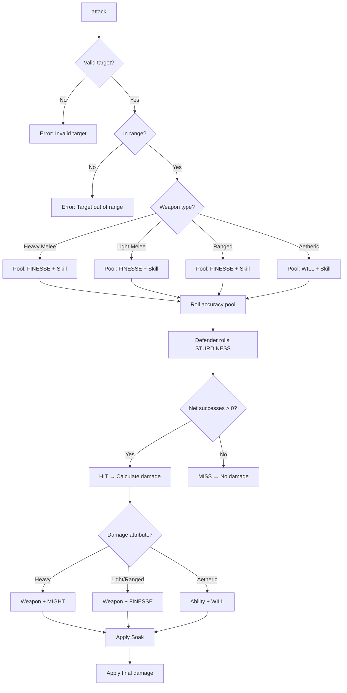
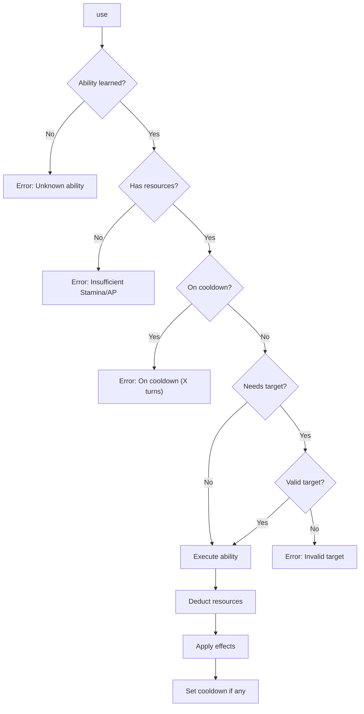
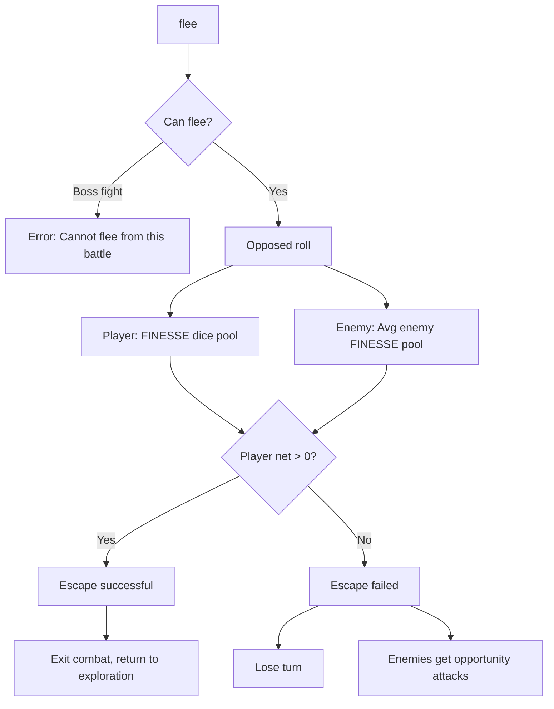

# Combat Commands

---

## Overview

Combat commands are available during turn-based combat encounters. This specification covers the command interface; see [combat-ui.md](../combat-ui.md) for presentation details and [combat-resolution.md](../../03-combat/combat-resolution.md) for resolution mechanics.

| Command | Aliases | Syntax | Action Cost |
|---------|---------|--------|-------------|
| `attack` | `a`, `hit`, `strike` | `attack <target>` | Standard |
| `defend` | `block`, `guard` | `defend` | Standard |
| `use` | `u`, `cast` | `use <ability> [on <target>]` | Varies |
| `flee` | `run`, `escape` | `flee` | Full Turn |
| `stance` | — | `stance <name>` | Free |
| `move` | `m` | `move <cell>` | Movement |
| `end` | `pass`, `done` | `end` | — |
| `target` | `t` | `target <enemy>` | Free |
| `abilities` | `ab`, `skills` | `abilities` | Free |
| `status` | `info` | `status [target]` | Free |

---

## 1. Attack

### 1.1 Syntax

```
attack <target>
a <target>
hit <target>
strike <target>
```

### 1.2 Resolution



### 1.3 Accuracy Pool

**Formula:**
```
Accuracy Pool = FINESSE + Weapon Skill + Equipment Bonus + Status Bonuses
```

> **Note:** All physical attacks use FINESSE for accuracy. Aetheric attacks use WILL.

### 1.4 Damage Pool

Damage scaling depends on weapon type:

| Weapon Type | Accuracy | Damage | Examples |
|-------------|----------|--------|----------|
| **Heavy Melee** | FINESSE | Weapon Base + **MIGHT** | Greatsword, Maul, Greataxe |
| **Light Melee** | FINESSE | Weapon Base + **FINESSE** | Dagger, Rapier, Shortsword |
| **Ranged** | FINESSE | Weapon Base + **FINESSE** | Bow, Crossbow, Thrown |
| **Aetheric** | WILL | Ability Base + **WILL** | Spells, Galdr |

### 1.5 Hit Determination

```
Net Successes = Attack Successes − Defense Successes

Net > 0:  HIT → Proceed to damage
Net ≤ 0:  MISS → Attack deflected (defender wins ties)
```

### 1.6 Critical Hits

| Net Successes | Result | Effect |
|---------------|--------|--------|
| 1-2 | Glancing Hit | −2 damage dice |
| 3-4 | Solid Hit | Full damage |
| 5+ | **Critical Hit** | Double damage dice |

### 1.7 Examples

**Standard attack (Heavy Weapon):**
```
> attack orc

  [Accuracy Roll: 8d10 (FINESSE 5 + Combat 3)]
  Roll: [10, 8, 7, 5, 4, 3, 2, 1]
  → 2 Successes, 1 Botch = 1 Net Success
  ✓ HIT (Glancing)

  [Damage: 2d8 + 5 (Greatsword + MIGHT)]
  Roll: 7 + 5 + 5 = 17 damage (−2 glancing = 15)
  Orc Soak: 4
  Final damage: 11

  → Orc Warrior takes 11 physical damage! [39/50 HP]
```

**Critical Hit:**
```
> attack goblin

  [Accuracy Roll: 12d10]
  Roll: [10, 10, 9, 9, 8, 8, 7, 6, 4, 3, 2, 1]
  → 6 Successes, 1 Botch = 5 Net Successes
  ★ CRITICAL HIT!

  [Damage: 4d8 + 5] (doubled dice)
  Roll: 8 + 7 + 6 + 4 + 5 = 30 damage
  Goblin Soak: 2
  Final damage: 28

  → Goblin Scout is slain!
```

**Light Weapon (FINESSE damage):**
```
> attack goblin

  [Accuracy Roll: 10d10 (FINESSE 6 + Combat 4)]
  Roll: [9, 8, 8, 7, 5, 4, 3, 2, 1, 1]
  → 3 Successes = 3 Net (Solid Hit)

  [Damage: 2d6 + 6 (Rapier + FINESSE)]
  Roll: 5 + 4 + 6 = 15 damage
  ...
```

### 1.8 Validation

| Condition | Error Message |
|-----------|---------------|
| No target specified | "Attack whom? Enemies: [list]" |
| Target not in combat | "'X' is not in this combat." |
| Target out of range | "'X' is out of range. Move closer or use ranged." |
| No weapon equipped | "You have no weapon equipped. Attack unarmed?" |

### 1.9 Events Raised

| Event | When | Payload |
|-------|------|---------|
| `AttackDeclaredEvent` | Attack initiated | `AttackerId`, `TargetId`, `WeaponId` |
| `AccuracyRolledEvent` | Accuracy resolved | `Pool`, `Successes`, `Botches` |
| `AttackHitEvent` | Attack hits | `AttackerId`, `TargetId`, `NetSuccesses`, `IsCritical` |
| `AttackMissEvent` | Attack misses | `AttackerId`, `TargetId`, `DefenseSuccesses` |
| `DamageDealtEvent` | Damage applied | `TargetId`, `RawDamage`, `SoakApplied`, `FinalDamage` |

---

## 2. Defend

### 2.1 Syntax

```
defend
block
guard
```

### 2.2 Effect

Entering a defensive posture until your next turn:

| Benefit | Value | Duration |
|---------|-------|----------|
| Soak bonus | +2 | Until next turn |
| Counter-attack | Enabled | Until next turn |
| Parry bonus | +1d10 to parry reactions | Until next turn |

### 2.3 Counter-Attack

When defending, if an enemy misses you:

```
Counter-Attack Opportunity!
  Roll: FINESSE + Weapon Skill (−2 dice)
  Damage: Half weapon damage on hit
```

### 2.4 Example

```
> defend

  You raise your guard, preparing to deflect incoming attacks.
  [+2 Soak until your next turn]
  [Counter-attack enabled]
  [+1d10 to parry reactions]

--- Enemy Turn ---

  Orc attacks you...
  [Accuracy: 3 successes vs Your Defense: 4 successes]
  MISS!

  ★ COUNTER-ATTACK!
  [Roll: 6d10 (8 − 2)]
  → 2 successes vs Orc Defense 1
  → Counter deals 8 damage!
```

### 2.5 Events Raised

| Event | When | Payload |
|-------|------|---------|
| `DefendActivatedEvent` | Defend stance taken | `CharacterId`, `SoakBonus`, `Duration` |
| `CounterAttackTriggeredEvent` | Counter opportunity | `CharacterId`, `TriggeredBy` |

---

## 3. Use (Ability)

### 3.1 Syntax

```
use <ability>
use <ability> on <target>
u <ability>
cast <ability>
```

### 3.2 Resolution



### 3.3 Resource Costs

| Resource | Source | Abilities |
|----------|--------|-----------|
| **Stamina** | Physical actions | Warrior, Skirmisher abilities |
| **Aether Pool (AP)** | Mystic power | Mystic abilities, Galdr |
| **Rage** | Berserker resource | Berserkr abilities |
| **Corruption** | Dark power (cost) | Blighted abilities |

### 3.4 Examples

**Targeted ability:**
```
> use skewer on orc

  [Skewer II — 35 Stamina]

  [Accuracy Roll: 10d10 (FINESSE 5 + Combat 3 + Ability +2)]
  Roll: [9, 8, 8, 7, 6, 5, 4, 3, 2, 1]
  → 3 Successes = HIT

  [Damage: 3d8 + 5 + Bleed]
  Roll: 7 + 6 + 4 + 5 = 22 damage
  Orc takes 22 damage and gains [Bleeding] (3 turns)

  Stamina: 80 → 45
```

**AoE ability:**
```
> use whirlwind strike

  [Whirlwind Strike I — 25 Stamina]
  Targeting all adjacent enemies...

  [Goblin Scout] Roll: 2 successes → 12 damage
  [Goblin Warrior] Roll: 1 success → 8 damage (glancing)

  Stamina: 45 → 20
```

**Mystic ability:**
```
> use flame bolt on orc

  [Flame Bolt II — 15 AP]

  [Accuracy: WILL 8 + Galdr 2 = 10d10]
  Roll: [10, 9, 8, 8, 7, 5, 4, 3, 2, 1] = 4 successes
  ✓ HIT

  [Damage: 3d10 + 8 (WILL) = Fire]
  Roll: 8 + 7 + 6 + 8 = 29 fire damage

  AP: 60 → 45
```

### 3.5 Validation

| Condition | Error Message |
|-----------|---------------|
| Unknown ability | "You don't know 'X'. Use 'abilities' to see your list." |
| Insufficient Stamina | "Not enough Stamina. Need X, have Y." |
| Insufficient AP | "Not enough Aether. Need X, have Y." |
| On cooldown | "'X' is on cooldown (Y turns remaining)." |
| Invalid target | "'X' cannot target 'Y'." |

### 3.6 Events Raised

| Event | When | Payload |
|-------|------|---------|
| `AbilityUsedEvent` | Ability executed | `CharacterId`, `AbilityId`, `TargetIds` |
| `ResourceSpentEvent` | Cost deducted | `CharacterId`, `ResourceType`, `Amount` |
| `CooldownStartedEvent` | Cooldown begins | `AbilityId`, `Turns` |
| `StatusAppliedEvent` | Status effect applied | `TargetId`, `StatusId`, `Duration` |

---

## 4. Flee

### 4.1 Syntax

```
flee
run
escape
```

### 4.2 Resolution



### 4.3 Flee Restrictions

| Encounter Type | Can Flee? | Notes |
|----------------|-----------|-------|
| Standard combat | ✓ Yes | Normal rules |
| Elite encounter | ✓ Yes | −2 dice penalty |
| Boss encounter | ✗ No | Must fight or die |
| Ambush (round 1) | ✗ No | Must survive first round |
| Scripted event | Varies | Story-dependent |

### 4.4 Examples

**Successful escape:**
```
> flee

  [Flee Attempt]
  Your FINESSE: 5d10 → [9, 8, 7, 4, 2] = 3 successes
  Enemy avg FINESSE: 3d10 → [8, 5, 3] = 1 success
  Net: +2 → SUCCESS

  ✓ ESCAPE!

  You break away from combat and flee to the previous room.
  [Combat ended — no rewards]
```

**Failed escape:**
```
> flee

  [Flee Attempt]
  Your FINESSE: 4d10 → [7, 5, 3, 2] = 0 successes
  Enemy avg FINESSE: 5d10 → [9, 8, 8, 4, 1] = 3 successes
  Net: −3 → FAILED

  ✗ BLOCKED!

  The enemies cut off your escape! You lose your turn.

  [Opportunity Attack]
  Orc Warrior strikes as you turn to run...
  → 8 damage!
```

### 4.5 Events Raised

| Event | When | Payload |
|-------|------|---------|
| `FleeAttemptedEvent` | Flee initiated | `CharacterId`, `PlayerSuccesses`, `EnemySuccesses` |
| `FleeSucceededEvent` | Escape successful | `CharacterId`, `DestinationRoomId` |
| `FleeFailedEvent` | Escape failed | `CharacterId`, `OpportunityAttacks` |

---

## 5. Stance

### 5.1 Syntax

```
stance <name>
stance
```

### 5.2 Available Stances

> **Reference:** See [combat-stances.md](../../03-combat/combat-stances.md) for complete stance mechanics.

| Stance | Offense | Defense | Special |
|--------|---------|---------|---------|
| **Neutral** | — | — | Default, no modifiers |
| **Aggressive** | +4 flat damage | +25% damage taken | — |
| **Defensive** | −25% damage dealt | +25% damage reduction | +1d10 parry |
| **Mobile** | −1 attack die | — | +1 movement, free disengage |

### 5.3 Specialization Stances

| Stance | Specialization | Effect |
|--------|----------------|--------|
| **Berserker Fury** | Berserkr | +50% damage, cannot defend |
| **Shield Wall** | Skjaldmær | +50% block, no movement |
| **Hunter's Focus** | Veiðimaðr | +2 ranged accuracy, no melee |
| **Resonance** | Echo-Caller | +Aether regen, −HP regen |

### 5.4 Switching Rules

| Property | Value |
|----------|-------|
| Action cost | Free action |
| Timing | Start of your turn only |
| Limit | Once per turn |
| Persistence | Until changed or combat ends |

### 5.5 Examples

```
> stance aggressive

  You shift to an Aggressive stance.
  [+4 flat damage to all attacks]
  [+25% damage taken from all sources]

> stance

  Current stance: Aggressive

  AVAILABLE STANCES:
  [1] Neutral      — No modifiers
  [2] Aggressive   — +4 damage, +25% damage taken
  [3] Defensive    — −25% damage, +25% reduction, +1d10 parry
  [4] Mobile       — −1 attack die, +1 movement, free disengage

  Enter stance name or number: _
```

### 5.6 Events Raised

| Event | When | Payload |
|-------|------|---------|
| `StanceChangedEvent` | Stance switched | `CharacterId`, `OldStance`, `NewStance` |

---

## 6. Move

### 6.1 Syntax

```
move <cell>
move to <cell>
m <direction>
```

### 6.2 Grid Notation

> **Note:** Grid movement only applies to **grid-enabled encounters**. Standard encounters use theater-of-the-mind.

```
      A   B   C   D   E
    ┌───┬───┬───┬───┬───┐
  1 │ . │ P │ . │ . │ E │
    ├───┼───┼───┼───┼───┤
  2 │ A │ . │ . │ E │ . │
    ├───┼───┼───┼───┼───┤
  3 │ . │ . │ . │ . │ E │
    └───┴───┴───┴───┴───┘

> move C1
  You move from B1 to C1. (1 cell)

> move D2
  You move from C1 to D2. (2 cells)
```

### 6.3 Movement Cost

| Action | Stamina Cost |
|--------|--------------|
| Move 1 cell | 1 Stamina |
| Difficult terrain | 2 Stamina per cell |
| Disengage (leave melee) | 5 Stamina (or free in Mobile stance) |

### 6.4 Direction Commands

```
> move north
  You move one cell north.

> move east 2
  You move two cells east.
```

| Direction | Aliases |
|-----------|---------|
| `north` | `n`, `up` |
| `south` | `s`, `down` |
| `east` | `e`, `right` |
| `west` | `w`, `left` |

### 6.5 Validation

| Condition | Error Message |
|-----------|---------------|
| Cell occupied | "Cell X is occupied by Y." |
| Out of range | "Cell X is out of movement range (max Y cells)." |
| Path blocked | "Path to X is blocked." |
| No grid | "This encounter doesn't use grid positioning." |

### 6.6 Events Raised

| Event | When | Payload |
|-------|------|---------|
| `MovementEvent` | Character moves | `CharacterId`, `FromCell`, `ToCell`, `StaminaCost` |
| `DisengageEvent` | Left melee range | `CharacterId`, `DisengagedFrom` |

---

## 7. End Turn

### 7.1 Syntax

```
end
pass
done
end turn
```

### 7.2 Effect

- Ends your current turn
- Passes initiative to next combatant
- Any unused action economy is lost
- Triggers end-of-turn processing (DoTs, status durations)

### 7.3 Example

```
> end

  You end your turn.

  [End of Turn Processing]
  - [Bleeding] ticks: Orc takes 4 damage
  - [Inspired] duration: 2 → 1 turns remaining

  [Goblin Scout's turn]
```

### 7.4 Events Raised

| Event | When | Payload |
|-------|------|---------|
| `TurnEndedEvent` | Turn ends | `CharacterId`, `RoundNumber` |
| `TurnStartedEvent` | Next turn begins | `CharacterId`, `RoundNumber` |

---

## 8. Target

### 8.1 Syntax

```
target <enemy>
t <enemy>
target next
target prev
```

### 8.2 Effect

Sets the default target for subsequent attacks and abilities.

```
> target orc warrior

  Target set: Orc Warrior [39/50 HP]

  Subsequent attacks will target Orc Warrior unless specified.

> attack

  Attacking Orc Warrior...
  ...
```

### 8.3 Target Cycling

```
> target next

  Target changed: Goblin Scout → Orc Warrior

> target prev

  Target changed: Orc Warrior → Goblin Scout
```

### 8.4 Events Raised

| Event | When | Payload |
|-------|------|---------|
| `TargetChangedEvent` | Target set | `CharacterId`, `TargetId` |

---

## 9. Abilities

### 9.1 Syntax

```
abilities
ab
skills
abilities combat
```

### 9.2 Display

```
> abilities

  YOUR COMBAT ABILITIES
  ═══════════════════════════════════════

  ACTIVE ABILITIES:
  [1] Skewer II        35 Stam   Single   Piercing + Bleed
  [2] Whirlwind Strike 25 Stam   AoE      All adjacent enemies
  [3] Shield Bash      15 Stam   Single   Stun chance

  PASSIVE ABILITIES:
  [P] Iron Stance      —         —        +1 Soak while Defensive
  [P] Riposte          —         React    Counter on parry

  COOLDOWNS:
  - Whirlwind Strike: Ready
  - Shield Bash: 2 turns remaining

  Stamina: 45/100
```

---

## 10. Status

### 10.1 Syntax

```
status
status <target>
info <target>
```

### 10.2 Display

```
> status

  YOUR STATUS
  ═══════════════════════════════════════
  HP:       45/60  ████████░░░░
  Stamina:  45/100 █████░░░░░
  Stress:   23/100 ███░░░░░░░

  Stance: Aggressive (+4 damage, +25% taken)

  Active Effects:
  - [Inspired] +2 attack dice (2 turns)
  - [Bleeding] 1d4 damage/turn (1 turn)

  Position: B2 (Grid)

> status orc

  ORC WARRIOR
  ═══════════════════════════════════════
  HP:       39/50  ████████░░
  Condition: Wounded

  Active Effects:
  - [Bleeding] 1d4 damage/turn (3 turns)

  Weaknesses: Fire (+25% damage)
  Resistances: Poison (immune)
```

---

## 11. Combat Context Validation

### 11.1 Command Availability

| Command | Your Turn | Enemy Turn | Out of Combat |
|---------|-----------|------------|---------------|
| `attack` | ✓ | ✗ | ✗ |
| `defend` | ✓ | ✗ | ✗ |
| `use` | ✓ | Reactions only | ✗ |
| `flee` | ✓ | ✗ | ✗ |
| `stance` | ✓ | ✗ | ✗ |
| `move` | ✓ | ✗ | ✗ |
| `end` | ✓ | ✗ | ✗ |
| `target` | ✓ | ✓ | ✗ |
| `abilities` | ✓ | ✓ | ✓ |
| `status` | ✓ | ✓ | ✓ |
| `look` | ✓ | ✓ | ✓ |
| `inventory` | ✓ | ✗ | ✓ |

### 11.2 Reactions (Enemy Turn)

Some abilities can be used as reactions during enemy turns:

| Reaction | Trigger | Cost |
|----------|---------|------|
| **Parry** | Attacked in melee | 5 Stamina |
| **Dodge** | Attacked (any) | 8 Stamina |
| **Riposte** | Successful parry | Passive |
| **Counter-Spell** | Targeted by spell | 10 AP |

---

## 12. Keyboard Navigation

> **Reference:** See [combat-ui.md](../combat-ui.md) for full TUI/GUI layout.

### 12.1 TUI Keybindings

| Key | Action |
|-----|--------|
| `1-9` | Select smart command option |
| `Tab` | Cycle targets |
| `↑/↓` | Navigate ability list |
| `Enter` | Confirm action |
| `Esc` | Cancel current action |
| `?` | Show combat help |
| `L` | Toggle combat log |

### 12.2 GUI Keybindings

| Key | Action |
|-----|--------|
| `A` | Attack (default target) |
| `D` | Defend |
| `S` | Open stance menu |
| `F` | Flee |
| `E` | End turn |
| `Tab` | Cycle targets |
| `1-5` | Use ability hotbar slot |
| `Space` | Confirm / Continue |

---

## 13. Service Interface

```csharp
public interface ICombatCommandService
{
    /// <summary>Validates and executes an attack.</summary>
    AttackResult ExecuteAttack(Character attacker, CombatParticipant target, Weapon weapon);

    /// <summary>Activates defend stance.</summary>
    DefendResult ActivateDefend(Character character);

    /// <summary>Uses a combat ability.</summary>
    AbilityResult UseAbility(Character character, Ability ability, List<CombatParticipant> targets);

    /// <summary>Attempts to flee combat.</summary>
    FleeResult AttemptFlee(Character character, CombatState state);

    /// <summary>Changes combat stance.</summary>
    StanceResult ChangeStance(Character character, Stance newStance);

    /// <summary>Moves character on grid.</summary>
    MoveResult MoveToCell(Character character, GridCell destination);

    /// <summary>Ends character's turn.</summary>
    void EndTurn(Character character, CombatState state);

    /// <summary>Sets default target.</summary>
    void SetTarget(Character character, CombatParticipant target);

    /// <summary>Gets available abilities.</summary>
    IReadOnlyList<AbilityDisplay> GetAvailableAbilities(Character character);

    /// <summary>Gets combatant status.</summary>
    CombatantStatus GetStatus(CombatParticipant participant);
}

public record AttackResult(
    bool Hit,
    int NetSuccesses,
    bool IsCritical,
    int RawDamage,
    int FinalDamage,
    List<StatusEffect> AppliedEffects
);

public record FleeResult(
    bool Success,
    int PlayerSuccesses,
    int EnemySuccesses,
    List<int> OpportunityDamage
);
```

---

## 14. Implementation Status

| Command | File Path | Status |
|---------|-----------|--------|
| `attack` | `RuneAndRust.Engine/Commands/AttackCommand.cs` | ❌ Planned |
| `defend` | `RuneAndRust.Engine/Commands/DefendCommand.cs` | ❌ Planned |
| `use` | `RuneAndRust.Engine/Commands/UseAbilityCommand.cs` | ❌ Planned |
| `flee` | `RuneAndRust.Engine/Commands/FleeCommand.cs` | ❌ Planned |
| `stance` | `RuneAndRust.Engine/Commands/StanceCommand.cs` | ❌ Planned |
| `move` | `RuneAndRust.Engine/Commands/MoveCommand.cs` | ❌ Planned |
| `end` | `RuneAndRust.Engine/Commands/EndTurnCommand.cs` | ❌ Planned |
| `target` | `RuneAndRust.Engine/Commands/TargetCommand.cs` | ❌ Planned |
| `abilities` | `RuneAndRust.Engine/Commands/AbilitiesCommand.cs` | ❌ Planned |
| `status` | `RuneAndRust.Engine/Commands/StatusCommand.cs` | ❌ Planned |

---

## 15. Related Specifications

| Document | Relationship |
|----------|--------------|
| [combat-resolution.md](../../03-combat/combat-resolution.md) | Core combat mechanics |
| [combat-stances.md](../../03-combat/combat-stances.md) | Stance system details |
| [combat-ui.md](../combat-ui.md) | TUI/GUI presentation |
| [attack-outcomes.md](../../03-combat/attack-outcomes.md) | Hit/miss/crit mechanics |
| [defensive-reactions.md](../../03-combat/defensive-reactions.md) | Parry, dodge, block |
| [status-effects.md](../../03-combat/status-effects.md) | Status effect registry |
| [dice-system.md](../../01-core/dice-system.md) | Core dice mechanics |

---

## 16. Changelog

| Version | Date | Changes |
|---------|------|---------|
| 1.0 | 2025-12-07 | Initial specification |
| 1.1 | 2025-12-14 | Aligned stance values with combat-stances.md; added weapon damage distinction (MIGHT/FINESSE); added target, abilities, status commands; added Events Raised sections; added Service Interface; added keyboard navigation; added Related Specifications |
