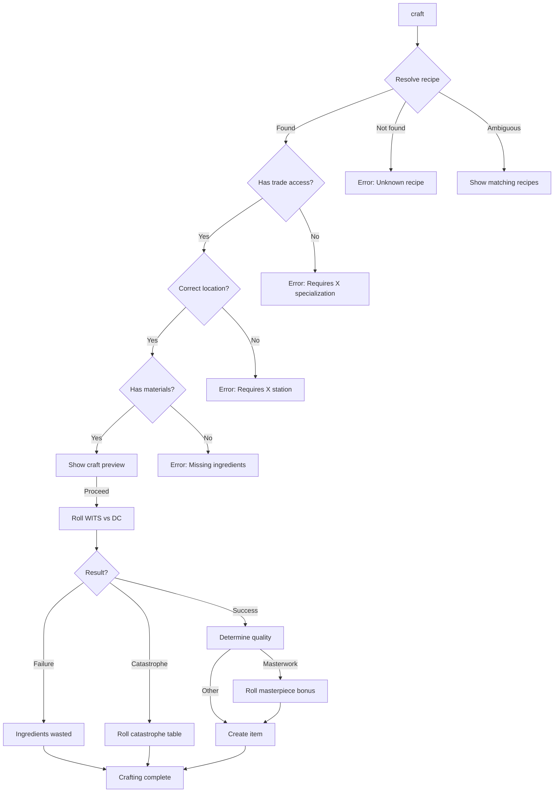

# Crafting Commands

---

## Overview

Crafting commands allow players to create items, brew potions, forge inscriptions, and prepare medical supplies using the four crafting trades. This specification covers the command interface; see [crafting-ui.md](../crafting-ui.md) for presentation and UI layout details.

> **UI Integration:** Commands in this spec trigger the unified crafting UI defined in [SPEC-UI-CRAFTING](../crafting-ui.md). The UI displays modifier breakdowns, ingredient checklists, and quality scaling information sourced from `ICraftingService`.

| Command | Aliases | Syntax | Context |
|---------|---------|--------|---------|
| `craft` | `make`, `create` | `craft <recipe>` | Exploration (with station) |
| `brew` | — | `brew <potion>` | Exploration (Alchemy) |
| `forge` | `inscribe` | `forge <inscription>` | Exploration (Runeforging) |
| `repair` | `fix`, `mend` | `repair <item>` | Exploration (Bodging) |
| `recipes` | — | `recipes [trade]` | Any (menu mode) |

---

## 1. Craft

### 1.1 Syntax

```
craft
craft <recipe>
craft <recipe> [quantity]
```

### 1.2 Aliases

| Input | Resolves To |
|-------|-------------|
| `craft` | Open crafting interface |
| `make healing poultice` | `craft healing poultice` |
| `create trap` | `craft trap` |

### 1.3 Context Requirements

| Condition | Required |
|-----------|----------|
| Context | Exploration only |
| Location | Appropriate crafting station (varies by trade) |
| Trade access | Character has specialization or training |
| Materials | Sufficient ingredients in inventory |
| Not in combat | Cannot craft during combat |

### 1.4 Behavior



### 1.5 Trade-Specific Stations

| Trade | Required Station | Location Examples |
|-------|------------------|-------------------|
| **Bodging** | Workbench | Settlement CraftingStation, Campfire (basic only) |
| **Alchemy** | Alchemist's Lab | Settlement Apothecary, Portable Kit (-2 DC penalty) |
| **Runeforging** | Runic Forge | Settlement Smithy, Nexus Anchor |
| **Field Medicine** | Medical Station | Settlement Temple, Campfire (basic), Field (+4 DC) |

### 1.6 Examples

**Opening crafting interface:**
```
> craft
  CRAFTING — Select Trade
  ═══════════════════════════════════════
  [1] Bodging (Scrap-Tinker)
  [2] Alchemy (Alka-hestur)
  [3] Runeforging (Rúnasmiðr)
  [4] Field Medicine (Bone-Setter)

  Enter trade number or 'cancel': _
```

**Direct recipe crafting:**
```
> craft healing poultice
  CRAFT: Healing Poultice (Field Medicine)
  ═══════════════════════════════════════
  Base DC: 12
  Modifiers:
    Bone-Setter specialization  -2
    Full medical kit            -2
    Campfire location           +0
  ──────────────────────────────────────
  Final DC: 8

  INGREDIENTS:
    • Herbs ×2          ✓ (5 available)
    • Water ×1          ✓ (3 available)

  OUTPUT:
    Heals 2d6 + WITS HP

  Proceed with crafting? (y/n) > y

  Crafting Healing Poultice...
  WITS Check: DC 8
  Roll: [7, 8, 9, 5, 6, 8] = 5 successes

  [SUCCESS] +3 over DC → Quality quality!

  Created: Quality Healing Poultice
  Effect: Heals 2d6 + WITS + 25% HP

  Ingredients consumed: Herbs ×2, Water ×1
```

**Masterwork result:**
```
> craft strong poultice
  ...
  Roll: [9, 8, 9, 7, 8, 9, 8] = 7 successes

  [MASTERWORK] +5 over DC!

  Masterpiece Bonus (d10): 3 — Long-Lasting

  Created: Masterwork Strong Poultice
  Effect: Heals 4d6 + WITS + 50% HP
  Special: Healing continues for extra round
```

**Failed craft:**
```
> craft antidote
  ...
  Roll: [3, 2, 1, 4, 2, 3] = 0 successes

  [FAILURE] Below DC 16

  The mixture fails to coalesce properly.
  Ingredients lost: Charcoal ×2, Herbs ×2, Water ×1
```

**Catastrophic failure:**
```
> craft miracle tincture
  ...
  Roll: [1, 2, 1, 3, 2, 1, 2, 4] = 0 successes

  [CATASTROPHE] 5+ under DC!

  Catastrophe (d10): 5 — Explosion!

  The volatile mixture detonates!
  You take 1d6 damage: [4] damage

  Ingredients lost: All rare materials consumed
```

### 1.7 Validation

| Condition | Error Message |
|-----------|---------------|
| Unknown recipe | "Unknown recipe 'X'. Use 'recipes' to see available." |
| No trade access | "Crafting X requires the Y specialization." |
| Wrong location | "X can only be crafted at Y." |
| Missing materials | "Missing ingredients: X ×N, Y ×M" |
| In combat | "Cannot craft during combat." |

### 1.8 Events Raised

| Event | When | Payload |
|-------|------|---------|
| `CraftingStartedEvent` | Craft initiated | `RecipeId`, `Trade`, `FinalDc` |
| `CraftingSucceededEvent` | Successful craft | `RecipeId`, `Quality`, `ItemCreated` |
| `CraftingFailedEvent` | Failed craft | `RecipeId`, `Margin`, `IngredientsLost` |
| `CraftingCatastropheEvent` | Catastrophic failure | `RecipeId`, `CatastropheType`, `Consequence` |
| `MasterpieceCreatedEvent` | Masterwork with bonus | `RecipeId`, `BonusType` |

---

## 2. Brew (Alchemy Shortcut)

### 2.1 Syntax

```
brew <potion>
brew <potion> [quantity]
```

### 2.2 Behavior

`brew` is an alias for `craft` specifically for Alchemy recipes:

```
> brew vigor tonic
  Equivalent to: craft vigor tonic

  CRAFT: Vigor Tonic (Alchemy)
  ═══════════════════════════════════════
  Base DC: 14
  ...
```

### 2.3 Alchemy-Specific UI Elements

When crafting alchemy items, additional information is shown:

```
> brew poison blade oil
  CRAFT: Poison Blade Oil (Alchemy)
  ═══════════════════════════════════════
  ...
  OUTPUT:
    Applies [Poisoned] on weapon hit (3 uses)
    Shelf Life: 7 days
    ⚠ Contains [Glitched] Venom Sac — Corruption risk!
```

---

## 3. Forge (Runeforging Shortcut)

### 3.1 Syntax

```
forge <inscription>
forge <inscription> on <equipment>
inscribe <rune> on <equipment>
```

### 3.2 Behavior

`forge` initiates runeforging, which has a two-phase process:

```mermaid
flowchart TD
    FORGE[forge <inscription>] --> SELECT[Select target equipment]
    SELECT --> PHASE1[Phase 1: Carving — WITS check]
    PHASE1 --> |Success| PHASE2[Phase 2: Activation — WILL check]
    PHASE1 --> |Failure| WASTE[Inscription ruined]
    PHASE2 --> |Success| INSCRIBED[Equipment inscribed]
    PHASE2 --> |Failure| CORRUPT[Corruption risk]

    CORRUPT --> ROLL{Corruption roll}
    ROLL --> |Pass| FADE[Inscription fades harmlessly]
    ROLL --> |Fail| TAINT[Equipment gains [Corrupted]]
```

### 3.3 Examples

```
> forge sharpness on iron sword
  RUNEFORGING: Inscription of Sharpness
  ═══════════════════════════════════════
  Target: Iron Sword

  PHASE 1 — CARVING (WITS)
  Base DC: 16
  Modifiers:
    Rúnasmiðr specialization    -2
    Runic Forge location        -2
  Final DC: 12

  PHASE 2 — ACTIVATION (WILL)
  Base DC: 14
  ⚠ CORRUPTION WARNING: Failed activation may corrupt item

  INGREDIENTS:
    • Rune Ink ×1       ✓ (2 available)
    • Dust of Ages ×1   ✓ (1 available)

  Proceed? (y/n) > y

  Phase 1: Carving...
  WITS Check: DC 12
  Roll: [8, 7, 9, 6, 8] = 4 successes ✓

  Carving complete. Proceeding to activation...

  Phase 2: Activation...
  WILL Check: DC 14
  Roll: [7, 8, 5, 9] = 3 successes ✓

  [SUCCESS] Inscription activated!

  Iron Sword is now inscribed with [Sharpness]
  Effect: +2 damage on attacks
```

---

## 4. Repair (Bodging Shortcut)

### 4.1 Syntax

```
repair <item>
repair all
fix <item>
mend <item>
```

### 4.2 Behavior

`repair` initiates equipment repair through Bodging:

```
> repair iron sword
  REPAIR: Iron Sword (Bodging)
  ═══════════════════════════════════════
  Current Condition: 45/100 (Damaged)
  Target Condition: 100/100 (Pristine)

  Base DC: 10
  Modifiers:
    Scrap-Tinker specialization  -2
    Full toolkit                 -2
    Workbench location           -2
  Final DC: 4

  MATERIALS:
    • Scrap Metal ×2    ✓ (8 available)
    • Leather Strip ×1  ✓ (3 available)

  Repair cost: 2 Scrap Metal, 1 Leather Strip

  Proceed? (y/n) > y

  Repairing Iron Sword...
  WITS Check: DC 4
  Roll: [6, 8, 7, 9, 5] = 4 successes ✓

  [SUCCESS] Equipment restored!

  Iron Sword: 45/100 → 100/100 (Pristine)
```

### 4.3 Repair All

```
> repair all
  REPAIR ALL — Equipment Assessment
  ═══════════════════════════════════════
  Damaged Equipment:
  [1] Iron Sword         45/100  (2 Scrap, 1 Leather)
  [2] Leather Armor      72/100  (1 Leather)
  [3] Crossbow           58/100  (2 Scrap, 1 String)

  Total Materials: 4 Scrap Metal, 2 Leather, 1 String
  Available: 8 Scrap, 3 Leather, 2 String ✓

  Repair all items? (y/n) > _
```

---

## 5. Recipes

### 5.1 Syntax

```
recipes
recipes <trade>
recipes known
recipes unknown
```

### 5.2 Behavior

Lists available recipes, optionally filtered by trade or knowledge status:

```
> recipes
  KNOWN RECIPES BY TRADE
  ═══════════════════════════════════════

  BODGING (Scrap-Tinker)
  ───────────────────────────────────────
    Lockpick                DC 10
    Improvised Trap         DC 12
    Repair Equipment        DC varies

  ALCHEMY (Alka-hestur)
  ───────────────────────────────────────
    Healing Salve           DC 10
    Vigor Tonic             DC 14
    Common Antidote         DC 16

  FIELD MEDICINE (Bone-Setter)
  ───────────────────────────────────────
    Standard Bandage        DC 10
    Healing Poultice        DC 12
    Strong Poultice         DC 16

  [K]nown only | [U]nknown | [1-4] Filter by trade | [Esc] Back
```

**Trade-filtered view:**
```
> recipes alchemy
  ALCHEMY RECIPES
  ═══════════════════════════════════════

  KNOWN:
    Healing Salve           DC 10   [✓ Can craft]
    Vigor Tonic             DC 14   [✓ Can craft]
    Common Antidote         DC 16   [✗ Missing: Charcoal ×2]
    Poison Blade Oil        DC 18   [✓ Can craft]

  UNKNOWN:
    ???                     DC 20
    ???                     DC 22
    ???                     DC 24

  To learn unknown recipes, find schematics or train with masters.
```

---

## 6. Crafting Mode Context

### 6.1 Available Commands in Crafting Mode

| Command | Available | Notes |
|---------|-----------|-------|
| `craft <recipe>` | ✓ | Direct crafting |
| `1-4` | ✓ | Select trade (1=Bodging, 2=Alchemy, 3=Rune, 4=Med) |
| `↑/↓` | ✓ | Navigate recipe list |
| `Enter` | ✓ | Begin craft (recipe selected) |
| `Tab` | ✓ | Cycle trade tabs |
| `F` | ✓ | Toggle filter (All/Craftable/Known) |
| `recipes` | ✓ | View recipe list |
| `cancel`, `Esc` | ✓ | Exit crafting mode |
| `?` | ✓ | Show help |
| Navigation commands | ✗ | Cannot move while crafting |
| Combat commands | ✗ | Not in combat |

### 6.2 Keyboard Navigation (from [crafting-ui.md](../crafting-ui.md))

**TUI Keybindings:**

| Key | Context | Action |
|-----|---------|--------|
| `Tab` | Any | Cycle trade tabs |
| `1-4` | Any | Direct select trade |
| `↑/↓` | Recipe list | Navigate recipes |
| `Enter` | Recipe selected | Begin craft |
| `Esc` | Any | Cancel/Back |
| `F` | Recipe list | Toggle filter |
| `?` | Any | Show help |

**GUI Keybindings:**

| Key | Action |
|-----|--------|
| `Ctrl+1-4` | Select trade tab |
| `Up/Down` | Navigate recipe list |
| `Enter` | Craft selected recipe |
| `Escape` | Close crafting UI |
| `F` | Focus filter |

### 6.2 Crafting Help

```
> help craft
  CRAFTING COMMANDS
  ═══════════════════════════════════════
  craft               Open crafting interface
  craft <recipe>      Craft specific item
  brew <potion>       Alchemy shortcut
  forge <inscription> Runeforging shortcut
  repair <item>       Repair equipment
  recipes [trade]     View available recipes

  MODIFIERS:
  - Specialization bonuses reduce DC
  - Better tools reduce DC
  - Location affects available recipes
  - Material quality affects output

  QUALITY TIERS:
  - DC exact:  Weak/Shoddy (-25%)
  - +1-2 over: Standard (normal)
  - +3-4 over: Quality/Potent (+25%)
  - +5+ over:  Masterwork (+50%, bonus)
```

---

## 7. Implementation Status

| Command | File Path | Status |
|---------|-----------|--------|
| `craft` | `RuneAndRust.Engine/Commands/CraftCommand.cs` | ❌ Planned |
| `brew` | `RuneAndRust.Engine/Commands/BrewCommand.cs` | ❌ Planned |
| `forge` | `RuneAndRust.Engine/Commands/ForgeCommand.cs` | ❌ Planned |
| `repair` | `RuneAndRust.Engine/Commands/RepairCommand.cs` | ❌ Planned |
| `recipes` | `RuneAndRust.Engine/Commands/RecipesCommand.cs` | ❌ Planned |

---

## 8. Service Interface

See [crafting overview](../../04-systems/crafting/crafting-overview.md) for full `ICraftingService` interface, and [crafting-ui.md](../crafting-ui.md) for display types.

### 8.1 Command-Specific Service

```csharp
public interface ICraftingCommandService
{
    /// <summary>Validates and executes a crafting attempt.</summary>
    CraftingResult ExecuteCraft(Character character, string recipeId, Room currentRoom);

    /// <summary>Validates repair and returns cost estimate.</summary>
    RepairEstimate GetRepairEstimate(Character character, Item item);

    /// <summary>Executes equipment repair.</summary>
    RepairResult ExecuteRepair(Character character, Item item);

    /// <summary>Gets recipes available to character, optionally filtered.</summary>
    IReadOnlyList<RecipeDisplay> GetAvailableRecipes(
        Character character,
        CraftingTrade? tradeFilter = null,
        bool knownOnly = false
    );

    /// <summary>Checks if character can craft at current location.</summary>
    CraftingAvailability GetCraftingAvailability(Character character, Room room);
}
```

### 8.2 Shared Types (from [crafting-ui.md](../crafting-ui.md))

```csharp
// Display types used by both commands and UI
public record RecipeDisplay(
    string RecipeId,
    string DisplayName,
    bool IsKnown,
    int BaseDc,
    string Category,
    CraftingTrade Trade,
    bool CanCraft
);

public record ModifierBreakdownDisplay(
    int BaseDc,
    IReadOnlyList<ModifierLine> Modifiers,
    int FinalDc,
    int DicePool,
    double SuccessChance
);

public record IngredientStatusDisplay(
    string IngredientId,
    string DisplayName,
    int Required,
    int Available,
    bool IsAvailable,
    bool IsGlitched  // For Runeforging corruption warnings
);

public record CraftingResultDisplay(
    bool Success,
    CraftQuality Quality,
    string ItemName,
    string EffectDescription,
    string? MasterpieceBonus,
    string? CatastropheEffect,
    IReadOnlyList<string> MaterialsConsumed
);
```

### 8.3 Command-Specific Types

```csharp
public record CraftingAvailability(
    bool CanCraft,
    IReadOnlyList<CraftingTrade> AvailableTrades,
    string? LocationName,
    string? Restriction
);

public record RepairEstimate(
    Item Item,
    int CurrentCondition,
    int TargetCondition,
    int BaseDc,
    IReadOnlyList<IngredientCost> MaterialCost,
    bool HasMaterials
);
```

---

## 9. Related Specifications

| Document | Relationship |
|----------|--------------|
| [crafting-ui.md](../crafting-ui.md) | TUI/GUI presentation |
| [crafting overview](../../04-systems/crafting/crafting-overview.md) | Core crafting mechanics |
| [bodging.md](../../04-systems/crafting/bodging.md) | Bodging recipes and rules |
| [alchemy.md](../../04-systems/crafting/alchemy.md) | Alchemy recipes and rules |
| [runeforging.md](../../04-systems/crafting/runeforging.md) | Runeforging recipes and rules |
| [field-medicine.md](../../04-systems/crafting/field-medicine.md) | Field Medicine recipes and rules |
| [parser.md](parser.md) | Grammar rules for commands |

---

## 10. Changelog

| Version | Date | Changes |
|---------|------|---------|
| 1.0 | 2025-12-14 | Initial specification |
