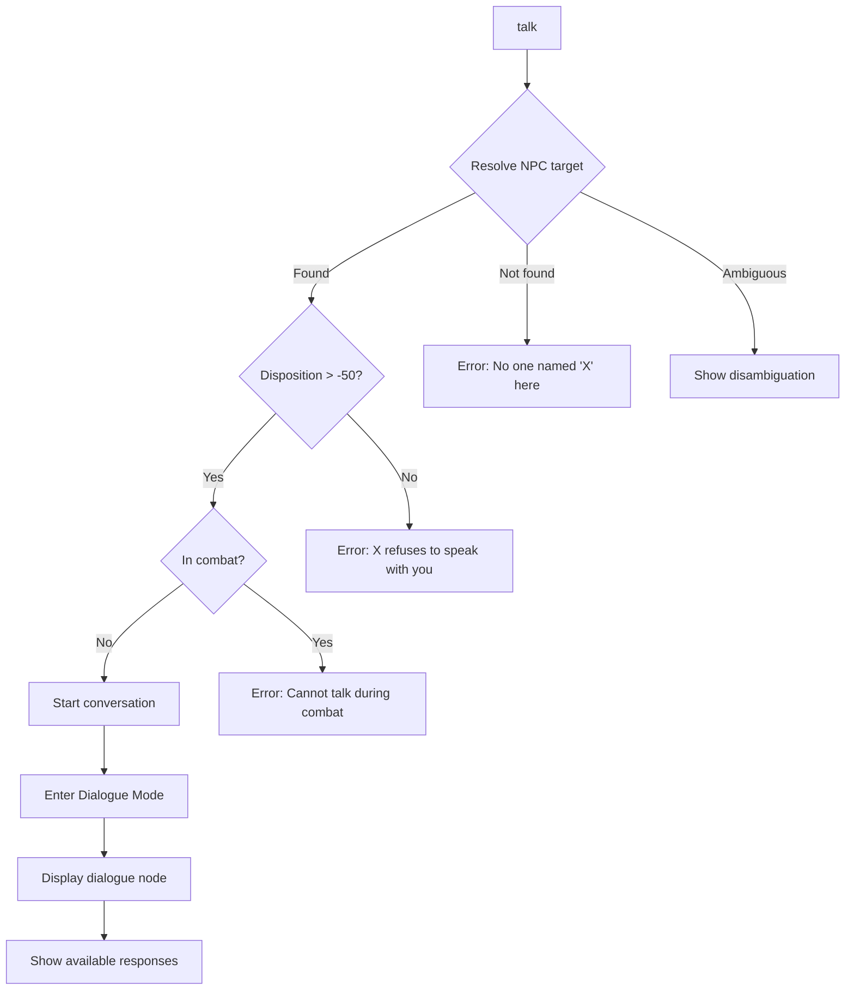
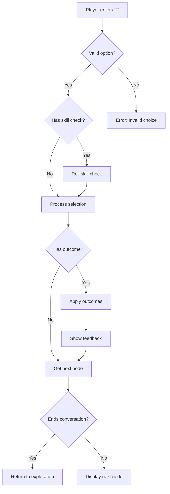
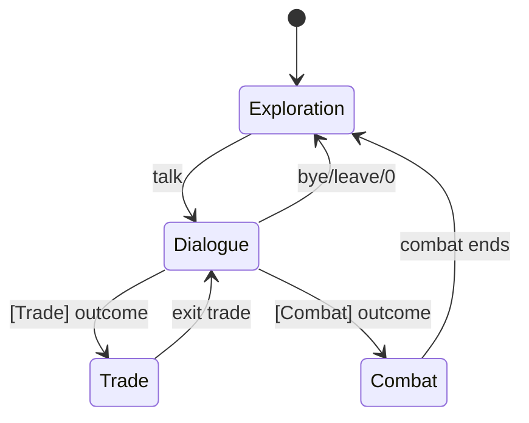

# Dialogue Commands

---

## Overview

Dialogue commands allow players to initiate and navigate conversations with NPCs, make meaningful choices, and observe consequences. This specification covers the command interface; see [dialogue-ui.md](../dialogue-ui.md) for presentation details.

| Command | Aliases | Syntax | Context |
|---------|---------|--------|---------|
| `talk` | `speak`, `converse` | `talk <npc>` | Exploration |
| `say` | — | `say <text>` / `<number>` | Dialogue |
| `ask` | `ask about` | `ask <npc> about <topic>` | Dialogue |
| `bye` | `leave`, `end` | `bye` | Dialogue |

---

## 1. Talk

### 1.1 Syntax

```
talk <npc>
talk to <npc>
speak <npc>
speak with <npc>
```

### 1.2 Aliases

| Input | Resolves To |
|-------|-------------|
| `talk sigrun` | `talk sigrun` |
| `talk to sigrun` | `talk sigrun` |
| `speak sigrun` | `talk sigrun` |
| `speak with sigrun` | `talk sigrun` |
| `converse sigrun` | `talk sigrun` |

### 1.3 Context Requirements

| Condition | Required |
|-----------|----------|
| Context | Exploration only |
| NPC present | Target NPC must be in current room |
| NPC disposition | Not Hostile (disposition > -50) |
| Combat | Not in combat |

### 1.4 Behavior



### 1.5 Target Resolution

NPCs are resolved using the standard target resolution system (see [parser.md](parser.md)):

1. **Exact match** — "sigrun" matches "Sigrun"
2. **Partial match** — "sig" matches "Sigrun" if unique
3. **Disambiguation** — Multiple matches prompt selection

### 1.6 Examples

**Successful initiation:**
```
> talk sigrun
  You approach Sigrun.

  ╔══════════════════════════════════════════════════════════════╗
  ║  SIGRUN — Midgard Combine Scavenger                          ║
  ║  [Neutral]                                                    ║
  ╟──────────────────────────────────────────────────────────────╢
  ║                                                              ║
  ║  "Another scavenger in these ruins? You look capable enough. ║
  ║   The Combine could use hands like yours."                   ║
  ║                                                              ║
  ╟──────────────────────────────────────────────────────────────╢
  ║  RESPONSES:                                                  ║
  ║                                                              ║
  ║  [1] "Who are you?"                                          ║
  ║  [2] "What kind of work?"                                    ║
  ║  [3] [WITS 4] "These ruins are Jötun-Forged..."              ║
  ║                                                              ║
  ║  [0] "I should go." [Leave]                                  ║
  ╚══════════════════════════════════════════════════════════════╝

  [Say] > _
```

**No NPC found:**
```
> talk merchant
  Error: There is no one named 'merchant' here.
  NPCs in this room: Sigrun, Bjorn
```

**Hostile NPC:**
```
> talk ragnar
  Ragnar glares at you with open contempt.
  "We have nothing to say to each other, oath-breaker."

  (Disposition: Hostile — improve reputation to speak)
```

**Disambiguation:**
```
> talk guard
  Multiple NPCs match 'guard':
  [1] Gate Guard (Midgard Combine)
  [2] Patrol Guard (Midgard Combine)

  Which one? (1-2) > _
```

### 1.7 Validation

| Condition | Error Message |
|-----------|---------------|
| No NPC specified | "Talk to whom? NPCs here: [list]" |
| NPC not in room | "There is no one named 'X' here." |
| Hostile disposition | "'X' refuses to speak with you." |
| In combat | "Cannot start conversation during combat." |
| NPC unconscious | "'X' is unconscious and cannot respond." |
| NPC dead | "'X' is dead." |

### 1.8 Events Raised

| Event | When | Payload |
|-------|------|---------|
| `ConversationStartedEvent` | Dialogue begins | `NpcId`, `NpcName`, `IsFirstMeeting` |

---

## 2. Say (Response Selection)

### 2.1 Syntax

```
<number>
say <number>
```

### 2.2 Context Requirements

| Condition | Required |
|-----------|----------|
| Context | Dialogue mode only |
| Valid option | Number must match displayed option |

### 2.3 Behavior

During dialogue, the player selects responses by entering the corresponding number:



### 2.4 Skill Check Options

Dialogue options may have **prerequisites** (threshold checks) or **active rolls** (dice pools).

#### 2.4.1 Prerequisite Checks (Threshold)

Options requiring minimum stats show requirements in brackets. These are **passive checks**—if you meet the threshold, the option is available:

| Check Type | Display | Requirement |
|------------|---------|-------------|
| Attribute | `[WITS 4]` | WITS attribute ≥ 4 |
| Specialization | `[Bone-Setter]` | Has Bone-Setter specialization |
| Skill | `[Rhetoric 2]` | Rhetoric skill ≥ rank 2 |
| Combined | `[WILL 3] [Skald]` | Both requirements met |

> **Hidden Options:** Options the player doesn't qualify for are not displayed.

#### 2.4.2 Active Dialogue Rolls (Dice Pool)

Some dialogue options require **active dice rolls** using the standard dice pool system:

| Check Type | Pool Formula | Opposed By |
|------------|--------------|------------|
| **Intimidation** | `MIGHT` | NPC's `WILL` |
| **Insight** | `WITS + Perception` | DC based on NPC deception |
| **Persuasion** | `WILL + Rhetoric` | NPC's `WILL` |
| **Deception** | `WILL + Rhetoric` | NPC's `WITS` |

> **Dice Rules:** See [SPEC-CORE-DICE](../../01-core/dice-system.md). Success = net successes ≥ DC or opponent's net successes.

### 2.5 Examples

**Standard selection:**
```
[Say] > 1
  "Who are you?"

  SIGRUN:
  "Name's Sigrun. I've been scouting these ruins for the Combine
   for three winters now. Still standing, so I must be doing
   something right."

  [1] "What's the Midgard Combine?"
  [2] "Any dangers I should know about?"
  [0] "I should go." [Leave]

[Say] > _
```

**Skill check option:**
```
[Say] > 3
  [WITS 4] "These ruins are Jötun-Forged..."

  Check: WITS 4 (You: 5) ✓

  SIGRUN's eyes widen with newfound respect.
  "You can read the old script? That's... rare. Very rare."

  [Reputation] +10 with Sigrun

  [1] "I've studied the old ways."
  [2] "Can you teach me more?"
  [0] "I should go." [Leave]
```

**Outcome triggers:**
```
[Say] > 2
  "I need supplies."

  SIGRUN:
  "Right. Let me show you what I've got."

  [Trade] Opening merchant interface...
```

### 2.6 Validation

| Condition | Error Message |
|-----------|---------------|
| Invalid number | "Invalid choice. Enter 1-N or 0 to leave." |
| Not in dialogue | "'say' is only valid during conversations." |

### 2.7 Events Raised

| Event | When | Payload |
|-------|------|---------|
| `DialogueChoiceEvent` | Option selected | `NodeId`, `OptionIndex`, `SkillCheckPassed` |
| `ReputationChangedEvent` | Reputation outcome | `NpcId/FactionId`, `Change`, `NewValue` |
| `QuestStartedEvent` | Quest given | `QuestId`, `QuestName` |
| `TradeInitiatedEvent` | Trade outcome | `NpcId`, `ShopId` |
| `CombatInitiatedEvent` | Combat outcome | `EnemyIds`, `Reason` |

---

## 3. Ask

### 3.1 Syntax

```
ask <npc> about <topic>
ask about <topic>
```

### 3.2 Aliases

| Input | Resolves To |
|-------|-------------|
| `ask sigrun about combine` | Jump to 'combine' topic |
| `ask about dangers` | Jump to 'dangers' topic (current NPC) |

### 3.3 Context Requirements

| Condition | Required |
|-----------|----------|
| Context | Dialogue mode |
| Topic known | Topic must exist in NPC's dialogue tree |

### 3.4 Behavior

The `ask` command allows players to directly jump to known topics:

```
[Say] > ask about the combine
  Jumping to topic: "The Midgard Combine"

  SIGRUN:
  "The Combine is what's left of the old settlements that banded
   together after the Glitch. We scavenge, we trade, we survive."
```

### 3.5 Topic Discovery

Topics become available through normal conversation flow. The `ask` command provides a shortcut to revisit previously discussed topics.

```
> ask about
  Known topics with Sigrun:
  - Her background
  - The Midgard Combine
  - Local dangers
  - Trade opportunities

  Ask about which topic? > _
```

### 3.6 Validation

| Condition | Error Message |
|-----------|---------------|
| Topic unknown | "You haven't discussed 'X' with this person yet." |
| Not in dialogue | "You're not in a conversation. Use 'talk <npc>' first." |

---

## 4. Bye (End Conversation)

### 4.1 Syntax

```
bye
leave
end
0
```

### 4.2 Aliases

| Input | Resolves To |
|-------|-------------|
| `bye` | End conversation |
| `leave` | End conversation |
| `end` | End conversation |
| `0` | End conversation (always option 0) |
| `farewell` | End conversation |

### 4.3 Behavior

```
[Say] > bye
  "I should go."

  SIGRUN:
  "Safe travels. The ruins don't forgive the careless."

  [Conversation ended]

> _
```

### 4.4 Special Cases

**Conversation cannot be ended:**
```
[Say] > bye
  Sigrun blocks your path.
  "We're not done here. You owe me an answer."

  (This conversation requires resolution before leaving.)
```

**Abrupt departure (reputation cost):**
```
[Say] > bye
  [!] Leaving now will offend Sigrun. Continue? (y/n)

> y
  You turn and walk away mid-sentence.

  [Reputation] -5 with Sigrun
  [Conversation ended abruptly]
```

### 4.5 Events Raised

| Event | When | Payload |
|-------|------|---------|
| `ConversationEndedEvent` | Dialogue ends | `NpcId`, `EndReason`, `TotalChoices` |

---

## 5. Dialogue Mode Context

### 5.1 Mode Transitions



### 5.2 Available Commands During Dialogue

| Command | Available | Notes |
|---------|-----------|-------|
| `1`, `2`, `3`... | ✓ | Select response |
| `say <n>` | ✓ | Explicit selection |
| `ask about <topic>` | ✓ | Jump to topic |
| `bye`, `leave`, `0` | ✓ | End conversation |
| `help`, `?` | ✓ | Show dialogue help |
| `l` (log toggle) | ✓ | Show/hide conversation log |
| `go`, `move` | ✗ | Cannot navigate during dialogue |
| `attack` | ✗ | Cannot attack during dialogue |
| `inventory` | ✗ | Cannot access inventory |

### 5.3 Dialogue Help

```
[Say] > ?
  DIALOGUE COMMANDS
  ═══════════════════════════════════════
  [1-9]         Select numbered response
  ask about X   Jump to known topic
  bye / 0       End conversation
  l             Toggle conversation log

  Skill checks shown as [ATTR N] require that attribute level.
  Options you don't qualify for are hidden.
```

---

## 6. Smart Commands Integration

During dialogue, smart commands surface dialogue options:

```
╔══════════════════════════════════════╗
║ DIALOGUE OPTIONS                     ║
╟──────────────────────────────────────╢
║ [1] "Who are you?"                   ║
║ [2] "What kind of work?"             ║
║ [3] "These ruins are Jötun-Forged.." ║
║ [0] Leave conversation               ║
╚══════════════════════════════════════╝
```

Priority order for dialogue smart commands:
1. Quest-related options
2. Trade/service options
3. Information options
4. Skill check options
5. Exit option (always last)

---

## 7. Implementation Status

| Command | File Path | Status |
|---------|-----------|--------|
| `talk` | `RuneAndRust.Engine/Commands/TalkCommand.cs` | ❌ Planned |
| `say` | `RuneAndRust.Engine/Commands/SayCommand.cs` | ❌ Planned |
| `ask` | `RuneAndRust.Engine/Commands/AskCommand.cs` | ❌ Planned |
| `bye` | `RuneAndRust.Engine/Commands/ByeCommand.cs` | ❌ Planned |
| DialogueService | `RuneAndRust.Engine/Services/DialogueService.cs` | ❌ Planned |

---

## 8. Service Interface

```csharp
public interface IDialogueService
{
    /// <summary>Starts a conversation with an NPC.</summary>
    DialogueResult StartConversation(Character character, Npc npc);

    /// <summary>Selects a dialogue option.</summary>
    DialogueResult SelectOption(int optionIndex);

    /// <summary>Jumps to a known topic.</summary>
    DialogueResult AskAbout(string topic);

    /// <summary>Ends the current conversation.</summary>
    DialogueResult EndConversation(bool abrupt = false);

    /// <summary>Gets available options for current node.</summary>
    IReadOnlyList<DialogueOption> GetAvailableOptions(Character character);

    /// <summary>Checks if character can talk to NPC.</summary>
    TalkAvailability CanTalk(Character character, Npc npc);

    /// <summary>Gets known topics with an NPC.</summary>
    IReadOnlyList<string> GetKnownTopics(Character character, Npc npc);
}

public record DialogueResult(
    bool Success,
    DialogueNode? CurrentNode,
    IReadOnlyList<DialogueOutcome>? Outcomes,
    bool ConversationEnded
);

public record DialogueOption(
    int Index,
    string Text,
    SkillCheck? RequiredCheck,
    bool PlayerQualifies,
    string? OutcomeHint
);

public record TalkAvailability(
    bool CanTalk,
    string? BlockReason,
    int Disposition,
    DispositionTier Tier
);
```

---

## 9. Related Specifications

| Document | Relationship |
|----------|--------------|
| [dialogue-ui.md](../dialogue-ui.md) | TUI/GUI presentation |
| [parser.md](parser.md) | Grammar rules for dialogue commands |
| [smart-commands.md](../smart-commands.md) | Context-aware option display |
| [faction-reputation.md](../../02-entities/faction-reputation.md) | Disposition mechanics |

---

## 10. Changelog

| Version | Date | Changes |
|---------|------|---------|
| 1.0 | 2025-12-14 | Initial specification |
