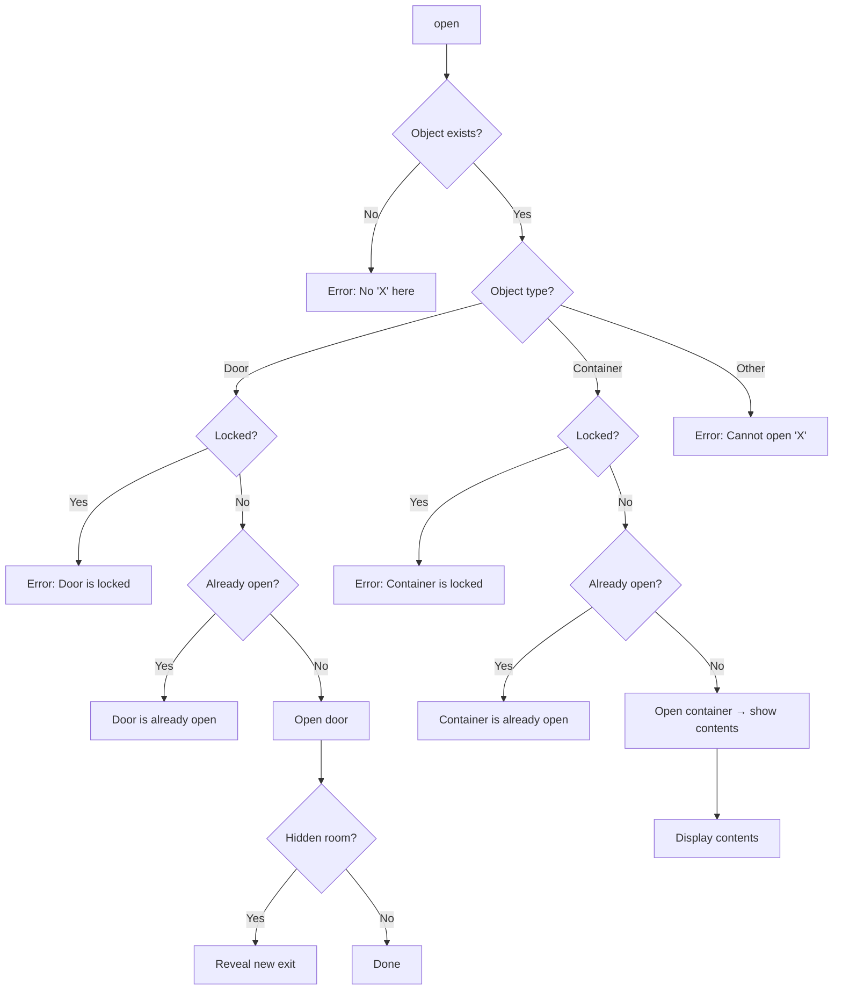
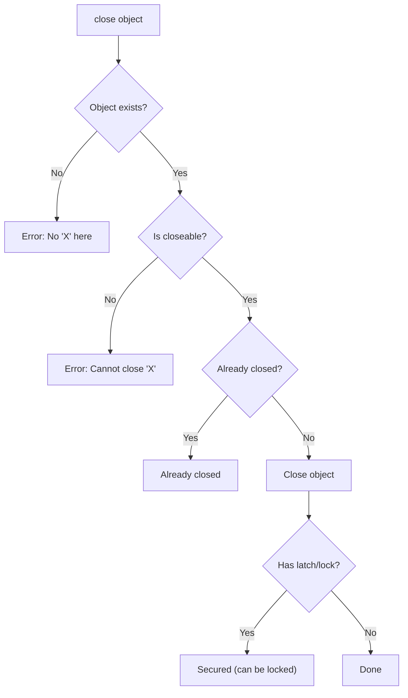
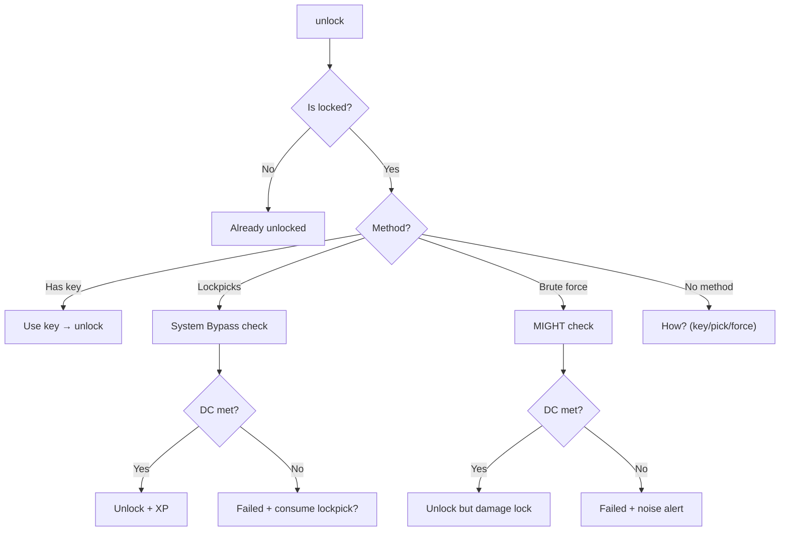
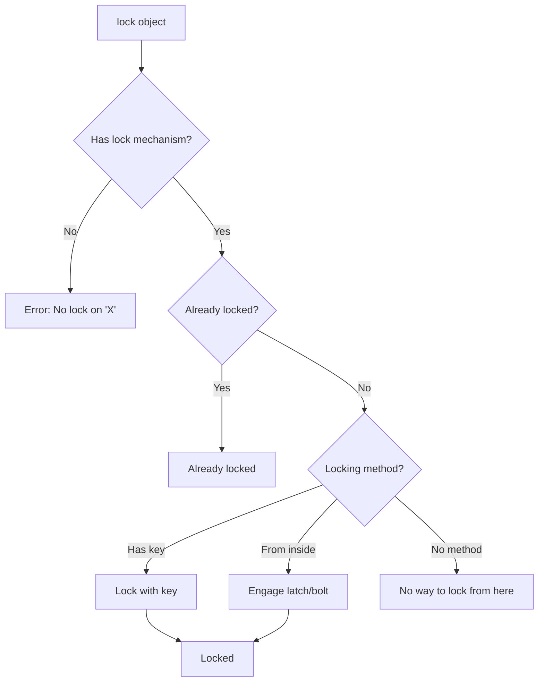
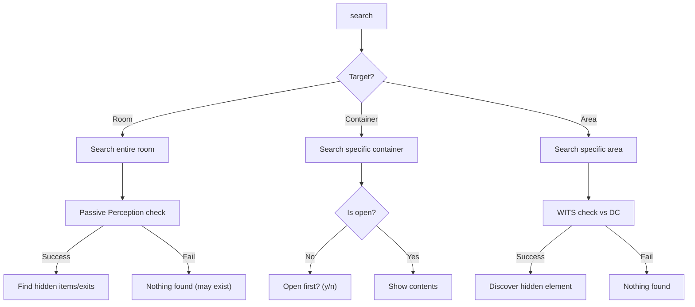
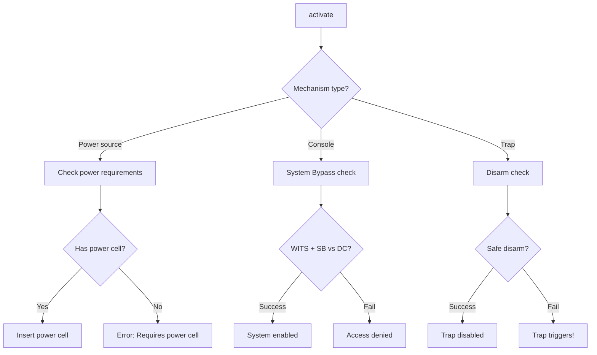

# Physical Interaction Commands

> *"Every lever tells a story. The question is whether you want to hear it before or after it crushes you."*

---

## Overview

Physical interaction commands represent tactile manipulation of environmental objects, containers, doors, and mechanisms. These commands enable puzzle-solving, exploration, and resource gathering.

### Design Philosophy

- **Meaningful Choices**: Every interaction has potential consequences
- **Skill Integration**: Physical attributes (MIGHT, FINESSE, WITS) determine success
- **Environmental Storytelling**: Objects reveal world lore through interaction
- **Risk/Reward**: Difficult interactions yield better rewards

| Command | Primary Skill | Syntax | Use Case |
|---------|---------------|--------|----------|
| `open` | — | `open <object>` | Doors, containers, hatches |
| `close` | — | `close <object>` | Doors, containers |
| `unlock` | System Bypass | `unlock <object>` | Locked doors, chests |
| `lock` | — | `lock <object>` | Secure doors behind you |
| `search` | WITS | `search [container]` | Find hidden items |
| `loot` | — | `loot <container>` | Take all from container |
| `pull` | MIGHT | `pull <object>` | Levers, chains, handles |
| `push` | MIGHT | `push <object>` | Crates, buttons, walls |
| `turn` | MIGHT/FINESSE | `turn <object>` | Valves, wheels, dials |
| `press` | FINESSE | `press <object>` | Buttons, runes, keypads |
| `activate` | WITS | `activate <mechanism>` | Power sources, consoles |
| `deactivate` | WITS | `deactivate <mechanism>` | Disable traps, machines |
| `break` | MIGHT | `break <object>` | Destructible barriers |
| `climb` | FINESSE | `climb <object>` | Ladders, ledges, ropes |

---

## 1. Open

### 1.1 Syntax

```
open <object>
open door
open chest
```

### 1.2 Aliases

| Input | Resolves To |
|-------|-------------|
| `open door` | `open door` |
| `open the chest` | `open chest` |
| `o door` | `open door` |

### 1.3 Behavior



### 1.4 Examples

**Opening a door:**
```
> open door

  You push open the rusted iron door. It groans in protest,
  revealing a darkened corridor beyond.

  [Exit revealed: North — Darkened Corridor]
```

**Opening a container:**
```
> open chest

  You lift the heavy lid of the Salvage Crate.

  CONTENTS:
  - Scrap Metal ×8
  - Frayed Wire ×3
  - Mending Draught ×1

  [Use 'loot chest' to take all, or 'take <item>' for specific items]
```

**Locked object:**
```
> open safe

  The safe is locked. A runic keypad glows faintly on its surface.

  [Requires: Key or System Bypass check]
```

### 1.5 Validation

| Condition | Error Message |
|-----------|---------------|
| Object not found | "There is no 'X' here." |
| Not openable | "'X' cannot be opened." |
| Already open | "'X' is already open." |
| Locked | "'X' is locked. Find a key or bypass the lock." |

### 1.6 Events Raised

| Event | When | Payload |
|-------|------|---------|
| `DoorOpenedEvent` | Door opened | `DoorId`, `RoomId`, `RevealedExitId` |
| `ContainerOpenedEvent` | Container opened | `ContainerId`, `Contents` |

---

## 2. Close

### 2.1 Syntax

```
close <object>
close door
shut <object>
```

### 2.2 Examples

```
> close door

  You pull the door shut behind you. The latch clicks into place.

> close chest

  You lower the lid of the chest.
```

### 2.3 Behavior



### 2.4 Extended Examples

**Closing a door for defense:**
```
> close door

  You pull the heavy iron door shut behind you.
  *clang* The latch clicks into place.

  [Door closed: West exit now blocked]
  [Tactical: Enemies must spend action to open]
```

**Closing a container:**
```
> close chest

  You lower the lid of the chest, concealing its contents.

  [Contents hidden from casual inspection]
```

**Cannot close:**
```
> close crate

  The crate has no lid to close.
```

### 2.5 Tactical Use

Closing doors can provide tactical advantages:

| Situation | Benefit |
|-----------|---------|
| Pursuit | Closed door delays enemies by 1 turn |
| Ambush | Enemies must open door (alerting you) |
| Trap setup | Some traps trigger on door open |
| Stealth | Blocks line of sight |

### 2.6 Validation

| Condition | Error Message |
|-----------|---------------|
| Object not found | "There is no '{object}' here." |
| Not closeable | "'{object}' cannot be closed." |
| Already closed | "'{object}' is already closed." |
| Blocked | "Something is blocking '{object}'." |

### 2.7 Events Raised

| Event | When | Payload |
|-------|------|---------|
| `DoorClosedEvent` | Door closed | `DoorId`, `RoomId` |
| `ContainerClosedEvent` | Container closed | `ContainerId` |

---

## 3. Unlock

### 3.1 Syntax

```
unlock <object>
unlock <object> with <key>
pick <object>
bypass <object>
```

### 3.2 Resolution Methods

| Method | Requirement | Skill Check |
|--------|-------------|-------------|
| **Key** | Matching key in inventory | None |
| **Lockpick** | Lockpicks + System Bypass | WITS + System Bypass vs Lock DC |
| **Brute Force** | MIGHT ≥ requirement | MIGHT vs Lock DC (damages lock) |
| **Specialization** | Ruin-Stalker, Scrap-Tinker | Reduced DC or auto-success |

### 3.3 Behavior



### 3.4 Lock Difficulty

| Lock Type | DC | Notes |
|-----------|-----|-------|
| Simple lock | 2 | Basic containers |
| Standard lock | 4 | Most doors, chests |
| Complex lock | 6 | Secure areas |
| Dvergr lock | 8 | Hegemony technology |
| Jötun seal | 10 | Ancient mechanisms |

### 3.5 Examples

**With key:**
```
> unlock door with iron key

  You insert the Iron Key into the lock.
  *click*
  The door is now unlocked.

  [Iron Key consumed: 0 remaining]
```

**Lockpicking:**
```
> unlock chest

  No matching key found. Attempt to bypass?

> pick chest

  [System Bypass Check: WITS 4 + System Bypass 2 = 6d10 vs DC 4]
  Roll: [9, 8, 7, 5, 3, 2] = 3 successes
  ✓ SUCCESS!

  You manipulate the lock mechanism. It clicks open.
  [+15 Legend — Lock bypassed]

  Lockpicks: 5 → 4 remaining
```

**Brute force:**
```
> force door

  [MIGHT Check: 5d10 vs DC 6]
  Roll: [10, 8, 6, 4, 2] = 2 successes
  ✗ FAILED

  You slam against the door but it holds firm.
  The noise echoes through the corridor...

  [Alert: Enemies may have heard]
```

### 3.6 Specialization Bonuses

| Specialization | Bonus |
|----------------|-------|
| **Ruin-Stalker** | −2 DC to all locks |
| **Scrap-Tinker** | Can craft lockpicks, +1 die |
| **Myrk-gengr** | Can phase through thin barriers |

### 3.7 Events Raised

| Event | When | Payload |
|-------|------|---------|
| `LockBypassedEvent` | Lock picked | `ObjectId`, `Method`, `LegendAwarded` |
| `LockForcedEvent` | Lock broken | `ObjectId`, `NoiseGenerated` |
| `KeyUsedEvent` | Key consumed | `KeyId`, `ObjectId` |

---

## 4. Lock

### 4.1 Syntax

```
lock <object>
lock <object> with <key>
```

### 4.2 Use Cases

- Secure doors behind you to slow pursuers
- Protect caches for later retrieval
- Trap enemies in rooms

### 4.3 Behavior



### 4.4 Examples

**Locking from inside:**
```
> lock door

  You engage the bolt from this side.
  *clunk* The door is now secured.

  [Door locked: West exit barred]
  [Enemies must break through or find another path]
```

**Locking with key:**
```
> lock safe with vault key

  You turn the Vault Key in the lock.
  *click* The safe is now secured.

  [Safe locked]
```

**Cannot lock:**
```
> lock crate

  The crate has no lock mechanism.
```

### 4.5 Validation

| Condition | Error Message |
|-----------|---------------|
| No lock mechanism | "'{object}' has no lock." |
| Already locked | "'{object}' is already locked." |
| No key/access | "You cannot lock '{object}' from this side." |
| Lock damaged | "The lock mechanism is broken." |

### 4.6 Events Raised

| Event | When | Payload |
|-------|------|---------|
| `DoorLockedEvent` | Door locked | `DoorId`, `RoomId`, `MethodUsed` |
| `ContainerLockedEvent` | Container locked | `ContainerId`, `KeyId` |

---

## 5. Search

### 5.1 Syntax

```
search
search <container>
search <area>
search thoroughly
```

### 5.2 Resolution



### 5.3 Search Types

| Search Type | Skill | Finds |
|-------------|-------|-------|
| **Passive** (room) | Passive Perception | Obvious hidden items |
| **Active** (area) | WITS + Perception | Hidden items, secret doors |
| **Thorough** | WITS + Time | Everything (takes time) |

### 5.4 Examples

**Room search:**
```
> search

  You scan the room carefully...

  [Passive Perception: 13 (WITS 4 + 9 base)]

  You notice:
  - A loose stone in the wall (west)
  - Scratches on the floor near the crate

  [Use 'investigate <target>' for detailed examination]
```

**Container search:**
```
> search crate

  You rummage through the Salvage Crate...

  FOUND:
  - Scrap Metal ×8
  - Frayed Wire ×3
  - Mending Draught ×1 (hidden compartment!)
```

**Thorough search:**
```
> search thoroughly

  You spend several minutes examining every corner...

  [WITS Check: 6d10 vs DC 4]
  Roll: [9, 8, 7, 5, 4, 2] = 3 successes
  ✓ SUCCESS!

  Behind a false panel, you discover:
  - Hidden Stash: 45 Scrip, Dvergr Lockpick ×2

  [Warning: Thorough search advances time by 10 minutes]
```

### 5.5 Hidden Elements

| Element | Base DC | Notes |
|---------|---------|-------|
| Hidden compartment | 3 | In containers |
| Secret door | 5 | In walls |
| Buried cache | 4 | Floor/ground |
| Trapped object | 6 | Identifies traps |
| Hidden runes | 7 | Magical concealment |

### 5.6 Events Raised

| Event | When | Payload |
|-------|------|---------|
| `SearchCompletedEvent` | Search finished | `AreaId`, `ItemsFound`, `TimeSpent` |
| `HiddenElementFoundEvent` | Secret discovered | `ElementType`, `ElementId` |

---

## 6. Loot

### 6.1 Syntax

```
loot <container>
loot all
take all from <container>
```

### 6.2 Behavior

Quickly takes all items from an open container.

```
> loot chest

  You gather everything from the chest:

  ACQUIRED:
  + Scrap Metal ×8
  + Frayed Wire ×3
  + Mending Draught ×1

  Burden: 32/60 → 38/60 lbs
```

### 6.3 Restrictions

| Condition | Result |
|-----------|--------|
| Container locked | "Must unlock first" |
| Container closed | Auto-opens then loots |
| Pack full | "Pack is full. Drop items first." |
| Quest items | Auto-taken regardless of weight |

### 6.4 Events Raised

| Event | When | Payload |
|-------|------|---------|
| `ContainerLootedEvent` | All items taken | `ContainerId`, `ItemsTaken` |
| `ItemsAcquiredEvent` | Items added to inventory | `Items`, `TotalWeight` |

---

## 7. Pull

### 7.1 Syntax

```
pull <object>
yank <object>
```

### 7.2 Use Cases

- Levers, chains, ropes
- Stuck drawers, handles
- Emergency releases
- Trapped mechanisms

### 7.3 State Transitions

```
[Up] ←─pull─→ [Down]
[Extended] ←─pull─→ [Retracted]
[Closed] ──pull──→ [Open]
```

### 7.4 Examples

**Standard lever:**
```
> pull lever

  [MIGHT Check vs DC 4]
  Roll: [8, 7, 5, 4, 3] = 2 successes
  ✓ SUCCESS!

  With a mighty heave, you wrench the rusted lever down.
  A grinding sound echoes as a stone gate rises...

  [Exit revealed: North — Hidden Chamber]
```

**Stuck mechanism:**
```
> pull drawer

  [MIGHT Check vs DC 6]
  Roll: [9, 8, 8, 6, 5] = 3 successes
  ✓ SUCCESS!

  The drawer screeches open, revealing its contents.

  FOUND:
  - Tarnished Key
  - Faded Journal
```

### 7.5 Fumble Consequences

| Object | Fumble Effect |
|--------|---------------|
| Rusted lever | Breaks off (permanent) |
| Trapped handle | Triggers trap |
| Rope | Frays or snaps |
| Emergency release | Mechanism jams |

### 7.6 Events Raised

| Event | When | Payload |
|-------|------|---------|
| `LeverPulledEvent` | Lever activated | `LeverId`, `NewState`, `TriggeredEffect` |
| `ObjectBrokenEvent` | Fumble breaks object | `ObjectId`, `Permanent` |

---

## 8. Push

### 8.1 Syntax

```
push <object>
shove <object>
push <object> <direction>
```

### 8.2 Use Cases

- Crates, heavy objects
- Loose wall sections
- Debris piles
- Enemies (combat)

### 8.3 Examples

**Puzzle crate:**
```
> push crate east

  [MIGHT Check vs DC 3]
  Roll: [8, 9, 5, 4, 3] = 2 successes
  ✓ SUCCESS!

  You shove the crate onto the pressure plate.
  *click* A hidden panel slides open!

  [Puzzle Progress: 1/3 pressure plates activated]
```

**Wall section:**
```
> push wall

  [MIGHT Check vs DC 5]
  Roll: [10, 9, 8, 5, 4] = 3 successes
  ✓ SUCCESS!

  The wall section grinds inward, revealing a hidden passage!

  [Secret discovered: Hidden Alcove]
```

### 8.4 Combat Push

| Action | Cost | Effect |
|--------|------|--------|
| Push crate onto enemy | Standard Action | 2d6 damage |
| Push enemy into hazard | Standard + Opposed | Hazard damage |
| Push to create cover | Movement | +2 Soak from direction |

### 8.5 Events Raised

| Event | When | Payload |
|-------|------|---------|
| `ObjectPushedEvent` | Object moved | `ObjectId`, `FromPosition`, `ToPosition` |
| `PressurePlateTriggeredEvent` | Plate activated | `PlateId`, `MechanismTriggered` |
| `SecretRevealedEvent` | Hidden area found | `SecretId`, `AreaRevealed` |

---

## 9. Turn

### 9.1 Syntax

```
turn <object>
turn <object> <direction>
rotate <object>
```

### 9.2 Direction Modifiers

| Input | Effect |
|-------|--------|
| `turn valve` | Default direction |
| `turn valve clockwise` | Clockwise |
| `turn valve left` | Counter-clockwise |
| `turn dial to 7` | Set to position |

### 9.3 Examples

**Valve:**
```
> turn valve clockwise

  [MIGHT Check vs DC 4]
  Roll: [9, 8, 6, 5, 3] = 2 successes
  ✓ SUCCESS!

  The valve squeals in protest but finally turns.
  Steam vents from the pipes, clearing the corridor.

  [Hazard removed: Steam Vents (Corridor B)]
```

**Combination dial:**
```
> turn dial to 7

  You rotate the dial to position 7.
  *click*

  [Combination Progress: 7 - ? - ?]
  Enter next number or 'reset' to start over.

> turn dial to 3

  [Combination Progress: 7 - 3 - ?]

> turn dial to 9

  [Combination: 7 - 3 - 9]
  ✓ CORRECT!

  The safe door swings open with a satisfying click.
```

### 9.4 Events Raised

| Event | When | Payload |
|-------|------|---------|
| `ValveTurnedEvent` | Valve operated | `ValveId`, `Direction`, `Effect` |
| `CombinationEnteredEvent` | Dial turned | `Position`, `Sequence`, `IsComplete` |

---

## 10. Press

### 10.1 Syntax

```
press <object>
press <object> <sequence>
push button
```

### 10.2 Use Cases

- Single buttons
- Button sequences (puzzles)
- Pressure runes
- Hidden bricks

### 10.3 Examples

**Single button:**
```
> press button

  *click*
  The button depresses with a satisfying click.
  A light flickers on above the door.

  [Door mechanism: 1/3 lights active]
```

**Sequence puzzle:**
```
> press buttons 1 3 2 4

  You press the buttons in sequence: 1, 3, 2, 4
  ✓ CORRECT SEQUENCE!

  The panel hums and the door slides open.
  [+25 Legend — Puzzle solved]
```

**Incorrect sequence:**
```
> press buttons 1 2 3 4

  You press the buttons in sequence: 1, 2, 3, 4
  ✗ INCORRECT!

  The panel flashes red and resets.

  [Warning: 2 attempts remaining before lockout]
```

### 10.4 Events Raised

| Event | When | Payload |
|-------|------|---------|
| `ButtonPressedEvent` | Button activated | `ButtonId`, `Effect` |
| `SequenceCompletedEvent` | Puzzle solved | `PuzzleId`, `Attempts`, `LegendAwarded` |
| `SequenceFailedEvent` | Wrong sequence | `PuzzleId`, `AttemptsRemaining` |

---

## 11. Activate / Deactivate

### 11.1 Syntax

```
activate <mechanism>
power on <device>
enable <system>

deactivate <mechanism>
power off <device>
disable <system>
```

### 11.2 Resolution



### 11.3 Examples

**Power source:**
```
> activate generator

  The generator requires a Power Cell.
  You have: Power Cell ×2

  Insert Power Cell? (y/n) > y

  You slot the Power Cell into the generator.
  *hum* The machinery rumbles to life.

  [Power restored to sector]
  [Lights: ON]
  [Door mechanisms: ACTIVE]

  Power Cell: 2 → 1 remaining
```

**Console:**
```
> activate console

  [System Bypass Check: WITS 5 + System Bypass 3 vs DC 6]
  Roll: [10, 9, 8, 7, 5, 4, 3, 2] = 4 successes
  ✓ ACCESS GRANTED

  The console flickers to life, displaying:

  JÖTUN-FORGED TERMINAL v2.17
  ═══════════════════════════════════════
  [1] Map — Display sector layout
  [2] Logs — Access archived records
  [3] Unlock — Remote door control
  [4] Shutdown — Power down sector

  Select option: _
```

**Trap disarm:**
```
> deactivate trap

  You examine the tripwire mechanism...

  [System Bypass Check: WITS 4 + System Bypass 2 vs DC 5]
  Roll: [9, 8, 6, 5, 4, 3] = 2 successes
  ✗ FAILED!

  Your hand slips—
  The trap triggers!

  [Poison Dart Trap]
  → 8 poison damage!
  → [Poisoned] status (2d4/turn, 3 turns)
```

### 11.4 Events Raised

| Event | When | Payload |
|-------|------|---------|
| `MechanismActivatedEvent` | Device powered | `MechanismId`, `PowerCellUsed` |
| `ConsoleAccessedEvent` | Terminal accessed | `ConsoleId`, `AccessLevel` |
| `TrapDisarmedEvent` | Trap safely disabled | `TrapId`, `LegendAwarded` |
| `TrapTriggeredEvent` | Trap triggered | `TrapId`, `Damage`, `StatusApplied` |

---

## 12. Break

### 12.1 Syntax

```
break <object>
smash <object>
destroy <object>
```

### 12.2 Breakable Objects

| Object Type | DC | Noise | Notes |
|-------------|-----|-------|-------|
| Wooden door | 4 | High | Destroys door |
| Crate | 2 | Medium | Contents may be damaged |
| Glass | 1 | High | Instant break |
| Chains | 5 | Low | Requires MIGHT 4+ |
| Stone wall | 8+ | Very High | Usually impossible |

### 12.3 Examples

```
> break crate

  [MIGHT Check vs DC 2]
  Roll: [8, 7, 5] = 2 successes
  ✓ SUCCESS!

  You smash the crate apart!

  SALVAGED:
  - Scrap Metal ×4 (some damaged)
  - Frayed Wire ×2

  [Warning: The noise may attract attention]
```

### 12.4 Consequences

| Consequence | Trigger |
|-------------|---------|
| Noise alert | Most breaking actions |
| Item damage | Breaking containers |
| Permanent destruction | Cannot be repaired |

### 12.5 Events Raised

| Event | When | Payload |
|-------|------|---------|
| `ObjectDestroyedEvent` | Object broken | `ObjectId`, `ItemsDropped`, `NoiseLevel` |
| `NoiseGeneratedEvent` | Loud action | `Source`, `NoiseLevel`, `EnemiesAlerted` |

---

## 13. Climb

### 13.1 Syntax

```
climb <object>
climb up <object>
climb down <object>
scale <object>
```

### 13.2 Climbable Objects

| Object | DC | Skill | Notes |
|--------|-----|-------|-------|
| Ladder | 0 | — | Automatic success |
| Rope | 2 | FINESSE | With equipment |
| Ledge | 4 | FINESSE + Acrobatics | Moderate |
| Wall (rough) | 6 | FINESSE + Acrobatics | Difficult |
| Wall (smooth) | 8 | FINESSE + Acrobatics | Requires gear |

### 13.3 Examples

**Ladder:**
```
> climb ladder

  You ascend the rusted ladder to the upper level.

  [Location: Maintenance Catwalk]
```

**Challenging climb:**
```
> climb ledge

  [Acrobatics Check: FINESSE 4 + Acrobatics 2 vs DC 4]
  Roll: [9, 8, 7, 5, 4, 3] = 3 successes
  ✓ SUCCESS!

  You haul yourself up onto the narrow ledge.
  From here, you can see across the entire chamber.

  [Tactical advantage: +2 to ranged attacks this encounter]
```

### 13.4 Fall Damage

| Height | Damage | Save |
|--------|--------|------|
| 10 ft | 1d6 | FINESSE DC 3 |
| 20 ft | 2d6 | FINESSE DC 5 |
| 30 ft | 4d6 | FINESSE DC 7 |
| 40+ ft | 6d6+ | FINESSE DC 9 |

### 13.5 Events Raised

| Event | When | Payload |
|-------|------|---------|
| `ClimbCompletedEvent` | Successfully climbed | `ObjectId`, `NewLocationId` |
| `FallEvent` | Failed climb/fall | `Height`, `Damage`, `SaveResult` |

---

## 14. Context-Aware `use` Mapping

The `use` command automatically maps to the appropriate verb:

| Object Type | `use` Becomes |
|-------------|---------------|
| Lever | `pull` |
| Button | `press` |
| Valve | `turn` |
| Crate | `push` |
| Door | `open` |
| Container | `open` |
| Console | `activate` |
| Trap | `deactivate` |
| Ladder | `climb` |

```
> use lever
  (Interpreted as: pull lever)

> use console
  (Interpreted as: activate console)
```

---

## 15. Skill Check Reference

### 15.1 Check Types by Object

| Object | Primary Skill | Alternative |
|--------|---------------|-------------|
| Rusted lever | MIGHT | System Bypass (Adept) |
| Heavy crate | MIGHT | — |
| Precision dial | FINESSE | — |
| Stuck valve | MIGHT | System Bypass (Adept) |
| Hidden button | WITS (find) | FINESSE (sequence) |
| Locked door | System Bypass | MIGHT (force) |
| Console | WITS + System Bypass | — |
| Trap | WITS + System Bypass | — |
| Climb | FINESSE + Acrobatics | — |

### 15.2 Fumble Consequences

| Interaction | Fumble Effect | Permanence |
|-------------|---------------|------------|
| Pull | Object breaks | Permanent |
| Push | Character staggers (−1 Defense, 1 round) | Temporary |
| Turn | Mechanism shears | Permanent |
| Press | Wrong trigger (trap/alarm) | Varies |
| Unlock (pick) | Lockpick breaks, lock jams | Permanent |
| Activate (trap) | Trap triggers | Immediate |
| Climb | Fall damage | Immediate |

---

## 16. Service Interface

```csharp
public interface IInteractionService
{
    /// <summary>Opens a door or container.</summary>
    InteractionResult Open(Character character, InteractableObject target);

    /// <summary>Closes a door or container.</summary>
    InteractionResult Close(Character character, InteractableObject target);

    /// <summary>Attempts to unlock a locked object.</summary>
    UnlockResult Unlock(Character character, InteractableObject target, UnlockMethod method);

    /// <summary>Searches an area or container.</summary>
    SearchResult Search(Character character, SearchTarget target, bool thorough = false);

    /// <summary>Takes all items from a container.</summary>
    LootResult Loot(Character character, Container container);

    /// <summary>Performs a physical manipulation (pull/push/turn/press).</summary>
    ManipulationResult Manipulate(Character character, InteractableObject target, ManipulationType type);

    /// <summary>Activates or deactivates a mechanism.</summary>
    MechanismResult ToggleMechanism(Character character, Mechanism target, bool activate);

    /// <summary>Breaks a destructible object.</summary>
    BreakResult Break(Character character, InteractableObject target);

    /// <summary>Attempts to climb an object.</summary>
    ClimbResult Climb(Character character, ClimbableObject target, ClimbDirection direction);
}

public record InteractionResult(
    bool Success,
    string Message,
    InteractionOutcome Outcome,
    List<TriggeredEffect> Effects
);

public record UnlockResult(
    bool Success,
    UnlockMethod MethodUsed,
    int DiceRolled,
    int Successes,
    bool LockJammed,
    int LegendAwarded
);

public record SearchResult(
    bool Success,
    List<FoundItem> ItemsFound,
    List<HiddenElement> SecretsFound,
    int TimeSpent
);

public enum ManipulationType { Pull, Push, Turn, Press }
public enum UnlockMethod { Key, Lockpick, BruteForce, Specialization }
```

---

## 17. Implementation Status

| Command | File Path | Status |
|---------|-----------|--------|
| `open` | `RuneAndRust.Engine/Commands/OpenCommand.cs` | ❌ Planned |
| `close` | `RuneAndRust.Engine/Commands/CloseCommand.cs` | ❌ Planned |
| `unlock` | `RuneAndRust.Engine/Commands/UnlockCommand.cs` | ❌ Planned |
| `lock` | `RuneAndRust.Engine/Commands/LockCommand.cs` | ❌ Planned |
| `search` | `RuneAndRust.Engine/Commands/SearchCommand.cs` | ❌ Planned |
| `loot` | `RuneAndRust.Engine/Commands/LootCommand.cs` | ❌ Planned |
| `pull` | `RuneAndRust.Engine/Commands/PullCommand.cs` | ❌ Planned |
| `push` | `RuneAndRust.Engine/Commands/PushCommand.cs` | ❌ Planned |
| `turn` | `RuneAndRust.Engine/Commands/TurnCommand.cs` | ❌ Planned |
| `press` | `RuneAndRust.Engine/Commands/PressCommand.cs` | ❌ Planned |
| `activate` | `RuneAndRust.Engine/Commands/ActivateCommand.cs` | ❌ Planned |
| `deactivate` | `RuneAndRust.Engine/Commands/DeactivateCommand.cs` | ❌ Planned |
| `break` | `RuneAndRust.Engine/Commands/BreakCommand.cs` | ❌ Planned |
| `climb` | `RuneAndRust.Engine/Commands/ClimbCommand.cs` | ❌ Planned |

---

## 18. Related Specifications

| Document | Relationship |
|----------|--------------|
| [navigation.md](navigation.md) | Movement and look commands |
| [system-bypass.md](../../01-core/skills/system-bypass.md) | Lock picking skill |
| [room-engine/core.md](../../07-environment/room-engine/core.md) | Room objects and interactables |
| [dice-system.md](../../01-core/dice-system.md) | Skill check mechanics |
| [inventory.md](inventory.md) | Item acquisition |

---

## 19. Phased Implementation Guide

### Phase 1: Basic Interactions
- [ ] Open command for doors and containers
- [ ] Close command for doors and containers
- [ ] Basic state tracking (open/closed)
- [ ] Door exit reveal on open

### Phase 2: Locking System
- [ ] Unlock command with key method
- [ ] Unlock command with lockpick method (System Bypass)
- [ ] Unlock command with brute force (MIGHT)
- [ ] Lock command implementation
- [ ] Lock DC validation

### Phase 3: Physical Manipulation
- [ ] Pull command for levers/chains
- [ ] Push command for crates/objects
- [ ] Turn command for valves/dials
- [ ] Press command for buttons/sequences
- [ ] State transition tracking

### Phase 4: Search System
- [ ] Basic container search
- [ ] Room search (passive perception)
- [ ] Thorough search (active check)
- [ ] Hidden element discovery
- [ ] Loot command for bulk collection

### Phase 5: Mechanisms
- [ ] Activate command for power sources
- [ ] Activate command for consoles
- [ ] Deactivate command for traps
- [ ] Power cell consumption
- [ ] Puzzle state management

### Phase 6: Advanced Interactions
- [ ] Break command for destructibles
- [ ] Climb command for vertical movement
- [ ] Noise generation system
- [ ] Fall damage calculation
- [ ] Context-aware `use` mapping

---

## 20. Testing Requirements

### 20.1 Door/Container Tests
- [ ] Open works on valid targets
- [ ] Open fails on locked targets
- [ ] Close properly changes state
- [ ] Lock/unlock toggle correctly
- [ ] State persists between room visits

### 20.2 Unlock Tests
- [ ] Key unlock consumes key appropriately
- [ ] Lockpick check uses correct dice pool
- [ ] Brute force check uses MIGHT
- [ ] Failed lockpick has chance to break pick
- [ ] Failed brute force generates noise

### 20.3 Search Tests
- [ ] Container search reveals contents
- [ ] Passive search uses perception
- [ ] Thorough search advances time
- [ ] Hidden elements require DC check
- [ ] Already-searched containers skip check

### 20.4 Manipulation Tests
- [ ] Pull/push require MIGHT check when appropriate
- [ ] Turn valves affect connected mechanisms
- [ ] Button sequences track correctly
- [ ] Puzzle progress persists
- [ ] Fumbles trigger appropriate consequences

### 20.5 Mechanism Tests
- [ ] Power cells consumed on activate
- [ ] Console access requires System Bypass
- [ ] Trap disarm success disables trap
- [ ] Trap disarm failure triggers trap
- [ ] Mechanism state persists

### 20.6 Break/Climb Tests
- [ ] Break generates appropriate noise
- [ ] Break may damage contents
- [ ] Climb uses FINESSE + Acrobatics
- [ ] Fall damage calculates by height
- [ ] Climbing equipment affects DC

### 20.7 Integration Tests
- [ ] Noise alerts nearby enemies
- [ ] Legend awarded for bypasses/puzzles
- [ ] Events fire to game state
- [ ] UI updates reflect state changes
- [ ] Combat context blocks certain actions

---

## 21. Configuration

| Setting | Default | Options | Description |
|---------|---------|---------|-------------|
| `AutoOpenOnLoot` | true | true/false | Auto-open containers when looting |
| `ConfirmDestructive` | true | true/false | Prompt before breaking objects |
| `ShowDCOnFail` | true | true/false | Display DC after failed checks |
| `NoiseAlertRange` | 3 | 1-10 | Rooms that hear noise events |
| `FumbleThreshold` | 1 | 0-3 | Successes needed to avoid fumble |
| `ThoroughSearchTime` | 10 | 5-30 | Minutes for thorough search |

---

## 22. Changelog

| Version | Date | Changes |
|---------|------|---------|
| 1.0 | 2025-12-07 | Initial specification (pull, push, turn, press only) |
| 1.1 | 2025-12-14 | Expanded with open, close, unlock, lock, search, loot, activate, deactivate, break, climb; added Events Raised, Service Interface, Related Specifications |
| 1.2 | 2025-12-14 | Added Design Philosophy, Mermaid flowcharts for Close/Lock, Validation tables, extended examples, Phased Implementation Guide, Testing Requirements, Configuration settings |
