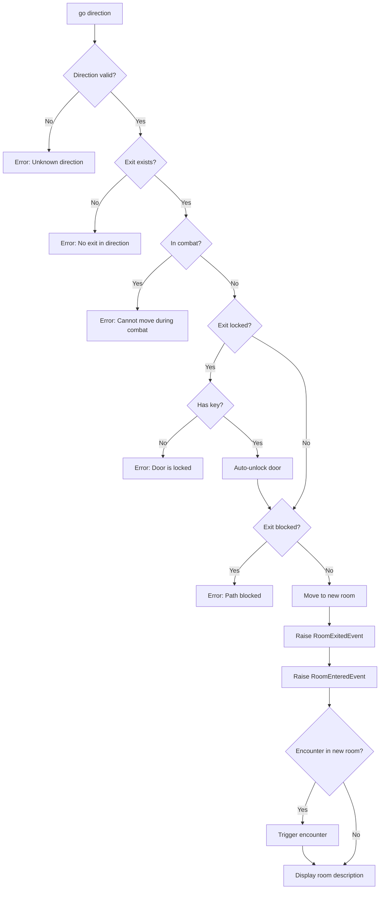
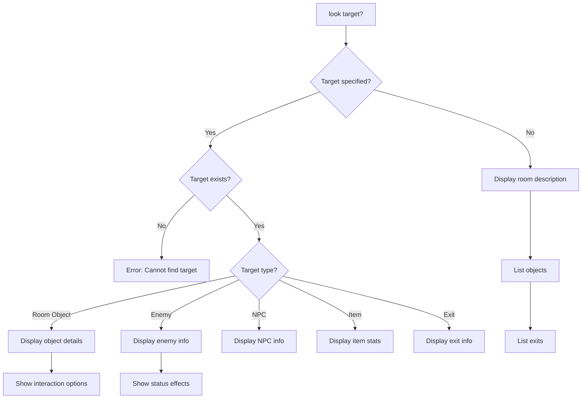
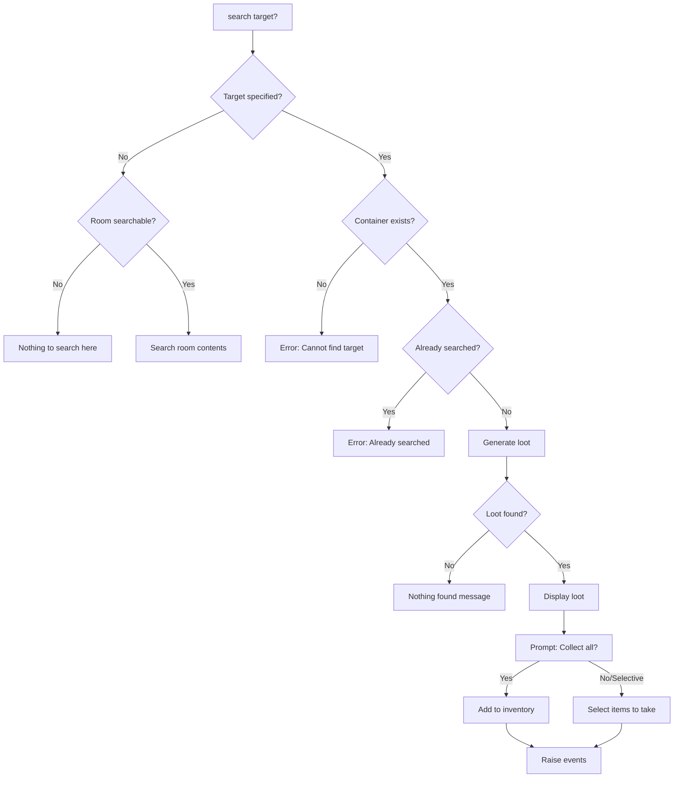
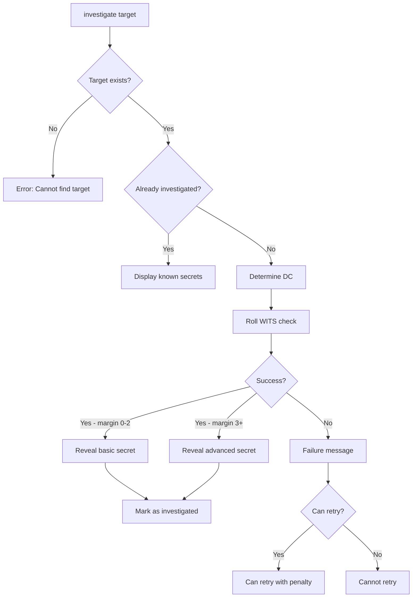
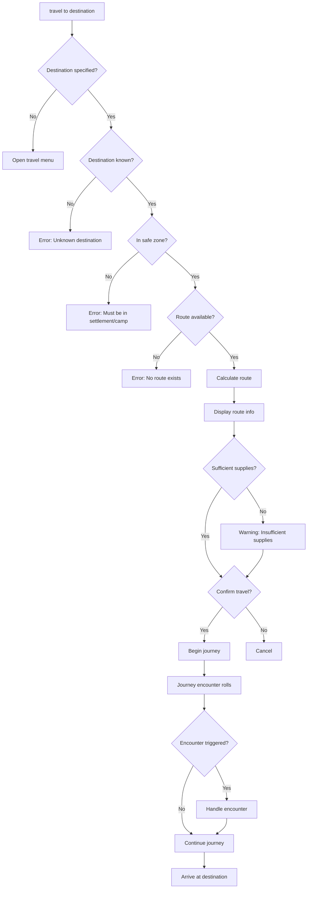
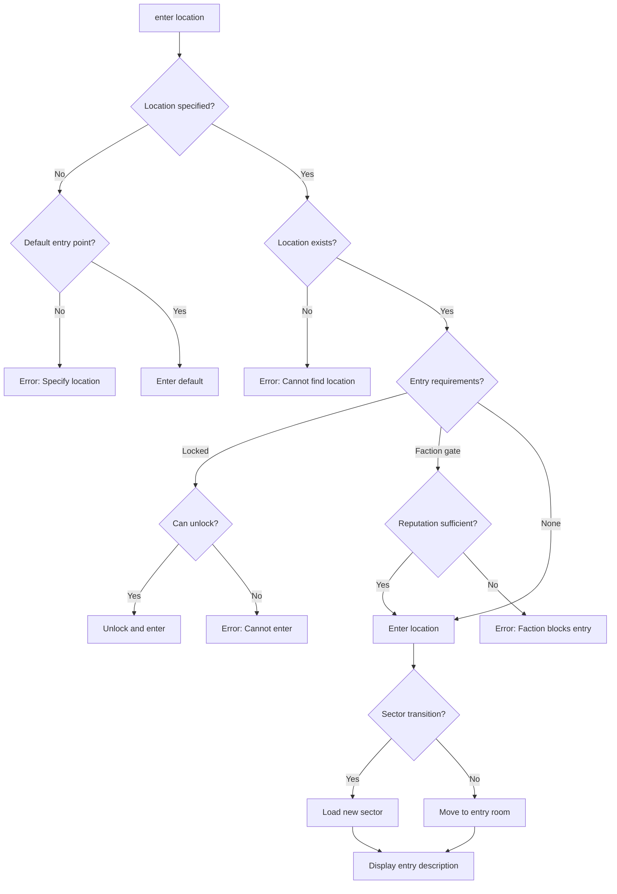

# Navigation Commands

> *"In the silence between your footsteps, listen—the world speaks to those who know how to look."*

---

## Overview

Navigation commands allow movement through the game world, examination of the environment, and discovery of hidden elements. These commands form the backbone of exploration gameplay.

| Command | Aliases | Syntax | Context | Turn Cost |
|---------|---------|--------|---------|-----------|
| `go` | `move`, `walk`, `n/s/e/w/u/d` | `go <direction>` | Exploration | Free |
| `look` | `l`, `examine`, `x`, `inspect` | `look [target]` | Exploration, Combat | Free |
| `search` | `find` | `search [container]` | Exploration | Action |
| `investigate` | — | `investigate <target>` | Exploration | Action |
| `travel` | `journey` | `travel to <settlement>` | Exploration | Special |
| `enter` | — | `enter <location>` | Exploration | Free |
| `exit` | `leave` | `exit [direction]` | Settlement | Free |

### Design Philosophy

- **Free Look**: Looking is always free—players should never hesitate to examine their surroundings
- **Discovery Layers**: Objects have multiple layers of detail revealed through `look` → `search` → `investigate`
- **Meaningful Movement**: Direction-based navigation creates mental mapping and spatial awareness
- **Vertical Awareness**: Z-axis movement (up/down/stairs) is first-class navigation

---

## 1. Go

Move between rooms in a cardinal or vertical direction.

### Syntax
```
go <direction>
<direction>
<direction_shortcut>
```

### Aliases
| Input | Resolves To |
|-------|-------------|
| `go north` | `go north` |
| `north` | `go north` |
| `n` | `go north` |
| `move east` | `go east` |
| `walk south` | `go south` |

### Directions

| Direction | Shortcuts | Description |
|-----------|-----------|-------------|
| `north` | `n` | Cardinal direction |
| `south` | `s` | Cardinal direction |
| `east` | `e` | Cardinal direction |
| `west` | `w` | Cardinal direction |
| `up` | `u` | Vertical (stairs, ladders, lifts) |
| `down` | `d` | Vertical (stairs, ladders, shafts) |
| `northeast` | `ne` | Diagonal |
| `northwest` | `nw` | Diagonal |
| `southeast` | `se` | Diagonal |
| `southwest` | `sw` | Diagonal |

### Behavior



### Validation

| Check | Error Message |
|-------|---------------|
| Direction not recognized | `Unknown direction: '{input}'.` |
| No exit in direction | `There is no exit '{direction}'. Valid exits: {exits}` |
| Combat active | `Cannot move during combat. Use 'flee' to escape.` |
| Exit locked (no key) | `The {exit_name} is locked. You need {key_name} to open it.` |
| Exit blocked | `The path {direction} is blocked by {blocker}.` |
| Exit hidden (undiscovered) | *(No error—exit simply doesn't appear)* |

### Examples

**Basic Movement:**
```
> go north
  You head north through the rusted door...

  ABANDONED CORRIDOR
  ═══════════════════════════════════════
  A narrow passage stretches before you, walls slick with
  condensation. Faded murals depict forgotten victories.

  OBJECTS: [scrap pile] [wall inscription]
  EXITS: [north] [south] [east]
```

**Shortcut Movement:**
```
> n
  You head north...
```

**Vertical Movement:**
```
> go up
  You climb the corroded ladder...

  OBSERVATION DECK (Z: +1)
  ═══════════════════════════════════════
  A raised platform overlooking the chamber below.

  EXITS: [down] [west]
```

**Locked Exit:**
```
> go east
  The Sealed Door is locked. You need an Iron Key to open it.

> go east
  [Iron Key consumed]
  You unlock the Sealed Door and push it open...
```

**Invalid Direction:**
```
> go purple
  Unknown direction: 'purple'. Valid directions: n/s/e/w/u/d

> go north
  There is no exit 'north'. Valid exits: [east] [south]
```

**Combat Block:**
```
> go north
  Cannot move during combat. Use 'flee' to escape.
```

### Z-Level Transitions

Movement between Z-levels uses special exit types:

| Exit Type | Command | Display |
|-----------|---------|---------|
| Stairs Up | `go up`, `u` | `[↑] Stairs Up (to Z:+1)` |
| Stairs Down | `go down`, `d` | `[↓] Stairs Down (to Z:-1)` |
| Ladder Up | `go up`, `u` | `[↑] Ladder Up` |
| Ladder Down | `go down`, `d` | `[↓] Ladder Down` |
| Lift | `use lift` | `[LIFT] Elevator (Z: -2 to +3)` |

### Events Raised

| Event | Data | When |
|-------|------|------|
| `RoomExitedEvent` | `RoomId`, `Direction`, `CharacterId` | Leaving current room |
| `RoomEnteredEvent` | `RoomId`, `FromDirection`, `CharacterId` | Entering new room |
| `DoorUnlockedEvent` | `DoorId`, `KeyId` | Key used to unlock |
| `ZLevelChangedEvent` | `OldZ`, `NewZ` | Vertical movement |

---

## 2. Look

Examine the current room or a specific target. Looking is always free and provides information at increasing levels of detail.

### Syntax
```
look
look [target]
look at <target>
examine <target>
inspect <target>
x <target>
```

### Aliases
| Input | Resolves To |
|-------|-------------|
| `l` | `look` (room) |
| `look` | `look` (room) |
| `look lever` | `look lever` |
| `examine corpse` | `look corpse` |
| `x terminal` | `look terminal` |
| `look at door` | `look door` |
| `inspect scrap` | `look scrap` |

### Behavior



### No Target — Room Description

When `look` is used without a target, display the full room:

```
> look

  ABANDONED WORKSHOP
  ═══════════════════════════════════════
  Rust-eaten machinery fills this cramped space. A faint
  hum emanates from a cracked terminal in the corner.
  The air smells of oil and decay.

  ─────────────────────────────────────────────────────
  YOU SEE
  • [lever] — Rusted control lever (interactable)
  • [terminal] — Cracked display screen (examinable)
  • [corpse] — Scavenger's remains (searchable)

  ─────────────────────────────────────────────────────
  EXITS
  • [N] Narrow Corridor
  • [E] Sealed Door (locked)
```

### Target Types

| Type | Display Elements | Example |
|------|------------------|---------|
| **Room Object** | Name, description, interaction type, state | Lever, terminal, crate |
| **Enemy** | Name, HP bar, tier, status effects, threat | Goblin Scout [████░░] |
| **NPC** | Name, faction, disposition, dialogue hint | Kjartan (Merchant) |
| **Item** | Name, rarity, stats, description | Iron Axe [Uncommon] |
| **Exit** | Direction, destination, lock status | [E] Sealed Door (locked) |
| **Corpse/Container** | Name, searched status, loot hint | Scavenger's remains (not searched) |

### Look at Objects

```
> look lever

  RUSTED LEVER
  ───────────────────────────────────────
  A corroded iron lever set into the wall. Ancient
  Aesir runes circle the mounting bracket. Pulling it
  might activate something, but the rust may make it
  difficult.

  Interaction: Pull (MIGHT DC 4)
  State: Up (not activated)
```

### Look at Enemies

```
> look goblin

  GOBLIN SCOUT                          [Fodder]
  ───────────────────────────────────────
  HP: ████████░░░░░░░░░░░░  18/35

  A hunched, wiry creature with yellowed eyes.
  It clutches a crude shortbow and watches you warily.

  Status: [Bleeding] [Frightened]
  Threat: Low
  Weak to: Fire
```

### Look at NPCs

```
> look kjartan

  KJARTAN SILVER-TONGUE
  ───────────────────────────────────────
  Faction: Midgard Combine (Merchant)
  Disposition: Friendly

  A weathered trader with a knowing smile and ink-
  stained fingers. His wagon is crammed with salvage
  from a dozen ruins.

  "Looking to trade, scavenger?"

  [TALK] to begin dialogue
```

### Look at Items

```
> look iron axe

  IRON AXE                              [Uncommon]
  ───────────────────────────────────────
  Type: One-Handed Melee
  Damage: 2d6+3 Slashing
  Weight: 4 Burden

  A heavy axe forged from salvaged steel. The edge
  shows signs of recent sharpening.

  Traits: [Cleave] — Can hit adjacent enemies
  Value: 45 Scrip
```

### Look at Exits

```
> look east

  SEALED DOOR [E]
  ───────────────────────────────────────
  A heavy iron door with Dvergr craftsmanship.
  A complex mechanical lock secures it.

  Status: Locked
  Requires: Dvergr Passkey OR Lockpicking (DC 6)
  Leads to: Unknown
```

### Context Availability

| Context | Room Look | Object Look | Enemy Look | Item Look |
|---------|-----------|-------------|------------|-----------|
| **Exploration** | ✓ | ✓ | — | ✓ |
| **Combat** | Limited | ✓ | ✓ | — |
| **Inventory** | — | — | — | ✓ |
| **Dialogue** | — | — | — | — |

### Events Raised

| Event | Data | When |
|-------|------|------|
| `ObjectExaminedEvent` | `ObjectId`, `CharacterId` | Looking at object |
| `EnemyExaminedEvent` | `EnemyId`, `CharacterId` | Looking at enemy |
| `NpcExaminedEvent` | `NpcId`, `CharacterId` | Looking at NPC |

---

## 3. Search

Search a container or the current room for loot and items. Searching costs an action but does not require a skill check for obvious contents.

### Syntax
```
search
search <container>
search room
```

### Aliases
| Input | Resolves To |
|-------|-------------|
| `search` | `search` (room) |
| `search corpse` | `search corpse` |
| `find` | `search` (room) |
| `loot` | `search` |
| `loot corpse` | `search corpse` |

### Behavior



### Search Container

**Standard Loot:**
```
> search corpse

  You search the scavenger's remains...

  LOOT FOUND
  ═══════════════════════════════════════════════════
    [Common] Rusty Dagger — 1d6 Slashing
    [Common] Mending Draught ×1
    Scrip: 12
  ═══════════════════════════════════════════════════

  Collect all? (y/n/select): _
```

**Rich Container:**
```
> search chest

  You open the reinforced chest...

  LOOT FOUND
  ═══════════════════════════════════════════════════
    [Uncommon] Iron Helm — +3 Soak (Head)
    [Common] Repair Kit ×2
    [Common] Salvage Components ×5
    Scrip: 47
  ═══════════════════════════════════════════════════

  Collect all? (y/n/select): _
```

**Selective Collection:**
```
> search corpse

  LOOT FOUND
  ═══════════════════════════════════════════════════
    [1] [Common] Rusty Dagger — 1d6 Slashing
    [2] [Common] Mending Draught ×1
    [3] Scrip: 12
  ═══════════════════════════════════════════════════

  Collect all? (y/n/select): select
  Enter numbers to take (e.g., 1,3): 2,3

  Collected: Mending Draught ×1, 12 Scrip
  Left behind: Rusty Dagger
```

### Search Room

```
> search room

  You search the chamber thoroughly...

  SEARCHABLE OBJECTS
  • [corpse] — Scavenger's remains (not searched)
  • [crate] — Wooden supply crate (not searched)
  • [debris] — Pile of scrap (searched)
```

### Already Searched

```
> search corpse
  You've already searched the scavenger's remains.
```

### Loot Generation

| Container Tier | Scrip Range | Equipment Chance | Max Items |
|----------------|-------------|------------------|-----------|
| 0 (Poor) | 5-15 | 30% | 1-2 |
| 1 (Common) | 15-30 | 40% | 2-3 |
| 2 (Uncommon) | 30-60 | 60% | 2-4 |
| 3 (Rare) | 50-100 | 80% | 3-5 |
| 4 (Exceptional) | 100-200 | 100% | 4-6 |

### Container Types

| Type | Typical Tier | Notes |
|------|--------------|-------|
| Corpse (fodder) | 0-1 | Basic enemy remains |
| Corpse (grunt) | 1-2 | Standard enemy remains |
| Corpse (elite) | 2-3 | Strong enemy remains |
| Crate/Barrel | 0-1 | Basic storage |
| Chest | 1-2 | Standard container |
| Locked Chest | 2-3 | Requires key or lockpick |
| Safe/Vault | 3-4 | High security |
| Boss Container | 3-4 | Guaranteed quality |

### Validation

| Check | Error Message |
|-------|---------------|
| No target found | `Cannot find '{target}'.` |
| Not searchable | `You cannot search the {target}.` |
| Already searched | `You've already searched the {target}.` |
| Locked container | `The {target} is locked. Requires {key} or lockpicking.` |
| Inventory full | `Your Pack is full. Drop items or expand capacity.` |

### Events Raised

| Event | Data | When |
|-------|------|------|
| `ContainerSearchedEvent` | `ContainerId`, `CharacterId` | Container searched |
| `ItemPickedUpEvent` | `ItemId`, `CharacterId`, `Quantity` | Each item collected |
| `CurrencyGainedEvent` | `Amount`, `CharacterId` | Scrip collected |
| `LootLeftBehindEvent` | `Items[]`, `ContainerId` | Items not taken |

---

## 4. Investigate

Perform a detailed examination of a target to reveal hidden information. Investigation requires a WITS check and costs an action.

### Syntax
```
investigate <target>
```

### Aliases

| Input | Resolves To |
|-------|-------------|
| `investigate lever` | `investigate lever` |
| `study terminal` | `investigate terminal` |

### Behavior



### Success Example

```
> investigate terminal

  [WITS Check vs DC 8]
  Rolling d10 pool... [8] [6] [9] = 2 successes
  + WITS (3) bonus dice: [7] [10] [4] = 1 success
  Total: 3 successes vs DC 2
  ★ SUCCESS! (Margin: +1)

  You examine the terminal's circuitry and discover a
  hidden bypass port beneath the main panel.

  DISCOVERED: Alternative Access
  ─────────────────────────────────────────────────────
  The terminal can now be hacked with SystemBypass
  (WITS DC 6) instead of Hacking (WITS DC 10).
```

### Critical Success Example

```
> investigate corpse

  [WITS Check vs DC 6]
  Rolling... 4 successes vs DC 2
  ★★ CRITICAL SUCCESS! (Margin: +2)

  You notice unusual stitching on the scavenger's jacket.
  A hidden pocket contains something valuable!

  DISCOVERED: Secret Compartment
  ─────────────────────────────────────────────────────
  • [Rare] Dvergr Passkey — Opens Dvergr-locked doors
  • Folded Note — Contains coordinates to a cache
```

### Failure Example

```
> investigate terminal

  [WITS Check vs DC 8]
  Rolling... 1 success vs DC 2
  ✗ FAILURE

  You examine the terminal carefully but find nothing
  unusual. Perhaps someone with sharper eyes could
  see more.

  [Retry available with +1 DC penalty]
```

### Target Types and Reveals

| Type | DC Range | Possible Reveals |
|------|----------|------------------|
| **Static Terrain** | 4-8 | Hidden details, structural weaknesses, secret doors |
| **Loot Node** | 6-10 | Hidden compartments, tier upgrades, quality info |
| **Dynamic Hazard** | 6-12 | Disable mechanism, safe path, timing pattern |
| **Locked Door** | 4-8 | Lock type, bypass options, alternate routes |
| **Enemy Corpse** | 4-6 | Hidden items, faction clues, trail info |
| **Environment** | 6-10 | Ambush signs, traps, environmental hazards |
| **NPC** | 8-12 | Deception detection, hidden motives, true faction |

### Secret Categories

| Category | Icon | Description |
|----------|------|-------------|
| **Alternative Access** | 🔓 | Different way to bypass obstacle |
| **Hidden Loot** | 💎 | Secret compartment or cache |
| **Tactical Advantage** | ⚔️ | Combat advantage if acted upon |
| **Lore Fragment** | 📜 | Codex entry or world knowledge |
| **Trap Warning** | ⚠️ | Hidden danger revealed |
| **Weakness** | 🎯 | Enemy or obstacle vulnerability |

### Retry Mechanics

| Attempt | DC Modifier | Notes |
|---------|-------------|-------|
| First | Base DC | Normal attempt |
| Second | +2 DC | Diminishing returns |
| Third | +4 DC | Final attempt |
| Fourth+ | — | Cannot retry further |

### Validation

| Check | Error Message |
|-------|---------------|
| No target specified | `Investigate requires a target. Usage: investigate <target>` |
| Target not found | `Cannot find '{target}'.` |
| Not investigable | `There's nothing unusual about the {target}.` |
| Exhausted retries | `You've examined the {target} thoroughly. Nothing more to find.` |

### Events Raised

| Event | Data | When |
|-------|------|------|
| `InvestigationAttemptEvent` | `TargetId`, `DC`, `Roll`, `Success` | Every attempt |
| `SecretDiscoveredEvent` | `SecretId`, `Category`, `Description` | On success |
| `CodexEntryUnlockedEvent` | `EntryId`, `FragmentId` | If lore discovered |
| `TrapRevealedEvent` | `TrapId`, `Location` | If trap found |

---

## 5. Travel

Initiate long-distance travel to a known settlement or waypoint. Travel uses the Journey Mode system for multi-day routes.

### Syntax
```
travel to <destination>
journey to <destination>
travel
```

### Aliases

| Input | Resolves To |
|-------|-------------|
| `travel to ironhold` | `travel to ironhold` |
| `journey ironhold` | `travel to ironhold` |
| `travel` | Open travel menu |

### Behavior



### Travel Menu

```
> travel

  TRAVEL DESTINATIONS
  ═══════════════════════════════════════════════════
  Current Location: Crossroads Hold (Midgard)

  KNOWN SETTLEMENTS
  ─────────────────────────────────────────────────────
  [1] Ironhold — 2-3 days (Class B route)
      45 km via Long Road | Supplies needed: 3 rations
  [2] Ashendale — 1-2 days (Class B route)
      28 km via Toll Road | Supplies needed: 2 rations
  [3] Rivercross — 4-5 days (Class C route)
      62 km via Frontier Track | Supplies needed: 5 rations

  DUNGEONS
  ─────────────────────────────────────────────────────
  [4] Iron Crypts — 4 hours (Class C route)
      8 km via wilderness | Supplies needed: 1 ration

  ═══════════════════════════════════════════════════
  Your supplies: 8 rations

  Enter number or destination name: _
```

### Route Confirmation

```
> travel to ironhold

  JOURNEY: CROSSROADS HOLD → IRONHOLD
  ═══════════════════════════════════════════════════

  Route: Long Road (Class B)
  Distance: ~45 km
  Travel Time: 2-3 days
  Supplies Required: 3 rations

  ROUTE CONDITIONS
  ─────────────────────────────────────────────────────
  Weather: Clear
  Hazard Level: Low
  Patrol Status: Rangers active
  Faction Control: Midgard Combine (friendly)

  JOURNEY RISKS
  ─────────────────────────────────────────────────────
  • Random Encounter: 15% chance per day
  • Weather Delay: 10% chance
  • Supplies consumed: 1 ration per day

  Your supplies: 8 rations (sufficient)

  ═══════════════════════════════════════════════════
  [J] Begin Journey  [A] Auto-pathfind instead  [C] Cancel
```

### Journey Outcome

```
> j

  [Beginning journey to Ironhold...]

  DAY 1
  ─────────────────────────────────────────────────────
  You set out along the Long Road. The weather holds.
  -1 ration consumed (7 remaining)

  DAY 2
  ─────────────────────────────────────────────────────
  Light rain slows progress slightly.
  -1 ration consumed (6 remaining)

  [!] ENCOUNTER — Bandits on the road!
  ─────────────────────────────────────────────────────
  Three figures emerge from the treeline ahead.
  [Entering combat...]

  ...

  [Combat resolved]
  -1 ration consumed (5 remaining)

  DAY 3
  ─────────────────────────────────────────────────────
  You arrive at Ironhold gates as the sun sets.

  JOURNEY COMPLETE
  ═══════════════════════════════════════════════════
  Duration: 3 days
  Supplies consumed: 3 rations
  Encounters: 1 (resolved)

  Welcome to Ironhold.
```

### Route Classifications

| Class | Speed | Characteristics | Encounter Chance |
|-------|-------|-----------------|------------------|
| **A** | 25-35 km/day | Maintained, patrolled | 5% per day |
| **B** | 15-25 km/day | Partially maintained | 15% per day |
| **C** | 8-15 km/day | Unmaintained, hazardous | 25% per day |
| **D** | 3-10 km/day | No infrastructure, extreme | 40% per day |

### Validation

| Check | Error Message |
|-------|---------------|
| Not in safe zone | `You must be in a settlement or camp to begin long-distance travel.` |
| Unknown destination | `'{destination}' is not a known location. Discover it first.` |
| No route | `There is no known route to {destination} from here.` |
| Insufficient supplies | `Warning: You have {current} rations but need {required}. Continue anyway?` |
| Hostile faction route | `The route passes through {faction} territory. They are hostile to you.` |

### Events Raised

| Event | Data | When |
|-------|------|------|
| `JourneyStartedEvent` | `Origin`, `Destination`, `RouteClass` | Journey begins |
| `JourneyDayPassedEvent` | `DayNumber`, `RationsConsumed`, `Events` | Each day |
| `JourneyEncounterEvent` | `EncounterType`, `Location` | Random encounter |
| `JourneyCompletedEvent` | `Destination`, `TotalDays`, `RationsUsed` | Arrival |

---

## 6. Enter

Enter a specific location such as a building, dungeon entrance, or settlement.

### Syntax
```
enter <location>
enter
```

### Aliases

| Input | Resolves To |
|-------|-------------|
| `enter tavern` | `enter tavern` |
| `enter` | Enter highlighted location |
| `go into cave` | `enter cave` |

### Behavior



### Enter Building

```
> enter tavern

  You push open the heavy wooden door...

  WANDERER'S REST
  ═══════════════════════════════════════
  Warmth and the smell of roasting meat greet you.
  The common room buzzes with quiet conversation.
  A fire crackles in the stone hearth.

  NPCS: [Innkeeper Bera] [Hooded Stranger]
  SERVICES: [Rest] [Rumors] [Recruitment]
  EXITS: [outside]
```

### Enter Dungeon

```
> enter iron crypts

  You descend the crumbling steps into darkness...

  [SECTOR TRANSITION]
  Loading: The Iron Crypts (Dungeon Sector)

  IRON CRYPTS — ENTRY HALL
  ═══════════════════════════════════════
  The air grows cold as you enter the ancient tomb.
  Faded murals line the walls, depicting forgotten
  kings and their conquests.

  OBJECTS: [sarcophagus] [wall torch] [inscription]
  EXITS: [north] [east] [outside]
```

### Enter Settlement

```
> enter crossroads hold

  You approach the settlement gates...

  [SECTOR TRANSITION]
  Loading: Crossroads Hold (Settlement Sector)

  COMBINE GATE
  ═══════════════════════════════════════
  A pair of armed guards flank the iron portcullis.
  Beyond, you see the bustle of the market district.

  "Halt, traveler. State your business."

  [1] "Trade and resupply."
  [2] "Passing through."
  [3] [Combine Courier Seal] "Official business."
```

### Validation

| Check | Error Message |
|-------|---------------|
| Location not found | `Cannot find '{location}'.` |
| Not enterable | `You cannot enter the {location}.` |
| Locked | `The {location} is locked. You need {key}.` |
| Faction blocked | `The {faction} guards refuse you entry.` |
| Combat active | `Cannot enter locations during combat.` |

### Events Raised

| Event | Data | When |
|-------|------|------|
| `LocationEnteredEvent` | `LocationId`, `EntryType` | Entering location |
| `SectorTransitionEvent` | `OldSector`, `NewSector`, `SectorType` | Sector change |
| `SettlementEnteredEvent` | `SettlementId`, `FactionId` | Settlement entry |

---

## 7. Exit

Leave the current location or settlement.

### Syntax
```
exit
exit <direction>
leave
```

### Aliases

| Input | Resolves To |
|-------|-------------|
| `exit` | Exit to default/previous |
| `exit north` | Exit via north gate |
| `leave` | `exit` |
| `leave tavern` | Exit current building |

### Behavior

```
> exit

  You leave the Wanderer's Rest...

  CROSSROADS PLAZA
  ═══════════════════════════════════════
  The central square bustles with traders and travelers.
```

### Exit Settlement

```
> exit north

  You pass through the northern gate...

  [SECTOR TRANSITION]
  Loading: Midgard Wilds (Dungeon Sector)

  NORTHERN ROAD
  ═══════════════════════════════════════
  The road stretches north toward distant mountains.
  The settlement walls shrink behind you.

  EXITS: [north] [south (Crossroads Hold)]
```

### Events Raised

| Event | Data | When |
|-------|------|------|
| `LocationExitedEvent` | `LocationId`, `ExitDirection` | Leaving location |
| `SectorTransitionEvent` | `OldSector`, `NewSector` | Sector change |
| `SettlementExitedEvent` | `SettlementId` | Leaving settlement |

---

## 8. Service Interface

### INavigationCommandService

```csharp
public interface INavigationCommandService
{
    // Movement
    MoveResult Move(Character character, Direction direction);
    IReadOnlyList<ExitInfo> GetAvailableExits(Guid roomId);
    bool CanMove(Character character, Direction direction, out string? blockReason);

    // Look
    RoomDescription GetRoomDescription(Guid roomId);
    TargetDescription GetTargetDescription(Guid targetId);
    IReadOnlyList<VisibleObject> GetVisibleObjects(Guid roomId);

    // Search
    SearchResult SearchContainer(Character character, Guid containerId);
    SearchResult SearchRoom(Character character, Guid roomId);
    IReadOnlyList<SearchableContainer> GetSearchableContainers(Guid roomId);
    bool IsContainerSearched(Guid containerId);

    // Investigate
    InvestigationResult Investigate(Character character, Guid targetId);
    bool CanInvestigate(Guid targetId, out int dc);
    IReadOnlyList<Guid> GetInvestigatableTargets(Guid roomId);

    // Travel
    TravelResult BeginJourney(Character character, Guid destinationId);
    IReadOnlyList<TravelDestination> GetKnownDestinations(Character character);
    RouteInfo GetRouteInfo(Guid originId, Guid destinationId);
    bool CanTravel(Character character, Guid destinationId, out string? blockReason);

    // Enter/Exit
    EnterResult EnterLocation(Character character, Guid locationId);
    ExitResult ExitLocation(Character character, Direction? direction = null);
    IReadOnlyList<EnterableLocation> GetEnterableLocations(Guid roomId);
}
```

### Data Records

```csharp
public record MoveResult(
    bool Success,
    Guid? NewRoomId,
    string? ErrorMessage,
    bool EncounterTriggered,
    int? NewZLevel
);

public record ExitInfo(
    Direction Direction,
    string DestinationName,
    ExitType Type,
    bool IsLocked,
    string? RequiredKey,
    bool IsHidden,
    int? DestinationZLevel
);

public record RoomDescription(
    string Name,
    string Description,
    int ZLevel,
    IReadOnlyList<VisibleObject> Objects,
    IReadOnlyList<ExitInfo> Exits,
    bool IsSafeZone
);

public record TargetDescription(
    string Name,
    string Description,
    TargetType Type,
    IReadOnlyDictionary<string, string> Properties
);

public record SearchResult(
    bool Success,
    IReadOnlyList<LootItem> Items,
    int Currency,
    string? ErrorMessage,
    bool AlreadySearched
);

public record InvestigationResult(
    bool Success,
    int Roll,
    int DC,
    SecretInfo? DiscoveredSecret,
    string Message,
    bool CanRetry,
    int? RetryDCPenalty
);

public record SecretInfo(
    Guid SecretId,
    SecretCategory Category,
    string Title,
    string Description,
    IReadOnlyDictionary<string, object> Data
);

public record TravelDestination(
    Guid DestinationId,
    string Name,
    string Region,
    RouteClass RouteClass,
    int EstimatedDays,
    int RationsRequired,
    bool IsAccessible
);

public record RouteInfo(
    Guid OriginId,
    Guid DestinationId,
    RouteClass Class,
    int DistanceKm,
    int MinDays,
    int MaxDays,
    int RationsRequired,
    float EncounterChancePerDay,
    string? FactionControl
);

public record EnterableLocation(
    Guid LocationId,
    string Name,
    LocationType Type,
    bool RequiresKey,
    string? RequiredKey,
    bool IsFactionGated,
    string? RequiredFaction
);

public enum Direction { North, South, East, West, Up, Down, Northeast, Northwest, Southeast, Southwest }
public enum ExitType { Open, Door, LockedDoor, Stairs, Ladder, Gate, Hidden }
public enum TargetType { Object, Enemy, Npc, Item, Exit, Container }
public enum SecretCategory { AlternativeAccess, HiddenLoot, TacticalAdvantage, LoreFragment, TrapWarning, Weakness }
public enum RouteClass { A, B, C, D }
public enum LocationType { Building, Dungeon, Settlement, Camp }
```

---

## 9. Z-Axis Navigation

Vertical navigation is a core feature of Aethelgard's room-by-room exploration.

### Z-Level Display

The current Z-level appears in room headers and the minimap:

```
  OBSERVATION DECK (Z: +1)
  ═══════════════════════════════════════
```

```
╔═══════════════════════════╗
║  Z: +1                    ║
║  ░─░─░─@─░                ║
║    │   │                  ║
║  ░─░─↓─░─░    ← Stairs    ║
╚═══════════════════════════╝
```

### Vertical Movement Commands

| Command | Effect |
|---------|--------|
| `go up` / `u` | Ascend via stairs, ladder, or lift |
| `go down` / `d` | Descend via stairs, ladder, or shaft |
| `use lift` | Access multi-level elevator |
| `climb` | Scale vertical surface (skill check) |
| `jump down` | Drop to lower level (may cause damage) |

### Vertical Exit Types

| Exit Type | Symbol | Commands | Notes |
|-----------|--------|----------|-------|
| **Stairs Up** | `↑` | `u`, `up`, `go up` | Standard ascent |
| **Stairs Down** | `↓` | `d`, `down`, `go down` | Standard descent |
| **Ladder** | `↕` | `u`/`d`, `climb` | May require hands free |
| **Lift** | `⬍` | `use lift` | Multi-floor selection |
| **Shaft** | `○` | `jump down`, `rappel` | One-way or requires rope |
| **Hatch** | `▢` | `open hatch`, `go up/down` | May be locked |

### Lift Usage

```
> use lift

  CARGO LIFT
  ═══════════════════════════════════════
  A creaking mechanical platform.

  AVAILABLE LEVELS
  ─────────────────────────────────────────────────────
  [1] Z: +2 — Upper Machinery (unexplored)
  [2] Z: +1 — Observation Deck (current)
  [3] Z: 0  — Main Floor (explored)
  [4] Z: -1 — Lower Storage (explored)
  [5] Z: -2 — Flooded Basement (unexplored)

  Select level (1-5): _
```

### Climbing

```
> climb wall

  [FINESSE Check vs DC 6]
  Rolling... 3 successes vs DC 2
  ★ SUCCESS!

  You scale the crumbling wall and pull yourself up
  to the ledge above.

  UPPER LEDGE (Z: +1)
  ═══════════════════════════════════════
  A narrow outcropping overlooking the chamber below.
```

### Falling

```
> jump down

  Warning: Dropping to Z: -1 (3 meters).
  This will cause falling damage.

  Continue? (y/n): y

  You drop down into the darkness...

  [Falling Damage: 1d6]
  Rolled: 4 damage

  HP: 68/72 (-4)

  LOWER CHAMBER (Z: -1)
  ═══════════════════════════════════════
```

### Z-Level Events

| Event | Data | When |
|-------|------|------|
| `ZLevelChangedEvent` | `OldZ`, `NewZ`, `TransitionType` | Any Z change |
| `ClimbAttemptEvent` | `TargetZ`, `Roll`, `Success` | Climbing |
| `FallDamageEvent` | `FallDistance`, `Damage` | Falling/jumping |
| `LiftUsedEvent` | `LiftId`, `FromZ`, `ToZ` | Lift travel |

---

## 10. Implementation Status

| Component | File Path | Status |
|-----------|-----------|--------|
| GoCommand | `RuneAndRust.Engine/Commands/GoCommand.cs` | ❌ Planned |
| LookCommand | `RuneAndRust.Engine/Commands/LookCommand.cs` | ❌ Planned |
| SearchCommand | `RuneAndRust.Engine/Commands/SearchCommand.cs` | ❌ Planned |
| InvestigateCommand | `RuneAndRust.Engine/Commands/InvestigateCommand.cs` | ❌ Planned |
| TravelCommand | `RuneAndRust.Engine/Commands/TravelCommand.cs` | ❌ Planned |
| EnterCommand | `RuneAndRust.Engine/Commands/EnterCommand.cs` | ❌ Planned |
| ExitCommand | `RuneAndRust.Engine/Commands/ExitCommand.cs` | ❌ Planned |
| NavigationService | `RuneAndRust.Engine/Services/NavigationService.cs` | ❌ Planned |
| ZLevelManager | `RuneAndRust.Engine/Navigation/ZLevelManager.cs` | ❌ Planned |

---

## 11. Phased Implementation Guide

### Phase 1: Basic Movement
- [ ] Go command with cardinal directions
- [ ] Basic room transitions
- [ ] Exit validation (exists, not locked)
- [ ] Room description display

### Phase 2: Look System
- [ ] Room description (no target)
- [ ] Object examination
- [ ] Enemy examination
- [ ] NPC examination

### Phase 3: Search & Loot
- [ ] Container searching
- [ ] Loot generation
- [ ] Selective collection
- [ ] Already-searched tracking

### Phase 4: Investigation
- [ ] WITS check integration
- [ ] Secret discovery
- [ ] Retry mechanics
- [ ] Codex integration

### Phase 5: Vertical Navigation
- [ ] Z-level tracking
- [ ] Stairs/ladder navigation
- [ ] Lift system
- [ ] Climbing mechanics
- [ ] Fall damage

### Phase 6: Travel System
- [ ] Travel menu
- [ ] Route calculation
- [ ] Journey mode
- [ ] Encounter integration

---

## 12. Testing Requirements

### 12.1 Movement Tests
- [ ] All cardinal directions work
- [ ] Vertical movement changes Z-level
- [ ] Locked exits block movement
- [ ] Combat blocks movement
- [ ] Minimap updates on move

### 12.2 Look Tests
- [ ] Room description displays correctly
- [ ] All target types have descriptions
- [ ] Context restrictions enforced
- [ ] Hidden objects not visible until discovered

### 12.3 Search Tests
- [ ] Loot generates correctly by tier
- [ ] Already-searched prevents re-search
- [ ] Selective collection works
- [ ] Inventory capacity respected

### 12.4 Investigation Tests
- [ ] WITS check calculates correctly
- [ ] Secrets revealed on success
- [ ] Retry DC increases
- [ ] Codex entries unlock

### 12.5 Z-Level Tests
- [ ] Z-level displays in room header
- [ ] Minimap shows correct level
- [ ] Lift allows multi-level selection
- [ ] Fall damage calculates correctly

---

## 13. Related Documentation

| Spec | Relationship |
|------|--------------|
| [map-ui.md](../map-ui.md) | Minimap and zone map display |
| [navigation.md](../../07-environment/navigation.md) | Route classification, travel mechanics |
| [room-engine/core.md](../../07-environment/room-engine/core.md) | Room generation and structure |
| [spatial-layout.md](../../07-environment/room-engine/spatial-layout.md) | Z-axis and 3D navigation |
| [parser.md](parser.md) | Command parsing and aliases |

---

## 14. Changelog

| Version | Date | Changes |
|---------|------|---------|
| 1.0 | 2025-12-07 | Initial specification |
| 2.0 | 2025-12-14 | Major expansion: added Travel, Enter, Exit commands; Z-axis navigation; service interfaces; Mermaid flowcharts; comprehensive examples |
